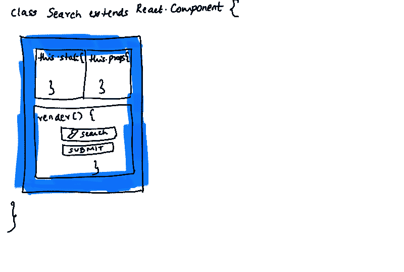
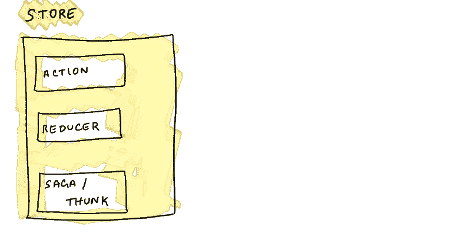
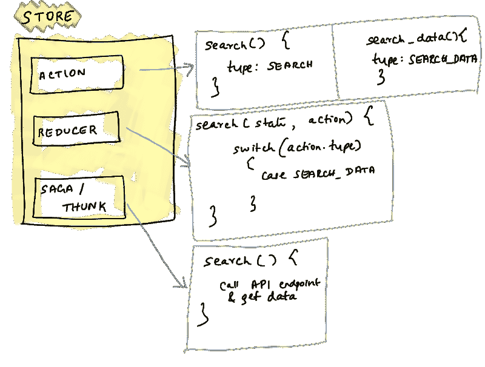
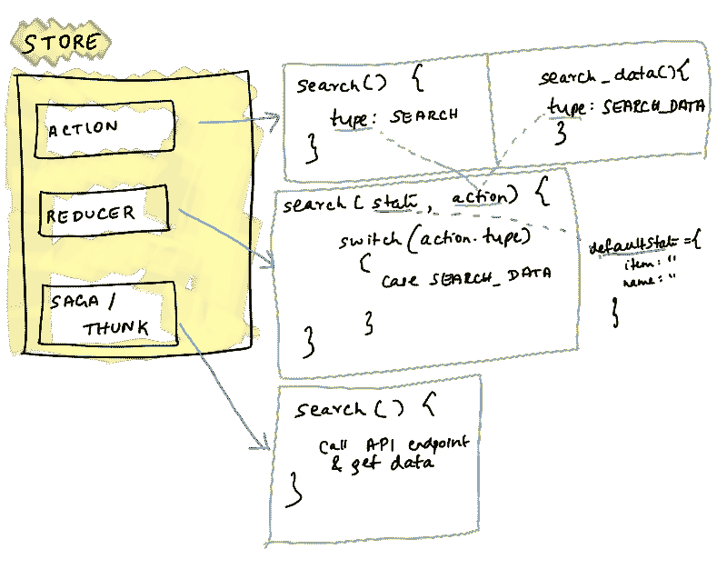
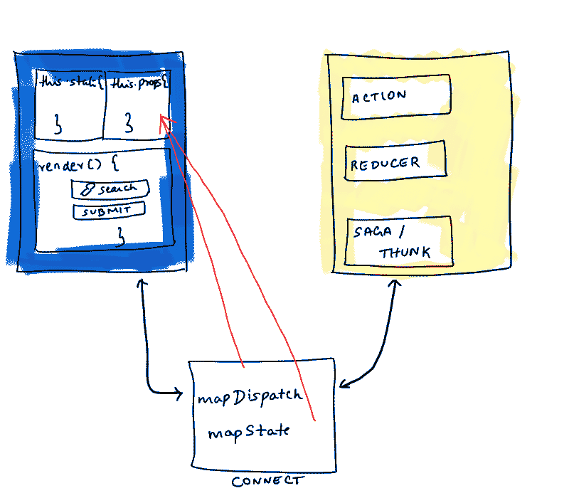
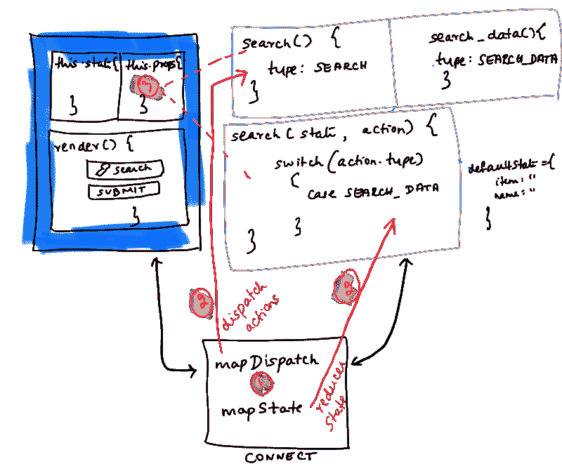
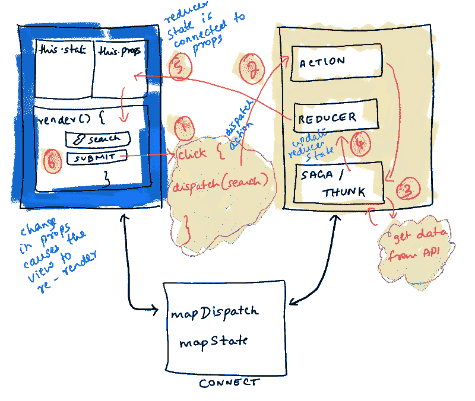

# 如何将 React 连接到 Redux —图解指南

> 原文：<https://www.freecodecamp.org/news/how-to-connect-react-to-redux-a-diagrammatic-guide-d2687c14750a/>

由普林西帕

# 如何将 React 连接到 Redux —图解指南

> 这个帖子是针对已经知道 React 和 Redux 的人的。这将有助于他们更好地理解事情是如何进行的。

> *刚进 React 宇宙的时候？大约 3 年前，我很难理解 Redux 的 m `apStateToProps` 和 m `apDispatchToProps` 是如何工作的，以及它们是如何用于 React 组件的。这里有一个图解指南，可以更好地理解 Redux 的 c `onnect` 如何与 React 一起工作。*

假设我们有一个`Search`组件。

The React component

和一家经典的 Redux 商店。

The Redux store

让我们用`Action`调度程序和`Reducer`状态填充 Redux 存储。

Redux store with Action dispatchers and the Reducer state

Reducer’s defaultState

减速器的`defaultState`长这样。`Reducer`函数中的`action`参数来自被调度的`Action.`

Connect React component to the Redux store

让我们将 React 搜索组件与 Redux 存储连接起来。 [React-Redux](https://react-redux.js.org/introduction/quick-start) 库有 Redux 的官方 React 绑定。

它提供了`connect`函数来将组件连接到商店。

`mapDispatchToProps`表示将动作的`dispatch`功能映射到反应组件的`this.props`。

这同样适用于`mapStateToProps`，其中减速器的状态被映射到 React 组件的`this.props`。

React to Redux connect flow

1.  将 React 连接到 Redux。
2.  `mapStateToProps`和`mapDispatchToProps`分别处理 Redux 商店的`state`和`dispatch`。
3.  减速器的`state`和动作的`dispatch`通过`this.props`提供给反应组件。

让我们通过点击 React 搜索组件中的一个按钮来总结整个 React to Redux connect 工作流。

React to Redux connect flow via button click

1.  单击 React 搜索组件上的`submit`按钮
2.  `click`函数分派一个动作。动作`dispatch`功能通过`mapDispatchToProps`连接到搜索组件，并对`this.props`可用
3.  (不在本文讨论范围内)被调度的动作负责`fetch`数据并调度另一个动作来更新减速器状态
4.  Reducer 状态使用步骤 3 中的新搜索数据进行自我更新。
5.  减速器状态已经通过`mapStateToProps`连接到搜索组件中的`this.props`
6.  `this.props`有最新的搜索数据，视图现在重新呈现以显示更新的搜索结果