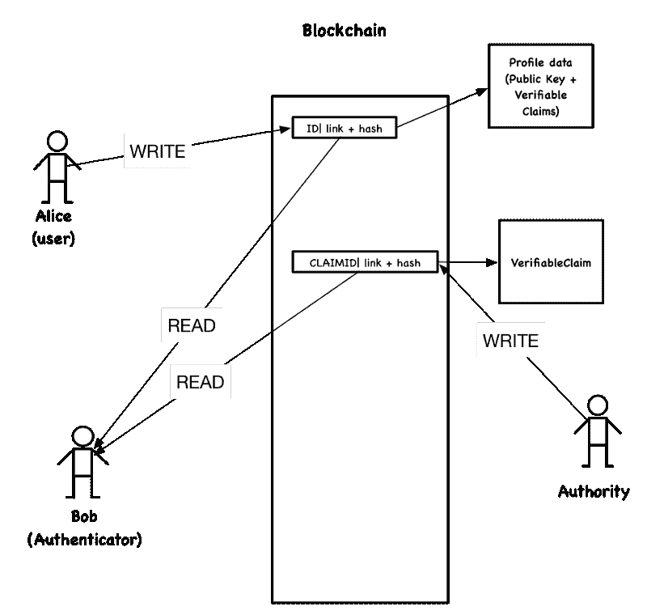
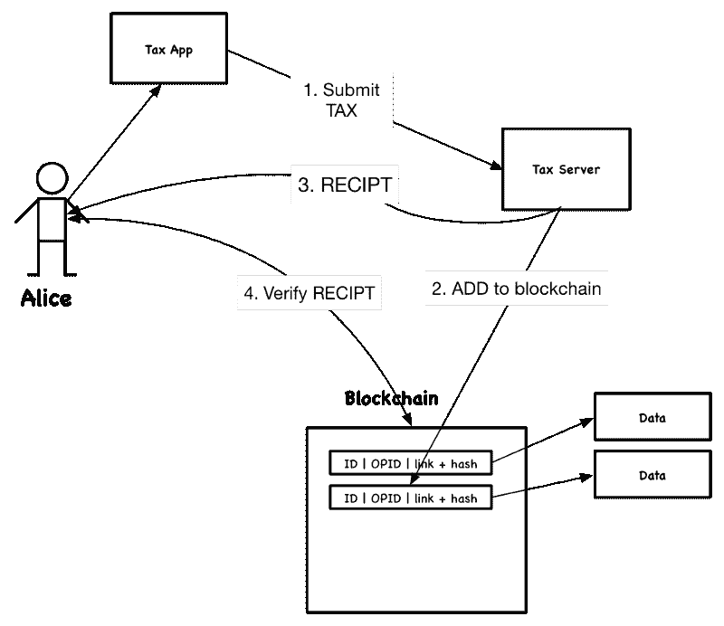
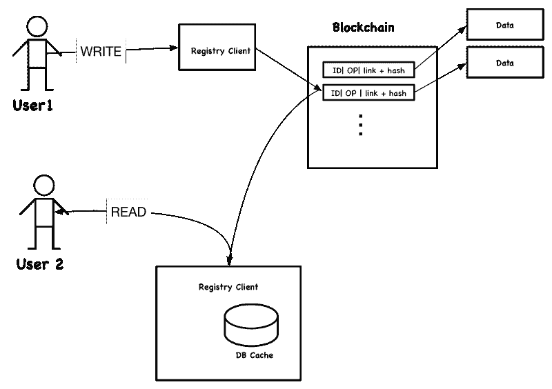
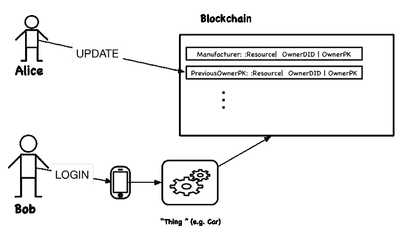

# 基于区块链的去中心化应用的四种架构模式候选

> 原文：<https://www.freecodecamp.org/news/https-medium-com-srinathperera-blockchain-patterns-6cf58fdc2d9b/>

区块链有一系列不同的用例，从金融到去中心化的互联网。然而，大多数区块链用例可以使用相对较少的模式来实现。例如，[基于区块链的应用的模式集合](https://www.researchgate.net/publication/325439030_A_Pattern_Collection_for_Blockchain-based_Applications)提供了 15 个区块链模式的列表。

如上所述的细粒度模式非常有用。然而，系统设计需要更高层次的抽象。拥有更粗粒度的宏模式也是有用的，我们称之为架构模式。这篇文章描述了四种这样的架构模式。

让我们开始吧。为了描述模式，我将使用 Aleksandra teanovic 在[什么是模式](http://citeseerx.ist.psu.edu/viewdoc/download?doi=10.1.1.123.1162&rep=rep1&type=pdf)中描述的模板。

### IAM 的架构模式。

背景: IAM 环境包括许多用户和服务提供商。IAM 系统为每个用户提供一个帐户和一组功能，使用户能够找到服务提供商，证明他们对帐户的所有权，然后根据他们的功能接受服务。

**Forces:** 需要实现一个分散的 IAM 环境，在这个环境中，单个流氓用户或少数用户不能对系统产生重大影响。

**解决方案:**建议的候选模式以如下方式使用万维网联盟(W3C) DID 规范和 W3C 可验证声明规范。

Figure 1: Blockchain-based IAM Architecture Pattern

假设 Alice 需要一个身份(DID，这是一个惟一的标识符)。如创建新 DID 的图所示，Alice 在区块链中创建了一个条目。这个条目包括一个随机生成的标识符，一个到带有她的个人资料数据的存储库的链接，以及一个个人资料数据的散列。用户配置文件包含一个公钥和一组可验证的声明。生成的随机标识符现在成为 Alice 的 DID，因为只有她拥有对应于公钥的私钥。

可验证声明是由主管机构签署的委托令牌。创建者还以类似于 DID 的方式将它们与声明的散列一起记录在区块链中。

爱丽丝首先通过去权威机构获得可证实的声明。例如，个人注册部或类似部门是核实姓名、地址和出生日期的适当机构。假设权威发布可验证的声明，Alice 首先使用挑战-响应-协议来证明她对 DID 的所有权。然后，她提交对其属性的可验证声明的请求，例如，这些属性可能包括她的姓名、地址、学位和出生日期。为了更新她的配置文件数据，Alice 将使用配置文件的新散列向区块链添加一个新条目。

在挑战-响应-协议中，验证器生成一个随机种子，使用 Alice 的公钥对其进行加密，然后通过解密加密的种子来挑战 Alice 以证明她拥有私钥。既然爱丽丝有私人钥匙，她一定是 DID 的主人。

不同的用户或组织(认证者)，Bob，想要识别 Alice，首先从 Alice 接收 DID，从区块链读取与该 DID 相关的所有条目，检索 Alice 的简档数据，并验证它们。Bob 可以使用挑战-响应-协议再次验证 Alice 的身份(标识)。然后，Bob 可以确认可验证的声明，并确信关于 Alice 的声明是真实的。

我们可以将大多数 IAM 用例放在这个架构模式之上。例如，我们可以通过为我们希望用户执行的操作发出可验证的声明，或者通过只接受在其可验证的声明中具有某些属性(例如，年龄、工作描述、组成员)的用户来实现访问控制。实现可以选择在数据库中缓存简档数据的相关子集以提高性能。

### 可审计历史或工作区的架构模式

**上下文:** A 两方或多方一起进行交易或工作，需要以无可争辩的方式记录他们的活动。

**Forces:** 需要实现一个分散的审计日志或一个工作区，在这里单个流氓用户或少数用户不能显著影响系统。

**解决方案:**建议的系统记录活动，并在区块链中为这些记录创建条目。该条目包含活动记录的散列，因此，这些记录以后不会有争议。

Figure 2: Blockchain based Auditable History or Workspace Architecture Pattern

例如，让我们假设爱丽丝想要交税。税务服务器接受付款申请，创建数字收据，在区块链中记录其散列，并将收据发送给 Alice。Alice 可以通过计算哈希并对照存储在区块链中的值来验证收据。此后，Bob 不能否认该收据，因为收据散列和时间被记录在区块链中。

如果活动很多，可能需要解决区块链性能限制。因此，一些实现可以将几个活动记录的散列记录为一个块，而不是单个活动记录。

### 注册中心或市场的架构模式

**上下文:**注册表是可以在网络上搜索和检索的数据条目的集合。市场是一个注册表，允许用户购买由数据条目表示的服务或产品。例如，注册表可以是可用 API 的目录。

**Forces:** 需要实现一个分散的环境，在这个环境中，单个流氓用户或少数用户不能显著影响系统。

**解决方案:**建议的模式工作如下。

Figure 3: Blockchain based Registry Architecture Pattern

让我们首先考虑一个注册表。使用所提出的体系结构，当用户发布注册中心更新(添加或修改条目)时，客户端在区块链中记录该变化。如果更新中的数据很大，区块链记录可能包含数据的链接和数据的哈希值。如果存储在注册中心的数据需要被修改，注册中心客户机向区块链添加具有修改信息的新记录。

在上图中，每个用户都有一个运行在本地机器(例如，笔记本电脑或电话)上的注册客户端。每个注册中心客户端从区块链中读取更新记录，根据记录中包含的哈希验证更新数据，并从更新中重建记录的最新视图。例如，通过读取关于 API、它们的添加、修改和删除的区块链记录，注册中心客户端可以创建一个视图来显示注册中心中包含的当前 API。为了避免每次使用注册表时都必须读取和验证所有记录，客户端可以将数据存储在数据库中并对其进行索引。客户端应该定期检查区块链并更新注册表。

区块链作为“服务市场”运作良好，因为相同的服务可能会被出售多次。然而，由于性能限制，区块链的市场不适合只能销售一次的商品。

为了说明基于区块链的注册中心的功能，让我们看看 Alice 何时想要订阅区块链市场中的“天气新闻服务”。当她提交请求时，注册中心为服务创建凭证并与 Alice 共享。支付可能以几种方式之一发生:使用比特币，通过智能合同及时支付，或通过一些不受约束的方式。

### 智能合同和托管物的架构模式

在这种模式下，我们考虑两种情况。首先，我们考虑智能合约，其次，我们考虑智能合约的一个常见特例:“托管事物”

#### 智能合同模式

**上下文:**多个用户想要遵守一个契约，描述为一个可执行的程序。根据合同中定义的条件，合同经历状态转换，并且在给定的时间，每个人都可以就合同的当前状态达成一致。

**Forces:** 需要实现一个环境，在这个环境中，单个流氓用户或少数用户不能显著影响系统。

**解决方案:**智能接触是区块链技术公司的一部分，受以太坊等区块链实现的支持。使用智能合同语言描述合同，并将其分发给所有参与者。当合同中定义的条件改变时，每个参与者执行合同并使用一致算法记录区块链中的当前状态。

#### 管理事物模式

**上下文:**我们需要追踪现实世界智能事物的所有权。在这里，智能事物是现实世界中能够在其中运行计算逻辑的物体。所有者被允许控制和执行现实世界事物上的动作。此外，所有者可以将其所有权转让给其他人。

**Forces:** 需要实现一个环境，在这个环境中，单个流氓用户或少数用户不能显著影响系统。

**解决方案:**下面以汽车为被管物为例描述该模式的实现。

Figure 4: Blockchain based Managed Things Architecture Pattern

我们可以分两步为托管对象(在本例中为汽车)实现区块链。首先，制造商记录车主的 DID 和公钥。当所有权发生变化时，所有者会在区块链中添加一条新记录来指定新的所有者。第二，在检查所有权时，汽车首先检索区块链中的所有记录，并验证每条记录都是车主当时添加的。这是通过对照先前所有权记录中包含的公钥来检查写该记录的用户的公钥来完成的。此有效链中的最后一个所有者是当前所有者。

在确定了所有者之后，汽车通过检索当前所有者 Alice 的公钥并使用具有 Alice 的私钥的 Alice 的电话执行基于挑战-响应-协议的登录来登录 Alice。

这种系统降低了与远程控制的人工制品相关的风险。例如，在非区块链实现中，有访问权的人可以更改您汽车的所有权。然而，对于基于区块链的模型，要远程控制汽车，潜在的攻击者必须改变区块链的所有权记录，如果不是所有者，这是很难实现的。

然而，很难阻止有权访问“东西”的人物理地改变内部运行的逻辑(例如，通过替换汽车的固件)。这个问题的一个解决方案是建立某种形式的自毁，当检测到对工件的篡改时触发。

例如，Alice 使用智能合同从 Bob 处购买汽车，该合同向 Bob 付款并更新汽车的所有权。交易完成后，Alice 走向汽车，汽车从电话中读取 Alice 的 DID，检索她的公钥，通过与拥有 Alice 私钥的电话通信，使用挑战-响应-协议对她进行认证，验证她的所有权，并解锁汽车。

### 结论

我们讨论了四种基于区块链的架构模式。GitHub 文档[基于区块链的集成用例](https://github.com/wso2/ETAC/blob/master/blockchain/blockchain-usecases.md)展示了这些模式的作用，描述了如何使用这四种模式实现 30 多个区块链用例。

如果你对以上模式有意见，或者知道其他模式，我真的很想听听。

我希望这是有用的。如果你喜欢这个，你可能也会喜欢我们最近发表的论文“以用例为中心的区块链调查:现状和未来方向”中详细的区块链分析