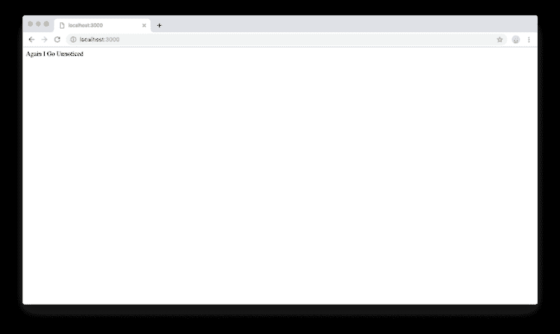
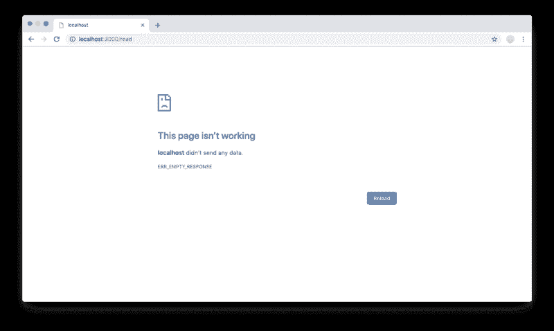
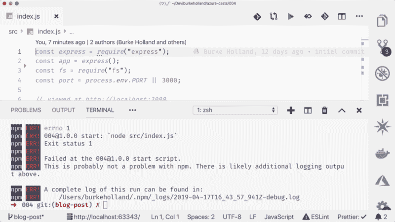
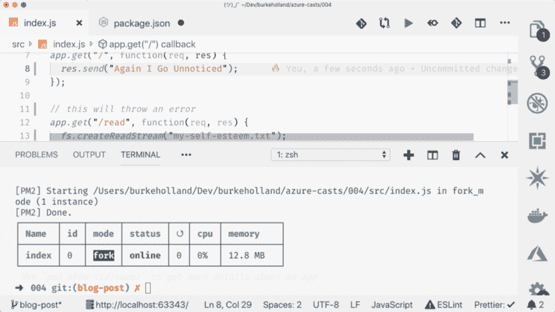
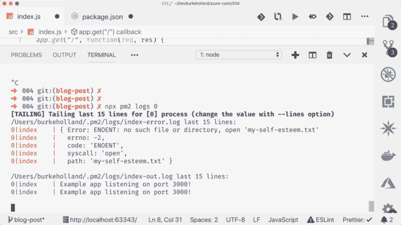
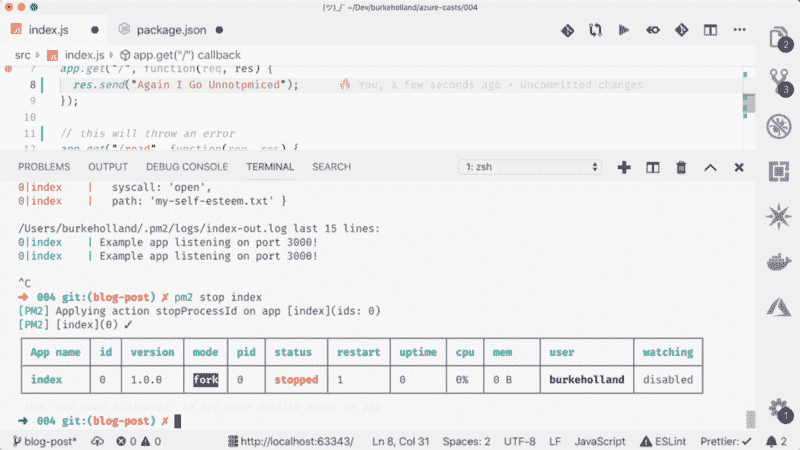
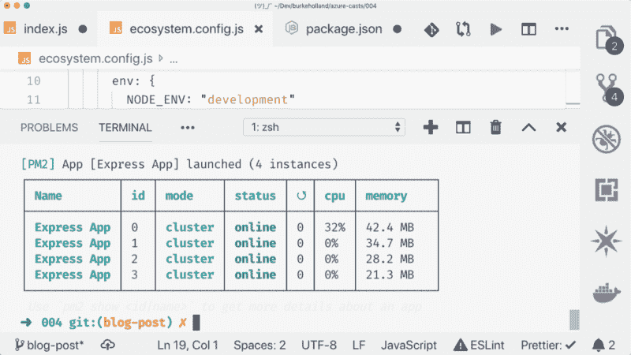
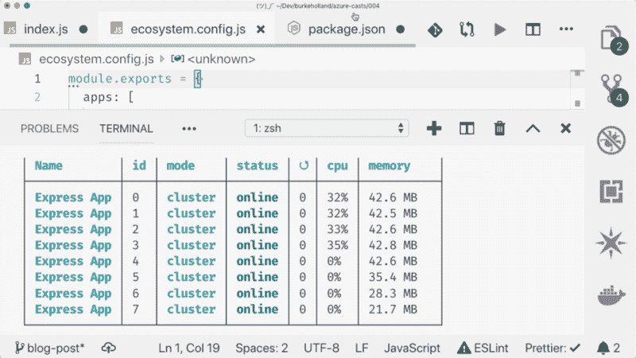
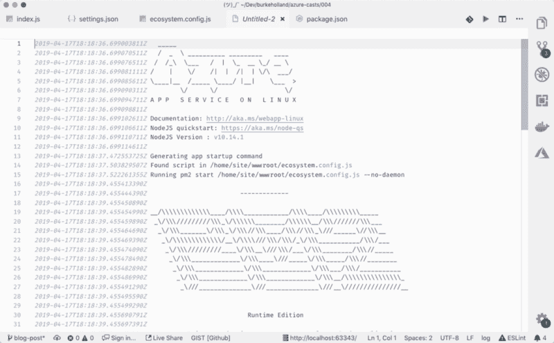
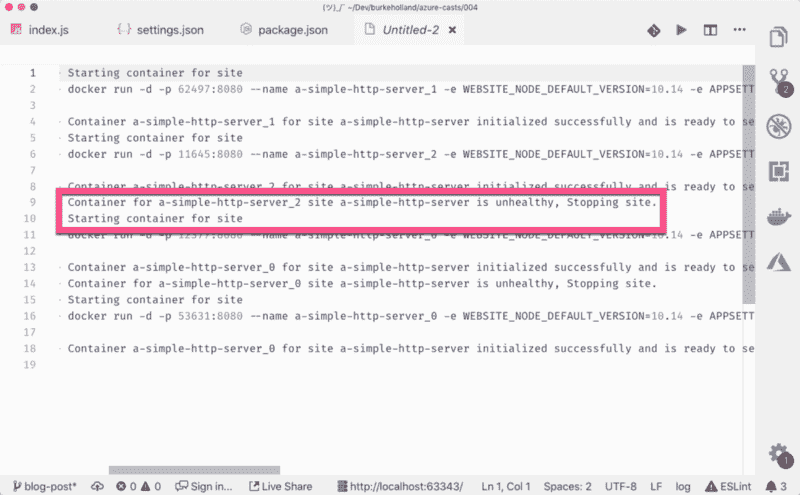

# 在生产中，永远不要直接运行 Node.js。也许吧。

> 原文：<https://www.freecodecamp.org/news/you-should-never-ever-run-directly-against-node-js-in-production-maybe-7fdfaed51ec6/>

有时候我怀疑自己是否知道很多事情。

就在几周前，我和一个朋友聊天时，他不经意地提到，“你永远不会在生产中直接针对 Node 运行应用程序”。

我用力点头示意我*也*永远不会在生产中与 Node 发生冲突，因为…哈哈哈…每个人都知道。但是我不知道！我应该知道吗？！？？我还能编程吗？

如果我要画一个维恩图，来表示我所知道的和我感觉其他人都知道的，它会是这样的…


顺便说一下，随着年龄的增长，这个小点变得越来越小。

艾丽西娅·刘(Alicia Liu)创作的一个更好的图表改变了我的生活。她说更像是这样…


我非常喜欢这个图表，因为我希望它是真实的。我不想下半辈子都做一个渺小的，萎缩的蓝点。

太戏剧性了。怪潘多拉。在我写这篇文章的时候，我不能控制接下来播放什么，而[仪表盘忏悔](https://www.youtube.com/watch?v=ixG3DgrPC3c)是一种很厉害的毒品。

假设艾丽西娅的图表是真的，我想和你分享我现在所知道的在生产中运行节点应用的情况。也许我们的相对维恩图在这个问题上没有重叠。

首先，让我们讨论一下“永远不要在生产中直接针对节点运行应用程序”这句话。

#### 永远不要直接对生产中的节点运行

也许吧。但也许不是。先说说这种说法背后的推理。首先，我们来看看为什么不。

假设我们有一个简单的 Express 服务器。我能想到的最简单的快递服务器…

```
const express = require("express");
const app = express();
const port = process.env.PORT || 3000;

// viewed at http://localhost:3000
app.get("/", function(req, res) {
  res.send("Again I Go Unnoticed");
});

app.listen(port, () => console.log(`Example app listening on port ${port}!`));
```

我们将在`package.json`文件中用一个启动脚本来运行它。

```
"scripts": {
  "dev": "npx supervisor index.js",
  "start": "node index.js"
}
```



这里有两个问题。第一个是开发问题，第二个是生产问题。

开发问题是，当我们更改代码时，我们必须停止并启动应用程序才能使我们的更改生效。

为了解决这个问题，我们通常使用某种节点流程管理器，如`supervisor`或`nodemon`。这些包将监视我们的项目，并在我们做出更改时重启我们的服务器。我通常这样做…

```
"scripts": {  "dev": "npx supervisor index.js",  "start": "node index.js"}
```

然后我跑`npm run dev`。注意，我在这里运行的是`npx supervisor`,这允许我不用安装就可以使用`supervisor`包。一、❤️ 2019。大部分是。

我们的另一个问题是，我们仍然直接针对 Node 运行，我们已经说过这是不好的，现在我们将找出原因。

我将在这里添加另一条路径，尝试从不存在的磁盘中读取文件。这是一个在任何实际应用程序中都很容易出现的错误。

```
const express = require("express");
const app = express();
const fs = require("fs");
const port = process.env.PORT || 3000;

// viewed at http://localhost:3000
app.get("/", function(req, res) {
  res.send("Again I Go Unnoticed");
});

app.get("/read", function(req, res) {
  // this does not exist
  fs.createReadStream("my-self-esteem.txt");
});

app.listen(port, () => console.log(`Example app listening on port ${port}!`));
```

如果我们直接对带有`npm start`的节点运行这个命令，并导航到`read` 端点，我们会得到一个错误，因为该文件不存在。



这没什么大不了的，对吧？这是一个错误。它发生了。

不，没什么大不了的。如果你回到你的终端，你会看到应用程序完全关闭。



这意味着，如果你回到浏览器，并试图去该网站的根网址，你得到同样的错误页面。一个方法中的一个错误导致**所有人**的应用程序停止运行。

那很糟糕。非常糟糕。这也是为什么人们说**“千万不要直接针对生产中的节点运行”**的主要原因之一。

好的。那么如果我们不能在生产中运行 Node，那么在生产中运行 Node 的正确方式是什么呢？

#### 生产节点的选项

我们有几个选择。

其中之一就是在生产中简单地使用类似于`supervisor`或`nodemon`的东西，就像我们在开发中使用它们一样。那将是可行的，但是这些工具有点轻量级。更好的选择是 pm2。

#### pm2 救援

pm2 是一个节点进程管理器，有很多功能。就像其他“JavaScript”一样，你可以从`npm`开始(全局)安装它——或者你可以再次使用`npx`。我不想告诉你如何生活。

有很多方法可以用 pm2 运行你的应用。最简单的方法是在入口点调用`pm2 start`。

```
"scripts": {
  "start": "pm2 start index.js",
  "dev": "npx supervisor index.js"
},
```

您将在终端中看到类似这样的内容…



这是我们在 pm2 监控的后台运行的流程。如果您访问`read`端点并使应用程序崩溃，pm2 将自动重启它。你在终端中看不到这些，因为它是在后台运行的。如果你想看 pm2 做它的事情，你必须运行`pm2 log 0`。`0`是我们想要查看日志的进程的 ID。



我们走吧！由于我们未处理的错误，当应用程序关闭时，您可以看到 pm2 重新启动应用程序。

我们还可以调出 dev 命令，让 pm2 为我们监视文件，并在有任何更改时重启。

```
"scripts": {
  "start": "pm2 start index.js --watch",
  "dev": "npx supervisor index.js"
},
```

请注意，因为 pm2 在后台运行，所以您不能退出正在运行的 pm2 进程。您必须通过传递 ID 或名称来停止它。

`pm2 stop 0`

`pm2 stop index`

另外，请注意，pm2 保留了对该进程的引用，因此您可以重新启动它。



如果您想要删除那个进程引用，您需要运行`pm2 delete`。您可以使用`delete`在一个命令中停止和删除一个进程。

`pm2 delete index`

我们还可以使用 pm2 来运行应用程序的多个进程。pm2 将自动平衡这些实例的负载。

#### pm2 分叉模式下的多个流程

pm2 有大量的配置选项，这些选项包含在一个“生态系统”文件中。要创建一个，运行`pm2 init`。你会得到这样的东西…

```
module.exports = {
  apps: [
    {
      name: "Express App",
      script: "index.js",
      instances: 4,
      autorestart: true,
      watch: true,
      max_memory_restart: "1G",
      env: {
        NODE_ENV: "development"
      },
      env_production: {
        NODE_ENV: "production"
      }
    }
  ]
};
```

我将忽略本文中的“部署”部分，因为我不知道它是做什么的。

“应用程序”部分是您定义希望 pm2 运行和监控的应用程序的地方。你可以跑不止一个。许多这样的配置设置可能是不言自明的。这里我想重点关注的是**实例**的设置。

pm2 可以运行应用程序的多个实例。您可以传入许多您想要运行的实例，pm2 会加速运行这些实例。因此，如果我们想运行 4 个实例，我们可以有以下配置文件。

```
module.exports = {
  apps: [
    {
      name: "Express App",
      script: "index.js",
      instances: 4,
      autorestart: true,
      watch: true,
      max_memory_restart: "1G",
      env: {
        NODE_ENV: "development"
      },
      env_production: {
        NODE_ENV: "production"
      }
    }
  ]
};
```

然后我们用`pm2 start`运行它。



pm2 现在以“集群”模式运行。每个进程都运行在我的机器上不同的 CPU 上，这取决于我有多少个内核。如果我们想在不知道有多少个内核的情况下为每个内核运行一个进程，我们只需将`max`参数传递给`instances`值。

```
{
   ...
   instances: "max",
   ...
}
```

让我们看看这台机器里有多少个内核。



8 核！天啊。我要在我的微软发行的机器上安装 Subnautica。别告诉他们是我说的。

在独立的 CPU 上运行进程的好处是，如果你有一个进程运行失控，并占用了 100%的 CPU，其他的仍然可以工作。如果您传递的实例多于您拥有的内核，pm2 将在必要时加倍 CPU 上的进程。

你可以用 pm2 做更多的事情，包括监控和处理那些讨厌的环境变量。

另一个需要注意的事项:如果出于某种原因，您希望 pm2 运行您的`npm start`脚本，您可以通过将 npm 作为进程运行并传递`-- start`来实现。“开始”之前的空格在这里非常重要。

```
pm2 start npm -- start
```

在 [Azure AppService](https://docs.microsoft.com/en-us/azure/app-service/?WT.mc_id=medium-blog-buhollan) 中，我们在后台默认包含 pm2。如果你想在 Azure 中使用 pm2，你不需要把它包含在你的`package.json`文件中。您只需添加一个生态系统文件，就万事大吉了。



好吧！既然我们已经了解了所有关于 pm2 的知识，让我们来谈谈为什么您可能不想使用它，以及它可能确实可以直接在 Node 上运行。

#### 直接针对生产中的节点运行

我对此有一些疑问，所以我联系了 Tierney Cyren，他是巨大的橙色知识圈的一部分，尤其是在 Node 方面。

Tierney 指出了使用像 pm2 这样的基于节点的进程管理器的一些缺点。

主要原因是你不应该使用节点来监控节点。你不想用你正在监控的东西来监控那个东西。这有点像你让我十几岁的儿子在周五晚上监督自己:结果会很糟糕吗？可能会，也可能不会。但是你会发现困难的一面。

Tierney 建议您根本不要让节点进程管理器运行您的应用程序。取而代之的是，在一个更高的层次上监视你的应用程序的多个独立的实例。例如，如果您有一个 Kubernetes 集群，并且您的应用程序在不同的容器上运行，那么这将是一个理想的设置。Kubernetes 可以监控这些容器，如果其中任何一个出现故障，它可以将它们带回来，并报告它们的健康状况。

在这种情况下，您**可以直接对 Node 运行**,因为您在更高的级别进行监控。

事实证明，Azure 已经在这么做了。如果我们不将 pm2 生态系统文件推送到 Azure，它将使用我们的`package.json`文件启动脚本启动应用程序，我们可以直接在 Node 上运行。

```
"scripts": {
  "start": "node index.js"
}
```

在这种情况下，我们直接针对 Node 运行，这没问题。如果应用程序崩溃了，你会发现它又回来了。这是因为在 Azure 中，你的应用运行在一个容器中。Azure 正在编排你的应用程序运行的容器，并且知道它何时面对 plants。



但是这里仍然只有一个实例。容器崩溃后需要一秒钟才能恢复联机，这意味着用户可能会有几秒钟的停机时间。

理想情况下，您会希望不止一个容器运行。对此的解决方案是将应用程序的多个实例部署到多个 Azure AppService 站点，然后使用 Azure Front Door 对单个 IP 地址后面的应用程序进行负载平衡。Front Door 将知道容器何时关闭，并将流量路由到应用程序的其他健康实例。

[**Azure Front Door Service |微软 Azure**](https://azure.microsoft.com/en-us/services/frontdoor/?WT.mc_id=medium-blog-buhollan)
[*借助 Azure Front Door 交付、保护和跟踪您的全球分布式微服务应用的性能…*azure.microsoft.com](https://azure.microsoft.com/en-us/services/frontdoor/?WT.mc_id=medium-blog-buhollan)

#### 系统

Tierney 的另一个建议是用`systemd`运行 Node。我对`systemd`不太了解(或者根本不了解),而且我已经把这个短语搞砸过一次了，所以我会让蒂尔尼用他自己的话来说…

> 只有在您的部署中能够访问 Linux，并且您能够在服务级别上控制该节点的启动方式时，此选项才是可能的。如果你在一个长期运行的 Linux 虚拟机上运行 Node.js 进程，比如 Azure 虚拟机，你就可以用 systemd 运行 Node.js。如果您只是将文件部署到 Azure AppService 或 Heroku 之类的服务中，或者在 Azure Container Instances 之类的容器化环境中运行，您可能应该避开这个选项。

[**使用 Systemd 运行您的 Node.js 应用程序第 1 部分**](https://nodesource.com/blog/running-your-node-js-app-with-systemd-part-1/)
[*您已经在 Node 中编写了下一个伟大的应用程序，您已经准备好向世界发布它了。这意味着你可以……*nodesource.com](https://nodesource.com/blog/running-your-node-js-app-with-systemd-part-1/)

#### Node.js 工作线程

Tierney 还希望您知道工作线程正在进入节点。这将允许你在多个“工人”(线程)上启动你的应用程序，从而不再需要像 pm2 这样的东西。也许吧。我不知道。我并没有真正读这篇文章。

[**Node.js v11.14.0 文档**](https://nodejs.org/api/worker_threads.html)
[*worker _ threads 模块支持使用并行执行 JavaScript 的线程。要访问它:const worker =…*nodejs.org](https://nodejs.org/api/worker_threads.html)

#### 成为一个成年人

Tierney 的最后一个建议是像成年人一样处理错误并编写一些测试。但是谁有时间做这个？

#### 这个小圈子一直存在

现在你知道蓝色小圆圈里的大部分内容了。剩下的只是关于 emo 乐队和啤酒的无用事实。

有关 pm2、Node 和 Azure 的更多信息，请查看以下资源…

*   [http://pm2.keymetrics.io/](http://pm2.keymetrics.io/)
*   [VS 代码上的 Node.js 部署](https://code.visualstudio.com/tutorials/nodejs-deployment/getting-started?WT.mc_id=medium-blog-buhollan)
*   [向 Azure 部署一个简单的节点站点](https://azurecasts.com/2019/03/31/002-node-vscode/)