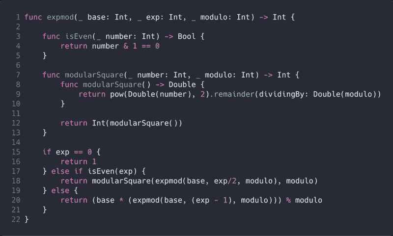
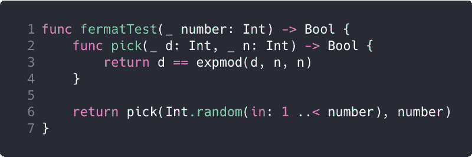
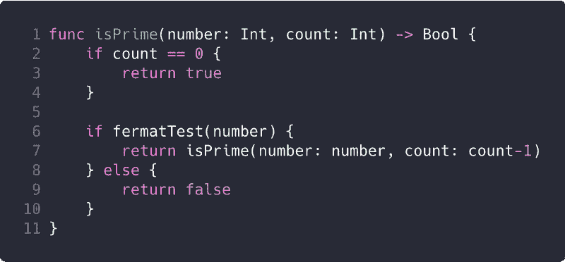

# 如何在 3 分钟内运行费马质数测试

> 原文：<https://www.freecodecamp.org/news/how-to-run-the-fermat-test-for-primality-in-under-3-minutes-89498c08f68c/>

费马试验是基于数论的一个结果，即费马小定理。

根据费马小定理，如果 *n* 是素数， *d* 是小于 *n* 的任意正整数，那么 *d* 的 n 次*幂等于 *d* 模 *n* 。*

如果两个数除以 *n* 后有相同的余数，那么称它们是*同余模 n* 。*d*模 n 就是一个数 *d* 除以 *n* 的余数。

比如 34 全等于 16(模 3)为
34 模 3 = 1，16 模 3 = 1。

#### 费马素性检验

1.  对于给定的数字 *n* ，取一个随机的正数 *d* 使得*d<T5；名词（noun 的缩写）*
2.  计算 *(d^n)模 n* 。
3.  当我们总是选择满足条件*d<的 *d* 时， *d 模 n* 总是会是*d*；名词（noun 的缩写）*
4.  如果 *(d^n)模 n* 的结果不等于 *d* ，那么 *d* 肯定不是素数。
5.  如果 *(d^n)模 n* 的结果等于 *d* ，那么 *n* 很有可能是素数。
6.  再随机挑选一个满足条件*d<n 的 *d* ，重复上述步骤。*

**注**:本帖示例使用 [Swift 4.1](https://swift.org/blog/swift-4-1-released/)

我们需要一个函数来计算一个数模另一个数的指数。

Calculate (d^n) modulo n

当指数大于 1 时，我们使用[模幂运算](https://en.wikipedia.org/wiki/Modular_exponentiation)来计算值，因为这让我们在执行计算的同时只处理小于 *n* 的数(上面函数中的*模*)。

The Fermat test

费马测试在 1 和 *n-1* (上述函数中的【T4 数— 1 )之间随机选择一个数 *d* 。目的是检查 d 的 n 次方的余数模 n 是否等于 d。

Run the Fermat test for the specified count

对指定的计数运行费马试验。如果一个数没有通过费马检验，我们确信它不是质数。如果一个数通过了费马检验，它不能保证是质数。我们试图通过运行测试足够的次数来减少素性测试中的错误概率。

通过尝试越来越多的*d*(1 到 n-1 之间的随机正数)的值，我们可以增加对结果的信心。