# 如何在 React 中识别和解决浪费的渲染

> 原文：<https://www.freecodecamp.org/news/how-to-identify-and-resolve-wasted-renders-in-react-cc4b1e910d10/>

作者:纳伊姆·礼萨

# 如何在 React 中识别和解决浪费的渲染

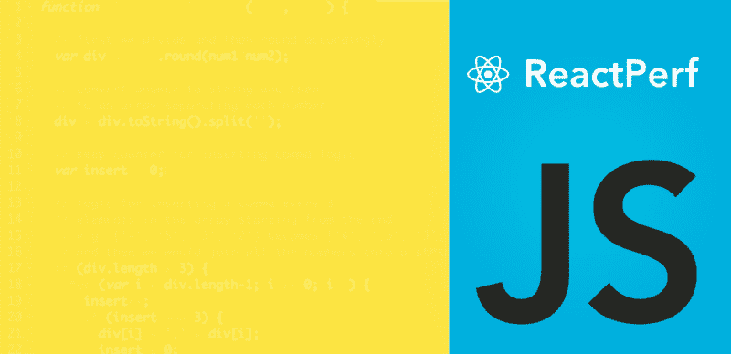

因此，最近我在考虑我正在开发的 react 应用程序的性能分析，突然想到设置一些性能指标。我确实发现我需要解决的第一件事是我在每个网页上浪费的渲染。顺便问一下，你可能在想什么是浪费的渲染？让我们开始吧。

从一开始，React 就改变了构建 web 应用的整个理念，并随之改变了前端开发人员的思维方式。通过引入*虚拟 DOM* ，React 使 UI 更新变得前所未有的高效。这使得 web 应用程序体验非常简洁。你有没有想过如何让你的应用反应更快？为什么中等规模的 React web 应用程序仍然表现不佳？问题在于我们实际上是如何使用 React 的！

### React 如何工作

像 [React](https://facebook.github.io/react/) 这样的现代前端库并没有让我们的应用程序快得惊人。首先，我们开发人员应该了解 React 是如何工作的。在应用程序的生命周期中，组件是如何经历组件生命周期的？因此，在我们深入研究任何优化技术之前，我们需要更好地理解 React 实际上是如何工作的。

React 的核心是 JSX 语法和 React 强大的构建和比较虚拟 DOM 的能力。自发布以来，React 已经影响了许多其他前端库。比如 Vue.js 也是依靠虚拟 DOMs 的思路。

每个 React 应用程序都从一个根组件开始。我们可以将整个应用程序看作一个树形结构，其中每个节点都是一个组件。React 中的组件是基于数据呈现 UI 的“函数”。这意味着它接收到的*道具*和*状态*；说那是`CF`

```
UI = CF(data)
```

用户与用户界面交互，导致数据的变化。交互是用户在我们的应用程序中可以做的任何事情。例如，单击按钮、滑动图像、拖动列表项以及 AJAX 请求调用 API。所有这些交互只会改变数据。它们不会引起用户界面的任何变化。

在这里，数据是定义应用程序的状态的一切。不仅仅是我们存储在数据库中的内容。甚至不同的前端状态，比如当前选择了哪个选项卡，或者当前是否选中了一个复选框，都是这些数据的一部分。每当数据发生变化时，React 使用组件函数来重新呈现 UI，但只是虚拟地:

```
UI1 = CF(data1)UI2 = CF(data2)
```

React 通过对其虚拟 DOM 的两个版本应用[比较算法](https://reactjs.org/docs/reconciliation.html#the-diffing-algorithm)来计算当前 UI 和新 UI 之间的差异。

```
Changes = Difference(UI1, UI2)
```

React 然后继续将 UI 更改仅应用于浏览器上的真实 UI。当与组件相关的数据发生变化时，React 确定是否需要实际的 DOM 更新。这允许 React 避免浏览器中潜在的昂贵的 DOM 操作。例如创建 DOM 节点和访问不必要的现有节点。

组件的这种重复区分和渲染可能是任何 React 应用程序中 React 性能问题的主要来源之一。构建一个 React 应用程序，其中差分算法无法有效地[协调](https://reactjs.org/docs/reconciliation.html)，导致整个应用程序被重复渲染，这实际上导致了浪费的渲染，并可能导致令人沮丧的缓慢体验。

在最初的渲染过程中，React 构建了一个 DOM 树，如下所示

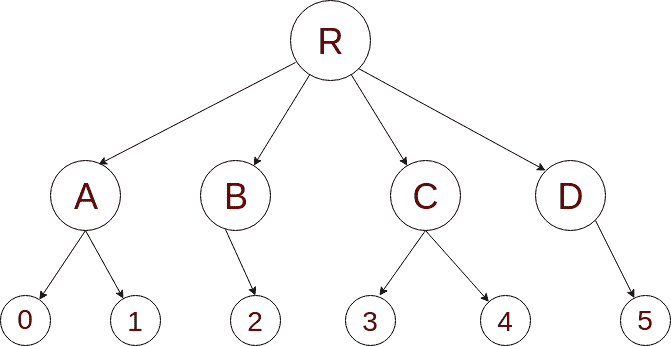

假设一部分数据发生了变化。我们想要 React 做的是只重新渲染那些直接受特定更改影响的组件。甚至可能跳过对其余组件的区分过程。假设上图中组件`2`中的一些数据发生了变化，这些数据从`R`传递到`B`，然后传递到`2`。如果 R 重新渲染，那么它会重新渲染它的每一个孩子，这意味着 A，B，C，D，通过这个过程，React 实际上是这样做的:

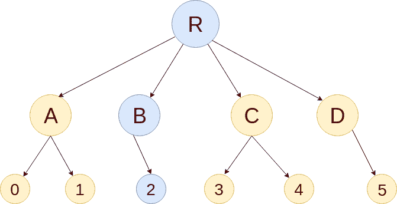

在上面的图像中，所有的黄色节点都被渲染和区分。这导致了时间/计算资源的浪费。这是我们将主要投入优化工作的地方。将每个组件配置为仅在必要时进行渲染和区分。这将允许我们回收那些浪费的 CPU 周期。首先，我们来看看如何识别应用程序中浪费的渲染。

### 识别浪费的渲染

有几种不同的方法可以做到这一点。最简单的方法是在 React dev 工具首选项中打开*高亮更新*选项。

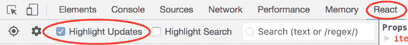

在与应用程序交互时，更新会在屏幕上用彩色边框突出显示。通过此过程，您应该会看到重新渲染的组件。这让我们发现不必要的重新渲染。

让我们按照这个例子。


请注意，当我们输入第二个待办事项时，第一个“待办事项”也会在每次按键时在屏幕上闪烁。这意味着它与输入一起被 React 重新渲染。这就是我们所说的“浪费”渲染。我们知道这是不必要的，因为第一个 todo 内容没有改变，但 React 不知道这一点。

即使 React 只更新更改的 DOM 节点，重新渲染仍然需要一些时间。在许多情况下，这不是一个问题，但如果速度明显下降，我们应该考虑一些事情来停止那些多余的渲染。

### 使用 shouldComponentUpdate 方法

默认情况下，React 将呈现虚拟 DOM，并比较树中每个组件的差异，看其属性或状态是否有变化。但这显然是不合理的。随着我们的应用程序的增长，试图在每个动作中重新渲染和比较整个虚拟 DOM 最终会减慢整个过程。

React 提供了一个简单的生命周期方法来指示组件是否需要重新呈现，也就是说，在重新呈现过程开始之前触发`shouldComponentUpdate`。这个函数的默认实现返回`true`。

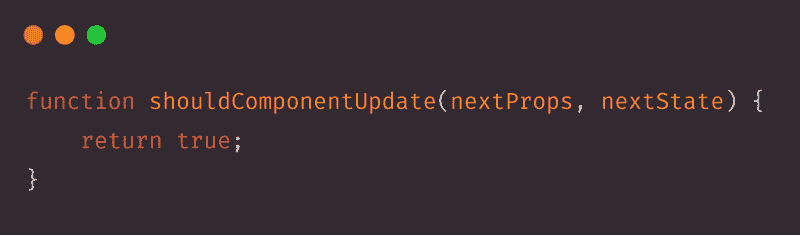

当该函数为任何组件返回 true 时，它允许触发渲染区分过程。这给了我们控制渲染差异过程的能力。假设我们需要防止一个组件被重新渲染，我们只需要从那个函数返回`false`。从方法的实现中可以看出，我们可以比较当前和下一个道具和状态，以确定是否需要重新渲染:

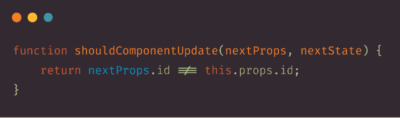

### 使用纯组件

当你在 React 上工作时，你肯定知道`React.Component`，但是`React.PureComponent`是怎么回事呢？我们已经讨论过 shouldComponentUpdate 生命周期方法，在纯组件中，已经有一个默认的实现，`shouldComponentUpdate()`，带有一个浅层的属性和状态比较。所以，一个纯组件是一个只在`props/state`不同于之前的*道具*和*状态*时才重新渲染的组件。

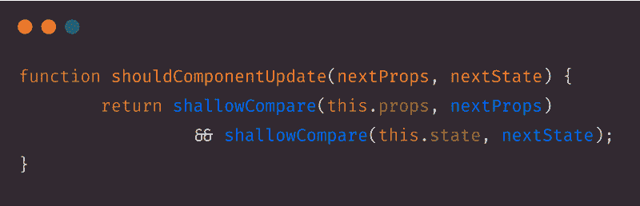

> 在浅层比较中，字符串、布尔、数字等原始数据类型通过值进行比较，数组、对象、函数等复杂数据类型通过引用进行比较

但是，如果我们有一个功能性的无状态组件，我们需要在每次重新呈现之前实现比较方法，那该怎么办呢？React 有一个高阶分量`React.memo`。它类似于 `React.PureComponent`,但是针对的是功能组件而不是类。

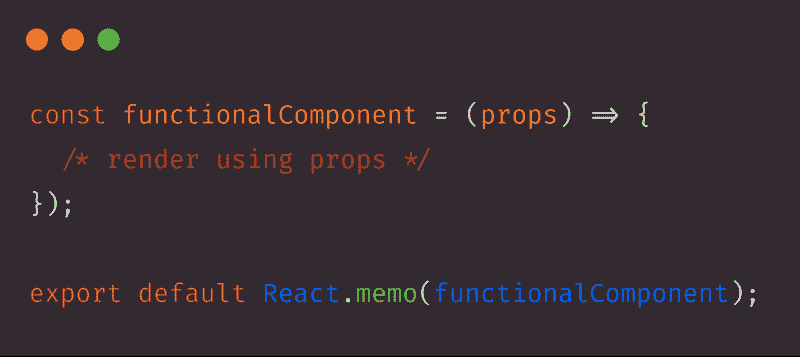

默认情况下，它与 shouldComponentUpdate()的作用相同，后者只是简单地比较 props 对象。但是，如果我们想要控制这种比较呢？我们还可以提供一个定制的比较函数作为第二个参数。

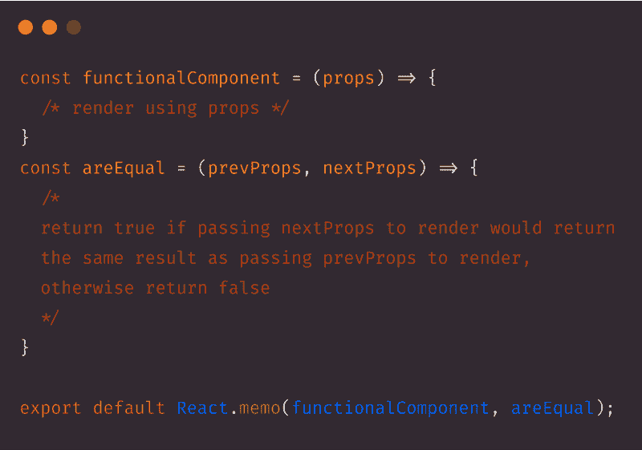

### 使数据不可变

如果我们可以使用一个`React.PureComponent`但是仍然有一个有效的方法来判断任何复杂的属性或状态，比如一个数组、对象等等，会怎么样呢？已经自动改变了？这就是不可变数据结构使生活变得更容易的地方。

使用不可变数据结构背后的想法很简单。正如我们前面所讨论的，对于复杂的数据类型，比较是在它们的引用上进行的。每当包含复杂数据的对象发生变化时，我们可以创建该对象的副本，而不是在该对象中进行更改，这将创建一个新的引用。

ES6 有对象传播操作符来实现这一点。

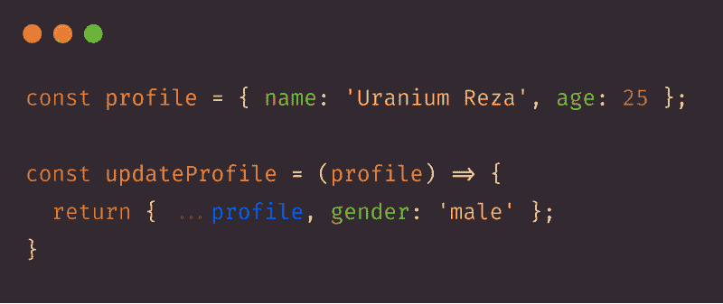

我们也可以对数组做同样的事情:

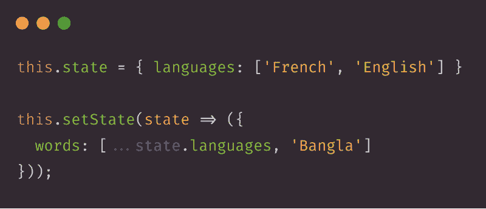

### 避免为相同的旧数据传递新的引用

我们知道，每当组件的`props`改变时，就会发生重新渲染。但是有时候`props`没变。我们以一种 React 认为它确实改变了的方式编写代码，这也将导致重新渲染，但这次是浪费渲染。所以，基本上，我们需要确保传递不同的引用作为不同数据的道具。此外，我们需要避免为相同的数据传递新的引用。现在，我们将研究一些我们正在制造这个问题的案例。让我们看看这段代码。

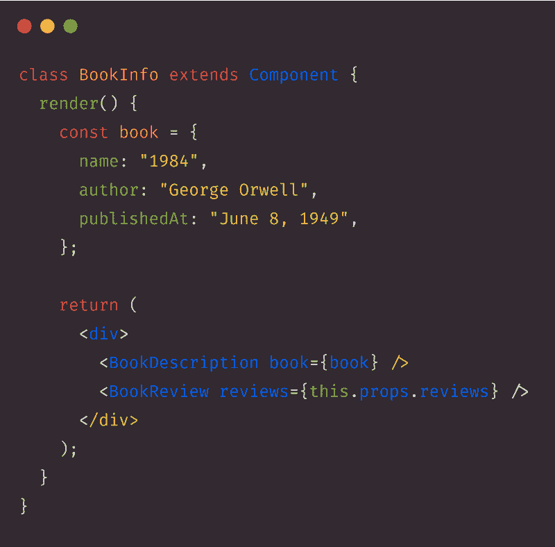

这里是`BookInfo`组件的内容，我们在这里渲染两个组件，`BookDescription`和`BookReview`。这是正确的代码，它运行良好，但有一个问题。`BookDescription`每当我们获得新的评论数据作为道具时，就会重新渲染。为什么？一旦`BookInfo`组件收到新的道具，就会调用`render`函数来创建它的元素树。render 函数创建一个新的`book`常量，这意味着创建了一个新的引用。因此，`BookDescription`将得到这个`book`作为新闻引用，这将导致`BookDescription`的重新渲染。因此，我们可以将这段代码重构为:

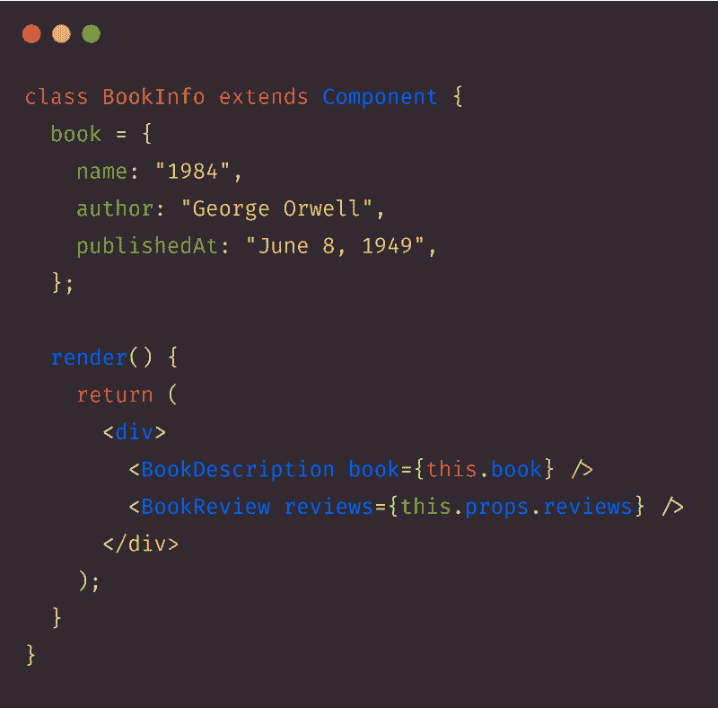

现在，引用总是相同的，`this.book`，并且在渲染时不会创建新的对象。这种重新渲染的理念适用于每一个`prop`，包括事件处理程序，比如:

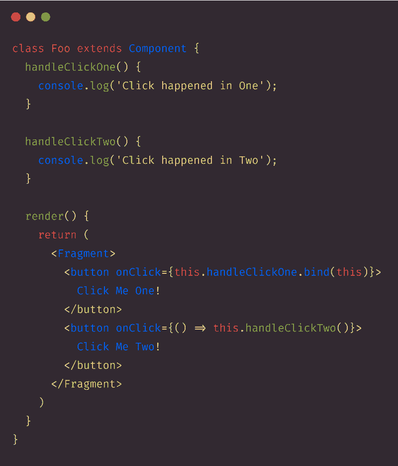

这里，我们使用了两种不同的方法(绑定方法和在 render 中使用 arrow 函数)来调用事件处理程序方法，但是每次组件重新呈现时，这两种方法都会创建一个新的函数。因此，为了解决这些问题，我们可以在`constructor`中绑定该方法，并使用类属性，这仍处于实验阶段，尚未标准化，但许多开发人员已经在生产就绪应用程序中使用这种将函数传递给其他组件的方法:

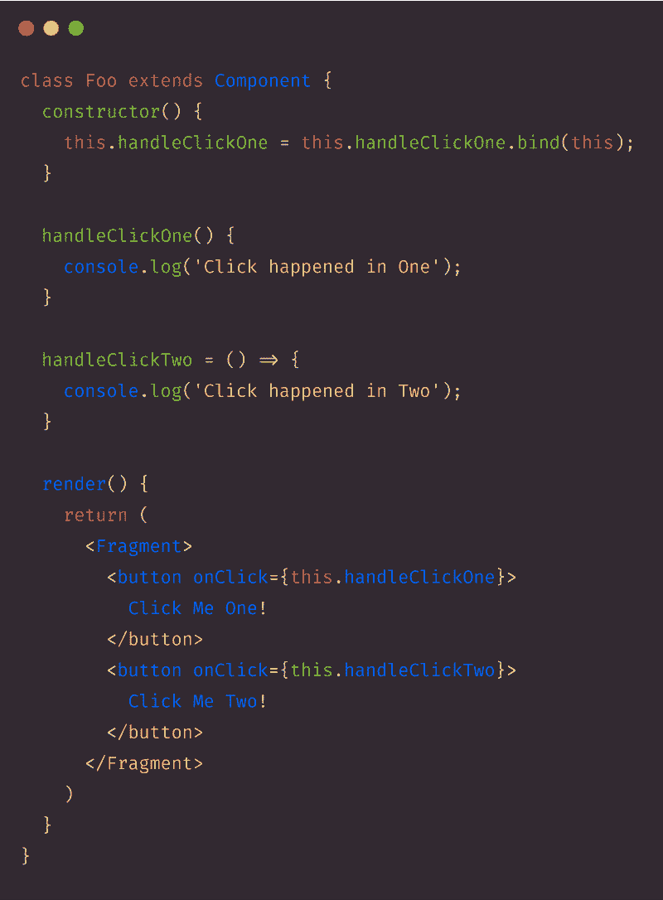

### 包扎

在内部，React 使用了几种巧妙的技术来最小化更新 UI 所需的代价高昂的 DOM 操作的数量。对于许多应用程序来说，使用 React 将会产生一个快速的用户界面，而不需要做太多专门针对性能的优化工作。然而，如果我们能够遵循我上面提到的技术来解决浪费的渲染，那么对于大型应用程序，我们也会在性能方面获得非常流畅的体验。