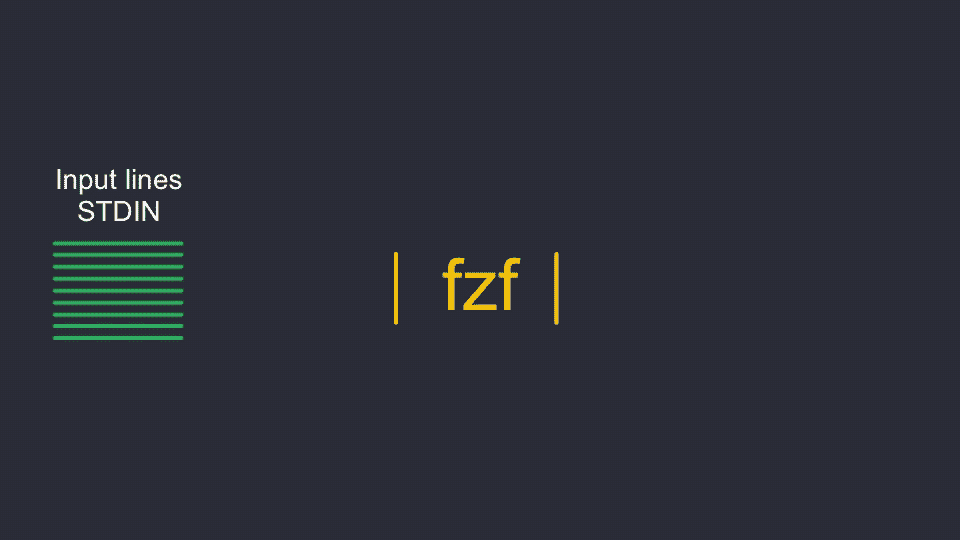
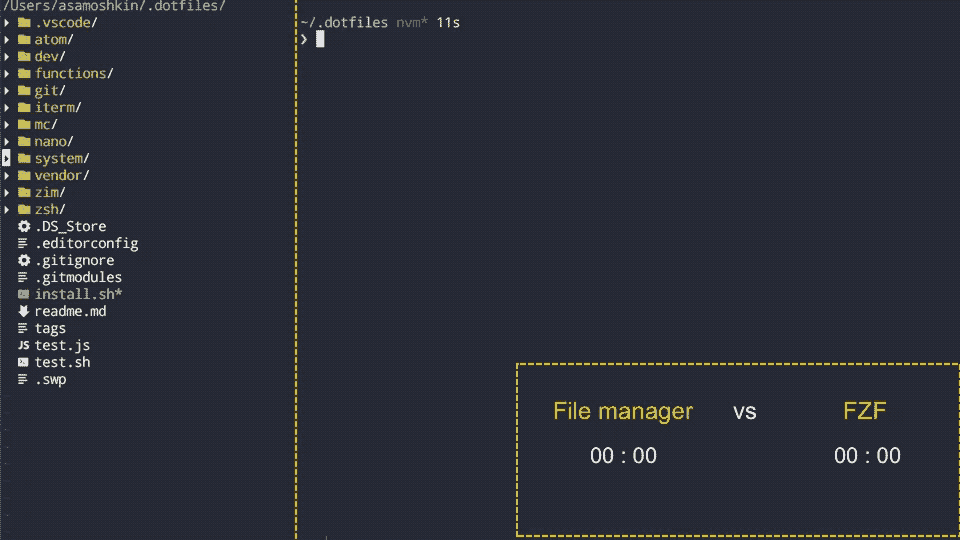
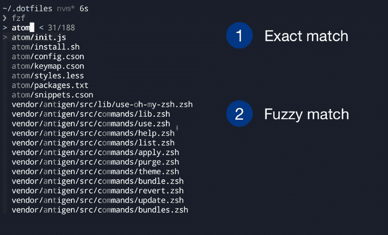
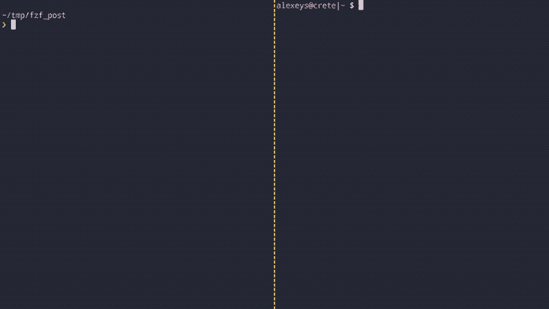
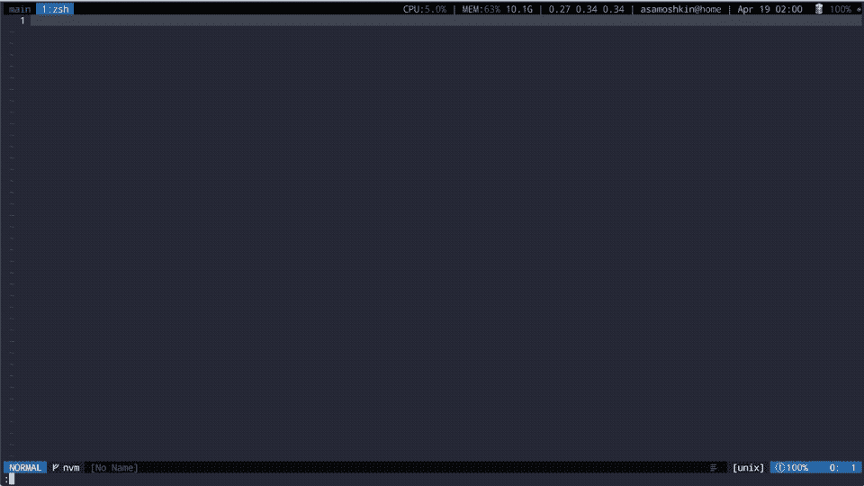

# 为什么你应该使用 fzf，命令行模糊查找器

> 原文：<https://www.freecodecamp.org/news/fzf-a-command-line-fuzzy-finder-missing-demo-a7de312403ff/>

阿列克谢·萨莫什金

# 为什么你应该使用 fzf，命令行模糊查找器

#### 找到丢失的演示

在本教程中，我将帮助你用`fzf`把你的命令行习惯提高到一个新的水平。像专家一样开始搜索文件。了解一些鲜为人知的功能，如更改目录、搜索命令历史记录、查找 SSH 的主机名、终止进程、具有语法高亮显示的即时文件预览等等…


quick demo

今天我要告诉你一个工具，它可以把你的科技生活分成“之前”和“之后”两部分。相信我——这不是夸张。认识一下 [fzf](https://github.com/junegunn/fzf) ，代表模糊查找器。顾名思义，**是一个通用的命令行模糊查找器**。对于第一次听说它的人来说，这听起来不是很有描述性和吸引力。但这是一个非常受欢迎的项目，在 Github 上有大约 21，000 颗星[。所以是时候拨开迷雾，深入洞察了。](https://github.com/junegunn/fzf)

这篇文章伴随着[我最近关于这个话题的视频](https://www.youtube.com/watch?v=qgG5Jhi_Els)。所以，如果你是一个通过观察来学习的人，去看看吧。要不，也去看看？，因为像 f `zf` 这样的工具最好通过一个现场演示来介绍，而不是大量的文本。

由于到目前为止,`fzf`项目页面没有任何演示视频，我将这篇文章称为“找到丢失的演示”。但现在，这个视频已经被拉入`fzf`回购，成为[项目自述](https://github.com/junegunn/fzf#demo)的一部分。

### 搜索文件

习惯命令行环境的人可能对 Unix 过滤器的概念很熟悉。这是指将几个独立的实用程序组合成一个管道，逐步产生所需的输出。例如，此管道生成一个字符串列表:

```
$ yes | head -10 | awk '{ print NR, NR % 2 == 0 ? "even" : "odd" }'
```

```
1 odd2 even3 odd4 even5 odd6 even7 odd8 even9 odd10 even
```

每个程序充当一个过滤器。简单来说，`fzf`只是另一个 Unix 过滤器。它从`stdin`中读取行，启动一个交互式 finder 对话框，最后将选中的项目写入`stdout`。与 GNU `find`等工具的关键点和区别在于，它的交互式查找器对话框可以在你输入时立即过滤项目。



“fzf” as a interactive unix filter

到目前为止，这听起来可能不太实际，但是`fzf`的主要用例是在命令行上搜索文件。有了模糊匹配和即时反馈，无论文件在目录层次结构中迷失得多深，您只需几个字符就能找到正确的文件。无需跳回文件管理器，遍历目录层次结构，复制文件路径并粘贴回 shell。比较下面的“文件管理器”与“fzf”工作流。



fzf vs file manager comparison

`fzf`支持模糊匹配，所以你只需在一行中键入几个字符，它就会将这些字符分散在字符串中进行匹配。或者，在搜索词前加一个单引号，比如`'string`，只选择精确匹配，或者作为`fzf --exact`运行。



fuzzy vs exact match

它不支持正则表达式或 glob 模式，所以`*.sh`模式不能工作。但是保持简单——生产力和速度是你今天的目标。您没有多余的时间来编写和键入正确的正则表达式。取而代之的是，只需输入几个单词，或者甚至是单词的一部分，用空格隔开，这将覆盖> 90%的用例。对于剩下的 10%，u `s` e ^ a `n` d $分别匹配字符串的开始和结束，u `s` e！否定匹配。


fzf matching syntax

将选定的文件打印到命令行并不是非常有用，所以搜索通常与一些进一步的操作结合在一起。例如，您可以用 Vim 打开它，或者通过管道将选定的项目传送到下一个程序。

```
# Open file in a Vimvim -o `fzf`
```

```
# Print info for each selected filefzf | xargs ls -l
```

### bash 和 zsh 的模糊补全

为了更方便，如果光标前的单词以触发序列结束，默认为`**`，则可以触发模糊补全。例如，键入`vim ~/path/**`并按下`TAB`。瞧，fzf 来了！


Double star fuzzy completion

`**`序列触发`fzf`查找器，它类似于用于本地外壳扩展的`*`。在某些时候，您甚至可能会忘记`fzf`的存在，并认为它是一个本地 shell 特性。

[格式如下](https://github.com/junegunn/fzf#fuzzy-completion-for-bash-and-zsh)，其中`FUZZY_PATTERN`可选。

```
COMMAND [DIRECTORY/][FUZZY_PATTERN]**<TAB>
```

如果不喜欢`**`序列，可以使用键盘快捷键。`CTRL+T`触发`fzf`，将选中的文件粘贴到命令行，而`ALT+C`则切换到选中的目录。

### 更改目录

好了，关于搜索文件已经说得够多了。再来说说其他有用的应用。改变你的工作目录是一个很常见的操作。但是尽管如此，我总是在试图回忆和键入正确的目录路径时遇到一些困难，在这个过程中犯了一些错误。它降低了我的节奏。即使 zsh 完井也不能补偿它。但是有了`fzf`，无论多深多远，换目录都是轻而易举的事情。只需输入`cd **`就差不多了。


changing directory is like a breeze

请注意，当 fzf 索引目录树时，您可以立即开始搜索。改变目录是我最喜欢的用例，模糊匹配在这里非常出色。无论是一级目录还是十级目录，都需要您付出同样的努力。

`ALT+C`快捷方式是在变更目录模式下触发`fzf`的另一种方式。

### 命令历史

您可能正在使用`Ctrl+R`键盘快捷键来搜索您的命令历史。太好了，但是用模糊查找器给它增压怎么样？看一看，比较一下。



Searching through command history

它将选定的项目粘贴到命令行上，因此您可以进一步调整它。

### 搜索要 SSH 到的主机名

如果你是一名后端开发人员，并且使用许多远程服务器，你可能会喜欢`ssh+fzf` combo。使用相同的双星触发序列和类型`ssh **`。它从你的`~/.ssh/config`中提取最近使用的 IP 地址和主机名，并显示一个交互式的查找器。


“fzf + ssh” combo

### 向进程发送信号

有时我们想给一个进程发送一个信号，但是首先我们需要通过名字获得它的 PID。通常使用`pgrep <process_na` me >来解析 PID 后跟 `by a kill <pro` cess_pid >引用`t P` ID。使用 fzf，您可以在列出所有流程时结合使用`steps. Typ` e kill < TAB >和 fzf 步骤。不再需要切换到专用的进程监视器，就像 Mac 上的“活动监视器”。


Find a process and send a signal

### 搜索时预览文件

假设您正在搜索文件，但有时文件名本身并不能告诉您足够的信息。因此，您可能需要查看一会儿文件的内容来做出决定。这里也包括你。


Preview window

默认情况下，我关闭了预览窗口，但当我想查看文件时，我会打开它。另外，我使用 [bat](https://github.com/sharkdp/bat) 作为预览命令，用彩色输出和语法高亮增强了它。

### 用户化

定制`fzf`的股票版本主要有两种方式:

*   更改 finder 对话框的行为(预览窗口、键盘快捷键、尺寸、自定动作等)。参见`FZF_DEFAULT_OPTS`环境变量。
*   更改底层查找后端。默认情况下，它使用 GNU `find`实用程序，但是您可以切换到更高级的工具，如 [fd](https://github.com/sharkdp/fd) 或 [ripgrep](https://github.com/BurntSushi/ripgrep) 。第一，比股票`find`实用程序快。第二，那些工具尊重`.gitignore`规则，所以你不会在你的搜索结果中得到`node_modules`或`.git`文件。在 Git repo 中，您还可以使用[来列出文件。参见`FZF_DEFAULT_COMMAND`环境变量。](https://github.com/junegunn/fzf#git-ls-tree-for-fast-traversal)

配置是通过环境变量完成的。这是我的设置中的片段。不确定它在复制-粘贴时是否还能正常工作，很可能还有其他一些缺失的依赖项。但这只是为了让您对配置有个大概的了解。

### Fzf 和 Vim

到目前为止，我们只看到了命令行的使用。但是`fzf`也作为 [Vim 插件](https://github.com/junegunn/fzf.vim)发布。相信我，如果你是个骗子，这值得加入你的`vimrc`。Vim 用法不在本帖讨论范围之内，否则没人会看？。但是我在 m [y 视频的第二部分，](https://www.youtube.com/watch?v=qgG5Jhi_Els)也在帖子开头链接了一下。

如果你不耐烦，这里有一小段摘录来引起你的注意。使用`:grep`命令进行项目范围的文本搜索，在`fzf`窗口中全屏打开匹配项，在`fzf`中进一步过滤匹配项，并跳转到选定的匹配项。并且不要忘记在精确的行位置的即时文件预览。太棒了，不是吗？



fzf ❤️ vim

### 结论

我希望你对 fzf 的超级牛逼印象深刻。您可能已经愿意安装并尝试一下了。

请记住，`fzf`不仅用于文件搜索，尽管这是它的主要功能。如你所见，“ **search + action** ”是一个通用原则，但是它足够抽象和强大，可以处理任何类型的列表:文件、目录、进程、主机名等等。记得在这篇文章的开头— **fzf 只是一个 Unix 过滤器**。释放你的想象力，满足你的任何需求，并根据你自己的需求进行定制。你可能会从[丰富的例子](https://github.com/junegunn/fzf/wiki/examples)中获得一些灵感。

顺便说一句，欣赏 Unix 哲学是多么优越。是遵守这些原则的一个很好的例子。

*   让程序做一件事并把它做好(单一责任原则)
*   使它足够抽象，不知道不相关的细节或数据类型
*   使用标准的明确定义的接口编写单独的程序。

在你的软件开发生涯中坚持这些原则。了解多种工具、语言和框架快速诞生和消亡背后的基本原则是专业开发人员与业余开发人员的区别。

### 资源

junegunn/fzf:命令行模糊查找器—[https://github.com/junegunn/fzf](https://github.com/junegunn/fzf)

Vim 宇宙。fzf —命令行模糊查找器—YouTube—[https://www.youtube.com/watch?v=qgG5Jhi_Els](https://www.youtube.com/watch?v=qgG5Jhi_Els)

我的 Youtube 频道。只有几个视频，因为我正在开始制作截屏。耐心点，我保证多做视频。阿列克谢·萨莫什金——YouTube——[https://www.youtube.com/channel/UCfju8u-YOpNMO4CbyzIsc9Q](https://www.youtube.com/channel/UCfju8u-YOpNMO4CbyzIsc9Q)。

sharkdp/fd:一个简单、快速和用户友好的“寻找”替代方案——[https://github.com/sharkdp/fd](https://github.com/sharkdp/fd)

BurntSushi/ripgrep: ripgrep 递归地在目录中搜索正则表达式模式—[https://github.com/BurntSushi/ripgrep](https://github.com/BurntSushi/ripgrep)

June Gunn/fzf . vim:fzf vim—[https://github.com/junegunn/fzf.vim](https://github.com/junegunn/fzf.vim)