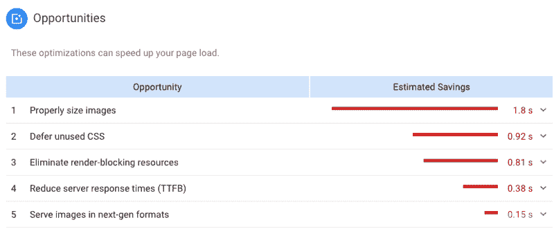
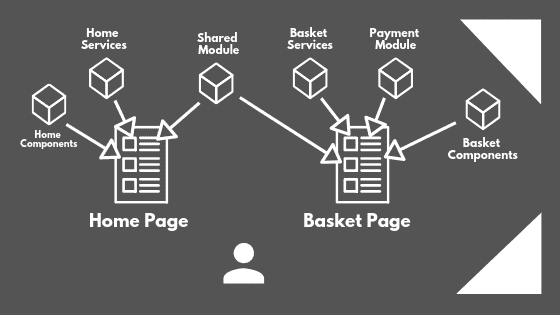

# 如何提升前端应用的性能

> 原文：<https://www.freecodecamp.org/news/how-to-boost-your-front-end-applications-performance-72ce872b08c/>

如果你的网站加载时间超过 3 秒，你可能已经失去了将近一半的访问者。

是的，这是一个事实，被一些研究证明了。漫长的加载时间会对应用程序的转换率产生毁灭性的影响。另一方面，优化页面加载时间会显著改善客户体验、转化率、SEO，并最终提高你的产品的**成功**。

假设你最近使用现代 JS 框架(Angular，React，VueJS 等)建立了一个网站或前端应用程序。).我们如何确保性能不会阻碍成功？

重要的事情先来。我们必须以某种方式收集一些数据。在衡量前端应用的性能时，我最信任的工具是:

*   谷歌 chrome 的[灯塔](https://developers.google.com/web/tools/lighthouse/)
*   [速度曲线](https://speedcurve.com/)

这两个工具都可以帮助你跟踪所有主要的性能 KPI(页面速度指数，互动时间，第一次满意的绘画，等等。).

Lighthouse 包含在你的 Chrome 的开发工具中，通过分析你的网站/网络应用，它可以给你一些关于如何提升它的真正有用的提示。

Chrome’s lighthouse can give you some really helpful hints

有了 **Speedcurve** ，你可以拥有所有这些关键绩效指标，还能随时监控它们。

所以现在我们能够衡量我们的成功，让我们继续优化我们网站中发挥最大作用的部分。

### 形象

图片是每个网站的关键部分。平均而言，图像占网页上加载数据的 60%以上。在我看来，作为几乎所有网站的关键组成部分，图像优化是最重要的，也许是最容易实现的。

#### 1.调整你的图片大小，让它们有反应。

要检查的最重要的事情是你没有使用比你真正需要的更大的分辨率。所以你必须调整你的图片大小，以符合你的布局要求。

Responsive layouts need responsive images

此外，你必须确保你的图像和你的布局一样反应灵敏。我最近一直在使用一个很棒的工具，它可以帮助你生成你可能需要的所有不同版本的图像，还可以生成可以利用它们的 HTML5 代码。它叫做[响应图像断点发生器](https://www.responsivebreakpoints.com/)。我通常喜欢生成 8-10 个不同的图像。

当然，您可以在任何前端应用程序或网站中使用生成的 HTML5 代码。此外，如果你喜欢吞咽，你可以用[吞咽响应](https://github.com/mahnunchik/gulp-responsive)插件自动完成这个过程。

#### 2.确保它们是惰性加载的。

惰性加载基本上意味着我们推迟加载不需要立即加载的图像。通常，对于用户在其当前视窗中不可见的任何图像，可以在稍后图像进入或将要进入视窗时加载。

无论你使用哪种框架，你都可以找到一个插件来为你延迟加载图像(例如 VueJS 中的 [v-lazy-image](https://github.com/alexjoverm/v-lazy-image) )，然而你也可以构建自己的实现。只要确保你使用现代的方法来检测元素何时进入或退出浏览器的视窗，即[intersectionobserver API](https://github.com/alexjoverm/v-lazy-image)。

#### 额外收获:使用 CDN 进行图像传输

如果你已经优化了你的网站加载的图片的大小和数量，特别是如果它将在全球范围内可用，你也可以使用**内容交付网络** (CDN)来服务它们。

简而言之，CDN 在其全球分布的服务器网络上缓存您的图像。因此，如果一个澳大利亚用户从你的网站上请求一张图片，而不是从你在欧洲的服务器上检索，CDN 将从另一个更接近澳大利亚用户的服务器上发送。这减少了加载映像所需的往返时间。

### CSS、JS 和 HTML

所有现代框架都在产品构建期间优化你的代码(代码分割、树抖动、缩小等)。).除此之外你还能做什么？

#### 1.优化主 HTML 文档

HTML 是几乎所有网络应用的支柱。当涉及到在 HTML 文档中引用资源时，您应该遵循一些最佳实践。建议:

*   将 CSS 引用放在 HTML 文档标题的顶部，以确保渐进式呈现。
*   将 JavaScript 属性放在 HTML 主体的底部，并且[更喜欢异步脚本加载](https://www.w3schools.com/tags/att_script_async.asp)。这将防止任何`<scri` pt >标签阻塞 HTML 呈现过程。

#### 2.确保你只装载你需要的东西

Lazy loading components and modules

Angular、React 和 VueJS 都为您提供了延迟加载功能。你只需要根据你自己的需要适当地分割你的代码，并且只加载你需要的模块，只要你真的需要它们。例如，如果您有一个电子商务应用程序，您必须确保当用户在主页上时，购物篮模块或支付模块没有被加载。

### 压缩和缓存

一般来说，对于所有对你的前端至关重要的资产(图像和代码)，你应该应用压缩并适当地缓存它们。

文件压缩将使你的应用程序的资产变得更轻，并减少服务它们所需的往返时间。最常用的文件压缩方法之一是 **Gzip** ，这是一种收缩代码块、文档、图像和音频文件的优秀方法。

[**Brotli**](https://github.com/google/brotli) 是另一种文件压缩算法，它越来越受欢迎。这种开源算法由谷歌和其他组织的软件工程师定期更新。事实证明，它能以比其他现有方法更好的 T4 比率压缩文件。

您可以在 nginx、apache 或您正在使用的任何服务器上启用您喜欢的压缩方法，方法是修改它们的配置文件([在 nginx 上启用 brotli](https://www.howtoforge.com/tutorial/how-to-install-nginx-with-brotli-compression-on-ubuntu-1804/)或[在 apache 上启用 brotli](https://ayesh.me/apache-brotli))。

说到缓存，最常用的缓存技术(也是 Lighthouse 推荐的)叫做**利用浏览器缓存**。同样，您可以通过修改服务器的配置文件来启用它([启用利用浏览器缓存](https://www.keycdn.com/blog/leverage-browser-caching))。

### 摘要

说到网站和前端应用，性能是一个巨大的话题，我们应该认真对待。

我希望这篇文章能帮助您理解并解决一些最重要的问题，这些问题是我们在提高应用程序性能时需要注意的。

如需详细的清单，请务必查看[前端性能清单](http://ront-End-Performance-Checklist)。

干杯！？