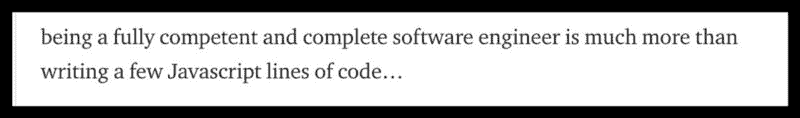
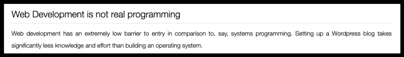
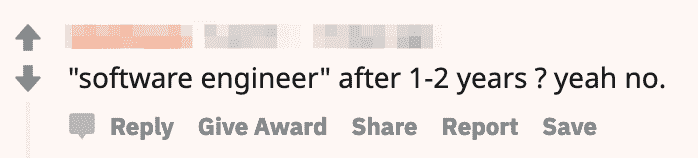
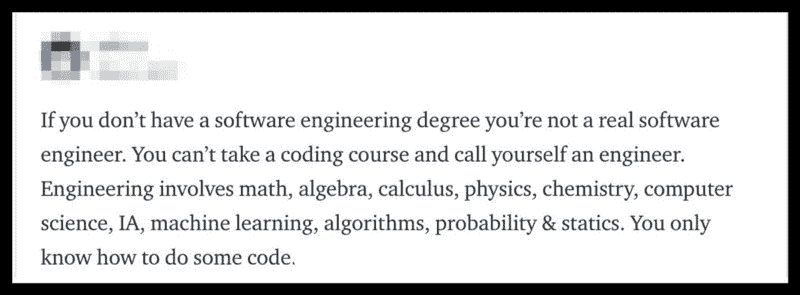
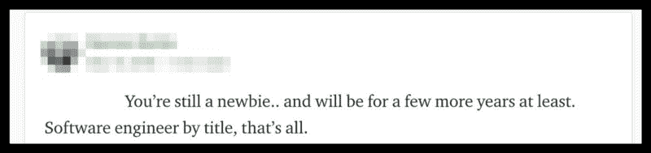
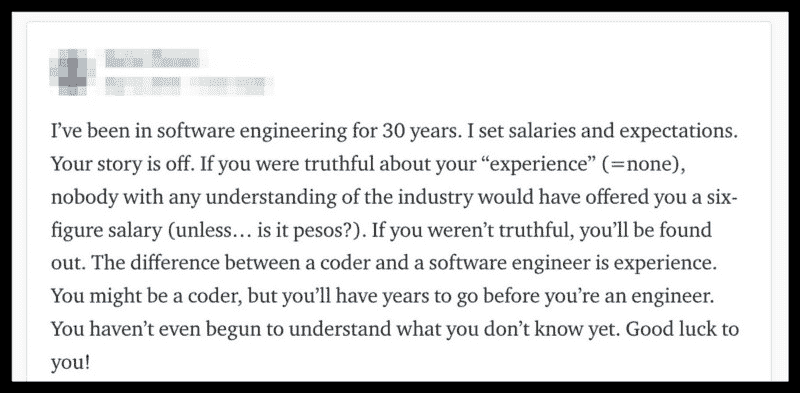
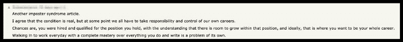
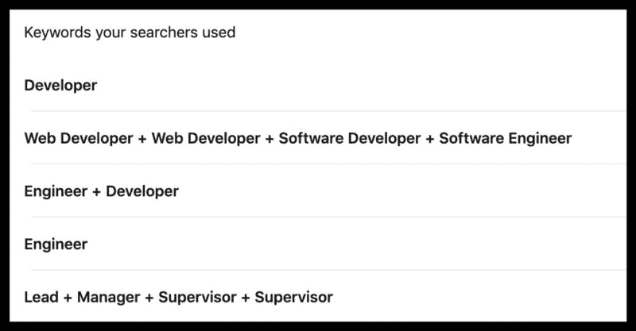

# 我是“真正的”软件工程师吗？

> 原文：<https://www.freecodecamp.org/news/am-i-a-real-software-engineer-yet-a0f38a2248c0/>

作者:孙李贝蒂

# 我是“真正的”软件工程师吗？

MacBook Air on white surface. Credit: [https://unsplash.com/photos/s7nlaF3kefg](https://unsplash.com/photos/s7nlaF3kefg)

我是“真正的”软件工程师吗？

这个问题困扰了我多年。似乎我并不孤单。许多人都有同样的不安全感。他们渴望知道他们是否成功了。他们终于*够好了吗？*

虽然“软件工程师”是雇主给出的标准头衔，但软件社区中的许多人有不同的标准。对于新加入这个领域的程序员来说，尤其是那些没有计算机科学学位的人，这个头衔看起来很安全。只授予那些证明了自己的精英。

许多人将这种缺乏感称为“冒名顶替综合症”，尽管它有许多名字。开发人员以不同的方式体验它，并有不同的反应。对一些人来说，这可能是有害的，但其他人可能不会注意到。

在这篇文章中，我将讲述我自己与冒名顶替综合症的折磨。虽然我不假装有治愈的方法，但我希望在这个话题上提供更多的信息，并帮助其他正在处理这个问题的人。

**注:**我分享的所有评论都是我在网上找到的真实评论。不是所有的都是针对我的，但我也听到过类似的言论。我相信你也是。

### 当一切开始的时候

Photo by [Danielle MacInnes](https://unsplash.com/photos/IuLgi9PWETU?utm_source=unsplash&utm_medium=referral&utm_content=creditCopyText) on [Unsplash](https://unsplash.com/search/photos/begin?utm_source=unsplash&utm_medium=referral&utm_content=creditCopyText)

对我来说，是从 2016 年 7 月开始的。我已经开始学习 web 开发，作为新年的一个决心。我当时对自己的职业不满意，想换个工作。这是一个共同起源的故事，我相信很多人都会有同感。

我专注于前端开发，因为我听说 HTML、CSS 和 JavaScript 很容易掌握。下班后，我花了几个晚上解析 Treehouse、Lynda 和 Codecademy 教程。2016 年的前三个月就这样过去了。到了四月，我的笔记本上写满了详细的笔记，我的 GitHub 包含了一些静态站点。但是我不满意。我想全力投入一个更大的项目。

那时我决定为我的妻子 T1 创建一个作品集网站，她是一名产品设计师。以我当时的技术水平，这不是一件容易的事。我挣扎了很久，花了四个月的大部分时间才完成。

值得注意的是，在我妻子的网站工作期间，我尽最大努力让自己置身于科技文化之中。我看了 YouTube 视频，听了播客，看了经验丰富的工程师的博文，让自己保持动力。我幻想站在他们的立场会是什么样子。在科技公司工作，研究最新的技术，在税单上写“软件工程师”作为我的职业。[硅谷](https://en.wikipedia.org/wiki/Silicon_Valley_(TV_series))让这一切看起来如此辉煌。

这就是为什么当我妻子的网站在那年 7 月上线时，我高兴得不得了。我已经做到了。我已经做了我的第一个真正的网站，它将获得真正的流量。我终于可以称自己为软件工程师了吗？

### “Web 开发不是真正的编程”

网上不是这么说的:

“being a fully competent and complete software is much more … ”

“Web development is not real programming” — Read more [here](http://joequery.me/code/the-self-hating-web-developer/)

“Web 开发不是真正的编程”，“JavaScript 不是真正的编程语言”，“前端开发人员不是软件工程师”都是我经常听到的短语。虽然我决心转行，但我也有自知之明。我无法摆脱反对者是对的这一想法。

如果我有 B 计划或稳定的职业可以依靠，我可能会当场放弃。幸运的是，我没有。不管是好是坏，我没有其他职业或技能可以依靠，而且我已经投入了太多时间。所以我继续艰难前行，沉没成本让我得以生存。

接下来的 18 个月，我全职学习软件开发。我辞掉了工作，搬去和我的姻亲住在一起——这本身就是一次旅行。我把我的一切都投入到我的职业生涯中。我学了 Ruby，Node，还有一些 Go，建了一些小的 web apps。

到 2018 年 1 月，我开始职业转换已经两年了，我学到了很多东西。我知道基本原理，我可以用多种语言编程，并且我已经开始为开源项目做贡献。我也有一份像样的作品集可以展示。我很兴奋终于可以称自己为软件工程师了。

“没那么快，”互联网说。

“software engineer” after 1–2 years? yeah no.”

“If you don’t have a software engineering degree you’re not a real software engineer. ... You only know how to do some code.”

在这一点上，我已经和许多怀疑者打过交道。虽然听到批评的感觉仍然不好，但我已经学会在很大程度上忽略它。此外，我还有一张王牌。我可以完成最后一步来打消所有的疑虑:找份工作。

是的，一份软件工程的工作。圣杯。我会得到头衔、薪水和赞誉。不再自我怀疑。只配得到雇主的认可。

[我就是这么做的](https://hackernoon.com/what-it-took-to-land-my-dream-software-engineering-job-17c01240266b)。我于 2018 年初开始面试，并于 2018 年 3 月签署了我的第一份录取通知书。我的正式角色是“软件工程师”。就是这样，寻求认可的过程终于结束了。

### 越来越糟

“You’re still a newbie.. and will be for a few more years at least. Software engineer by title, that’s all.

“I’ve been in software engineering for 30 years. …You haven’t even begun to understand what you don’t know yet. Good luck to you!”

至少我是这么想的。看门人似乎甚至延伸到了就业领域。但一切都结束了。我是一名软件工程师——我有 W4 文件为证。当我第一天上班走进办公室的时候，我所有的担心都消失了。

但事实并非如此。谁知道增加义务和截止日期会让一个人的不安全感变得更糟，而不是更好？

当我第一天到达公司时，我的焦虑达到了顶点。我听不懂的无聊对话。GitHub 仓库里有成千上万行我无法理解的代码。我从未听说过或使用过的开发工具。我工作的第一周压力很大。

不要误会我的意思，我很高兴被这样有经验的工程师所包围。我的团队中有很多我见过的最聪明的工程师，他们非常善解人意。他们指导我，让我加快速度。但它仍然令人生畏。

我的许多同事都有高等学位，有些人从十几岁就开始编程，还有一些人是大型开源项目的核心维护者。我是谁？某个因为在电视上看起来很酷而学习编码的家伙。我感到格格不入，这种感觉并没有消失。

我的想法开始类似于那些我努力证明是错误的负面评论:

我到底是怎么来到这里的？是运气吗？有人犯错了吗？

我意识到我不需要 Reddit 来指出我的不足之处——我自己很有能力做到这一点。的确，随着时间的推移，我越来越熟悉我的环境。我开始理解 Slack 对话，代码变得更加熟悉，我学会了如何使用各种工具。然而，我无法摆脱在异乡是个陌生人的感觉。我犯的每一个错误都进一步证明了这一点。

我期待着有一天，我犯了太多的错误，最后有人问:“你到底是怎么被录用的？”那种恐惧吞噬了我。我开始阅读白皮书，经常浏览黑客新闻，并参加课程以获得计算机科学学位。所有这些都是为了让我最终觉得自己适合这里。我是一个“真正的”软件工程师。但是都没用。

幸运的是，我找到了一些有用的东西。

### 找到我的解决方案

我为自己找到的解决方案简单而又可怕。

**说话。**

我得和某人谈谈。我不能再隐瞒下去了。然而，我太紧张了，不敢问任何一个同事这样的问题:“你有没有觉得自己是个骗子？”相反，我从我的密友开始。但是我很快发现自己在和任何人讨论这个话题，包括同事和队友。因为我说的越多，听的越多，我越意识到我不是一个人。

事实证明，冒名顶替综合症太普遍了，已经成了老生常谈！

“Another impostor syndrome article …. Walking in to work everyday with a complete mastery over everything you do and write is a problem of its own.”

许多处于事业巅峰的专业人士都经历过。[蒂娜·菲](https://www.instyle.com/celebrity/stars-imposter-syndrome?slide=3163098#3163098)，[约翰·斯坦贝克](https://www.grammarly.com/blog/notable-people-imposter-syndrome/)，甚至[阿尔伯特·爱因斯坦](https://www.therebegiants.com/overcoming-impostor-syndrome/)。发现我和这么好的人在一起令人欣慰。此外，在与一位密友交谈时，他说了一些引起我共鸣的话:

> “冒名顶替综合症唯一不好的时候是你没有患上它。感觉自己是个骗子是你在学习的标志。在一个新的不舒服的环境中感到焦虑是完全正常的。当你觉得自己完全知道该做什么，知道一切是如何运作的时候，麻烦就来了。如果你发现自己处于那种情况，你就再也学不到东西了。”

就在那一刻，我意识到冒名顶替综合症不是一个可以对抗或忽视的问题。有了正确的心态，它可以成为一种工具。这听起来像是一些自我感觉良好的谎言，但是公共演讲者使用类似的技巧将焦虑转化为兴奋。

这并不是说我的不安全感已经神奇地消失了。远非如此。每当我有新项目要做时，我的恐慌就会不受欢迎地回来。我的心跳加速，脑海中浮现出失败的神奇壮举。然而，我已经学会把这种紧张的能量解释为我正在学习并把自己推向新高度的标志。

当我的经理给我一个复杂的任务时，这意味着他们相信我能完成它。我可能需要寻求帮助，研究这个话题，或者只是出去散散步冷静一下神经，但我知道我会挺过去的。我还是会一直犯错，这一点永远不会改变。这都是过程的一部分。

毕竟，没有人什么都懂，即使是在自己的专业范围内。丹·阿布拉莫夫不知道 flexbox 和[大卫·海涅梅尔·汉森](https://en.wikipedia.org/wiki/David_Heinemeier_Hansson)仍然在查找他自己写的 ActiveRecord 方法。如果完美是一个可行的目标，堆栈溢出就不会像现在这样流行。

### 我是“真正的”软件工程师吗？

那么过了这么久，我还是一个“真正的”软件工程师吗？LinkedIn 似乎是这么认为的。

更好的问题是，“这重要吗？”我并不总是对科技充满热情，我也缺乏摇滚明星工程师那种诱人的出身故事。但我现在在这里，我会留在这里。所以，对于那些对我的头衔有强烈意见的科技界人士，随便你怎么称呼我。软件工程师、程序员、脚本小子...

我的头衔对我不再重要。重要的是我做了什么。我所做的就是用代码解决问题，设计解决方案，让人们的生活变得更好。

最棒的是，我非常擅长这个。

#### 我的更多信息:

[**需要更快的代码？尝试多线程**](https://hackernoon.com/need-faster-code-try-multithreading-5dc30c83837c)
[*在程序员的职业生涯中，有时他们会意识到他们的代码只需要运行得更快。无论是…*hackernoon.com](https://hackernoon.com/need-faster-code-try-multithreading-5dc30c83837c)[**两个网站的故事**](https://medium.freecodecamp.org/a-tale-of-two-websites-the-importance-of-slow-progress-and-self-reflection-4a09ffcbd059)
[*缓慢进展和自我反思的重要性*medium.freecodecamp.org](https://medium.freecodecamp.org/a-tale-of-two-websites-the-importance-of-slow-progress-and-self-reflection-4a09ffcbd059)[**构建秘密会议:一个分散的、实时的、协作的文本编辑器**](https://hackernoon.com/building-conclave-a-decentralized-real-time-collaborative-text-editor-a6ab438fe79f)
[*使用 WebRTC 和无冲突复制数据类型(crdt)*hackernoon.com](https://hackernoon.com/building-conclave-a-decentralized-real-time-collaborative-text-editor-a6ab438fe79f)