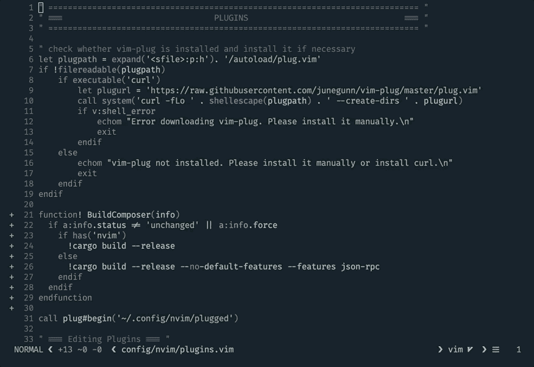
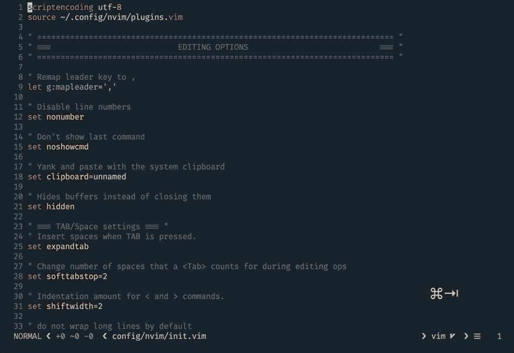
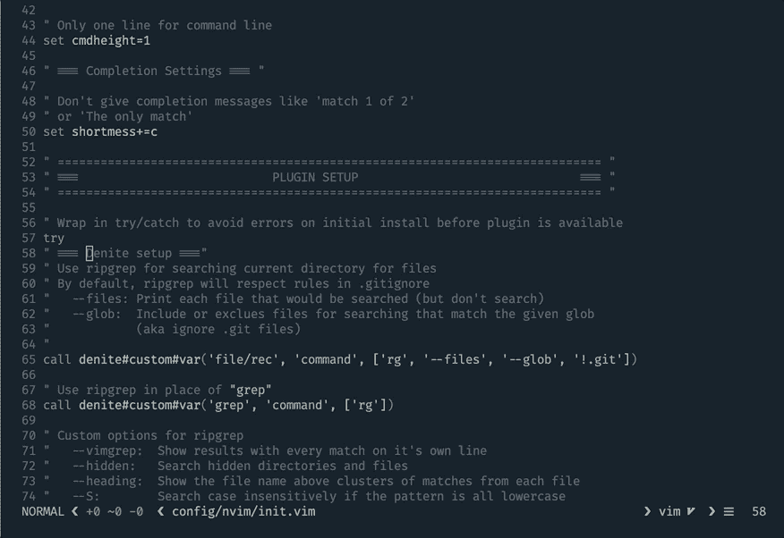
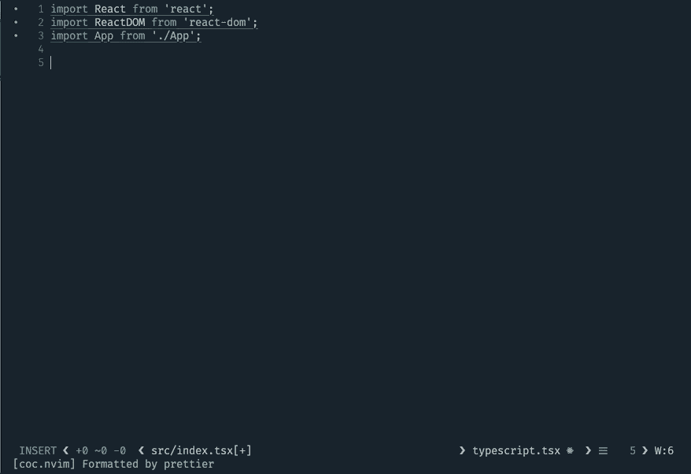
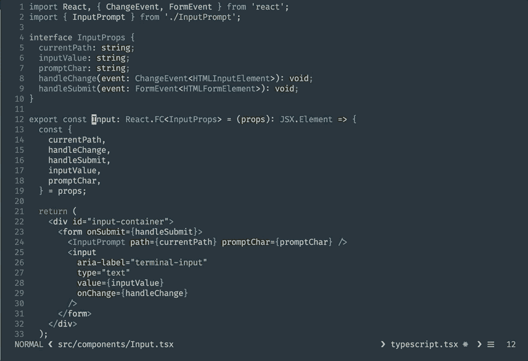
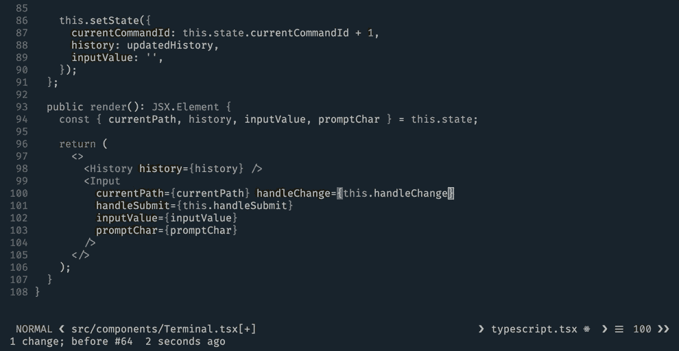

# 使用(Neo)vim 的现代 Web 开发指南

> 原文：<https://www.freecodecamp.org/news/a-guide-to-modern-web-development-with-neo-vim-333f7efbf8e2/>

凯勒·泰勒

# 使用(Neo)vim 的现代 Web 开发指南

有很多优秀的编辑器为 web 开发提供了大量的特性。在 Vim 中重现这些特性一直是一个挑战。我喜欢 Vim，但我也花了 ***吨*** 的时间来调整我的设置。这篇文章是我工作成果的总结。


Jarvis in action

我使用 [coc.nvim](https://github.com/neoclide/coc.nvim) 和 [denite](https://github.com/Shougo/denite.nvim) 来增强我的编码体验。Denite 用于模糊查找文件，管理打开的文件，并搜索您的项目。Coc.nvim 通过包装许多驱动 [VSCode IDE](https://code.visualstudio.com/) 的相同核心扩展来驱动[智能感知](https://docs.microsoft.com/en-us/visualstudio/ide/using-intellisense?view=vs-2019)引擎。关于我的完整设置，包括我如何配置这些插件等等，请查看[我的点文件](https://github.com/ctaylo21/jarvis)。

> **注**:本文中我只引用 Vim，实际上我用的是 [Neovim](https://neovim.io/) 。这些插件都可以和 Vim 一起工作——取决于版本——但是像“浮动窗口”这样的功能将会是 Neovim 特有的。

### **简介**

我每天都在编写 TypeScript/JavaScript，我知道 Vim 和像 VSCode 这样的现成编辑器之间的差别有多么明显。现代编辑器中有许多特性需要时间、专业知识和/或插件才能在 Vim 中实现。

我已经创建了以下功能列表，这是我对现代编辑器的期望。标准编辑器特性(如语法高亮)不包括在内。

1.  **模糊文件查找** —如果知道项目中的文件名，应该可以快速打开(比如—两次击键+最少字符数到唯一文件名)。
2.  **文件切换** —您应该能够看到打开的文件，并在打开的文件之间快速切换，包括模糊查找和手动浏览。
3.  **—代码林挺应该是自动的和快速的**、**并且你应该会使用代码固定器。**
4.  ****项目搜索** —你应该能够搜索一个任意的字符串，搜索一个符号，找到一个符号的定义和用法。**
5.  **代码智能感知(Code Intellisense)——让你的 IDE 提供相关的、无缝的建议和自动完成功能可以极大地提高生产率。在我看来，大多数 Vim 用户的“白鲸”。**

**让所有这些东西在 Vim 中工作可能是一件痛苦的事情。有大量的插件可供选择，配置需要调整，文档需要阅读。经过 7 年的反复试验，我终于找到了一个好地方。最精彩的部分？**

**我将向你展示如何用两个插件获得所有的核心功能。**

**我不会涵盖这些令人敬畏的插件的每一个特性，也不会列出所有可能的替代品(有很多很棒的)。我将重点强调我使用的核心功能，以及我用来提升体验的任何映射或配置。**

**所以事不宜迟，让我们开始吧。**

### ****Denite****

****您的收获:**模糊文件查找、文件管理、项目搜索**

**我不想撒谎，丹尼特是相当疯狂的。看看[的文件](https://github.com/Shougo/denite.nvim/blob/master/doc/denite.txt)。在基本层面上，它在一系列核心功能之上提供了一个模糊查找层。它是由传奇的维姆绝地大师[寿戈](https://github.com/Shougo)建造的。**

**Denite 建立在[lambda lisue/neovim-prompt](https://github.com/lambdalisue/neovim-prompt)之上。它有一个功能齐全的界面，可能需要一段时间来适应。您可以创建自定义菜单，并使用 Denite 作为顶层的许多自定义源。**

#### ****基础知识****

**我主要使用 [Denite](https://github.com/Shougo/denite.nvim) 在我的项目中查找文件，并管理我打开的文件。我已经配置 Denite 使用 [ripgrep](https://github.com/BurntSushi/ripgrep) 来支持我的搜索。你可以看到[我是如何在我的设置中配置](https://github.com/ctaylo21/jarvis/blob/master/config/nvim/init.vim#L58)它的。**

**我有所有的关键功能映射，方便快捷地访问。我为这些映射使用的键只是个人偏好，应该为每个用户定制。我对 Denite 映射使用“浮动窗口”选项，但也支持其他变化(如水平/垂直分割)。**

#### ****管理打开的文件****

**`;`调出当前打开的文件列表。你可以开始输入，它将允许你模糊搜索当前打开的文件。当文件列表打开时，`<ctr` l > o 让你像在`re in` 正常模式下一样浏览列表，在这里你可以打开和/或删除列表中的任何文件。**

**

Managing open buffers with Denite** 

#### ****模糊查找文件****

**模糊搜索当前目录中的文件。使用 ripgrep， `your .git` ignore 中的任何文件也会被忽略。**

**

Fuzzy-finding files in the current directory** 

#### ****项目搜索****

**`<leade`r>T1；leader > j 在整个项目中搜索给定的术语，并分别在光标下搜索该术语。**

**

Searching with Denite** 

#### ****配置****

**Denite 可能是一个很难理解的工具。它有很好的文档记录，但是它确实引用了一些大多数用户可能不熟悉的概念。我所有的 [Denite 配置](https://github.com/ctaylo21/jarvis/blob/master/config/nvim/init.vim#L58)都记录在我的设置中，所以你应该可以把它作为参考。这里有一个快速配置 Denite 基本选项的例子，比如定制高亮组和布局。**

### **Coc.nvim**

****结果:**智能感知代码引擎、自动完成、林挺、代码修复**

**Vim 现代开发的最大挑战之一是设置[智能感知代码完成](https://en.wikipedia.org/wiki/Intelligent_code_completion)。大多数现代编辑器，如 [Visual Studio Code](https://code.visualstudio.com/) 都内置了智能感知引擎，或者可以通过插件轻松获得(只需很少的设置)。**

**我试过几种解决方案，coc.nvim 是我用过的最好的。它有几个主要特性，这些特性是将 Vim 提升到与现代 ide 相同水平的关键。**

**我认为它是 Vim 中智能感知的较好解决方案之一，有几个主要原因:**

1.  **它非常容易安装，并且很快就能与我的 TypeScript 和 JavaScript 项目一起工作。**
2.  **它建立在语言服务器上，在许多现代编辑器中支持智能感知。**
3.  **像 [coc-tsserver](https://github.com/neoclide/coc-tsserver) 这样的语言服务器扩展建立在内置于 VSCode 的[类型脚本/JavaScript 代码扩展](https://github.com/Microsoft/vscode/tree/master/extensions/typescript-language-features)之上。因此，随着 VSCode 服务器扩展的改进，Vim 用户也可以从中受益。**

#### ****基础知识****

**启动并运行 coc.nvim 非常简单。一旦你按照[安装说明](https://github.com/neoclide/coc.nvim/wiki/Install-coc.nvim)，你就可以通过运行`:CocInstall`来安装语言服务器扩展。**

**例如，在我当前基于 web 的项目中，通过运行以下命令，我可以为大多数现代 TypeScript/JavaScript 项目提供一个全功能的 intellisense 引擎:**

```
`:CocInstall coc-tsserver coc-eslint coc-json coc-prettier coc-css`
```

#### ****LSP 扩展****

**这是 coc.nvim 体验的核心。有了像 [coc-tsserver](https://github.com/neoclide/coc-tsserver) 这样的语言服务器扩展，你就有了一大堆[特性](https://github.com/neoclide/coc-tsserver#features)。我将强调几个:**

*   **代码完成支持**
*   **转到定义**
*   **查找参考资料**
*   **签名帮助**
*   **代码验证**
*   **支持 Javascript & TypeScript 和 JSX/TSX**

**

coc-tsserver in action with React and Typescript** 

**默认情况下，您可以快速、自动地完成代码。类型是自动导入的，您可以在键入时看到函数签名和相关的代码完成。**

**我设置了一些键映射来快速利用语言服务器的一些关键特性:**

**这些映射允许您快速跳转到符号定义，查看符号的实现，或者找到引用它的位置。我经常使用它们，发现它们极大地提高了工作效率。**

**

Using coc.nvim mappings** 

#### ****林挺****

**我的 JavaScript 和 TypeScript 项目都依赖于林挺的 ESLint。既然 [TSLint 已经被弃用](https://medium.com/palantir/tslint-in-2019-1a144c2317a9)，选择就更加容易了。我最初使用的是 [Ale](https://github.com/w0rp/ale) (这是一个很棒的工具)，但是当它和 coc.nvim 一起使用时会有一些问题**

**现在，使用 [coc-eslint 语言服务器扩展](https://github.com/neoclide/coc-eslint)，您可以使用相同的工具从您的 linter 和语言服务器获得实时反馈。我还使用[COC-beautiful](https://github.com/neoclide/coc-prettier)让 coc.nvim 将我的代码格式化为[beautiful](https://prettier.io/)标准的文件保存。**

**

Using eslint and prettier via coc.nvim** 

#### ****配置****

**您可以通过创建配置文件来配置 coc.nvim 设置。现在，[我的](https://github.com/ctaylo21/jarvis/blob/master/config/nvim/coc-settings.json)很简单:**

**你可以在这里阅读更多关于设置你自己的 coc.nvim 配置文件[的信息。](https://github.com/neoclide/coc.nvim/wiki/Using-configuration-file)**

### **结论**

**差不多结束了。我很乐意听到任何反馈或建议，所以请留下评论！如果你错过了上面的内容，关于我的完整设置，请查看我的[点文件](https://github.com/ctaylo21/jarvis)和[关于我在 Vim 之外的其余设置](https://medium.freecodecamp.org/coding-like-a-hacker-in-the-terminal-79e22954968e)的文章。感谢阅读！**