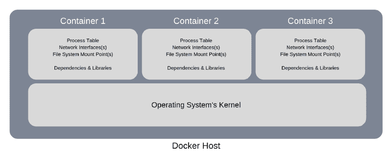
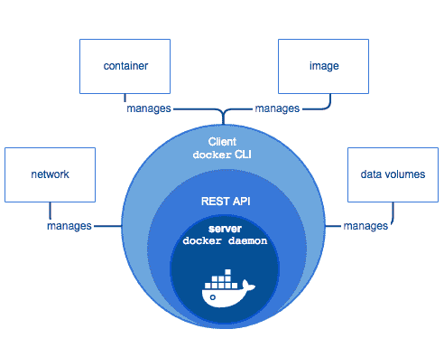

# Docker 简化版:绝对初学者的实践指南

> 原文：<https://www.freecodecamp.org/news/docker-simplified-96639a35ff36/>

作者:沙赫赞

无论你是计划在 DevOps 开始你的职业生涯，还是已经进入其中，如果你的简历上没有 Docker，无疑是时候考虑一下了，因为 Docker 是任何进入 DevOps arena 的人的关键技能之一。

在这篇文章中，我将尽我所能用最简单的方式来解释 Docker。

在我们深入研究并开始探索 Docker 之前，让我们先来看看作为初学者指南的一部分，我们将涵盖哪些主题。

*   [Docker 是什么？](https://medium.com/p/96639a35ff36#06d9)
*   [码头工人解决的问题](https://medium.com/p/96639a35ff36#ba08)
*   [使用 Docker 的优缺点](https://medium.com/p/96639a35ff36#dcc3)
*   [Docker 的核心部件](https://medium.com/p/96639a35ff36#5539)
*   [码头术语](https://medium.com/p/96639a35ff36#b7d7)
*   [什么是 Docker Hub？](https://medium.com/p/96639a35ff36#a053)
*   [Docker 版本](https://medium.com/p/96639a35ff36#965a)
*   [安装对接器](https://medium.com/p/96639a35ff36#d3ff)
*   [帮助您入门的一些基本 Docker 命令](https://medium.com/p/96639a35ff36#d56c)
*   [总结](https://medium.com/p/96639a35ff36#0ba9)

### 我们先来了解一下，Docker 是什么？

简单来说，Docker 是一个软件平台，它简化了构建、运行、管理和分发应用程序的过程。它通过对安装和运行它的计算机的操作系统进行虚拟化来实现这一点。

Docker 第一版发布于 2013 年。

Docker 是使用 GO 编程语言开发的。


> 看看 Docker 提供的丰富功能，它已经被一些世界领先的组织和大学广泛接受，例如 Visa、PayPal、康奈尔大学和印第安纳大学(仅举几例)使用 Docker 运行和管理他们的应用程序。

### 现在让我们试着理解这个问题，以及 Docker 提供的解决方案

#### 问题是

假设您有三个不同的基于 Python 的应用程序，您计划将它们托管在一个服务器上(可以是物理机也可以是虚拟机)。

这些应用程序中的每一个都使用不同版本的 Python，并且相关的库和依赖项也因应用程序而异。

由于我们不能在同一台机器上安装不同版本的 Python，这就阻止了我们在同一台计算机上托管所有三个应用程序。

#### 解决方案

让我们看看如何在不使用 Docker 的情况下解决这个问题。在这种情况下，我们可以通过拥有三台物理机或单台物理机来解决这个问题，单台物理机足够强大，可以在其上托管和运行三台虚拟机。

这两个选项都允许我们在每台机器上安装不同版本的 Python，以及它们相关的依赖项。

无论我们选择哪种解决方案，与采购和维护硬件相关的成本都非常昂贵。

现在，让我们来看看 Docker 如何成为解决这个问题的一个高效且经济的解决方案。

为了理解这一点，我们需要看看 Docker 到底是如何工作的。



安装并运行 Docker 的机器通常简称为 Docker 主机或主机。

因此，每当您计划在主机上部署应用程序时，它都会在主机上创建一个逻辑实体来托管该应用程序。在 Docker 术语中，我们称这个逻辑实体为容器，或者更准确地说是 Docker 容器。

Docker 容器上没有安装和运行任何操作系统。但是它将拥有进程表、网络接口和文件系统挂载点的虚拟副本。这些是从承载和运行容器的主机的操作系统继承的。

而主机操作系统的内核在其上运行的所有容器之间共享。

这允许每个容器与同一主机上的其他容器相隔离。因此，它支持具有不同应用程序需求和依赖性的多个容器在同一主机上运行，只要它们具有相同的操作系统需求。

要理解 Docker 在解决这个问题上是如何发挥作用的，您需要参考下一节，其中讨论了使用 Docker 的优点和缺点。

简而言之，Docker 将虚拟化安装和运行它的主机的操作系统，而不是虚拟化硬件组件。

### 使用 Docker 的利与弊

#### 使用 Docker 的优势

下面列出了使用 Docker 的一些主要好处:

*   Docker 支持具有不同应用程序需求和依赖关系的多个应用程序一起托管在同一台主机上，只要它们具有相同的操作系统需求。
*   存储优化。大量的应用程序可以托管在同一台主机上，因为容器的大小通常只有几兆字节，并且占用很少的磁盘空间。
*   鲁棒性。容器上没有安装操作系统。因此，与虚拟机(安装并运行完整的操作系统)相比，它消耗的内存非常少。这还将启动时间缩短到了几秒钟，而启动虚拟机需要几分钟。
*   降低成本。Docker 对运行它所需的硬件要求不高。

#### 使用 Docker 的缺点

*   具有不同操作系统要求的应用程序不能一起托管在同一个 Docker 主机上。例如，假设我们有 4 个不同的应用程序，其中 3 个应用程序需要基于 Linux 的操作系统，另一个应用程序需要基于 Windows 的操作系统。在这种情况下，需要基于 Linux 的操作系统的 3 个应用程序可以托管在单个 Docker 主机上，而需要基于 Windows 的操作系统的应用程序需要托管在不同的 Docker 主机上。

### Docker 的核心组件

**Docker 引擎**是 Docker 的核心组件之一。它负责 Docker 平台的整体功能。

Docker Engine 是一个基于客户端-服务器的应用程序，由 3 个主要组件组成。

1.  计算机网络服务器
2.  REST API
3.  客户



Image Source: [https://docs.docker.com](https://docs.docker.com/v17.12/engine/docker-overview/)

**服务器**运行一个名为**Docker****(Docker Daemon)**的守护进程，它只不过是一个进程。它负责在 Docker 平台上创建和管理 Docker 映像、容器、网络和卷。

REST API 指定了应用程序如何与服务器交互，并指示它完成工作。

客户端只是一个命令行界面，允许用户使用命令与 **Docker** 进行交互。

### 码头术语

让我们快速浏览一下与 Docker 相关的一些术语。

**Docker 图片**和 **Docker 容器**是你每天在与 **Docker** 一起工作时会遇到的两个必不可少的东西。

简单来说， **Docker 映像**是一个包含应用程序以及在 Docker 上运行该应用程序所需的所有依赖项的模板。

另一方面，如前所述， **Docker 容器**是一个逻辑实体。更准确地说，它是 Docker 映像的运行实例。

#### 什么是 Docker Hub？

Docker Hub 是一个官方的在线知识库，在这里你可以找到所有可供我们使用的 Docker 图片。

如果我们愿意，Docker Hub 还允许我们存储和分发我们的自定义图像。根据我们的要求，我们还可以将它们设为公有或私有。

请注意:免费用户只允许保留一个 Docker 图片作为私有。如果我们希望保留多个 Docker 图像作为私有图像，我们需要订阅付费订阅计划。

### Docker 版本

Docker 有两种不同的版本，如下所示:

*   **社区版(CE)**
*   **企业版(EE)**

**社区版**适合个人开发者和小团队。与企业版相比，它提供的功能有限。

另一方面,**企业版,**适合大型团队和在生产环境中使用 Docker。

企业版进一步分为三个不同的版本，如下所示:

*   **基础版**
*   **标准版**
*   **高级版**

### 安装 Docker

在使用 Docker 之前，我们需要知道的最后一件事是安装 Docker。

以下是 Docker CE 官方安装指南的链接。你可以按照这些指南在你的机器上安装 Docker，因为它们简单明了。

*   [CentOS Linux](https://docs.docker.com/install/linux/docker-ce/centos/)
*   [Debian Linux](https://docs.docker.com/install/linux/docker-ce/debian/)
*   [Fedora Linux](https://docs.docker.com/install/linux/docker-ce/fedora/)
*   [Ubuntu Linux](https://docs.docker.com/install/linux/docker-ce/ubuntu/)
*   [微软视窗系统](https://docs.docker.com/docker-for-windows/install/)
*   [苹果电脑](https://docs.docker.com/docker-for-mac/install/)

#### 想跳过安装，直接开始练习 Docker 吗？

万一你懒得安装 Docker，或者你的计算机上没有足够的可用资源，你不必担心——下面是你的问题的解决方案。

你可以前往[和 Docker](https://labs.play-with-docker.com/) 一起玩，这是 Docker 的在线游乐场。它允许用户立即练习 Docker 命令，而不必在你的机器上安装任何东西。最棒的是它使用简单，而且免费。

### Docker 命令

现在是时候使用 Docker 命令了，这是我们一直等待的。

#### docker 创建

我们将看到的第一个命令是 **docker create** 命令。

这个命令允许我们创建一个新的容器。

该命令的语法如下所示:

```
docker create [options] IMAGE [commands] [arguments]
```

请注意:方括号内的任何内容都是可选的。这适用于您将在本指南中看到的所有命令。

使用此命令的一些示例如下所示:

```
$ docker create fedora
```

```
02576e880a2ccbb4ce5c51032ea3b3bb8316e5b626861fc87d28627c810af03
```

在上面的例子中，docker create 命令将使用最新的 Fedora 图像创建一个新的容器。

在创建容器之前，它会检查 Docker 主机上是否有 Fedora 的最新官方图像。如果 Docker 主机上没有最新的映像，它会在创建容器之前从 Docker Hub 下载 Fedora 映像。如果 Docker 主机上已经存在 Fedora 映像，它将利用该映像并创建容器。

如果容器创建成功，Docker 将返回容器 ID。例如，在上面的示例中，02576 e 880 a2 ccbb 4 ce 5c 51032 ea 3 B3 bb 8316 e5b 626861 fc 87d 28627 c 810 af 03 是 Docker 返回的容器 ID。

每个容器都有一个唯一的容器 ID。我们使用容器 ID 来引用容器，以便在容器上执行各种操作，比如启动、停止、重新启动等等。

现在，让我们参考 docker create 命令的另一个例子，它有传递给它的选项和命令。

```
$ docker create -t -i ubuntu bash
```

```
30986b73dc0022dbba81648d9e35e6e866b4356f026e75660460c3474f1ca005
```

在上面的例子中，docker create 命令使用 Ubuntu 映像创建了一个容器(如前所述，如果映像在 docker 主机上不可用，它将在创建容器之前从 Docker Hub 下载最新的映像)。

选项-t 和-i 指示 Docker 为容器分配一个终端，以便用户可以与容器进行交互。它还指示 Docker 在容器启动时执行 bash 命令。

#### docker ps

我们要看的下一个命令是 **docker ps** 命令。

**docker ps** 命令允许我们查看 docker 主机上运行的所有容器。

```
$ docker ps
```

```
CONTAINER ID IMAGE  COMMAND CREATED        STATUS            PORTS NAMES30986b73dc00 ubuntu "bash"  45 minutes ago Up About a minute                 elated_franklin
```

它只显示当前在 Docker 主机上运行的容器。

如果您想查看在这个 Docker 主机上创建的所有容器，不管它们的当前状态如何，比如它们是正在运行还是已退出，那么您需要包含选项-a，它将依次显示在这个 Docker 主机上创建的所有容器。

```
$ docker ps -a
```

```
CONTAINER ID IMAGE  COMMAND     CREATED           STATUS       PORTS NAMES30986b73dc00 ubuntu “bash”      About an hour ago Up 29 minutes elated_franklin02576e880a2c fedora “/bin/bash” About an hour ago Created hungry_sinoussi
```

在我们继续之前，让我们试着解码并理解 **docker ps** 命令的输出。

**容器 ID:** 由字母数字字符组成的唯一字符串，与每个容器相关联。

**IMAGE:** 用于创建该容器的 Docker 图像的名称。

**命令:**启动容器时需要执行的任何应用特定命令。

**CREATED:** 这显示了自该容器创建以来所经过的时间。

**状态:**显示容器的当前状态，以及经过的时间。

如果容器正在运行，它将随着经过的时间段显示为 Up(例如，Up 约一小时或 Up 3 分钟)。

如果容器被停止，那么它将显示为 Exited，后跟圆括号内的退出状态代码，以及经过的时间段(例如，3 周前 Exited (0)或 15 秒前 Exited (137)，其中 0 和 137 是退出代码)。

**PORTS:** 显示为容器定义的任何端口映射。

**名称:**除了容器 ID 之外，每个容器还被分配了一个惟一的名称。我们可以使用容器 ID 或唯一名称来引用容器。Docker 自动为它创建的每个容器分配一个唯一的傻名字。但是如果您想为容器指定您自己的名称，您可以通过在 docker create 或 docker run(稍后我们将查看 docker run 命令)命令中包含`— — name`(双连字符名称)选项来实现。

我希望这能让您更好地理解 docker ps 命令的输出。

#### 码头开始

我们要看的下一个命令是 **docker start** 命令。

此命令启动任何停止的容器。

该命令的语法如下所示:

```
docker start [options] CONTAINER ID/NAME [CONTAINER ID/NAME…]
```

我们可以通过指定容器 ID 的前几个唯一字符或指定其名称来启动容器。

使用此命令的一些示例如下所示:

```
$ docker start 30986
```

在上面的例子中，Docker 从容器 ID 30986 开始启动容器。

```
$ docker start elated_franklin
```

而在本例中，Docker 启动了名为 elastic _ Franklin 的容器。

#### 码头停车

列表中的下一个命令是**停靠站停止**命令。

该命令停止任何正在运行的容器。

该命令的语法如下所示:

```
docker stop [options] CONTAINER ID/NAME [CONTAINER ID/NAME…]
```

它类似于 docker start 命令。

我们可以通过指定容器 ID 的前几个唯一字符或指定其名称来停止容器。

使用此命令的一些示例如下所示:

```
$ docker stop 30986
```

在上面的例子中，Docker 将从容器 ID 30986 开始停止容器。

```
$ docker stop elated_franklin
```

而在本例中，Docker 将停止名为 elastic _ Franklin 的容器。

#### docker 重启

我们要看的下一个命令是 **docker restart** 命令。

此命令重新启动任何正在运行的容器。

该命令的语法如下所示:

```
docker restart [options] CONTAINER ID/NAME [CONTAINER ID/NAME…]
```

我们可以通过指定容器 ID 的前几个唯一字符或指定其名称来重新启动容器。

使用此命令的一些示例如下所示:

```
$ docker restart 30986
```

在上面的例子中，Docker 将从容器 ID 30986 开始重新启动容器。

```
$ docker restart elated_franklin
```

而在本例中，Docker 将重启名为 elastic _ Franklin 的容器。

#### 码头运行

我们要看的下一个命令是 **docker run** 命令。

该命令首先创建容器，然后启动容器。简而言之，这个命令是 docker create 和 docker start 命令的组合。

该命令的语法如下所示:

```
docker run [options] IMAGE [commands] [arguments]
```

它的语法类似于 docker create 命令。

使用此命令的一些示例如下所示:

```
$ docker run ubuntu
```

```
30fa018c72682d78cf168626b5e6138bb3b3ae23015c5ec4bbcc2a088e67520
```

在上面的例子中，Docker 将使用最新的 Ubuntu 映像创建容器，然后立即启动容器。

如果我们执行上面的命令，它将启动容器并立即停止它——我们根本没有机会与容器交互。

如果我们想要与容器交互，那么我们需要指定选项:-它(连字符后跟 I 和 t)向 docker run 命令提供终端，使用它我们可以通过输入适当的命令与容器交互。下面是一个相同的例子。

```
$ docker run -it ubuntu
```

```
root@e4e633428474:/#
```

为了从容器中出来，您需要在终端中键入 exit。

#### 码头工人室

继续下一个命令——如果我们想要删除一个容器，我们使用 **docker rm** 命令。

该命令的语法如下所示:

```
docker rm [options] CONTAINER ID/NAME [CONTAINER ID/NAME...]
```

使用此命令的一些示例如下所示:

```
$ docker rm 30fa elated_franklin
```

在上面的例子中，我们指示 Docker 在一个命令中删除两个容器。要删除的第一个容器使用其容器 ID 来指定，要删除的第二个容器使用其名称来指定。

请注意:容器需要处于停止状态才能被删除。

#### docker 图像

**docker images** 是列表中的下一个命令。

该命令列出了 Docker 主机上存在的所有 Docker 映像。

```
$ docker images
```

```
REPOSITORY  TAG      IMAGE          CREATED        SIZEmysql       latest   7bb2586065cd   38 hours ago   477MBhttpd       latest   5eace252f2f2   38 hours ago   132MBubuntu      16.04    9361ce633ff1   2 weeks ago    118MBubuntu      trusty   390582d83ead   2 weeks ago    188MBfedora      latest   d09302f77cfc   2 weeks ago    275MBubuntu      latest   94e814e2efa8   2 weeks ago    88.9MB
```

让我们解码 **docker images** 命令的输出。

**REPOSITORY:** 这代表 Docker 图像的唯一名称。

**标签:**每张图像都与一个唯一的标签相关联。标签基本上代表了图像的一个版本。

标签通常用一个单词或一组数字或字母数字字符的组合来表示。

**图像 ID:** 由字母数字字符组成的唯一字符串，与每个图像相关联。

**CREATED:** 显示自该图像创建以来经过的时间。

**尺寸:**显示图像的尺寸。

#### rmi 坞站

列表中的下一个命令是 **docker rmi** 命令。

**docker rmi** 命令允许我们从 docker 主机中删除映像。

该命令的语法如下所示:

```
docker rmi [options] IMAGE NAME/ID [IMAGE NAME/ID...]
```

使用此命令的一些示例如下所示:

```
docker rmi mysql
```

上面的命令从 Docker 主机中删除名为 mysql 的映像。

```
docker rmi httpd fedora
```

上面的命令从 Docker 主机中删除名为 httpd 和 fedora 的图像。

```
docker rmi 94e81
```

上面的命令从 Docker 主机中删除以图像 ID 94e81 开始的图像。

```
docker rmi ubuntu:trusty
```

上面的命令从 Docker 主机中删除名为 ubuntu、标签为 trusty 的图像。

这些是您将会看到的一些基本的 Docker 命令。有更多的 Docker 命令需要探索。

### 总结

集装箱化最近得到了应有的重视，尽管它已经存在了很长时间。一些顶级科技公司，如谷歌、亚马逊网络服务(AWS)、英特尔、特斯拉和瞻博网络，都有自己的定制版本的容器引擎。他们非常依赖它们来构建、运行、管理和分发他们的应用程序。

> Docker 是一个非常强大的容器化引擎，在构建、运行、管理和分发应用程序时，它可以提供很多功能。

你刚刚看到了 Docker 的高水平。关于 Docker 还有很多需要学习的地方，例如:

*   Docker 命令(更强大的命令)
*   Docker 图像(构建您自己的自定义图像)
*   Docker 网络(设置和配置网络)
*   Docker 服务(对使用相同图像的容器进行分组)
*   Docker 栈(对应用程序所需的服务进行分组)
*   Docker Compose(管理和运行多个容器的工具)
*   Docker Swarm(分组并管理一台或多台运行 Docker 的机器)
*   还有更多…

如果你觉得 Docker 很吸引人，并且有兴趣了解更多，那么我建议你参加下面列出的课程。我发现它们信息量很大，而且直截了当。

如果你是一个绝对的初学者，那么我会建议你[参加这个为初学者设计的课程](http://bit.ly/2YLH23G)。

如果你对 Docker 有一定的了解，并且对基本的东西非常有信心，并且想要扩展你的知识，那么我建议你应该[参加这个课程](http://bit.ly/2UaTGe8)，它的目标更多的是与 Docker 相关的高级主题。

Docker 是一项经得起未来考验的技能，并且正在加速发展。

将你的时间和金钱投入到 Docker 的学习中是不会让你后悔的。

> 希望这篇文章对你有所帮助。请随意分享。这对我真的很重要。

### 在你说再见之前…

让我们保持联系，[点击此处输入您的电子邮件地址](https://forms.gle/3U1uBNEC4mDkSpMJ7)(如果上面的小工具没有出现在您的屏幕上，请使用此链接)。

非常感谢你花宝贵的时间阅读这篇文章。

免责声明:所有产品和公司名称都是其各自所有者的商标或注册商标。使用它们并不意味着它们的任何认可。这篇文章中可能有附属链接。