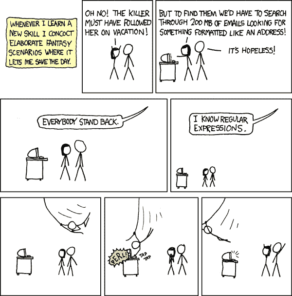

# 学习正则表达式在这个自由速成班

> 原文：<https://www.freecodecamp.org/news/regular-expressions-crash-course/>

几乎所有编程语言都使用正则表达式来定义搜索模式，该模式可用于搜索字符串中的内容。

在这个完整的速成课程中，你可以免费学习正则表达式的基础知识。它着重于在 JavaScript 中使用 regex，但是这些原则也适用于您可能选择使用的许多其他编程语言。

本课程跟随[freeCodeCamp.org](https://learn.freecodecamp.org/javascript-algorithms-and-data-structures/regular-expressions)的免费正则表达式课程。

你可以在[freeCodeCamp.org YouTube 频道](https://www.youtube.com/watch?v=ZfQFUJhPqMM)观看完整的视频课程(45 分钟观看)。

From [https://xkcd.com/208/](https://xkcd.com/208/)