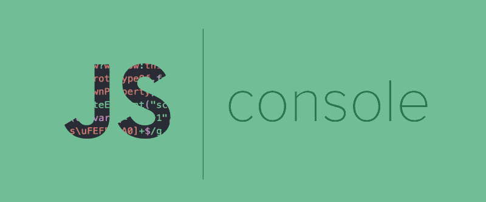
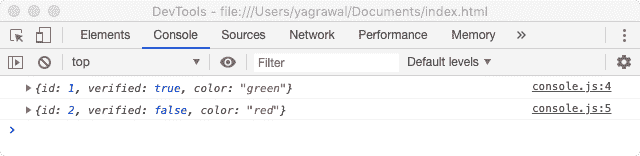
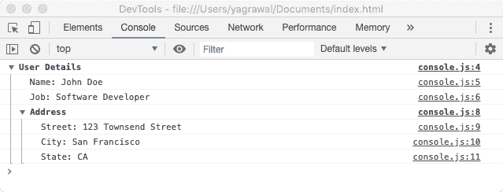
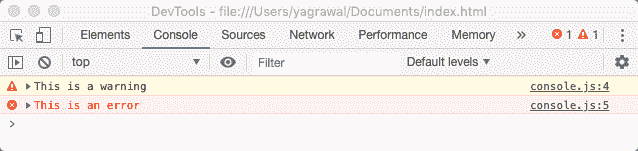
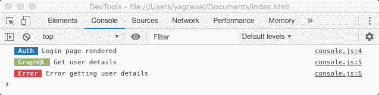
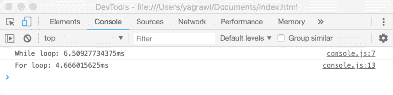

# 如何使用 JavaScript 控制台:超越 console.log()

> 原文：<https://www.freecodecamp.org/news/how-to-use-the-javascript-console-going-beyond-console-log-5128af9d573b/>

作者:亚什·阿格拉瓦尔

# 如何使用 JavaScript 控制台:超越 console.log()



在 JavaScript 中调试任何东西的最简单的方法之一是使用`console.log`记录东西。但是控制台提供了许多其他方法，可以帮助您更好地调试。

让我们开始吧。

最基本的用例是记录一个字符串或一堆 JavaScript 对象。很简单，

```
console.log('Is this working?');
```

现在，想象一个场景，您有一堆需要登录到控制台的对象。

```
const foo = { id: 1, verified: true, color: 'green' };const bar = { id: 2, verified: false, color: 'red' };
```

最直观的记录方式是一个接一个地记录。当我们看到它如何出现在控制台上时，问题就更加明显了。



No variable names visible

如您所见，看不到任何变量名。当你有一堆这样的变量，你不得不展开左边的小箭头来查看变量的确切名称时，这变得非常烦人。输入计算的属性名称。这允许我们将所有变量放在一个单独的`console.log({ foo, bar });`中，输出很容易看到。这也减少了代码中`console.log`行的数量。

#### console.table()

我们可以更进一步，将所有这些放在一个表格中，使其更具可读性。每当你有具有共同属性的对象或对象数组时，使用`console.table()`。这里我们可以使用`console.table({ foo, bar})`，控制台显示:


console.table in action

#### console.group()

当您想要将相关的详细信息分组或嵌套在一起以便于阅读日志时，可以使用这种方法。

当一个函数中有几个 log 语句，并且希望能够清楚地看到每个语句对应的范围时，也可以使用这种方法。

例如，如果您正在记录用户的详细信息:

```
console.group('User Details');console.log('name: John Doe');console.log('job: Software Developer');
```

```
// Nested Groupconsole.group('Address');console.log('Street: 123 Townsend Street');console.log('City: San Francisco');console.log('State: CA');console.groupEnd();
```

```
console.groupEnd();
```



Grouped logs

如果您想默认折叠组，也可以使用`console.groupCollapsed()`而不是`console.group()`。你需要点击左边的描述符按钮来展开。

#### console.warn() & console.error()

根据具体情况，为了确保你的控制台可读性更好，你可以使用`console.warn()`或`console.error()`来添加日志。还有`console.info()`，它在一些浏览器中显示一个“I”图标。



warning and error logs

通过添加自定义样式，可以更进一步。您可以使用`%c`指令为任何日志语句添加样式。这可以用来通过遵守约定来区分 API 调用、用户事件等。这里有一个例子:

```
console.log('%c Auth ',             'color: white; background-color: #2274A5',             'Login page rendered');console.log('%c GraphQL ',             'color: white; background-color: #95B46A',             'Get user details');console.log('%c Error ',             'color: white; background-color: #D33F49',             'Error getting user details');
```

还可以更改`font-size`、`font-style`等 CSS 的东西。



Styling console.log statements

#### console.trace()

`console.trace()`向控制台输出堆栈跟踪，并显示代码如何在某一点结束。有些方法你只想调用一次，比如从数据库中删除。`console.trace()`可用于确保代码按照我们想要的方式运行。

#### console.time()

对于前端开发来说，另一件重要的事情是代码需要很快。`console.time()`允许对代码中的某些操作进行计时测试。

```
let i = 0;
```

```
console.time("While loop");while (i < 1000000) {  i++;}console.timeEnd("While loop");
```

```
console.time("For loop");for (i = 0; i < 1000000; i++) {  // For Loop}console.timeEnd("For loop");
```



console.time() output for loops

希望这篇文章提供了一些关于使用控制台的各种方法的信息。如果你有任何问题或想让我详细说明，请在下面给我留言或通过 [twitter](http://twitter.com/yagrawl) 或[电子邮件](mailto:yagrawl2@gmail.com)联系我。