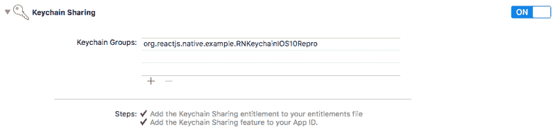
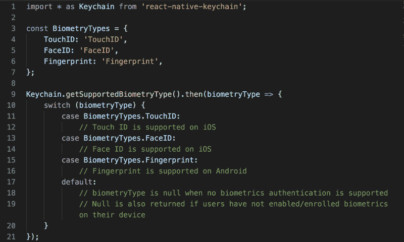
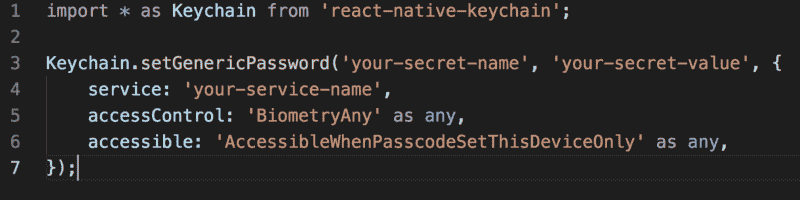

# 如何在移动设备上实现安全的生物认证

> 原文：<https://www.freecodecamp.org/news/how-to-implement-secure-biometric-authentication-on-mobile-devices-4dc518558c5c/>

作者凯西·丁

# 如何在移动设备上实现安全的生物认证


快速搜索 React Native biometric authentic ation 将为您提供几个教程。当我的一个项目需要这样一个特性时，这是我做的第一件事。根据您的应用程序可接受的风险水平，其中一个解决方案可能是合适的。对于像我们这样的高风险应用程序，它不会通过安全测试。

如果你想给 aa ***React 原生 iOS app*** 增加一个安全的生物特征认证，你来对地方了。

#### **react-native-touch id 怎么了？**

大多数实现使用 *react-native-touchid* 包。在 [TouchID.m](https://github.com/naoufal/react-native-touch-id/blob/master/TouchID.m) 文件的[第 65 行](https://github.com/naoufal/react-native-touch-id/blob/2e7c4bcd0aedad01e45708fbb831fcc70fc48264/TouchID.m#L65)处， *authenticate* 方法在尝试 TouchID/FaceID 认证时调用以下 LAContext 方法:

```
evaluatePolicy:localizedReason:reply:^(BOOL success, NSError *error)
```

如果所提供的指纹与设备上登记的指纹相匹配，则该方法依赖于本地认证检查。当检查通过时，将返回一个成功布尔值，并且用户已经使用 TouchID/FaceID 成功地进行了身份验证。

*有报道称，通过向苹果在越狱或非越狱 iOS 设备上的 API 发送成功信号，可以绕过本地认证*。因此，通过本地认证的生物特征认证容易受到攻击者的欺骗，攻击者可以在运行时干扰检查。

#### **实现生物认证的安全方式是什么？**

要在 iOS 应用中实现生物认证，有两种方式——要么通过苹果的本地认证 API，要么通过底层系统原生提供的钥匙串服务的*访问控制。*

使用本地身份验证进行身份验证更简单，但通常不推荐用于关键应用程序。如前一节所述，本地身份验证是一种高级 API，其行为可以被覆盖，即攻击者可以通过更改 API 的响应来伪造成功的身份验证。

使用钥匙串服务在高风险应用中实现生物认证是公认的*最佳实践。钥匙串服务使用 iOS 和 [Secure Enclave](https://developer.apple.com/documentation/security/certificate_key_and_trust_services/keys/storing_keys_in_the_secure_enclave) 提供的功能对其储存的内容实施访问控制。该过程在硬件和操作系统层执行，因此最大限度地减少了对不太可信的应用层的暴露。当用户在越狱或受恶意软件感染的设备上时，确实存在安全风险，但这些威胁可以通过移动设备管理(MDM)技术来缓解。*

#### **我们如何通过钥匙串服务实现生物认证？**

为了访问 React Native 应用程序中的钥匙串服务，我们将使用包 [react-native-keychain](https://github.com/oblador/react-native-keychain) 。示例代码是 TypeScript 格式的，应该很容易转换成 JavaScript。

首先，*安装* react-native-keychain 及其类型声明作为您的项目依赖项:

```
npm i -S react-native-keychain
```

```
npm i -S @types/react-native-keychain
```

接下来，我们必须*链接库*，因为它依赖于本地组件。React 原生应用中有两种链接库的方式:自动链接和手动链接。我在执行自动链接时遇到了许多 CocoaPods 错误。手动链接是可行的，但是需要很多步骤。

我发现，在暂时删除 iOS 文件夹下的 *Podfile* 后，如果运行 *react-native link* ，库会正确链接，不会出现错误。为了省去您的麻烦，让我们遵循这样一种混合方法。假设您的代码在版本控制下*，以便可以安全地恢复任何更改，删除您的 Podfile，*然后*运行链接命令:*

```
react-native link react-native-keychain
```

现在，撤消您的 Podfile 删除。对于 iOS 10，您需要在构建目标的`Capabilities`部分启用`Keychain Sharing`权限。



将以下键值对添加到 *Info.plist* 中:

```
<key>NSFaceIDUsageDescription</key><string>Enabling Face ID allows you quick and secure access to your account.</string>
```

然后使用以下内容重新构建您的项目:

```
react-native run-ios
```

如果你在安装 react-native-keychain 时遇到困难，请参考这个 [GitHub 自述文件](https://github.com/oblador/react-native-keychain)。

在要求用户使用 TouchID/FaceID 进行身份验证之前，明智的做法是通过调用`[getSupportedBiometryType](https://github.com/oblador/react-native-keychain#getsupportedbiometrytype)`来检查用户的 iOS 设备是否支持此类功能:



确认支持生物认证后，您需要在钥匙串中保存一些内容，并设置访问控制标志。内容可以是用户凭证或一些访问令牌。钥匙串条目被加密并储存在安全的储存装置中。要在钥匙串中储存一个值，请调用`[setGenericPassword](https://github.com/oblador/react-native-keychain#setgenericpasswordusername-password--accesscontrol-accessible-accessgroup-service-securitylevel-)`:



这里需要注意几点:

*   将 *accessControl* 设置为这些`[Keychain.ACCESS_CONTROL](https://github.com/oblador/react-native-keychain#keychainaccess_control-enum)`枚举值`BIOMETRY_ANY`、`BIOMETRY_CURRENT_SET`、`BIOMETRY_ANY_OR_DEVICE_PASSCODE`、`BIOMETRY_CURRENT_SET_OR_DEVICE_PASSCODE`中的任何一个，都会要求用户在我们试图检索钥匙串项目时使用 TouchID/FaceID 进行身份验证。
*   我们还将*可访问的*设置为`Keychain.ACCESSIBLE`枚举值`WHEN_PASSCODE_SET_THIS_DEVICE_ONLY`。这是最严格的可访问约束，它强制:

```
Your device must be unlocked for the secret to be accessible.
```

```
Your device must have a device passcode set.
```

```
If you turn off your device passcode, the secret is deleted.
```

```
The secret cannot be restored to a different device.
```

```
The secret is not included in iCloud backups.
```

最后，我们通过尝试使用`[getGenericPassword](https://github.com/oblador/react-native-keychain#getgenericpassword-authenticationprompt-service-)`访问先前存储的钥匙串值来触发 TouchID/FaceID 认证提示:


由于我们以前保存了访问控制的秘密，访问该项目需要用户通过生物认证。认证成功后，结果返回一个对象，其*用户名*为‘你的秘密名称’，*密码*为‘你的秘密值’，*服务*为‘你的服务名称’。

在系统范围的 TouchID/FaceID 认证尝试失败 *5 次后，设备上的生物识别认证将被关闭。用户必须使用密码锁定和解锁设备才能重新启用 TouchID/FaceID。这就是为什么在第 14 行，我们必须检查支持的生物统计学类型，并适当地处理这种情况，例如，要求用户使用他们的用户名/密码登录。*

#### **注意事项**

虽然 react-native-keychain 的生物认证适用于关键应用程序，但我想提醒您一些注意事项:

**有*无密码回退*** *。*您可能会收到允许用户使用其设备密码进行身份验证的要求。查看这个包的自述文件，您应该可以找到`Keychain.ACCESS_CONTROL`枚举键`DEVICE_PASSCODE`、`BIOMETRY_ANY_OR_DEVICE_PASSCODE`、`BIOMETRY_CURRENT_SET_OR_DEVICE_PASSCODE`。

不幸的是，当调用`setGenericPassword`到这三个枚举键中的任何一个时，设置一个访问控制值并不支持“输入密码”回退。[这个问题已经在 GitHub](https://github.com/oblador/react-native-keychain/issues/182) 上报道过，但是在本文发表时还没有任何回应。

您可能会考虑使用不同的库来实现密码回退。请注意，您的系统的安全性取决于您最薄弱的环节。如果您的密码回退实现在应用层执行，它是安全攻击的潜在目标，并且违背了依靠钥匙串服务进行生物认证的目的。

另外**，在 Android 设备上使用 react-native-keychain 进行认证*可能不被认为是安全的*** ，因为在 Android 中没有等价的 keychain 服务。

#### 包扎

谢谢你读到这里。我希望你已经发现教程有用。您可能希望进行的一项改进是，在您的应用程序中启用生物认证之前，询问用户是否愿意选择加入。此外，您可以在您的应用程序设置页面中添加设置，让用户打开或关闭 TouchID/FaceID 身份验证。

#### **参考文献**

*   [为什么本地认证不安全](https://www.punchkick.com/blog/2016/03/31/best-practices-of-implementing-touch-id-within-financial-apps)
*   [触控 ID 钥匙串认证的工作原理](https://docplayer.net/62572307-Keychain-and-authentication-with-touch-id.html)