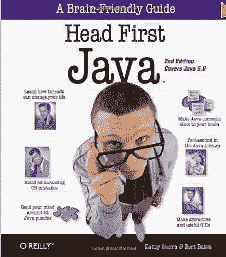
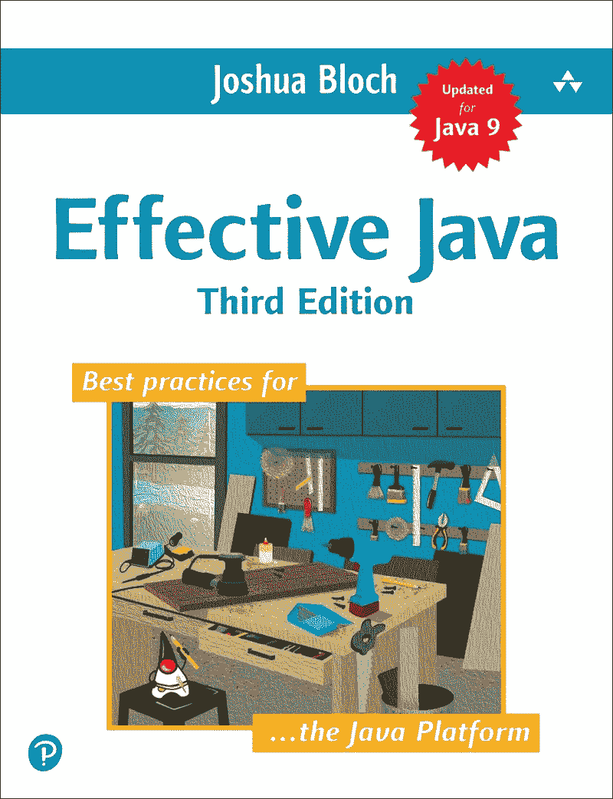
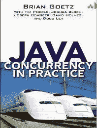
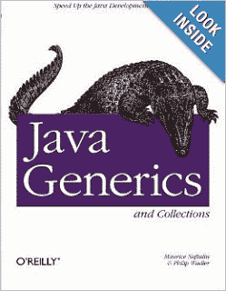
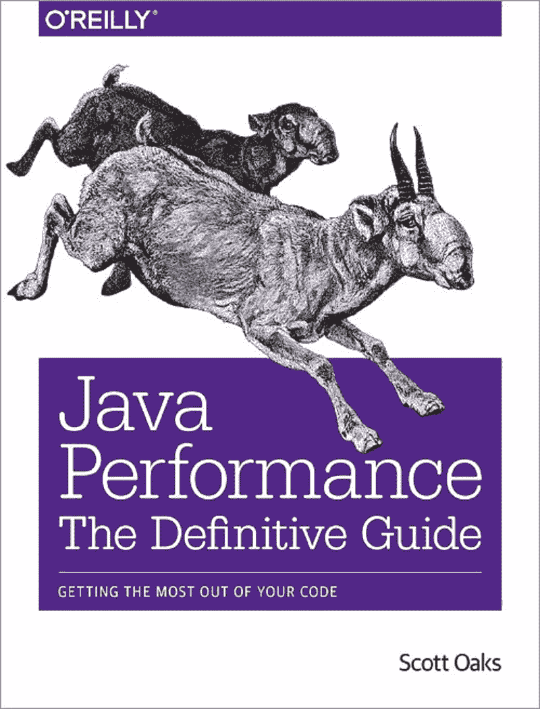
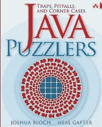
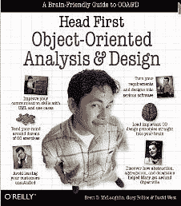
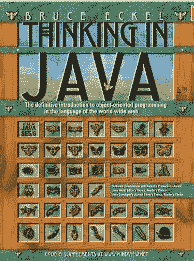
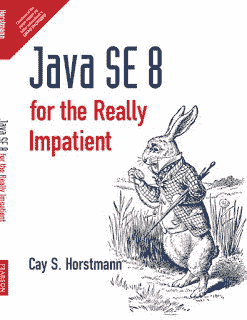

# 学习 Java 编程的必读书籍

> 原文：<https://www.freecodecamp.org/news/must-read-books-to-learn-java-programming-327a3768ea2f/>

作者:javinpaul

大家好，今天是在线课程的世界。每个人都在谈论从在线培训、Youtube、 [Coursera](https://www.freecodecamp.org/news/must-read-books-to-learn-java-programming-327a3768ea2f/undefined) 和其他网站上的免费课程中学习，这是帮助你更快学习的在线课程，但是，我相信书籍仍然应该是你学习的重要部分，因为它们提供了最深入的知识，并且通常由该主题的权威撰写。

如果你正在学习 [Java 编程](https://www.java.com/en/)，那么请准备好阅读本文中一些最棒的书籍来学习和掌握 Java 编程。

每当程序员开始学习 Java 编程语言时，他们问的第一个问题就是，“*学习 Java 应该参考哪本书？*”或者*“初学者学习 Java 最好的书是什么？”*或者*“能告诉我一些学习 Java 的好书吗？”*这本身就说明了 Java 书籍对于程序员，尤其是初学者是多么重要。

尽管 Java 中有如此多的免费资源，如[教程](http://java67.blogspot.com/)、[在线课程](http://www.java67.com/2018/08/top-10-free-java-courses-for-beginners-experienced-developers.html)、技巧、[博客](http://javarevisited.blogspot.com/)和代码示例，Java 书籍还是有自己的一席之地，因为:

*   它们是由该领域的权威程序员编写的
*   他们用更多的细节和解释来涵盖这个主题。

这些 Java 书籍是我个人的最爱，每当我有时间的时候，我更喜欢阅读它们来刷新我的知识。虽然我已经读了其中的许多(到目前为止，我已经读了至少四遍 [**Effective Java**](https://www.amazon.com/Effective-Java-3rd-Joshua-Bloch/dp/0134685997/?tag=javamysqlanta-20) )，但我总是想学习一些新的东西，我对伟大书籍的追求永无止境。

这些书是当今最好的书籍之一，对初学者、中级和高级 Java 程序员同样有用。

不管你是完全的 Java 新手还是已经用 Java 编程一段时间了，你都会通过这些书学到很多新的东西。

话虽如此，但并不是所有的书都同样适合所有的程序员。对于初学者来说， [*头先 Java*](http://www.amazon.com/dp/0596009208/?tag=javamysqlanta-20) 仍是*最好的入门书，而对于高级 Java 开发者来说， [*有效 Java*](https://www.amazon.com/Effective-Java-3rd-Joshua-Bloch/dp/0134685997/?tag=javamysqlanta-20) 是一本不错的入门书。*

### *学习 Java 编程的 10 本最佳书籍*

*下面是我收集的 Java 书籍，推荐给每一个想学习 Java 的程序员。它包含了初学者和有经验的程序员的书籍。*

*这些书涵盖了各种领域，包括核心 Java 基础知识、Java 集合框架、[多线程和并发性](https://javarevisited.blogspot.com/2018/06/top-5-java-multithreading-and-concurrency-courses-experienced-programmers.html)、 [JVM 内部机制](https://javarevisited.blogspot.com/2018/07/top-5-java-performance-tuning-books-for.html)和性能调优、[设计模式](https://javarevisited.blogspot.com/2018/02/top-5-java-design-pattern-courses-for-developers.html)等。*

#### *1.头先 Java*

*许多人会认为这是一本过时的书，但是说实话, [Head First Java](http://www.amazon.com/dp/0596009208/?tag=javamysqlanta-20) 对于任何编程和 Java 新手来说都是最好的书。这种先入为主的解释方式相当惊人，我真的很喜欢他们的书。*

*Head First Java 涵盖了关于类、对象、线程、集合和语言特性的基本 Java 编程知识，如[泛型](http://javarevisited.blogspot.sg/2011/09/generics-java-example-tutorial.html)、[枚举](https://javarevisited.blogspot.com/2011/08/enum-in-java-example-tutorial.html)、[变量参数](https://javarevisited.blogspot.com/2011/09/variable-argument-in-java5-varargs.html)，或[自动装箱](http://javarevisited.blogspot.sg/2012/07/auto-boxing-and-unboxing-in-java-be.html#axzz59AWpr6cb)。*

*它们也有一些关于 Swing、网络和 Java IO 的高级章节，这使得它们成为 Java 初学者的完整包。如果你是从零开始，这应该是你看的第一本 Java 书。*

**

*如果你更喜欢在线课程而不是书本，那么你也可以看看 Udemy 的 [**完整 Java 大师班**](https://pluralsight.pxf.io/c/1193463/424552/7490?u=https%3A%2F%2Fwww.pluralsight.com%2Fcourses%2Fjava1) 课程。*

*免责声明:这不是一门免费课程，如果你从 Udemy 购买这门课程，或者如果你从亚马逊使用这里列出的书籍的链接，我将获得补偿。*

#### *2.头先设计模式*

*[Head First 设计模式](http://www.amazon.com/dp/0596007124/?tag=javamysqlanta-20)是 Head-First 实验室的另一本顶级 Java 书籍。*

*当我在 2006 年开始读这本书的时候，我并没有过多地考虑设计模式，它们如何解决常见的问题，如何应用设计模式，它们提供了什么好处，以及所有基本的东西。但看完这本 Java 书，我受益匪浅。*

*第一章是关于[继承](http://www.java67.com/2016/03/top-21-java-inheritance-interview-Questions-Answer-Programming.html)和[组合](http://javarevisited.blogspot.sg/2013/06/why-favor-composition-over-inheritance-java-oops-design.html#axzz57Kv4wGXe)，这简直太棒了，通过引入问题和解决方案来促进实践的改进。*

**

*这本书还包含有用的要点、练习和记忆图，帮助你快速理解设计模式。*

*如果你想学习核心的 Java 设计模式和面向对象的设计原则，这是你应该看的第一本 Java 书。*

*如果你正在寻找一门关于 GOF 或面向对象设计模式的课程，我建议你去看看 [**设计模式库**](https://pluralsight.pxf.io/c/1193463/424552/7490?u=https%3A%2F%2Fwww.pluralsight.com%2Fcourses%2Fpatterns-library) ，这是我迄今为止参加过的关于设计模式的最好的课程之一。*

*关于这本书的一个好消息是新版本针对 [Java SE 8](https://javarevisited.blogspot.com/2018/08/top-5-java-8-courses-to-learn-online.html) 进行了更新，它将教你如何使用 Java 8 的特性开发经典的 GOF 设计模式，比如 [lambda 表达式](https://javarevisited.blogspot.com/2014/02/10-example-of-lambda-expressions-in-java8.html#axzz5b2nmYJFN)和[流](http://www.java67.com/2018/10/java-8-stream-and-functional-programming-interview-questions-answers.html)。*

#### *3.有效的 Java*

*[Effective Java](http://www.amazon.com/dp/0321356683/?tag=javamysqlanta-20) 是我记录中最好的 Java 书籍之一，也是最令人愉快的书籍之一。我非常尊重作者 Joshua Bloch，因为他对 Java 集合框架和 Java 并发包做出了贡献。*

*高效的 Java 最适合精通 Java 编程的经验丰富的程序员。对于那些希望通过遵循[编程最佳实践](http://javarevisited.blogspot.sg/2014/10/10-java-best-practices-to-name-variables-methods-classes-packages.html#axzz5Bwn8nSNW)来分享他们的技能，以及渴望聆听 Java 开发工具包(JDK)贡献者的人来说，这是非常棒的。*

**

*有效的 Java 由 Java 编程最佳实践的集合组成，范围从[静态工厂](http://javarevisited.blogspot.it/2011/12/factory-design-pattern-java-example.html)、[序列化](http://javarevisited.blogspot.sg/2016/09/how-to-serialize-object-in-java-serialization-example.html)、[等于](https://javarevisited.blogspot.com/2012/12/difference-between-equals-method-and-equality-operator-java.html#axzz5Y4Kd7uK1)和 [hashcode](http://javarevisited.blogspot.sg/2011/02/how-to-write-equals-method-in-java.html#axzz5B6EWE6M7) 到泛型、枚举、变量和反射。*

*这本 Java 编程书几乎涵盖了 Java 的每个方面，与您习惯的方式略有不同。*

*去年发布的新版本引入了去年 9 月发布的 JDK 7、8 和 9 的功能。它还有整整一章是关于λ的。*

#### *4.实践中的 Java 并发*

*[实践中的 Java 并发性](http://www.amazon.com/dp/0321349601/?tag=javamysqlanta-20)是 Joshua Bloch、Doug Lea 及其团队的另一部经典著作。这是关于并发和多线程的最好的 Java 书籍——核心 Java 开发人员的必读书籍之一。*

*Java 并发实践的优势包括:*

*1)这本书非常详细，抓住了多线程和并发性的小细节*

*2)本书没有关注核心 Java 类，而是关注并发问题，如[死锁](https://javarevisited.blogspot.com/2018/08/how-to-avoid-deadlock-in-java-threads.html)、饥饿、线程安全、竞争条件，并介绍了使用 Java 并发类解决这些问题的方法。*

*这本书是学习和掌握 Java 并发包和类的极好资源，比如 [CountDownLatch](http://javarevisited.blogspot.sg/2012/07/countdownlatch-example-in-java.html) 、 [CyclicBarrier](http://javarevisited.blogspot.sg/2012/07/cyclicbarrier-example-java-5-concurrency-tutorial.html) 、 [BlockingQueue](http://javarevisited.blogspot.sg/2012/12/blocking-queue-in-java-example-ArrayBlockingQueue-LinkedBlockingQueue.html) 或 [Semaphore](http://javarevisited.blogspot.sg/2012/05/counting-semaphore-example-in-java-5.html) 。这是我喜欢读这本 Java 书，并且反复阅读的最大原因。*

**

*Java 中并发实践的另一个优点是没有废话的例子；这本书里的例子清晰、简洁、有智慧。*

*4)这本书还善于解释什么是错的，为什么是错的，以及如何改正，这是任何一本 Java 书取得成功所必不可少的。*

*简而言之，这是学习 Java 并发和多线程的最佳书籍之一。从初学者的角度来看，内容肯定是先进的，但毫无疑问，这是有经验的 Java 程序员的必读之书。*

#### *5.Java 泛型和集合*

*来自 O'Reilly 的 Naftalin 和 Philip Wadler 的 Java Generics and Collection 是另一本关于 Java 的好书，我最初忘记将它包括在我的列表中，但现在应许多读者的要求，我将它包括在内。*

*我喜欢这本书是因为它关于泛型和集合的内容，这是 Java 语言的核心领域。*

*一个有经验的程序员应该对 Java 集合和 T2 泛型有很深的了解，这些书在这方面很有帮助。*

**

*它解释了每个集合接口，如 [Set](http://www.java67.com/2013/08/ata-structures-in-java-programming-array-linked-list-map-set-stack-queue.html) 、 [List](https://javarevisited.blogspot.com/2011/05/example-of-arraylist-in-java-tutorial.html) 、 [Map](http://www.java67.com/2013/02/10-examples-of-hashmap-in-java-programming-tutorial.html) 、Queue，以及它们的实现，比较它们在不同情况下的表现。*

*我真的很喜欢他们在每章末尾的比较图表，它让你很好地了解什么时候使用特定的 Java 集合类，比如`ArrayList`、`HashMap`或`LinkedHashMap`。*

#### *6.Binu John 的 Java 性能*

*这是另一本讲述 JVM 内部机制、垃圾收集、JVM 调优、剖析的好书。等等，我强烈推荐每一位高级 Java 开发人员阅读本书。这也是我个人的最爱之一。*

*随着我们的逐渐进步，我们从初级水平开始到中级水平，现在是高级水平。*

**Java 性能*是关于性能监控、剖析和用于 Java 性能监控的工具。*

*这不是一般的编程书。相反，它提供了关于 [JVM](http://javarevisited.blogspot.sg/2011/11/hotspot-jvm-options-java-examples.html) 、[垃圾收集](http://javarevisited.blogspot.sg/2012/10/10-garbage-collection-interview-question-answer.html)、 [Java 堆](http://javarevisited.blogspot.sg/2011/05/java-heap-space-memory-size-jvm.html)监控和分析应用程序的细节。*

*我喜欢他们关于 JVM 概述的那一章，这是用简单的语言学习更多关于 JVM 的必读书。*

*初学者和中级程序员都可以从本书中受益，但是在阅读本书之前，最好先掌握一些 Java 经验。到目前为止，这是关于性能监控的最好的 Java 书籍。*

*如果你对性能很认真，这是另一本必读的 Java 书。*

*Java 中有几本新书，涵盖了 JDK 1.7。要找到关于 Java 性能的最新书籍，如斯科特·奥克斯 的权威指南**[【Java Performance】，在购买这本书之前，当然值得一读。](http://javarevisited.blogspot.com/2014/07/top-5-java-performance-tuning-books.html)***

*如果你需要一些关于解决内存和 CPU 问题的指导，我建议你也看看 Richard Warburton 的[理解和解决 Java 内存问题](https://pluralsight.pxf.io/c/1193463/424552/7490?u=https%3A%2F%2Fwww.pluralsight.com%2Fcourses%2Fjava-understanding-solving-memory-problems)课程。*

**

#### *7.Java 难题*

*约书亚·布洛赫的另一本书值得一读，这次是与尼尔·加夫特合作的。这本书是关于 Java 编程语言中的死角和陷阱。*

*Java 比 [C++](http://www.java67.com/2018/02/5-free-cpp-courses-to-learn-programming.html) 更安全，JVM 很好地将程序员从容易出错的内存分配和释放中解放出来。但是，Java 仍然有让有经验的 Java 程序员感到惊讶的极限情况。*

**

*这本 Java 书展示了这样的 Java 陷阱，并对它们进行了更详细的解释。如果你喜欢谜题，这是一本很好的 Java 书——你甚至可以在[核心 Java 访谈](http://javarevisited.blogspot.sg/2015/10/133-java-interview-questions-answers-from-last-5-years.html#axzz4pEKHfj36)中包括许多这样的内容，以检查他们的 Java 知识。*

*我对它的评价不如*【有效 Java】*和 *Java Concurrency in Practice，*那么高，但你仍然可以试一试，尤其是检查一下你对 Java 及其核心案例的了解，这将有助于你回答面试中一些[棘手的 Java 问题](http://www.java67.com/2012/09/top-10-tricky-java-interview-questions-answers.html)。*

*为了理解这本 Java 书的大部分内容，尝试自己解谜，然后查看解释，使你的知识更加具体。*

#### *8.面向对象的分析与设计*

*Head-First 系列的另一本关于 Java 编程和设计原则的好书。*头先面向对象分析与设计*可结合*头先设计模式*一起阅读。*

*这本书聚焦于面向对象的设计原则，像[喜欢组合胜过继承](http://javarevisited.blogspot.sg/2013/06/why-favor-composition-over-inheritance-java-oops-design.html)，为接口而不是实现编程，DRY 等等。*

**

*学习 Java 的一部分是编写好的代码并遵循最佳实践，这本书在教育程序员这方面很有帮助。*

*从本书中获得的知识适用于许多面向对象的编程语言，总体来说，将提高你对[代码](http://www.java67.com/2016/02/5-books-to-improve-coding-skills-of.html)和 [OOP 设计原则](https://pluralsight.pxf.io/c/1193463/424552/7490?u=https%3A%2F%2Fwww.pluralsight.com%2Fcourses%2Fprinciples-oo-design)的理解。*

#### *9.用 Java 思考*

**用 Java 思考*是布鲁斯·埃凯尔写的，他也是*用 C++* 思考的作者，用他独特的风格来教授 Java 概念。*

*许多人会同意这是最好的 Java 书籍之一，因为它的优点是指出了聪明的例子。这是一本完整的 Java 书籍，也可以作为参考。*

*Java 中有一章关于 [Java 内存映射 IO](http://javarevisited.blogspot.sg/2012/01/memorymapped-file-and-io-in-java.html) 来自*思维，是我的最爱。**

**

*如果不喜欢头头是道的教学风格，但是需要一本浅显示例风格的初学者 Java 书，那么用 Java 思考*是个不错的选择。**

*它很详细，很成熟，而且经常更新，但是，如果你需要更多的选择，你也可以看看这些给初学者的核心 Java 书籍。*

#### *10。为真正没有耐心的人准备的 Java SE 8*

*这是学习 Java 8 的[最佳书籍](https://www.amazon.com/Java-SE8-Really-Impatient-Course/dp/0321927761?tag=javamysqlanta-20)之一。这也是我的通用 Java 8 书籍。如果你时间不多，并且想了解关于 [Java 8](https://javarevisited.blogspot.com/2018/08/top-5-free-java-8-and-9-courses-for-programmers.html) 的所有重要内容，这本书可以参考。*

*我没必要提醒你关于凯的事。霍斯特曼的写作技巧，他是 Java 最好的作者之一，与约书亚·布洛赫齐名。我发现它们都非常具有可读性。*

*你不会觉得无聊，程序员看技术书经常会觉得无聊。它解释了关于 [lambda 表达式](http://www.java67.com/2014/11/java-8-comparator-example-using-lambda-expression.html)、[流](http://www.java67.com/2014/04/java-8-stream-examples-and-tutorial.html)、[函数接口](https://javarevisited.blogspot.com/2018/01/what-is-functional-interface-in-java-8.html)、[方法引用](https://javarevisited.blogspot.com/2017/03/what-is-method-references-in-java-8-example.html)、[新的 Java 日期时间 API](https://javarevisited.blogspot.com/2015/03/20-examples-of-date-and-time-api-from-Java8.html#axzz5dUGc82ss) 以及其他几个小的增强，如连接字符串、可重复注释等。简而言之，学习 Java 的最佳书籍之一。*

**

### *包扎*

*这是我列出的**顶级 Java 编程书籍**。我读了所有的书，其中一些我还在读，有几本，像 *Effective Java* 和 Head-First 系列，我已经读了几遍。很多程序员问我应该从哪本书开始，现在应该读哪本 Java 书。我希望你能在这本书集中找到一些好书。快乐阅读！*

***学习 Java 编程的其他有用资源**
[2019 年 Java 程序员应该学会的 10 件事](https://javarevisited.blogspot.com/2017/12/10-things-java-programmers-should-learn.html#axzz5atl0BngO)
[每个 Java 开发者应该知道的 10 个工具](http://www.java67.com/2018/04/10-tools-java-developers-should-learn.html)
[学习 Java 编程语言的 10 个理由](http://javarevisited.blogspot.sg/2013/04/10-reasons-to-learn-java-programming.html)
[2019 年 Java 和 Web 开发者应该学会的 10 个框架](http://javarevisited.blogspot.sg/2018/01/10-frameworks-java-and-web-developers-should-learn.html)
[2019 年成为更好的 Java 开发者的 10 个技巧](http://javarevisited.blogspot.sg/2018/05/10-tips-to-become-better-java-developer.html)
[要学习的 5 大 Java 框架](http://javarevisited.blogspot.sg/2018/04/top-5-java-frameworks-to-learn-in-2018_27.html)*

### *结束语*

*感谢您阅读本文。你可能会想，有这么多东西要学，有这么多课程要参加，但你不需要担心。*

*很有可能你已经知道了大部分内容，也有很多有用的免费资源供你使用——我还在这里和那里链接了它们以及其他资源，这些资源当然不是免费的，但很值钱。*

*我是 Udemy 课程的特别粉丝，因为它们非常便宜，并且以很小的金额提供了很多价值，但是你可以自由选择你想要的课程。*

*在一天结束的时候，你应该从使用这里提到的资源中获得足够的知识和经验。*

*祝您的 Java 之旅好运！当然**不会很容易**，但是通过遵循这个路线图和指南，你离成为你一直想成为的 Java 开发人员又近了一步*

*如果你喜欢这篇文章，那么请考虑在 medium 上关注我( [javinpaul](https://www.freecodecamp.org/news/must-read-books-to-learn-java-programming-327a3768ea2f/undefined) )。如果你想在每一个新帖子上得到通知，别忘了在 Twitter 上关注 **[javarevisited](https://twitter.com/javarevisited)** ！再次祝你的 Java 开发之旅一切顺利，非常感谢所有作者写了这么棒的书。这些顶级 Java 编程书籍是学习 Java 的最佳书籍之一——我甚至可以说其中一些是有史以来出版的最好的 Java 书籍。*