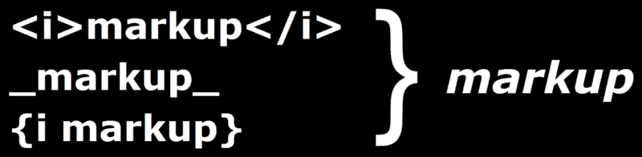
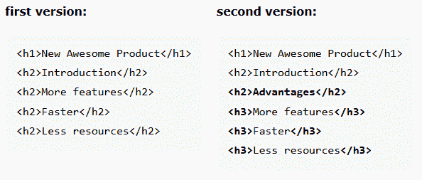
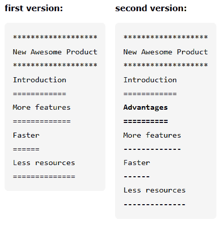

# 我们需要一种新的文档标记语言——原因如下

> 原文：<https://www.freecodecamp.org/news/we-need-a-new-document-markup-language-c22e0ec44e15/>

克里斯蒂安·纽曼

# 我们需要一种新的文档标记语言——原因如下



### 简介:有什么问题？

已经有许多可用的文档标记语言。维基百科在其文档标记语言列表中列出了 70 多种变体，其中包括 HTML、Markdown、Docbook、Asciidoctor、reStructuredText 等。

那么，为什么这篇文章的标题暗示我们还需要另一个？？？

有什么问题？

现有的文档标记语言有两个基本问题:要么它们不容易使用，要么它们不太适合编写复杂的文档，如技术文章、用户手册或书籍。“不容易使用，但适合复杂文档”的一个例子是 Docbook。“易于使用，但不适合复杂文档”的一个例子是 Markdown。

当然，上述分类过于简单。但是它应该作为一个很好的起点来理解这篇文章的主旨，这篇文章的目的是描述在实践中出现的问题。您将看到许多有代表性的标记代码示例，它们说明了什么是错误的，并附有更多信息的链接。

你还会发现一种新的标记语言。大量的例子将展示一种新的语法是如何产生一种“易于使用并适合复杂文档”的语言的。一个*概念验证*实现已经可用。稍后将详细介绍。

### 序言

请注意:

*   这篇文章是关于用来写文本文档的文档标记语言，比如在网上出版的书籍和文章。还有其他标记语言用于描述特定的数据，如数学公式、图像和地理信息，但这些超出了本文的范围。然而，本文中提出的一些想法可能也适用于其他类型的标记语言。
*   本文只关注标记语言的*语法*。我们将不讨论在选择合适的标记语言时同样重要的其他方面，例如:对您的操作系统的支持、安装的容易性和依赖性、可用于创建最终文档的工具链、文档的质量、价格、客户/用户支持等。
*   本文的读者应该对 HTML、Markdown、Asciidoctor 或类似的标记语言有一些基本的经验。
*   没有意识到文档标记语言的许多优点的读者可能首先想阅读:
    [文档标记语言相对于所见即所得编辑器的优点](https://medium.freecodecamp.org/the-advantages-of-document-markup-languages-vs-wysiwyg-editors-829dc8362219)(文字处理器)

### 不便之处/第 1 部分

让我们首先考虑一些众所周知的标记语言，并看看一些不便之处。

#### 超文本标记语言

HTML 是网络语言。那么，为什么不用 HTML 写所有的东西呢？放弃这一选择的原因众所周知。让我们快速概括一下。

HTML 写起来很麻烦。没有人愿意手工编写 XML 代码，尽管支持 HTML/XML 的编辑器可能会有所帮助。

一些频繁的编写任务需要大量的 HTML 代码。

假设我们想要显示一个水平居中的图像，带有一个简单的黑色边框和一个链接。一个没有经验的用户所期望的 HTML 代码可能是这样的:

```

```

但是他或她实际要写的代码很麻烦，而且有不同的方法。这里有一种方法:

```
<div style="text-align: center">    <a href="http://www.example.com/ball">        </div>
```

HTML 缺乏“作者的生产力特征”，例如:

*   自动生成目录、索引、术语表等。
*   用于保存循环值的变量
*   将文档拆分成不同的文件

其他不便稍后会显示。

#### 降价

Markdown 是一种非常流行的轻量级标记语言。它易于学习和使用，非常适合简短的文本，如论坛中的评论、自述文件等。

但是，它存在以下问题，使其不适合复杂或大型文档(例如，技术文章、用户手册和书籍):

*   约翰·格鲁伯(John Gruber)定义的原始标记缺少许多作者期望的特性，如表格(只支持嵌入的 HTML 表格)、目录自动生成、语法高亮、文件分割等。
*   降价没有唯一的、明确的规范。存在许多风格的降价，支持不同的规则和不同的特性。当标记代码被共享时，这会导致不兼容的问题。 [CommonMark](https://commonmark.org/) 就是解决这个问题的尝试。然而，该规范非常庞大，尚未完成(在撰写本文时，2019 年 4 月，版本 0.28，日期为 2017 年 8 月 1 日，是最新的版本)。
*   Markdown 的问题和局限性与“不便之处/第二部分”一章中的问题和局限性相似。当你把 Markdown 用于除了简短文本之外的任何东西时，这些缺陷会很快变成一种烦恼。

以下是一系列关于 Markdown 缺点的文章:

*   [为什么不应该在文档中使用“降价”](http://www.ericholscher.com/blog/2016/mar/15/dont-use-markdown-for-technical-docs/)
*   减价日的日落？
*   [为什么 Markdown 不是我最喜欢的语言](http://www.wilfred.me.uk/blog/2012/07/30/why-markdown-is-not-my-favourite-language/)

#### 文档

Docbook 是一种基于 XML 的标记语言，使用语义标签来描述文档。

它可能拥有所有标记语言中最完整的特性集。它已经被许多作者使用，预装在一些 Linux 发行版上，并得到许多组织和出版商的支持。Docbook 已经被成功地用于创建、发布和打印各种大文档。

但是它有以下缺点:

它使用 XML 和冗长的语法。看下面这个例子，借用[维基百科](https://en.wikipedia.org/wiki/DocBook):

```
<?xml version="1.0" encoding="UTF-8"?><book xml:id="simple_book"  version="5.0">    <title>Very simple book</title>    <chapter xml:id="chapter_1">        <title>Chapter 1</title>        <para>Hello world!</para>        <para>I hope that your day is proceeding <emphasis>splendidly</emphasis>!</para>    </chapter>    <chapter xml:id="chapter_2">        <title>Chapter 2</title>        <para>Hello again, world!</para>    </chapter></book>
```

你喜欢编写和维护这样的代码吗？

现在将上面的代码与下面的代码进行比较，下面的代码是用现代标记语言编写的，如 Asciidoctor:

```
= Very simple book== Chapter 1Hello world!I hope that your day is proceeding _splendidly_!== Chapter 2Hello again, world!
```

Docbook 也很复杂，因此很难学习和使用。

Docbook 产生的输出，尤其是 HTML，看起来很老套(见其网站上的例子)。当然，演示文稿可以定制，但这不是一件容易的事情。

#### 乳液

[LaTeX](https://en.wikipedia.org/wiki/LaTeX) 是一个高质量的排版系统。它在学术界被广泛用于创建科学文档。它被认为是编写包含大量数学公式和方程的 PDF 文档的最佳选择。

我自己从来没有使用过 LaTeX，因为我不写科学文档——只写要在网络上发表的文章和书籍。所以，我不想过多评论。但是，因为它在学术界的流行，所以提到它是很重要的。

LaTeX 独特的语法对我来说似乎很冗长，而且有点复杂。下面是来自维基百科的一个简短例子:

```
\documentclass{article}\usepackage{amsmath}\title{\LaTeX}
```

```
\begin{document}    \maketitle    \LaTeX{} is a document preparation system ...
```

```
 % This is a comment    \begin{align}        E_0 &= mc^2 \\        E &= \frac{mc^2}{\sqrt{1-\frac{v^2}{c^2}}}    \end{align}  \end{document}
```

文章[从(La)TeX 到 HTML 的转换](https://texfaq.org/FAQ-LaTeX2HTML)指出将 LaTeX math 转换成 HTML 是“一个挑战”。

一些标记语言允许将 LaTeX 片段嵌入到它们的标记代码中，如果您需要 LaTeX 的数学能力，这将非常有用。还有其他选项在网络上显示数学，如 [Mathjax](https://www.mathjax.org/) 或[MathML](https://en.wikipedia.org/wiki/MathML)(ISO 标准和 HTML5 的一部分)。

### 适用于大文档

出现了数量可观的标记语言。它们中的许多使用类似于标记的语法，因此易于学习和使用。有些比 Markdown 拥有更多的功能，甚至是可扩展的。然而，一旦我们开始编写复杂的文档，边角案例和限制就会减少最初使用它们的乐趣。

用于大文档的两种流行的标记语言是 asciidor(Asciidoc 的改进版本)和 T2 的 restructured text(structured text 的改进版本)。我们很快就会看到它们。

### 实用标记语言(PML)

在进入本文最有趣的部分之前，让我简单介绍一下我在引言中提到的新标记语言。

语言叫做**【PML】*。*

> *“以有益的方式适应特定情况的需要；帮助解决问题或困难的；有效或合适”*

> **—《剑桥词典》中“实用”的定义**

*几个月前，我启动了 PML 项目，因为我找不到一种易于使用的标记语言,*和*非常适合大型复杂文档，比如用户手册。*

*在下一节中，我们将看看用 PML 编写的标记代码的例子，并与用其他语言编写的代码进行比较。因此，让我们首先提及理解接下来的例子所需的两个基本 PML 语法规则。*

*PML 文档是一个节点树(类似于 XML/XHTML 文档)。每个节点都以一个`{`开头，后面跟着一个标记名。每个节点都以一个`}`结束。节点可以包含文本或子节点。*

*例如，下面是一个包含将以斜体显示的文本的节点:*

```
*`{i bright}`*
```

*这个节点以`{i` 开始，以`}`结束。`i`是标记名。在这种情况下，`i`是`italic`的缩写，这意味着节点的内容将以*斜体*呈现。这个节点的内容是文本`bright`。上面的 PML 标记代码将被渲染为:
*亮**

*一些节点具有属性，用于指定节点的附加属性(除了它的标记名之外)。*

*例如，用属性`title`定义一个章节的标题，如下所示:*

```
*`{chapter title=A Nice Surprise    Once upon a time ...}`*
```

*关于 PML 语法的基本概念就不多说了。要了解更多细节，以及本文中没有用到的特性描述，请查阅 [PML 用户手册](http://www.practical-programming.org/pml/docs/User_Manual/PML_User_Manual.html)。*

*你可以下载并使用 PML 的免费实现。但是请注意:PML 是一项正在进行中的工作。有缺失的功能，您可能会遇到错误，并且向后兼容性目前没有保证。*

*我自己用 PML 写我所有的网络文档，比如这篇文章。更多真实例子的链接请访问[常见问题解答](http://www.practical-programming.org/pml/about/faq.html#examples)。*

### *不便之处/第二部分*

*在这一节中，我们将看看揭示标记语言遇到的一些问题的例子。这绝不是所有麻烦和死角的详尽列举。我们的目的只是展示几个例子，展示在现实世界中遇到的不便和限制。*

*对于每个示例，标记代码将显示在 [HTML](https://www.w3.org/TR/html/) 、[asciidor](https://asciidoctor.org/)、 [reStructuredText](http://docutils.sourceforge.net/rst.html) 和 [PML](http://www.practical-programming.org/pml/) 中。*

*如果你想测试一些代码，你可以使用下面的在线测试工具(不需要在你的电脑上安装任何东西):*

*   *[HTML](https://www.w3schools.com/tryit/)*
*   *[Asciidoctor](https://asciidoclive.com)*
*   *[重组文本](http://rst.ninjs.org)*

*用于 PML 的在线测试器还不可用。如果你想试用的话，你必须在 Windows PC 上安装 PML。*

### *字体样式*

*字体样式(*斜体*、**粗体**、`monospace`等)。)经常在各种文档中使用，所以良好的支持是必不可少的。*

*但是正如我们将会看到的，一旦我们不得不处理非平凡的情况，意外和限制就会出现。让我们看一些的例子来说明这一点。*

### *斜体字句子的一部分*

*假设我们要写:
他们称之为*谐态*，一个好名字。*

*这是一个简单的例子，所有语言都支持它。*

***HTML** :*

```
*`They called it <i>Harmonic States</i>, a good name.`*
```

***Asciidoctor** :*

```
*`They called it _Harmonic States_, a good name.`*
```

***重组文本**:*

```
*`They called it *Harmonic States*, a good name.`*
```

***PML** :*

```
*`They called it {i Harmonic States}, a good name.`*
```

### *斜体字的一部分*

*我们想写:
她*联合国*第一个完成挑战。*

***HTML** :*

```
*`She <i>un</i>wrapped the challenge first.`*
```

***Asciidoctor** :*

```
*`She __un__wrapped the challenge first.`*
```

*注意，我们必须使用两个下划线。使用单个下划线(如第一个示例)，将导致:
她首先取消了质询。*

***重组文本**:*

```
*`She *un*\wrapped the challenge first.`*
```

*注意，字母 w 必须转义(前面加一个反斜杠)，原因在这里[解释](http://docutils.sourceforge.net/docs/ref/rst/restructuredtext.html#character-level-inline-markup)。如果字母没有转义，则会显示警告，结果是:
她首先取消了挑战。*

***PML** :*

```
*`She {i un}wrapped the challenge first.`*
```

### *粗体和斜体文本*

*我们想写:
他们都被*看得目瞪口呆。**

****HTML** :**

```
**`They were all <b><i>totally flabbergasted</i></b>.`**
```

****Asciidoctor** :**

```
**`They were all *_totally flabbergasted_*.`**
```

****重组文本:****

**在 reStructuredText 中不支持组合粗体和斜体，但是有一些复杂的解决方法。**

****PML:****

```
**`They were all {b {i totally flabbergasted}}.`**
```

### **现实生活中的例子**

**这里有一个受 Asciidoctor 用户启发的例子，[问](https://github.com/asciidoctor/asciidoctor/issues/2020)如何显示:
**_id** *可选*。**

**让我们通过显示:
*_id* **可选**来使这个练习更有趣一些。**

****HTML** :**

```
**`<b>_id</b> <i>optional</i>&lt;i>_id</i> <b>optional</b>`**
```

**这并不奇怪。它只是像预期的那样工作。**

****Asciidoctor:****

**直觉尝试:**

```
**`*_id* _optional___id_ *optional*`**
```

**第一行不行，它产生:
***id***_ 可选**

**但是，第二行行得通，有点违反直觉。**

**如果普通文本包含一个也用于标记的字符(在我们的例子中是在`id`之前的`_`，那么这个字符必须被转义。这是几乎所有标记语言的基本规则。例如在 HTML 一个`&`lt；必须转义 wi`th &`lt；。许多语言(包括 Asciidoctor 和 PML)使用反斜杠前缀(例如`g.` \r)进行转义。所以让我们重写代码:**

```
**`*\_id* _optional__\_id_ *optional*`**
```

**这在 Asciidoctor 中不起作用。它产生
**_ id**_ 可选 _
和
_ id**可选****

**下面是一个正确的版本，正如在回答用户问题时所建议的:**

```
**`*pass:[_]id* _optional__pass:[_]id_ *optional*`**
```

**另一个答案提出了这个解决方案:**

```
**`*_id* __optional_____id__ *optional*`**
```

**Asciidoctor 用户手册的章节[无约束格式化边缘情况](https://asciidoctor.org/docs/user-manual/#unconstrained-formatting-edge-cases)和[转义无约束引号](https://asciidoctor.org/docs/user-manual/#escaping-unconstrained-quotes)中记录了更多边缘情况。**

****重组文本:****

```
**`**_id** *optional**_id* **optional**`**
```

**这里没有问题，因为 reStructuredText 中没有使用字符`_`来定义标记。**

**但是，假设我们要写:
** id *****可选*** 。**

**代码如下:**

```
**`*\*id\** ***optional***`**
```

**注意，`id`中的`*` s 必须转义，但是`optional`中的`*` s 不需要转义。**

****PML:****

```
**`{b _id} {i optional}{i _id} {b optional}`**
```

### **嵌套字体样式**

**同类嵌套字体样式(如`<i>...<i>..`)。</我>...< /i >很少出现在人类编写的文本中，但它们在自动生成的标记代码中或多或少会出现。如果它们不被支持，那么生成标记代码的工具实现起来会变得更加复杂，因为它必须跟踪已经激活的字体样式，以避免嵌套它们。**

**那么，这在不同的语言中是如何支持的呢？**

****HTML:****

```
**`<i>This is <i>excellent</i&gt;, isn't it?</i>`**
```

**没问题，它产生
*这个很优秀吧？***

****Asciidoctor:****

```
**`_This is _excellent_, isn't it?_`**
```

**上面的代码明显有歧义:斜体是嵌套的还是我们要斜体“这是”和“不是吗？”。我测试的时候，结果都不是:
*这个是 _ 优秀的*吧？_**

**就我现在所知，Asciidoctor 不支持同类嵌套字体样式。**

****重组文本:****

**reStructuredText 规范[声明](http://docutils.sourceforge.net/docs/ref/rst/restructuredtext.html#inline-markup):“内联标记不能嵌套。”但是，如果*是*嵌套的，则不会显示错误，并且结果是未指定的。**

****PML:****

```
**`{i This is {i excellent}, isn't it?}`**
```

**同类字体风格可以嵌套在 PML。上面的代码结果为:
*这个很优秀吧？***

### **嵌套章节**

**假设我们正在写一篇题为“新的令人敬畏的产品”的文章，它包含四个章节。其结构如下所示:**

```
**`New Awesome Product    Introduction    More features    Faster    Less resources`**
```

**后来，我们决定插入“优点”一章，作为最后三章的母章。该结构现在变为:**

```
**`New Awesome Product    Introduction    Advantages        More features        Faster        Less resources`**
```

**从版本 1 到版本 2，标记代码中需要哪些*变化*？我们能简单地插入新章节的代码吗？让我们看看。**

****HTML:****

****

**注:代码*变化*以粗体显示。**

**如上所示，除了插入新章节，我们还必须更改三个子章节的标记:`h2`必须更改为`h3`。**

****Asciidoctor:****

****

**同样，我们必须更改三个子章节的标记:`==`必须更改为`===`**

**注意:章节之间的空行是必需的，否则文档不能正确呈现。**

****重组文本:****

****

**三个子章节的标记必须更改:所有出现的`=`必须更改为`-`**

**重构文本各部分的重要规则可以在这里查阅[。](http://docutils.sourceforge.net/docs/ref/rst/restructuredtext.html#sections)**

****PML:****

****

**在 PML，没有必要更改三个子分会的代码。**

****底线:****

**在除 PML 以外的所有语言中，如果插入父章节，所有子章节的标记代码都必须进行调整。**

**对于章节不多的小文章来说，这并不是一个大问题。但是想象一下，你正在写下一篇大文章或一本书，有很多章节和频繁的修改。现在，手动更新子章节的必要性可能会很快变成一项令人生畏、乏味且容易出错的任务。**

**注意:Asciidoctor 提供了一个`leveloffset`变量，可以用来改变章节的级别。这在某些情况下可能是有用的，但它也制造了额外的不必要的复杂性，正如这里的和这里的所示。**

**更严重的问题可能出现在以下情况中:想象一组不同的文档共享一些共同的章节。为了避免代码重复，公共章节存储在不同的文件中，并且在主文档中使用了一个`insert file`指令。只要所有公共章节的级别在所有文档中都相同，这就很好。但如果情况不是这样，麻烦就会出现。**

**还值得一提的是，HTML、Asciidoctor 和 reStructuredText 不能保护我们免受错误的章节层次结构的影响。例如，如果级别 2 的章节包含级别 4 的直接子章节，您不会收到警告或错误。**

**在像 PML 这样的语言中，上述问题根本不存在，因为标记代码中没有指定级别。所有章节(任何级别)都用相同的、唯一的语法定义。章节的树形结构(即每个章节的级别)由解析器自动定义。标记代码中的错误层次结构，比如缺少用于结束一章的`}`，会被错误消息标记出来。**

### **列表**

**在 Asciidoctor 中，我们在章节层次结构中看到的问题也会在列表层次结构中出现(例如，包含列表的列表)。原因与章节相同: [Asciidoctor 列表](https://asciidoctor.org/docs/user-manual/#nested)使用不同的标记代码来显式指定列表项的级别(`*`表示 1 级，`**`表示 2 级，等等。).此外，在使用[复杂列表内容](https://asciidoctor.org/docs/user-manual/#complex-list-content)时，您必须意识到许多复杂的情况。**

**在 reStructuredText 中，[嵌套列表](https://stackoverflow.com/questions/5550089/how-to-create-a-nested-list-in-restructuredtext)使用缩进和空行创建。这对于简单的嵌套列表很好，但是在更复杂的情况下会产生其他问题(这里不讨论)。我们很快就会看到，在标记代码中使用空白(例如空行和缩进)来定义结构是一个坏主意。**

**在 HTML 和 PML 中，列表不存在上述问题，因为父节点和子节点的语法是相同的。**

### **空白和缩进**

**首先，使用空白来定义结构似乎是个好主意。请看下面的例子:**

```
**`parent    child 1    child 2`**
```

**结构非常容易读*和写*。不需要嘈杂的特殊标记字符。**

**因此，对于标记语言设计者来说，使用空白作为定义结构的简单方法是很有诱惑力的。不幸的是，这仅适用于简单的结构，并且还有其他不便之处，我们很快就会看到。**

**因此，在为处理复杂内容而设计的标记语言中，必须应用一个简单但重要的规则:**

> **"空白不会改变文档的结构或语义."**

> ***—空白-无关紧要-规则***

**这是什么意思？**

**首先，让我们定义一下*空格*:空格是一个或多个连续空格、制表符、换行符和其他表示空格的 Unicode 字符的任意集合。**

**在我们的上下文中，上述规则意味着:**

**在文本中，一组*多个*(即多于一个)空白字符被视为与一个*单个*空白字符相同。**

**例如，这段代码:**

```
**`a beautiful    flower`**
```

**…与这个相同:**

```
**`a beautiful flower`**
```

**在结构元素之间，一组空白字符是无关紧要的。**

**例如，这段代码:**

```
**`<table>    <tr>`**
```

**…与这个相同:**

```
**`<table&gt;<tr>`**
```

**空白的一种特殊情况是*缩进*(在行首的前导空白)。上述规则意味着缩进也是无关紧要的。缩进不会改变最终文档的结果。**

**应用*空白无关紧要的*规则很重要，因为它带来了显著的优势:**

*   **没有必要学习、应用和担心复杂的空白规则(参见下面的例子)。
    违反标记规范中的*空白无关紧要的*规则会增加不必要的复杂性，并可能导致标记代码难看、容易出错且难以维护，尤其是在嵌套列表的情况下。**
*   **作者可以自由地使用空白来以一种更容易理解、更可展示和更有吸引力的方式格式化标记代码(漂亮的打印)。例如，列表(和列表的列表)可以缩进，以一种视觉上清晰和可维护的方式显示它们的结构，而没有改变底层结构的风险。**
*   **可以复制/粘贴文本块，而无需修改空白。**
*   **如果共享文本块(存储在不同的文件中)被导入到几个具有不同结构的文档中，则不会有改变或破坏结构的风险。**
*   **如果空白对于人类读者来说不可见，则没有意外或模糊的行为。一些例子:
    -空格字符的混合，例如空格和制表符，尤其是在用于缩进代码的时候
    -行尾的空格
    -空行中的空格
    -看不懂空格的视障(盲人)
    注:为了减轻痛苦，一些编辑器提供了*显示-空格*模式。**
*   **生成标记代码的工具以及标记解析器通常更容易创建。**
*   **在某些情况下，为了节省存储空间和提高性能，将空白减少到最低限度(例如，没有新行)是有用的。**

**如果您想要一些例子来说明空白很重要时会出现的技术问题，您可以阅读:**

*   **空白缩进而不需要花括号的缺点是什么？**
*   **[F#语法:缩进和冗长](https://fsharpforfunandprofit.com/posts/fsharp-syntax/)**
*   **[nodeca/js-YAML 中的问题](https://github.com/nodeca/js-yaml/issues/80)**

**那么，我们在本文中讨论的语言是如何处理空白的呢？**

****HTML:****

**HTML 应用了*空白无关紧要的*规则。**

**要获得彻底的解释，请看 Patrick Brosset 写的这篇优秀文章:[在 HTML 中什么时候空格很重要？](https://medium.com/@patrickbrosset/when-does-white-space-matter-in-html-b90e8a7cdd33)。**

****Asciidoctor:****

**在 Asciidoctor 中，空白在某些情况下很重要。**

**这可能导致令人惊讶的行为和问题，没有简单或令人满意的解决方案。一些例子可以看到[这里](https://github.com/asciidoctor/asciidoctor/issues/686)和[这里](https://github.com/asciidoctor/asciidoctor/issues/623)。**

****重组文本:****

**reStructuredText 的空白规则“有点令人惊讶”。**

**例如，写`*very*`的结果是*非常*(如所料，文本为斜体)。但是，`* very*`的结果是* very*(没有斜体！)，因为“非常”前面有空格。要理解为什么，答案可能会在规范的章节[空白](http://docutils.sourceforge.net/docs/ref/rst/restructuredtext.html#whitespace)中找到。**

****PML:****

**与 HTML 类似，PML 应用了*空白无关紧要的*规则。**

**有一个例外:出于实际原因，两个文本块之间的空行会导致段落中断。这意味着代替书写:**

```
**`{p text of paragraph 1}{p text of paragraph 2}`**
```

**…我们可以简单地写:**

```
**`text of paragraph 1text of paragraph 2`**
```

**注意:有时，空白*在文本中很重要。例如，源代码示例中必须保留空白。或者，在逐字文本中，必须在最终文档中保留几个连续的空格或新行。所有语言都支持这一点。然而，在 reStructuredText 中，如何做到这一点并不总是显而易见的，正如这里的所示。***

### **其他不便之处**

**正如已经看到的，一些标记语言系统地使用开始和结束标签。一个例子是`<`；HTML 中的 i > `; an` d < /i >。所有基于 XML 的语言，以及 PML 都属于这一类语言。**

**不深究细节，这里有一些在不*不*(或不总是)使用不同的开始/结束标签对的语言中可能出现的缺点(例如 Markdown、Asciidoctor 和 reStructuredText):**

****编辑支持**
创建好的、可靠的编辑支持是比较难开发的。有用的编辑器功能示例如下:**

*   **标记代码的语法突出显示**
*   **标记代码完成**
*   **可视化成对的块开始/结束标记(例如`{`及其对应的`}`)**
*   **块折叠/展开
    对于使用不同的开始/结束标签的语言，最后两个特性在一些编辑器中是现成的。例如，PML 使用`{`和`}`作为节点边界。这也在许多编程语言(C、Java、Javascript 等)中使用。)因此为编程语言实现的块特性也适用于 PML。**

****文档验证**
自动检测到的语法和结构错误更少。这会导致在调试文档上花费更多的时间。或者，更糟糕的是，可能会有被忽略的错误，最终导致错误的输出(我真的没有发现我的 310 页书的第 267 页上缺少的警告块吗？).**

**解析器
创建在所有情况下都工作良好的解析器(即读取标记代码的程序)更加困难。如果不同的解析器读取相同的标记代码，那么获得不同结果的风险就会增加。**

****自动生成的标记代码**
以编程方式生成标记代码的工具更难创建。例如，如果空白很重要，或者字体样式不能嵌套，那么必须更新和跟踪附加状态，以便遵守这些规则。**

### **我自己的经历**

**几年前我开始写技术文档的时候，用的是 Docbook。我花了一些时间来学习它，但从那以后我再也没有遇到过我不会做的事情。Docbook 功能强大。然而，我不喜欢输入冗长的 XML 代码。我尝试了一些 XML 编辑器，但是放弃了。最后，我在 Notepad++中编写了完整的无格式文本块，然后用必要的标记代码修饰了文本。这既令人沮丧又耗费时间。此外，我找不到生成好看的 web 文档的样式表，我也没有耐心、动力和经验去摆弄大而复杂的 CSS 文件并对它们进行改编。**

**后来我发现了 Asciidoctor。真是如释重负。一切都简单多了，web 文档也很漂亮，开箱即用。Asciidoctor 的文档很棒，我认为社区很有帮助，也很活跃。然而，当我开始编写更复杂和更大的文档时，我不得不处理类似于前面章节中描述的问题。有一次，我不得不开发一个特定的前处理器和后处理器来解决一个我在 Asciidoctor/Gitbook 中找不到解决方案的问题。**

**一个耐人寻味的问题出现了:“为什么 Docbook 中不存在这些问题？”。**

**长话短说，我认为我们需要一种新的标记语法。成功的关键点是:**

*   **容易学习:很少，简单，一致和可预测的规则(没有例外)**
*   **易于书写和阅读**
*   **没有歧义的结构良好的文档**
*   **强大到足以创建大而复杂的文档，而不需要“特殊的规则、技巧或变通办法”**

**经过一段时间的调查、琢磨、编程、测试和改进，[实用标记语言(PML)](http://www.practical-programming.org/pml/index.html) 诞生了。从此，我再也没有回头。今天我在 PML 写我所有的网络文档(包括这篇文章)。**

**当然，当我开始创作 PML 时，是为了满足我自己的需求。所以，我大概是有偏见的。希望这篇文章包含足够多的事实例子，但是我鼓励你留下评论，如果你看到任何错误的，不公平的，或者遗漏的。我感谢任何形式的建设性反馈，如果需要，我会更新文章。**

### **结论**

**正如本文所展示的，使用 PML 语法，现有文档标记语言遇到的许多问题都烟消云散了。**

**现在我们应该团结起来改进 PML，让它变得更强大，这样它就能覆盖更多的用例，让更多的人从中受益。**

**请帮忙宣传一下。或者尝试 PML 并发送反馈，这样我们就知道什么需要改进。你的声音很重要！**

**我们的愿景是创建最好的文档标记语言和所有必要的工具，以便作者可以专注于写作，并享受在最短的时间内创建漂亮的文档——而不用担心不必要的复杂性。**