# 深入了解数据库索引

> 原文：<https://www.freecodecamp.org/news/database-indexing-at-a-glance-bb50809d48bd/>

在电子商务、支付系统、游戏、交通应用等许多消费类产品中，性能极其重要。尽管数据库通过多种机制进行了内部优化，以满足其在现代世界中的性能要求，但这在很大程度上也取决于应用程序开发人员——毕竟，只有开发人员知道应用程序必须执行什么样的查询。

处理关系数据库的开发人员使用过或者至少听说过索引，这是数据库世界中一个非常常见的概念。然而，最重要的部分是理解索引什么&索引将如何提高查询响应时间。为此，您需要了解如何查询数据库表。只有当您确切地知道您的查询和数据访问模式是什么样子时，才能创建合适的索引。

用简单的术语来说，索引通过使用不同的内存和磁盘数据结构将搜索关键字映射到磁盘上相应的数据。索引用于通过减少要搜索的记录数量来加快搜索。

大多数情况下，当数据库基于查询的`WHERE`子句中指定的列从表中检索&过滤器数据时，会在这些列上创建索引。如果不创建索引，数据库扫描所有的行，过滤掉匹配的行&返回结果。对于数百万条记录，这个扫描操作可能需要几秒钟&这种高响应时间使得 API&应用程序变慢&不可用。让我们看一个例子——

我们将使用带有默认 InnoDB 数据库引擎的 MySQL，尽管本文中解释的概念在其他数据库服务器中或多或少是相同的，如 Oracle、MSSQL 等。

使用以下模式创建一个名为`index_demo`的表:

```
CREATE TABLE index_demo ( 
    name VARCHAR(20) NOT NULL, 
    age INT, 
    pan_no VARCHAR(20), 
    phone_no VARCHAR(20) 
);
```

#### 我们如何验证我们使用的是 InnoDB 引擎？

运行以下命令:

```
SHOW TABLE STATUS WHERE name = 'index_demo' \G;
```

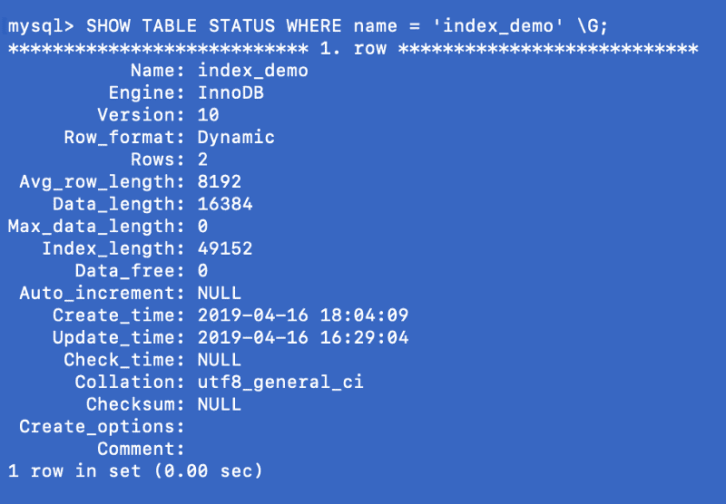

上面屏幕截图中的`Engine`列表示用于创建表的引擎。这里用的是`InnoDB`。

现在在表中插入一些随机数据，我的 5 行表如下所示:

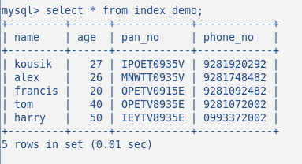

到目前为止，我还没有在这个表上创建任何索引。让我们通过命令来验证这一点:`SHOW INDEX`。它返回 0 个结果。


此时，如果我们运行一个简单的`SELECT`查询，由于没有用户定义的索引，查询将扫描整个表以找出结果:

```
EXPLAIN SELECT * FROM index_demo WHERE name = 'alex';
```

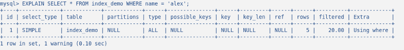

`EXPLAIN`显示了查询引擎计划如何执行查询。在上面的截图中，可以看到`rows`列返回`5` & `possible_keys`返回`null`。`possible_keys`表示该查询中可以使用的所有可用索引。`key`列表示在这个查询中所有可能的索引中，哪个索引将被实际使用。

### 主键:

上面的查询效率非常低。让我们优化这个查询。我们将使`phone_no`列成为`PRIMARY KEY`，假设在我们的系统中没有两个用户拥有相同的电话号码。创建主键时，请考虑以下事项:

*   主键应该是应用程序中许多重要查询的一部分。
*   主键是唯一标识表中每一行的约束。如果多个列是主键的一部分，则该组合对于每一行都应该是唯一的。
*   主键不应为空。永远不要将可为空的字段作为主键。根据 ANSI SQL 标准，主键应该可以相互比较，并且您应该能够明确地判断特定行的主键列值是大于、小于还是等于其他行的主键列值。由于`NULL`在 SQL 标准中意味着一个未定义的值，你不能确定地将`NULL`与任何其他值进行比较，所以逻辑上`NULL`是不允许的。
*   理想的主键类型应该是像`INT`或`BIGINT`这样的数字，因为整数比较更快，所以遍历索引会非常快。

通常我们在表中定义一个`id`字段为`AUTO INCREMENT`&使用它作为主键，但是主键的选择取决于开发者。

#### 如果你自己不创建任何主键呢？

自己创建主键并不是强制性的。如果您没有定义任何主键，InnoDB 会隐式地为您创建一个主键，因为 InnoDB 的设计要求每个表中都必须有一个主键。因此，一旦您稍后为该表创建了主键，InnoDB 就会删除之前自动定义的主键。

因为到目前为止我们还没有定义任何主键，所以让我们看看 InnoDB 默认为我们创建了什么:

```
SHOW EXTENDED INDEX FROM index_demo;
```

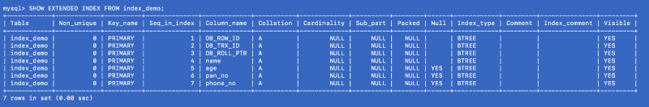

`EXTENDED`显示所有用户不可用但完全由 MySQL 管理的索引。

这里我们看到 MySQL 已经为表中定义的所有列`DB_ROW_ID`、`DB_TRX_ID`、`DB_ROLL_PTR`、&定义了一个复合索引(我们将在后面讨论复合索引)。在没有用户定义的主键的情况下，该索引用于唯一地查找记录。

#### key 和 index 有什么区别？

虽然术语`key` & `index`可以互换使用，但是`key`意味着对列行为的约束。在这种情况下，约束条件是主键是唯一标识每一行的非空字段。另一方面，`index`是一种特殊的数据结构，便于跨表进行数据搜索。

现在让我们在`phone_no` &上创建主索引，检查创建的索引:

```
ALTER TABLE index_demo ADD PRIMARY KEY (phone_no);
SHOW INDEXES FROM index_demo;
```

注意`CREATE INDEX`不能用来创建主索引，但是`ALTER TABLE`被使用。


在上面的截图中，我们看到在列`phone_no`上创建了一个主索引。以下图像的列描述如下:

`Table`:创建索引的表。

`Non_unique`:如果值为 1，则索引不唯一，如果值为 0，则索引唯一。

`Key_name`:创建的索引的名称。在 MySQL 中，主索引的名称总是`PRIMARY`,不管您在创建索引时是否提供了任何索引名称。

`Seq_in_index`:索引中该列的序号。如果多个列是索引的一部分，将根据索引创建时列的排序方式分配序号。序列号从 1 开始。

`Collation`:列在索引中的排序方式。`A`表示上升，`D`表示下降，`NULL`表示未排序。

`Cardinality`:索引中唯一值的估计数量。基数越大，查询优化器选择查询索引的机会就越大。

`Sub_part`:索引前缀。如果整列都被索引，则为`NULL`。否则，如果列是部分索引的，它将显示索引的字节数。我们将在后面定义部分索引。

`Packed`:表示密钥是如何打包的；`NULL`如果不是。

`Null` : `YES`如果该列可能包含`NULL`值，如果不包含则为空。

`Index_type`:表示该索引使用的索引数据结构。一些可能的候选人是— `BTREE`、`HASH`、`RTREE`或`FULLTEXT`。

`Comment`:没有在自己的栏中描述的关于指数的信息。

`Index_comment`:创建带有`COMMENT`属性的索引时指定的索引的注释。

现在让我们看看这个索引是否减少了在查询的`WHERE`子句中搜索给定`phone_no`的行数。

```
EXPLAIN SELECT * FROM index_demo WHERE phone_no = '9281072002';
```

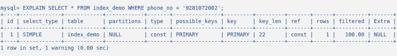

在这个快照中，注意到`rows`列只返回了`1`，而`possible_keys` & `key`都返回了`PRIMARY`。因此，这实质上意味着使用名为`PRIMARY`的主索引(该名称是在创建主键时自动分配的)，查询优化器直接转到记录&并获取它。效率很高。这正是索引的作用——以额外空间为代价最小化搜索范围。

### 聚集索引:

一个`clustered index`与数据配置在同一个表空间或同一个磁盘文件中。您可以认为聚集索引是一个`B-Tree`索引，它的叶节点是磁盘上的实际数据块，因为索引&数据驻留在一起。这种索引按照索引键的逻辑顺序在物理上组织磁盘上的数据。

#### 物理数据组织是什么意思？

在物理上，数据是跨成千上万的磁盘/数据块组织在磁盘上的。对于聚集索引，并不强制所有的磁盘块都被存储。只要有必要，操作系统就会随时移动物理数据块。数据库系统对如何管理物理数据空间没有任何绝对控制权，但是在数据块内部，可以按照索引键的逻辑顺序存储或管理记录。下面的简图对此进行了解释:

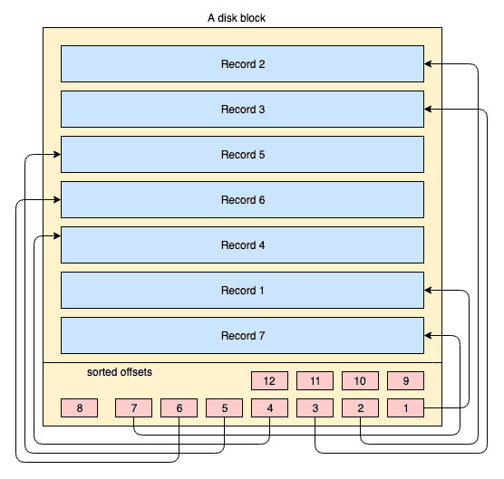

*   黄色大矩形代表磁盘块/数据块
*   蓝色矩形代表在该块中存储为行的数据
*   页脚区代表块的索引，红色小矩形按特定键的排序顺序排列。这些小块只是指向记录偏移量的指针。

记录以任意顺序存储在磁盘块上。每当添加新记录时，它们都会被添加到下一个可用空间中。每当现有记录被更新时，操作系统决定该记录是否仍然适合相同的位置，或者必须为该记录分配新的位置。

所以记录的位置完全由操作系统处理&任何两个记录的顺序之间不存在确定的关系。为了按键的逻辑顺序提取记录，磁盘页在页脚包含一个索引部分，该索引包含一个按键顺序排列的偏移指针列表。每次更改或创建记录时，都会调整索引。

通过这种方式，您实际上不需要关心以某种顺序组织物理记录，而是按照这种顺序维护一个小的索引部分&获取或维护记录变得非常容易。

#### 聚集索引的优势:

相关数据的这种排序或协同定位实际上使聚集索引更快。当从磁盘中读取数据时，包含数据的完整块被系统读取，因为我们的磁盘 IO 系统以块为单位写入和读取数据。因此，在范围查询的情况下，很有可能将并置的数据缓存在内存中。假设您启动以下查询:

```
SELECT * FROM index_demo WHERE phone_no > '9010000000' AND phone_no < '9020000000'
```

执行查询时，数据块被提取到内存中。假设数据块包含从`9010000000`到`9030000000`范围内的`phone_no`。因此，无论您在查询中请求的范围是什么，都只是块中存在的数据的子集。如果您现在启动下一个查询来获取该范围内的所有电话号码，比如从`9015000000`到`9019000000`，那么您不需要从磁盘中获取更多的块。在当前数据块中可以找到完整的数据，因此`clustered_index`通过将尽可能多的相关数据配置在同一个数据块中来减少磁盘 IO 的数量。这种减少的磁盘 IO 导致了性能的提高。

所以，如果你很好地考虑了主键&你的查询是基于主键的，那么性能会非常快。

#### 聚集索引的约束:

因为聚集索引影响数据的物理组织，所以每个表只能有一个聚集索引。

#### 主键和聚集索引之间的关系:

您不能在 MySQL 中使用 InnoDB 手动创建聚集索引。MySQL 为你选择。但是它如何选择呢？以下摘录来自 MySQL 文档:

> 当您在表上定义一个`PRIMARY KEY`时，`InnoDB`将其用作聚集索引。为您创建的每个表定义一个主键。如果没有逻辑唯一且非空的列或列集，则添加一个新的[自动递增](https://dev.mysql.com/doc/refman/5.7/en/glossary.html#glos_auto_increment)列，其值会自动填充。
> 
> 如果您没有为您的表定义一个`PRIMARY KEY`，MySQL 将定位第一个`UNIQUE`索引，其中所有的键列都是`NOT NULL`，`InnoDB`将它用作聚集索引。
> 
> 如果表没有`PRIMARY KEY`或合适的`UNIQUE`索引，`InnoDB`在包含行 ID 值的合成列上内部生成一个名为`GEN_CLUST_INDEX`的隐藏聚集索引。在这样的表中，行按照`InnoDB`分配给行的 ID 排序。行 ID 是一个 6 字节的字段，随着新行的插入而单调增加。因此，按行 ID 排序的行实际上是按插入顺序排列的。

简而言之，MySQL InnoDB 引擎实际上将主索引作为聚集索引来管理以提高性能，因此主键&磁盘上的实际记录聚集在一起。

#### 主键(聚集)索引的结构:

索引通常在磁盘和内存中以 B+树的形式维护，任何索引都存储在磁盘的块中。这些块被称为索引块。索引块中的条目总是按索引/搜索关键字排序。索引的叶索引块包含一个行定位器。对于主索引，行定位符指的是磁盘上数据块的相应物理位置的虚拟地址，根据索引键对数据块所在的行进行排序。

在下图中，左侧矩形表示叶级索引块，右侧矩形表示数据块。逻辑上，数据块看起来是按排序顺序排列的，但正如前面已经描述的，实际的物理位置可能分散在各处。

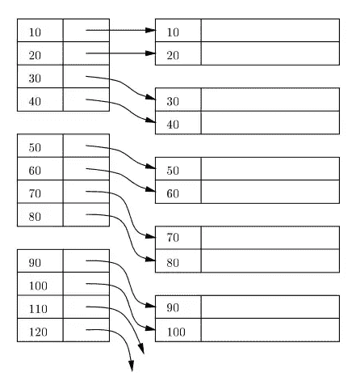

#### 可以在非主键上创建主索引吗？

在 MySQL 中，主索引是自动创建的，我们已经在上面描述了 MySQL 如何选择主索引。但是在数据库世界中，实际上没有必要在主键列上创建索引——也可以在任何非主键列上创建主索引。但是当在主键上创建时，所有的键条目在索引中都是惟一的，而在另一种情况下，主索引也可能有一个重复的键。

#### 可以删除主键吗？

可以删除主键。删除主键时，相关的聚集索引以及该列的唯一性属性将丢失。

```
ALTER TABLE `index_demo` DROP PRIMARY KEY;

- If the primary key does not exist, you get the following error:

"ERROR 1091 (42000): Can't DROP 'PRIMARY'; check that column/key exists"
```

#### 主索引的优点:

*   基于主索引的范围查询非常有效。数据库从磁盘中读取的磁盘块可能包含属于查询的所有数据，因为主索引是聚集的&记录是物理排序的。所以数据的局部性可以由主索引提供。
*   任何利用主键的查询都非常快。

#### 主索引的缺点:

*   由于主索引包含通过虚拟地址空间对数据块地址的直接引用&磁盘块在物理上是按照索引键的顺序组织的，所以每次操作系统由于`INSERT` / `UPDATE` / `DELETE`等`DML`操作而进行一些磁盘页分割时，主索引也需要更新。因此`DML`的运营给主要指数的表现带来了一些压力。

### 次要索引:

聚集索引以外的任何索引都称为辅助索引。与主索引不同，辅助索引不影响物理存储位置。

#### 什么时候需要二级索引？

在您的应用程序中可能有几个不使用主键查询数据库的用例。在我们的例子中，`phone_no`是主键，但我们可能需要用`pan_no`或`name`查询数据库。在这种情况下，如果这种查询的频率非常高，就需要在这些列上建立辅助索引。

#### 如何在 MySQL 中创建二级索引？

下面的命令在`index_demo`表的`name`列中创建一个辅助索引。

```
CREATE INDEX secondary_idx_1 ON index_demo (name);
```


#### 二级索引的结构:

在下图中，红色矩形代表二级索引块。二级索引也在 B+树中维护，它按照创建索引的键排序。叶节点包含主索引中相应数据的键的副本。

为了便于理解，您可以假设辅助索引引用了主键的地址，尽管事实并非如此。通过二级索引检索数据意味着你必须遍历两个 B+树——一个是二级索引 B+树本身，另一个是主索引 B+树。

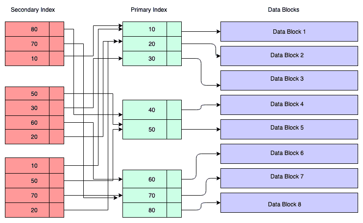

#### 二级指数的优势:

从逻辑上讲，您可以创建任意多的二级索引。但在现实中，实际需要多少指数需要认真思考，因为每个指数都有自己的惩罚。

#### 二级索引的缺点:

使用类似于`DELETE` / `INSERT`的`DML`操作，二级索引也需要更新，以便可以删除/插入主键列的副本。在这种情况下，大量二级索引的存在会产生问题。

此外，如果主键非常大，像一个`URL`，因为二级索引包含主键列值的副本，它在存储方面可能是低效的。更多的辅键意味着更多的主键列值的副本，因此在主键很大的情况下需要更多的存储空间。此外，主键本身存储键，因此对存储的综合影响将非常大。

#### 删除主索引之前的注意事项:

在 MySQL 中，可以通过删除主键来删除主索引。我们已经看到，二级索引依赖于一级索引。因此，如果您删除一个主索引，所有的辅助索引都必须更新，以包含 MySQL 自动调整的新主索引键的副本。

当存在多个二级索引时，此过程开销很大。此外，其他表可能有对主键的外键引用，因此您需要在删除主键之前删除这些外键引用。

当一个主键被删除时，MySQL 会自动在内部创建另一个主键，这是一个代价很高的操作。

### 唯一键索引:

像主键一样，唯一键也可以唯一地标识记录，唯一键列可以包含`null`值。

与其他数据库服务器不同，在 MySQL 中，一个惟一键列可以有尽可能多的`null`值。在 SQL 标准中，`null`表示未定义的值。因此，如果 MySQL 必须在唯一键列中只包含一个`null`值，它必须假设所有的空值都是相同的。

但是逻辑上这是不正确的，因为`null`意味着未定义——未定义的值不能相互比较，这是`null`的本质。由于 MySQL 不能断言所有的`null`的含义是否相同，所以它允许在一列中有多个`null`值。

以下命令显示了如何在 MySQL 中创建唯一的键索引:

```
CREATE UNIQUE INDEX unique_idx_1 ON index_demo (pan_no);
```


### 综合指数:

MySQL 允许您在多列上定义索引，最多 16 列。这种索引称为多栏/复合/复合索引。

假设我们有一个定义在 4 列上的索引— `col1`、`col2`、`col3`、`col4`。有了综合指数，我们就有了对`col1`、`(col1, col2)`、`(col1, col2, col3)`、`(col1, col2, col3, col4)`的搜索能力。因此，我们可以使用索引列的任何左侧前缀，但是我们不能省略中间的列&使用类似的前缀— `(col1, col3)`或`(col1, col2, col4)`或`col3`或`col4`等。这些是无效的组合。

以下命令在我们的表中创建 2 个复合索引:

```
CREATE INDEX composite_index_1 ON index_demo (phone_no, name, age);

CREATE INDEX composite_index_2 ON index_demo (pan_no, name, age);
```

如果您的查询在多个列上包含一个`WHERE`子句，请按照复合索引列的顺序编写该子句。索引将有利于查询。事实上，在决定复合索引的列时，您可以分析系统的不同用例&,尝试得出对大多数用例有益的列顺序。

综合指数也可以帮助你进行`JOIN` & `SELECT`查询。示例:在下面的`SELECT *`查询中，使用了`composite_index_2`。

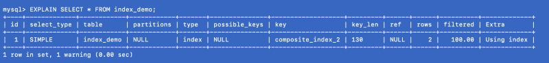

当定义了几个索引时，MySQL 查询优化器会选择删除最多行或扫描尽可能少的行以提高效率的索引。

#### 为什么我们使用综合指数？为什么不在我们感兴趣的列上定义多个二级索引呢？

除了 UNION 之外，MySQL 在每个查询中每个表只使用一个索引。(在 UNION 中，每个逻辑查询单独运行，结果合并。)因此，在多个列上定义多个索引并不能保证这些索引会被使用，即使它们是查询的一部分。

MySQL 维护着一种叫做索引统计的东西，它可以帮助 MySQL 推断数据在系统中的样子。虽然索引统计是一种泛化，但是基于这些元数据，MySQL 决定哪个索引适合当前查询。

#### 综合指数是如何工作的？

复合索引中使用的列连接在一起，这些连接的键使用 B+树按排序顺序存储。当您执行搜索时，您的搜索关键字的连接将与复合索引的连接相匹配。然后，如果搜索关键字的顺序与复合索引列的顺序不匹配，就不能使用索引。

在我们的示例中，对于下面的记录，组合索引键是通过连接`pan_no`、`name`、`age` — `HJKXS9086Wkousik28`形成的。

```
+--------+------+------------+------------+
 name   
 age  
 pan_no     
 phone_no

+--------+------+------------+------------+
 kousik 
   28 
 HJKXS9086W 
 9090909090
```

#### 如何确定是否需要综合指数:

*   首先根据您的用例分析您的查询。如果您看到某些字段同时出现在许多查询中，您可以考虑创建一个复合索引。
*   如果您在`col1` &中创建一个指数，在`col1`、`col2`中创建一个综合指数，那么只有综合指数应该可以。`col1`由于它是指数的左侧前缀，因此可以由综合指数本身单独提供服务。
*   考虑基数。如果复合索引中使用的列最终都具有很高的基数，那么它们是复合索引的良好候选。

### 覆盖指数:

覆盖索引是一种特殊的复合索引，其中查询中指定的所有列都存在于索引中。因此，查询优化器不需要访问数据库来获取数据，而是从索引本身获取结果。示例:我们已经在`(pan_no, name, age)`上定义了一个复合索引，所以现在考虑下面的查询:

```
SELECT age FROM index_demo WHERE pan_no = 'HJKXS9086W' AND name = 'kousik'
```

`SELECT` & `WHERE`条款中提到的栏目是综合指数的一部分。所以在这种情况下，我们实际上可以从综合指数本身获得`age`列的值。让我们看看`EXPLAIN`命令为这个查询显示了什么:

```
EXPLAIN FORMAT=JSON SELECT age FROM index_demo WHERE pan_no = 'HJKXS9086W' AND name = '111kousik1';
```

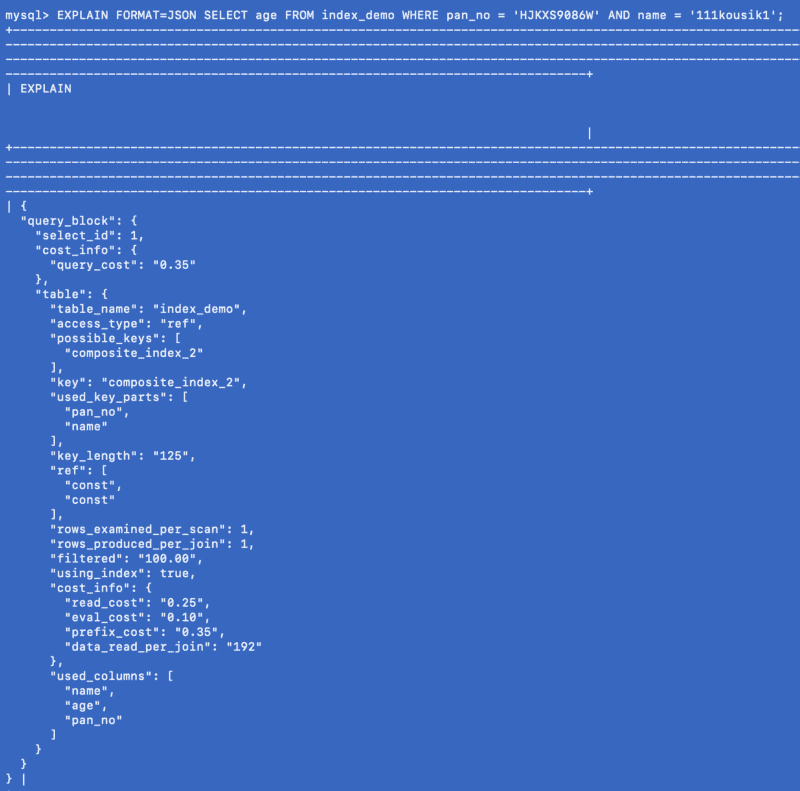

在上面的响应中，注意有一个键— `using_index`，它被设置为`true`，这表示覆盖索引已经用于回答查询。

我不知道在生产环境中有多少覆盖索引是受欢迎的，但显然，如果查询符合要求，这似乎是一个很好的优化。

### 部分索引:

我们已经知道索引以空间为代价加快了查询速度。索引越多，存储需求就越大。我们已经在列`name`上创建了一个名为`secondary_idx_1`的索引。列`name`可以包含任意长度的大值。同样在索引中，行定位器或行指针的元数据也有自己的大小。所以总的来说，一个索引可以有很高的存储&内存负载。

在 MySQL 中，也可以在数据的前几个字节上创建索引。示例:以下命令在名称的前 4 个字节上创建索引。尽管这种方法在一定程度上减少了内存开销，但是索引不能消除很多行，因为在这个例子中，前 4 个字节可能在很多名字中是相同的。通常情况下，`CHAR`、`VARCHAR`、`BINARY`、`VARBINARY`类型的栏目支持这种前缀索引。

```
CREATE INDEX secondary_index_1 ON index_demo (name(4));
```

#### 当我们定义一个指数时会发生什么？

让我们再次运行`SHOW EXTENDED`命令:

```
SHOW EXTENDED INDEXES FROM index_demo;
```

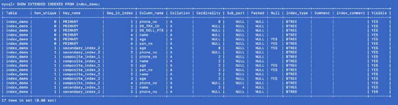

我们在`name`上定义了`secondary_index_1`，但是 MySQL 在(`name`，`phone_no`)上创建了一个复合索引，其中`phone_no`是主键列。我们在`age` &上创建了`secondary_index_2`MySQL 在(`age`，`phone_no`)上创建了一个复合索引。我们在(`pan_no`、`name`、`age` ) &上创建了`composite_index_2`MySQL 在(`pan_no`、`name`、`age`、`phone_no`)上创建了一个复合索引。综合指数`composite_index_1`已经包含了`phone_no`。

因此，无论我们创建什么索引，MySQL 都会在后台创建一个后备复合索引，该索引反过来指向主键。这意味着主键是 MySQL 索引世界中的一等公民。它还证明了所有的索引都有一个主索引副本的支持——但是我不确定主索引的单个副本是共享的，还是不同的副本用于不同的索引。

还有许多其他索引，如 MySQL 提供的空间索引和全文搜索索引。我还没有试验过这些指数，所以我不会在这篇文章中讨论它们。

#### 一般索引指南:

*   因为索引会消耗额外的内存，所以要仔细决定多少和什么类型的索引能满足你的需要。
*   通过`DML`操作，索引被更新，因此写操作对于索引来说是相当昂贵的。指数越多，成本越大。索引用于加快读取操作的速度。因此，如果您有一个写负载很重但读负载不重的系统，请认真考虑是否需要索引。
*   基数很重要—基数意味着一列中不同值的数量。如果在基数较低的列中创建索引，这不会有什么好处，因为索引会减少搜索空间。低基数不会显著减少搜索空间。
    示例:如果您在一个布尔(`int` `1`或【仅 )类型的列上创建一个索引，由于基数较小(此处基数为 2)，索引将会非常倾斜。但是，如果这个布尔字段可以与其他列组合起来产生高基数，那么在必要时使用那个索引。
*   如果旧数据仍然保留在索引中，索引可能也需要一些维护。它们需要被删除，否则内存会被占用，所以试着为你的索引制定一个监控计划。

最后，理解数据库索引的不同方面非常重要。这将有助于做低层次的系统设计。我们应用程序的许多实际优化都依赖于对这些复杂细节的了解。精心选择的索引肯定会帮助您提高应用程序的性能。

***如果你喜欢这篇文章，请鼓掌&在社交媒体上与你的朋友&分享。*:)**

### 参考资料:

1.  [https://dev . MySQL . com/doc/ref man/5.7/en/innodb-index-types . html](https://dev.mysql.com/doc/refman/5.7/en/innodb-index-types.html)
2.  [https://www . quora . com/What-is-difference-between-primary-index-And-secondary-index-exact-And-What-advantage-of-one-over-other](https://www.quora.com/What-is-difference-between-primary-index-and-secondary-index-exactly-And-whats-advantage-of-one-over-another)
3.  [https://dev.mysql.com/doc/refman/8.0/en/create-index.html](https://dev.mysql.com/doc/refman/8.0/en/create-index.html)
4.  [https://www . oreilly . com/library/view/high-performance-MySQL/0596003064/ch04 . html](https://www.oreilly.com/library/view/high-performance-mysql/0596003064/ch04.html)
5.  [http://www.unofficialmysqlguide.com/covering-indexes.html](http://www.unofficialmysqlguide.com/covering-indexes.html)
6.  [https://dev . MySQL . com/doc/ref man/8.0/en/multi-column-indexes . html](https://dev.mysql.com/doc/refman/8.0/en/multiple-column-indexes.html)
7.  [https://dev.mysql.com/doc/refman/8.0/en/show-index.html](https://dev.mysql.com/doc/refman/8.0/en/show-index.html)
8.  [https://dev.mysql.com/doc/refman/8.0/en/create-index.html](https://dev.mysql.com/doc/refman/8.0/en/create-index.html)