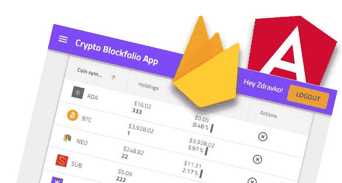
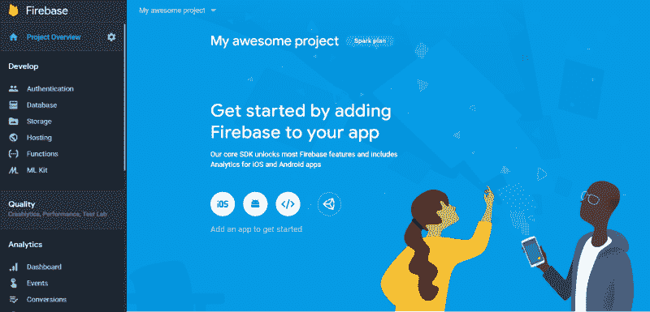
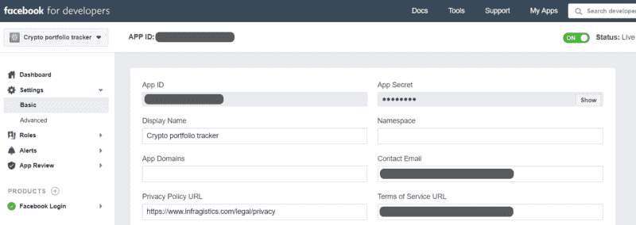
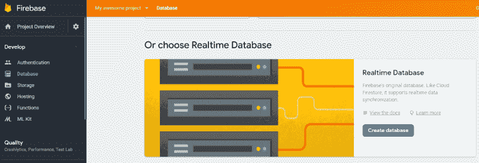
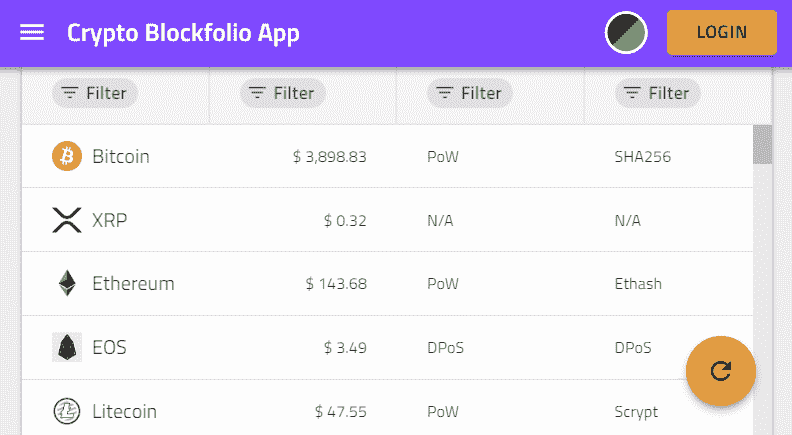

# 如何用 auth 和实时数据库构建 Firebase Angular app

> 原文：<https://www.freecodecamp.org/news/firebase-angular-application-with-auth-and-realtime-database-ae37fef5859d/>

兹德拉夫科·科列夫

# 如何用 auth 和实时数据库构建 Firebase Angular app



很长时间以来，我一直在寻找一个好的投资组合 web 应用程序，它可以帮助我轻松跟踪我的加密货币利润/损失，直到我决定在 **Firebase 和 Angular** 的帮助下[自己开发这样的](https://igniteui.github.io/crypto-portfolio-app/)！是的，就是这么简单，让我给你解释一下为什么。

**Firebase** 为具有用户认证和[实时数据库](https://firebase.google.com/docs/database/)存储需求的应用程序提供了完美的工具。它提供了丰富的[文档](https://firebase.google.com/docs/)和各种开发[示例](https://firebase.google.com/docs/samples/)来帮助任何人更好地理解如何创建一流的应用程序。

我已经在另一篇[的博客文章](https://www.infragistics.com/community/blogs/b/infragistics/posts/easily-create-your-first-ignite-ui-for-angular-application)中介绍了 **Angular** 应用程序引导，使用 [Ignite UI CLI](https://www.infragistics.com/products/ignite-ui-angular/getting-started) 。

**本文旨在:**

*   完成 Firebase 的安装和设置。
*   设置 Firebase 身份验证。
*   实现[实时数据库](https://firebase.google.com/docs/database/)的存储和同步。
*   添加可观察的数据服务。
*   [在角度应用中可视化数据](https://www.infragistics.com/products/ignite-ui-angular)。

### 配置 Firebase 帐户

我想介绍一下我们建立投资组合 Firebase 帐户的步骤。从 [Firebase 控制台](https://console.firebase.google.com/)选择**添加一个新项目来创建项目。**一旦提交了**创建项目**表单，您将看到以下项目概述。



Firebase Project Overview

在 Project Overview 部分，您可以找到用于身份验证和数据存储的所有开发工具。这里也是投资组合 Web 应用程序中使用的配置。这个配置是通过按下**将 Firebase 添加到您的 web 应用程序**来生成的，稍后会添加到应用程序的 **app.module.ts** 文件中。

让我们回到左侧边栏，选择**认证**。从这里，我们可以访问应用程序中需要的**登录方法**。导航到登录选项卡，在那里您可以看到在投资组合应用程序中启用和使用的提供商— **谷歌，脸书和电子邮件/密码提供商**。

登录提供商允许用户使用他们的脸书和谷歌账户，通过将他们的登录信息集成到应用程序中来验证 Firebase。至于电子邮件/密码提供者，它代表了一个简单的认证机制，只使用电子邮件和密码。Firebase Auth 提供了内置的验证规则来验证用户输入，所以我们不需要在这里配置额外的东西。


这里“最棘手”的部分是脸书提供者的配置，因为我们需要一个**脸书应用程序**来认证登录。我们已经创建了一个来自[脸书开发者](https://developers.facebook.com/)的 FB 应用，它向我们提供了从 Firebase 请求的应用 ID 和应用密码。



启用脸书提供者时，应该填写 **API ID** 和**机密**。至于**授权重定向 URI** (来自提供者窗口)应该粘贴在`Facebook/Facebook Login/Products section/Valid Auth Redirect URIs`下。

让我们继续使用 Firebase 控制台。从数据库视图页面，我们已经创建了一个**实时数据库。**



Firebase Database View

在这个视图中，我们可以找到关于应用程序数据项和写/读安全规则的信息。以下是投资组合应用程序使用的规则:

```
{  "rules": {    "items": {      "$uid": {        ".read": "$uid === auth.uid",        ".write": "$uid === auth.uid"      }    }  }}
```

> 这个安全规则配置将只允许经过身份验证的用户能够读写我们的数据库。如果你想学习如何定义更高级的规则，我强烈建议查看官方安全&规则部分。

好吧，我们说到哪了？现在我们已经完成了**投资组合** **Firebase 账户**的创建，让我们看看 **Firebase 开发项目**是如何创建的。

如果我们还没有创建项目，我会推荐从安装 [firebase CLI](https://firebase.google.com/docs/cli/) 开始，它提供了各种管理和部署 firebase 项目的工具。但是我们已经用 Ignite UI CLI 引导了 [Portfolio Angular Project](https://www.infragistics.com/community/blogs/b/infragistics/posts/easily-create-your-first-ignite-ui-for-angular-application) ，所以我们只需要从 **npm** 安装 **AngularFire** 和 **Firebase** 。我们需要这两个包来与 Firebase 通信。 **AngularFire** 是 Firebase 和 Angular development 的官方库。

```
npm install firebase @angular/fire --save
```

应用中使用的所有 AngularFire 模块都添加到`app.module.ts`文件中:

*   数据库功能需要 FirestoreModule ,如处理集合、查询以及数据流和操作服务。
*   **FireAuthModule** 是监控认证状态、登录提供商和安全性等认证功能所需的。
*   FireDatabaseModule 允许我们使用实时数据库。对于需要在客户端之间实时同步状态的移动和网络应用程序来说，这非常有效。

> 投资组合应用程序中唯一没有使用的通用模块是 **AngularFireStorageModule。**您可以使用此模块快速轻松地存储和提供用户生成的内容，如照片和视频，以及监控上传和与文件相关的元数据。

现在我们知道了应用程序最初是如何配置的，我们可以看看使用的其他 **Firebase 特性**。

### 证明

我们使用`AngularFireAuth`服务来监控 app 认证状态。`AngularFireAuth.auth`返回一个初始化的`firebase.auth.Auth`实例，允许用户登录和退出。该应用展示了使用三个提供商的登录功能:脸书、谷歌和电子邮件。

Firebase 用户实例是为链接到该用户的每个提供者保存的，当用户注册或登录时，该用户就成为 Auth 实例的当前用户。该实例保存用户的状态，以便刷新页面或重新启动应用程序时不会丢失用户的信息。

我们对脸书和谷歌提供商都使用`signInWithRedirect`方法，以便通过重定向到登录页面来登录。[基于密码的帐号](https://firebase.google.com/docs/auth/web/password-auth)创建用于邮件登录提供者，`createUserWithEmailAndPassword`*`signInWithEmailAndPassword`*是负责用户帐号创建和登录的方法。**

**

Password-based account view** 

**我推荐 Firebase 官方文档，以获得更多关于[认证](https://firebase.google.com/docs/auth/)和[用户生命周期](https://firebase.google.com/docs/auth/users#the_user_lifecycle)的详细信息。**

### **实时数据库操作**

**Firebase 提供了两个基于云的、客户端可访问的数据库解决方案，我们正在使用 Firebase 的原始数据库——real time。在官方[文档页面](https://firebase.google.com/docs/firestore/rtdb-vs-firestore)查看**实时**和**云火店**的区别。**

**`AngularFireDatabase` 和`AngularFireList` 服务用于 Portfolio app 轻松检索、保存和删除数据。**

**`AngularFireDatabase` 可以通过构造函数注入一个组件或者`@Injectable()` 服务。在我们的例子中，我们使用第二种方法:**

**通过`AngularFireDatabase` 服务检索数据，填充`BlockItems`的可观察列表。`AngularFire` 提供了类似`snapshotChanges()`的方法，以同步数组的形式返回可观察的数据。如果你想限制事件动作，比如*增加*，*改变*，*移除*，*移动*，这是非常方便的。默认情况下，它监听所有四个事件，但是，您可能只对其中一个事件感兴趣，并且您可以指定您想要使用哪个事件。在我们的应用程序中，我们订阅了所有这些内容。**

**通过使用`push()`、`update()`和`remove()`方法，可以添加新项目、更新现有项目或从列表中删除项目。**

**每个数据操作方法都返回一个承诺，虽然我们不需要用完成承诺来表示成功，因为实时数据库保持列表同步。**

### **看得见的**

#### **CoinItem 服务**

**Cryptocompare API 服务管理异步数据，用`Observables`一次发出多个值。我们使用`[HttpClient get(](https://angular.io/guide/http))`方法从[资源](http://min-api.cryptocompare.com/)请求数据并订阅它，以便将它转换为`CoinItem` 对象的可观察数组，这些对象稍后将由我们的`igxGrid`、`igxList`和`igxCard`组件使用。**

**Rx.js 允许我们缓存 HTTP 请求的结果。我们首先检索这些数据，缓存它们，并在应用程序的生命周期中使用缓存的版本。`publishReply(1, 300000)`和`refCount()`的组合执行以下操作。**

> ****publishReply(1，300000)** 告诉 Rx 缓存最新发出的值，并在 5 分钟内保持有效。过了这段时间，它将使缓存失效。**

> ****refCount()** 告诉 Rx 只要有订户，就保持可观察对象的存在。**

**现在，在我们订阅硬币列表后，结果将被缓存，我们不需要再进行一次 HTTP 请求。**

#### **BlockItem 服务**

**组合加密硬币数据由返回可观察的`BlockItem`数组的`getItemsList()`方法来保证，其中`igxGrid`组件被订阅。只有经过身份验证的用户才能使用这个服务，因为我们操作的`AngularFireList`与唯一的用户 id 相关联。**

### **将数据可视化**

**对于可视化，我们使用来自 Angular 库的 [Ignite UI 的 UI 组件。这些组件负责数据处理，同时使用最少的代码，通过直观的 API 提供对自定义模板和实时更新的访问。](https://github.com/IgniteUI/igniteui-angular)**

#### **iggrid**

**[网格](https://www.infragistics.com/products/ignite-ui-angular/angular/components/grid.html) `[data]`属性绑定用于传递返回的`BlockItem`数组。每个`<igx-colu` mn >代表对象的一个字段，它用于定义编辑和排序等特性。这些列是可模板化的，并且有了 Angular 管道的 he [lp，我们可以很容易地在其中声明显示值转换。我们使用一个小数管道来改变小数点前的最小整数位数。](https://angular.io/guide/pipes)**

**该组件为 CRUD 操作提供了简单的事件处理程序和 API。像`updateRow`和`deleteRow`这样的处理程序正在用`igxSnackbar`实现额外的逻辑，如`AngularFireList`操作和硬币物品恢复逻辑。**

#### **igxCard**

**[卡](https://www.infragistics.com/products/ignite-ui-angular/angular/components/card.html)用于提供使用 CSS [Flexbox 布局](https://css-tricks.com/snippets/css/a-guide-to-flexbox/)的加密硬币的一般信息。这些卡组件可以用`igxFilter`指令过滤，该指令可以用来过滤不同的数据源。`igxFilter`可作为管道或指令使用。**

#### **igxFinancialChart**

**[图表](https://www.infragistics.com/products/ignite-ui-angular/angular/components/financialchart.html)提供了多种数据可视化和解释的方式，一旦数据被服务返回。价格和成交量有几种显示模式，在我们的例子中我们使用`chartType=”candle”`。**

**财务图表组件自动分析选择数据列:
- `Date/Time`列用于`x-axis`-
-`Open`、`High`、`Low`、`Close`、`Volume`列或前 5 个数值列用于`y-axis`**

#### **主题**

**IgniteUI for Angular 的组件设计基于[材料设计原则](https://material.io/design/introduction/#principles)，只需几行代码，我们就可以轻松改变组件的颜色、尺寸、字体和整体外观。**

**既然我们已经提供了`igx-theme,`所需的所有基本定义并配置了`igx-dark-theme` mixin，我们只需要在 DOM 元素根级别的某个地方应用`.light-theme`和`.dark-theme` CSS 类并在按钮点击时切换它。**

### **结果**

****

### **包扎**

**有了合适的工具，一切皆有可能。我们已经使用 Angular 框架、Firebase 认证服务和云数据库存储/同步的全部功能创建了一个组合 Web 应用程序。**

**你可以在这里找到 [GitHub 库](https://github.com/IgniteUI/crypto-portfolio-app)和实际的组合[应用](https://igniteui.github.io/crypto-portfolio-app/)。**

**欢迎在下面的评论中分享你的任何问题，关于应用程序中可以改进或改变的建议，或者你在配置 Firebase 帐户或应用程序时遇到的任何问题。**