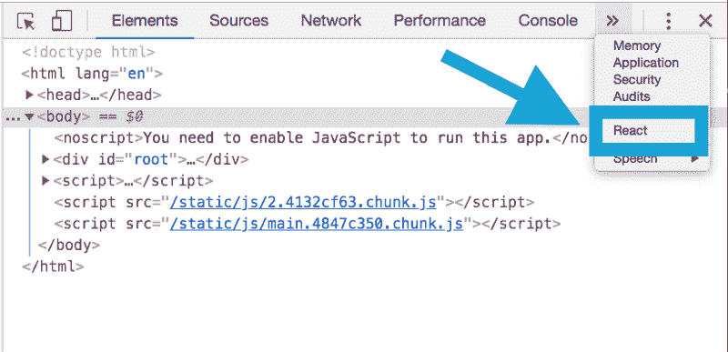
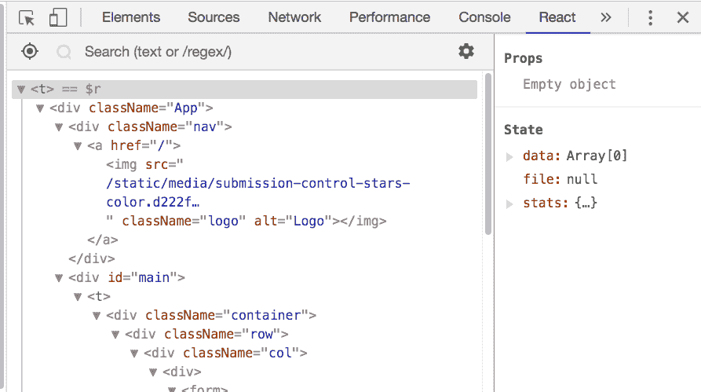
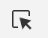

# 如何在浏览器中看到你的反应状态和道具

> 原文：<https://www.freecodecamp.org/news/how-to-see-your-react-state-props-in-the-browser-774098a50fcc/>

作者安德鲁·贝尔斯

# 如何在浏览器中看到你的反应状态和道具

如果您正在使用 React 构建 web 应用程序，您可能希望实时查看组件的状态或属性。这里有一个针对 Chrome 和 FireFox 的快速解决方案！

### React 开发人员工具

为 [Chrome](https://chrome.google.com/webstore/detail/react-developer-tools/fmkadmapgofadopljbjfkapdkoienihi?hl=en) 或 [FireFox](https://addons.mozilla.org/en-US/firefox/addon/react-devtools/) 安装 React 开发者工具扩展。它允许您检查开发人员工具中的 React 组件层次结构——就像您查看 DOM 元素、控制台或网络一样。

### 检查反应组件

1.  打开你的应用程序，用开发者工具检查页面(Command+Option+I)。
2.  选择 React 开发工具

3.在树中选择一个组件来查看它的状态和当前属性。

您也可以通过使用选择工具将鼠标悬停在页面上来直接选择 React 元素:

Selection tool menu icon in developer tools

### 修改状态

如果你想在浏览器中更新你的状态，你可以！通过在“反应”选项卡中单击并编辑状态属性来修改它。这将重新呈现 DOM，通过 props 传递状态。

编码快乐！？