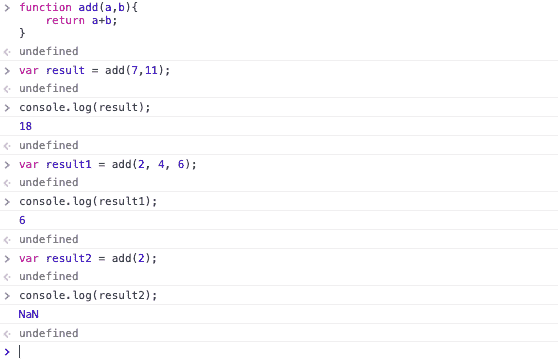
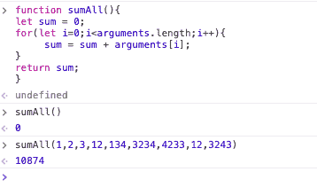
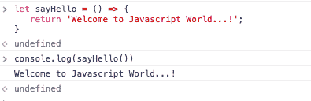
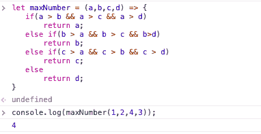
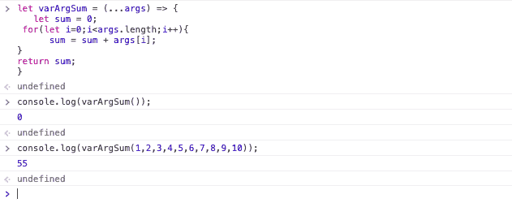
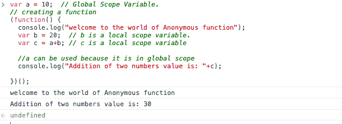
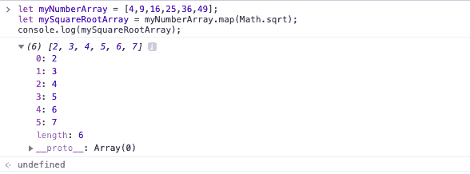
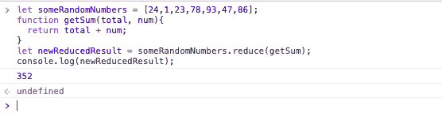
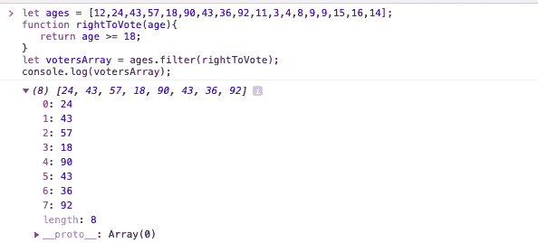
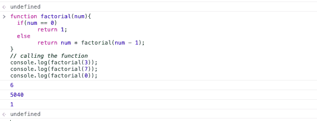

# 如何以及为什么在现代 JavaScript 中使用函数式编程

> 原文：<https://www.freecodecamp.org/news/how-and-why-to-use-functional-programming-in-modern-javascript-fda2df86ad1b/>

by PALAKOLLU SRI MANIKANTA

在本文中，您将深入了解函数式编程及其好处。

## 函数式编程简介

函数式编程(FP)是计算机科学中的一种范式或模式。在 FP 中，所有的事情都是在函数的帮助下完成的，基本的构建模块仅仅是函数。

支持纯函数式编程的编程语言是—

1.  哈斯克尔
2.  关闭
3.  斯卡拉
4.  结构化查询语言

一些支持函数式编程和其他编程范例的编程语言是—

1.  计算机编程语言
2.  java 描述语言
3.  C++
4.  红宝石

既然名字说的是泛函，大多数程序员考虑的是数学函数。FP 的情况并非如此。它只是一种以简单有效的方式解决现实世界复杂问题的抽象。

在面向对象编程时代之前，软件业完全依赖于函数式编程。这种模式震撼了软件行业几十年。函数式编程存在一些问题，这就是他们转向面向对象范式的原因。FP 的问题将在本文后面讨论。

这就是函数式编程的全部介绍。现在，首先，我们需要学习什么是函数。

### 功能

在揭示实际定义之前，我想说明一个情况，以了解实际在哪里使用 FP。假设您正在编写构建应用程序的代码。在您的开发旅程中，您希望在不同的地方重用几行(100 行)代码。对于您的应用程序，函数是有帮助的。我们可以在一个地方写函数，我们可以在程序的任何地方访问这些函数。函数式编程有以下特点—

1.  减少代码冗余。
2.  提高模块化。
3.  帮助我们解决复杂的问题。
4.  提高可维护性。

**让我们看看函数的实际定义:**

> 函数是一个特定的代码块，用于执行程序中的特定任务。

最受欢迎的函数类型是—

1.  一般功能
2.  箭头功能
3.  匿名函数

### 一般功能

通用函数只不过是程序员经常用来执行特定任务的函数。在 Javascript 中声明通用函数的语法是:

```
function functionName(parameters) {  // code to be executed}
```

**function —** 是声明一个函数所必需的关键字。

**功能名称—** 可以根据功能工作来命名。

**参数—** 我们可以向函数传递任意数量的参数。

> 声明的函数不会立即执行。它们被“保存起来以备后用”，并且当它们被调用时将被执行。

当我们想执行函数中返回的那段代码时，我们需要调用函数。

一般功能分类如下—

### 无参数函数

我们不需要向函数传递任何参数。

```
// Function Declaration
```

```
function sayHello(){   alert('Hello...!');}
```

```
// Calling the functionsayHello()
```

当我们调用 sayHello()函数时，它会产生 Hello 这样的警告消息。

### 自变量函数

在这种类型的函数中，我们将把参数传递给它们。

**例子**

```
// Declaring a Function
```

```
function add(num1, num2){   return num1 + num2;}
```

```
// Function Call
```

```
var result = add(7, 11);
```

```
console.log(result);
```

在声明一个函数时传递的实参即(num1，num2)称为 ***形参。***

调用函数时传递的自变量，即(7，11)，称为**实际参数。**

一个函数通常会返回一些值，为了返回这个值，我们需要使用 **return** 关键字。当一个函数返回某个值时，这意味着它不为我们打印任何输出，它只返回最终输出。我们有责任打印结果。在上面的程序中，函数返回值，我将该值传递给一个名为“result”的变量。现在，该函数将把结果传递给“result”变量。

## Javascript 函数的特殊性

如果您传递的参数多于声明的数量，那么您将不会得到任何错误。但是在其他编程语言如 Python、C、C++、Java 等中，我们会得到一个错误。Javascript 会根据他们的需求来考虑。

**例子**

```
// Calling the function with more number of arguments than the declared number
```

```
var result1 = add(2, 4, 6);console.log(result1);
```

```
var result2 = add(2);console.log(result2);
```

**输出**



Output and Execution of the above program in chrome Javascript console.

如果您传递的参数少于声明的数量，那么我们也不会得到任何错误。但是我们不能预测程序的输出，因为，基于你的函数功能，输出会被产生。

### 可变参数函数

Javascript 函数的最大优点是我们可以给函数传递任意数量的参数。该功能帮助开发人员以一致的方式更有效地工作。

**例子**

```
// Creating a function to calculate sum of all argument numbers
```

```
function sumAll(){
```

```
let sum = 0;
```

```
for(let i=0;i<arguments.length;i++){      sum = sum + arguments[i];}
```

```
return sum;
```

```
}
```

```
// Calling the sumAll function
```

```
sumAll();
```

```
sumAll(1,2,3,12,134,3234,4233,12,3243);
```

**输出**



Output and Execution part of the above program in chrome Javascript console.

这都是关于以简单的方式执行复杂任务的通用函数。现在我们来讨论一下 ES6 中引入的一些叫做**箭头函数**的高级函数。

### 箭头功能

一个**箭头函数表达式**在语法上是一个常规函数表达式的紧凑替代。它没有自己绑定到**这个**、**超**、**自变量**或 **new.target** 关键字。箭头函数表达式不适合作为方法。它们不能用作构造函数。

> Es6 中最受欢迎的功能之一是箭头功能。这个箭头函数帮助开发人员节省时间，简化函数范围。

arrow 函数的语法是:

```
const functionName = (parameters) => {  // code to be executed}
```

```
 (OR)
```

```
var functionName = (parameters) => {  // code to be executed}
```

```
 (OR)
```

```
let functionName = (parameters) => {  // code to be executed}
```

### 箭头函数的示例

**Eg 1**

创建一个箭头函数向用户显示欢迎信息。

```
// Creating a Welcome function
```

```
let sayHello = () => {   return 'Welcome to Javascript World...!';}
```

```
// Calling the function
```

```
console.log(sayHello())
```

**输出**



Output and Execution part of the above program in chrome Javascript console.

**Eg 2**

在本例中，我们创建了一个 Arrow 函数来生成作为参数传递的所有数字中的最大值。

```
let maxNumber = (a,b,c,d) => {
```

```
 if(a > b && a > c && a > d)       return a;   else if(b > a && b > c && b>d)       return b;   else if(c > a && c > b && c > d)       return c;   else       return d;}
```

```
// Calling the function
```

```
console.log(maxNumber(1,2,4,3));
```

**输出:**



Output and Execution part of the above program in chrome Javascript console.

### 可变参数与箭头函数的组合

因为我们使用的是一个箭头函数，它不像一般函数那样默认支持参数数组。我们有责任明确声明它支持可变数量的参数

**例 3**

```
let varArgSum = (...args) => {   let sum = 0;
```

```
 for(let i=0;i<args.length;i++){      sum = sum + args[i];}
```

```
return sum;
```

```
}
```

```
// Calling the Function
```

```
console.log(varArgSum());
```

```
console.log(varArgSum(1,2,3,4,5,6,7,8,9,10));
```

**输出**



Output and Execution part of the above program in chrome Javascript console.

这就是我们如何将可变数量的参数与箭头函数结合起来。现在让我们讨论 JavaScript 中的匿名函数。

### 匿名函数

匿名函数就是没有名字的函数。使用匿名函数的目的是执行某个任务，而该任务不再需要编程。通常，匿名函数是在运行时动态声明的。

> 匿名函数在一个程序中只被调用一次。

**举例:**

```
// Working with an Anonymous function
```

```
var a = 10;  // Global Scope Variable.
```

```
// creating a function(function() {
```

```
 console.log("welcome to the world of Anonymous function");
```

```
 var b = 20;  // b is a local scope variable.
```

```
 var c = a+b; // c is a local scope variable    //a can be used because it is in the global scope
```

```
 console.log("Addition of two numbers value is: "+c);})();
```

**输出**



Output and Execution part of the above program in chrome Javascript console.

这就是匿名函数的概念。我想我已经用简单易懂的方式解释了。

### 高阶函数

高阶函数是将函数作为参数或返回另一个函数作为结果的函数。

Javascript 中高阶函数的最好例子是 Array.map()、Array.reduce()、Array.filter()。

**例 1: Array.map()**

```
// working with Array.map()
```

```
let myNumberArray = [4,9,16,25,36,49];
```

```
let mySquareRootArray = myNumberArray.map(Math.sqrt);
```

```
console.log(mySquareRootArray);
```

**输出**



Output and Execution part of the above program in chrome Javascript console.

**例 2: Array.reduce()**

```
// working with Array.reduce()
```

```
let someRandomNumbers = [24,1,23,78,93,47,86];
```

```
function getSum(total, num){  return total + num;}
```

```
let newReducedResult = someRandomNumbers.reduce(getSum);
```

```
console.log(newReducedResult);
```

**输出**



Output and Execution part of the above program in chrome Javascript console.

**例 3: Array.filter()**

```
// Working with array filter
```

```
let ages = [12,24,43,57,18,90,43,36,92,11,3,4,8,9,9,15,16,14];
```

```
function rightToVote(age){   return age >= 18;}
```

```
let votersArray = ages.filter(rightToVote);
```

```
console.log(votersArray);
```

**输出**



Output and Execution part of the above program in chrome Javascript console.

### 递归

这是函数式编程的关键主题之一。函数直接或间接调用的过程称为递归函数。递归的概念在解决算法问题时非常有用，如汉诺塔、前序、后序、有序和一些图形遍历问题。

**例子**

让我们讨论一个著名的例子:用递归求一个数的阶乘。这可以通过从程序中反复直接调用函数来实现。程序的逻辑是

> 阶乘(n) =阶乘(n) *阶乘(n - 1) *阶乘(n - 2) *阶乘(n - 3) * …..*阶乘(n-n)；

```
// Finding the factorial of a number using Recursion
```

```
function factorial(num){  if(num == 0)        return 1;  else        return num * factorial(num - 1);
```

```
}
```

```
// calling the function
```

```
console.log(factorial(3));
```

```
console.log(factorial(7));
```

```
console.log(factorial(0));
```

**输出**



Output and Execution part of the above program in chrome Javascript console.

## 函数式编程的特点

任何 FP 语言的目标都是模仿数学概念的使用。然而，在函数式编程中，计算的基本过程是不同的。函数式编程的主要特点是:

**数据是不可变的:**函数中的数据是不可变的。在函数式编程中，我们可以很容易地创建一个新的数据结构，但我们不能修改现有的数据结构。

**可维护性:**函数式编程给开发者和程序员带来了极大的可维护性。我们不需要担心在给定函数之外意外进行的更改。

**模块化:**这是函数式编程最重要的特征之一。这有助于我们将一个大项目分解成更简单的模块。这些模块可以单独测试，这有助于减少花费在单元测试和调试上的时间。

## 函数式编程的优势

1.  它帮助我们以更简单的方式有效地解决问题。
2.  它提高了模块化。
3.  它允许我们在程序中实现 lambda 演算来解决复杂的问题。
4.  一些编程语言支持嵌套函数，这提高了代码的可维护性。
5.  它把复杂的问题简化成简单的部分。
6.  它提高了开发人员的生产率。
7.  它帮助我们快速调试代码。

## 函数式编程的缺点

1.  对于初学者来说，很难理解。所以对于新程序员来说，这不是一个初学者友好的范例方法。
2.  当项目规模很大时，在编码阶段维护是困难的。
3.  对于开发人员来说，函数式编程中的可重用性是一项棘手的任务。

## 结论

对某些人来说，这可能是一种全新的编程范式。希望你在编程之旅中给它一个机会。我想你会发现你的程序更容易阅读和调试。

这种函数式编程的概念对你来说可能有些棘手和困难。即使你是初学者，最终也会变得更容易。然后你就可以享受函数式编程的特性了。

如果你喜欢这篇文章，请与你的朋友分享。

忙碌的人们，你们好，我希望你们在阅读这篇文章时感到愉快，并且我希望你们在这里学到了很多！这是我尝试分享我所学到的东西。

我希望你在这里看到了对你有用的东西。下次再见！

****玩得开心！不断学习新事物，编码解决问题。****

**查看我的[推特](https://twitter.com/Sri_Programmer)、 [Github](https://github.com/srimani-programmer) 、[脸书](https://www.facebook.com/srimani.programmer)。**