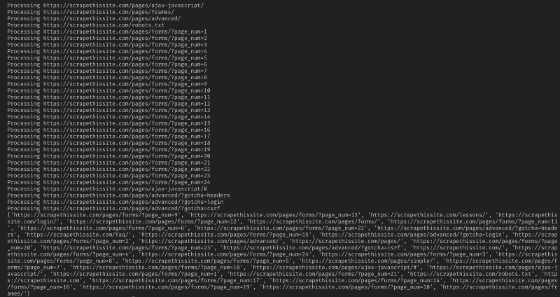

# 如何使用 Python 构建 URL 爬虫来映射网站

> 原文：<https://www.freecodecamp.org/news/how-to-build-a-url-crawler-to-map-a-website-using-python-6a287be1da11/>

由哈德警长

# 如何使用 Python 构建 URL 爬虫来映射网站

#### 一个学习网页抓取基础的简单项目


在我们开始之前，让我们确保了解什么是网络抓取:

> 网络搜集是从网站中提取数据，并以用户易于理解的格式呈现出来的过程。

在本教程中，我想展示用 Python 构建一个简单的 URL 爬虫有多简单，您可以用它来绘制网站地图。虽然这个程序相对简单，但它可以很好地介绍 web 抓取和自动化的基础知识。我们将着重于从网页中递归提取链接，但是同样的想法也可以应用于无数的其他解决方案。

我们的程序将这样工作:

1.  访问网页
2.  抓取网页上找到的所有唯一 URL，并将其添加到队列中
3.  递归地逐个处理 URL，直到我们用完队列
4.  打印结果

### 重要的事情先来

我们应该做的第一件事是导入所有必要的库。我们将使用 [BeautifulSoup](https://www.crummy.com/software/BeautifulSoup/) 、 [requests](http://docs.python-requests.org/en/master/) 和 [urllib](https://docs.python.org/3/library/urllib.html) 进行网页抓取。

```
from bs4 import BeautifulSoupimport requestsimport requests.exceptionsfrom urllib.parse import urlsplitfrom urllib.parse import urlparsefrom collections import deque
```

接下来，我们需要选择一个 URL 来开始爬行。虽然你可以选择任何带有 HTML 链接的网页，但我推荐使用[scrapethisite](https://scrapethissite.com/)。这是一个安全的沙箱，你可以爬而不陷入困境。

```
url = “https://scrapethissite.com”
```

接下来，我们将需要创建一个新的 [deque](https://docs.python.org/3.3/library/collections.html#collections.deque) 对象，这样我们就可以很容易地添加新发现的链接，并在完成处理后删除它们。用您的`url`变量预先填充队列:

```
# a queue of urls to be crawled nextnew_urls = deque([url])
```

然后，我们可以使用一个[集合](https://docs.python.org/3.3/library/stdtypes.html?highlight=set#set)来存储经过处理的唯一 URL:

```
# a set of urls that we have already processed processed_urls = set()
```

我们还希望跟踪本地(与目标相同的域)、外部(与目标不同的域)和损坏的 URL:

```
# a set of domains inside the target websitelocal_urls = set()
```

```
# a set of domains outside the target websiteforeign_urls = set()
```

```
# a set of broken urlsbroken_urls = set()
```

### 爬行的时间到了

一切就绪后，我们现在可以开始编写抓取网站的实际代码了。

我们希望查看队列中的每个 URL，查看该页面中是否还有其他 URL，并将每个 URL 添加到队列的末尾，直到没有 URL。一旦我们完成抓取一个 URL，我们将把它从队列中移除并添加到`processed_urls`集合中以备后用。

```
# process urls one by one until we exhaust the queuewhile len(new_urls):    # move url from the queue to processed url set    url = new_urls.popleft()    processed_urls.add(url)    # print the current url    print(“Processing %s” % url)
```

接下来，添加一个异常来捕获任何损坏的 web 页面，并将它们添加到`broken_urls`集合中以备后用:

```
try:    response = requests.get(url)
```

```
except(requests.exceptions.MissingSchema, requests.exceptions.ConnectionError, requests.exceptions.InvalidURL, requests.exceptions.InvalidSchema):    # add broken urls to it’s own set, then continue    broken_urls.add(url)    continue
```

然后，我们需要获得网页的基本 URL，以便我们可以轻松区分本地和国外地址:

```
# extract base url to resolve relative linksparts = urlsplit(url)base = “{0.netloc}”.format(parts)strip_base = base.replace(“www.”, “”)base_url = “{0.scheme}://{0.netloc}”.format(parts)path = url[:url.rfind(‘/’)+1] if ‘/’ in parts.path else url
```

初始化 BeautifulSoup 以处理 HTML 文档:

```
soup = BeautifulSoup(response.text, “lxml”)
```

现在抓取网页中的所有链接，并将其分类添加到相应的集合中:

```
for link in soup.find_all(‘a’):    # extract link url from the anchor    anchor = link.attrs[“href”] if “href” in link.attrs else ‘’
```

```
if anchor.startswith(‘/’):        local_link = base_url + anchor        local_urls.add(local_link)    elif strip_base in anchor:        local_urls.add(anchor)    elif not anchor.startswith(‘http’):        local_link = path + anchor        local_urls.add(local_link)    else:        foreign_urls.add(anchor)
```

由于我想将我的 crawler 仅限于本地地址，所以我添加了以下内容来将新的 URL 添加到我们的队列中:

```
for i in local_urls:    if not i in new_urls and not i in processed_urls:        new_urls.append(i)
```

如果您想对所有 URL 进行爬网，请使用:

```
if not link in new_urls and not link in processed_urls:    new_urls.append(link)
```

***警告:*** *程序目前的工作方式，抓取国外网址将需要* ***很长的时间*** *。你可能会因为未经许可抓取网站而惹上麻烦。* ***使用后果自负！***



Sample output

以下是我所有的代码:

应该就是这样了。你刚刚创建了一个简单的工具来抓取一个网站，并映射所有找到的网址！

### 最后

请随意构建和改进这些代码。例如，你可以修改程序，在抓取网页时搜索电子邮件地址或电话号码。您甚至可以通过添加命令行参数来扩展功能，以提供定义输出文件、限制搜索深度等选项。在这里了解如何创建命令行接口来接受参数[。](https://medium.com/@ahadsheriff/the-best-way-to-make-command-line-interfaces-in-python-e00e8b9d10c9)

如果你有额外的建议、提示或资源，请在评论中分享！

感谢阅读！如果你喜欢这个教程，并想要更多这样的内容，请务必粉碎以下按钮。❤️

也一定要看看我的[网站](https://ahadsheriff.com/)、 [Twitter](https://twitter.com/ahadsheriff) 、 [LinkedIn](https://linkedin.com/in/ahadsheriff) 和 [Github](https://github.com/ahadsheriff) 。