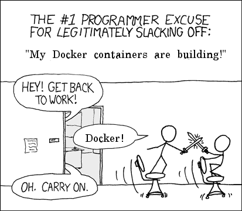
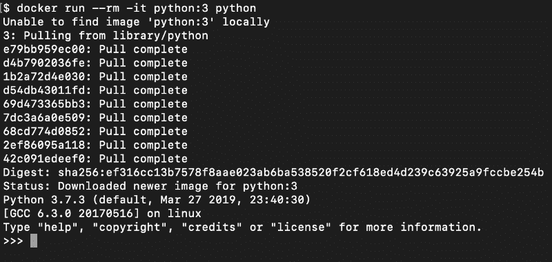
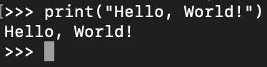
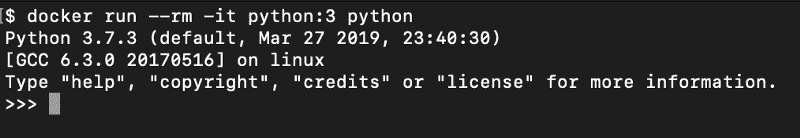
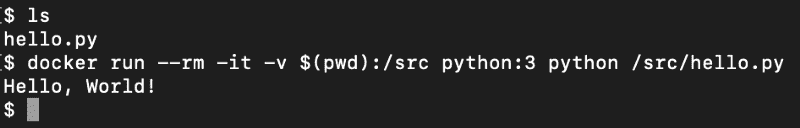
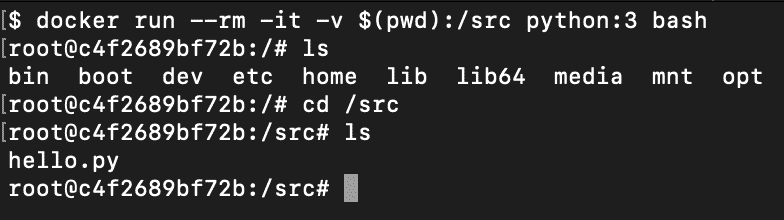
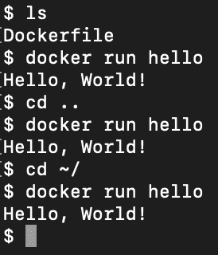
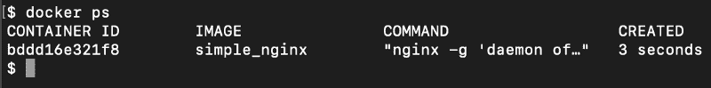
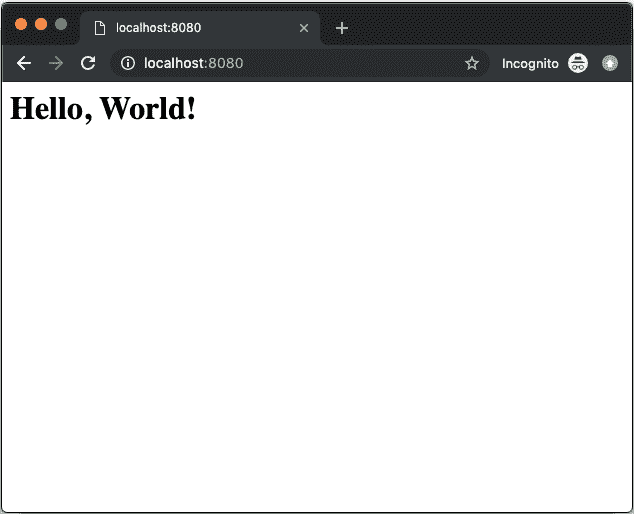

# 101 号案例:基础与实践

> 原文：<https://www.freecodecamp.org/news/docker-101-fundamentals-and-practice-edb047b71a51/>

由 Guilherme Pejon

如果你厌倦了听到你的同事一有机会就称赞 Docker 及其好处，或者你厌倦了每次发现自己处于这样的对话中就点头走开，那么你来对地方了。

此外，如果你正在寻找一个新的借口离开而不被解雇，继续读下去，你以后会感谢我的。



Source: [developermemes](http://www.developermemes.com)

### 码头工人

以下是 Docker 的定义，根据[维基百科](https://en.wikipedia.org/wiki/Docker_(software)):

> Docker 是一个执行操作系统级虚拟化的计算机程序。

很简单，对吧？不完全是。好吧，这是我对 docker 的定义:

> Docker 是一个从**图像**创建和运行**容器**的平台。

还是迷路了？别担心，那是因为你可能不知道什么是**容器**或**图像**。

**映像**是包含运行程序所需的所有依赖关系和配置的单个文件，而**容器**是这些映像的实例。让我们来看一个实践中的例子，让事情变得更清楚。

> **重要提示:**在您继续之前，确保您[使用针对您的操作系统的推荐步骤安装 docker](https://docs.docker.com/install/) 。

### 第一部分。“你好，世界！”来自 Python 图像

假设您的机器上没有安装 Python——或者至少不是最新版本——您需要 Python 打印“Hello，World！”在你的终端里。你是做什么的？你用 docker！

继续运行以下命令:

```
docker run --rm -it python:3 python
```

不要担心，我马上会解释这个命令，但是现在您可能会看到这样的内容:



It might take a few moments for this command to run for the first time

这意味着我们现在在一个 **docker 容器**中，这个容器是通过运行`python`命令的 python 3 **docker 映像**创建的。为了结束这个例子，输入`print("Hello, World!")`,看看神奇的事情发生了。



A "Hello, World!". Much wow!

好吧，你做到了，但在你开始自我表扬之前，让我们后退一步，了解一下这是如何工作的。

#### **分解它**

让我们从头开始。`docker run`命令是 docker 的标准工具，帮助您启动和运行容器。

`--rm`标志告诉 Docker 守护进程在容器退出后清理容器并删除文件系统。这有助于您在运行像这样的短命容器后节省磁盘空间，我们只开始打印“Hello，World！”。

`-t (or --tty)`标志告诉 Docker 在容器内分配一个虚拟终端会话。这通常与`-i (or --interactive)`选项一起使用，该选项即使在分离模式下运行也保持 STDIN 打开(稍后将详细介绍)。

> **注意:**现在不要太担心这些定义。要知道，只要你想在你的容器上输入一些命令，你就可以使用`-it`标志。

最后，`python:3`是我们用于这个容器的基本图像。目前，这个映像附带了 python 版本 3.7.3，以及其他一些东西。现在，你可能想知道这个图像是从哪里来的，里面有什么。你可以在这里找到这两个问题的答案[，以及我们可以在这个例子中使用的所有其他 python 图像。](https://hub.docker.com/_/python/)

最后但同样重要的是，`python`是我们告诉 Docker 在我们的`python:3`映像中执行的命令，它启动了一个 python shell 并允许我们的`print("Hello, World!")`调用工作。

#### 还有一点

要退出 python 并终止我们的容器，可以使用 CTRL/CMD + D 或`exit()`。现在就去做吧。之后，再次尝试执行我们的`docker run`命令，您会看到一些稍微不同的东西，并且速度快了很多。



Much faster. Wow!

这是因为我们已经下载了`python:3`图像，所以我们的容器现在启动得更快了。

### 第二部分。自动化的“你好，世界！”来自 Python 图像

有什么比写“你好，世界！”在你的终端里？你说对了，写两遍！

因为我们迫不及待地想看到“你好，世界！”再次打印在我们的终端中，我们不想再经历打开 python 和键入`print`的忙乱，让我们继续并稍微自动化这个过程。从在你喜欢的任何地方创建一个`hello.py`文件开始。

```
# hello.py
```

```
print("Hello, World!")
```

接下来，继续从同一个文件夹运行下面的命令。

```
docker run --rm -it -v $(pwd):/src python:3 python /src/hello.py
```

这是我们期待的结果:



Great! YAHW (Yet Another "Hello World!")

> **注意:**我在命令前使用了`ls`来显示我在创建`hello.py`文件的同一个文件夹中。

正如我们之前所做的，让我们后退一步，理解它是如何工作的。

#### 打破它

除了两件事之外，我们运行的命令与上一节中运行的命令基本相同。

`-v $(pwd):/src`选项告诉 Docker 守护进程在我们的容器**中启动一个**卷 i** 。卷是在 Docker 中保存数据的最佳方式。在这个例子中，我们告诉 Docker，我们希望将当前目录——从`$(pwd)`中检索——添加到文件夹`/src`中的容器中。**

> **注意:**你可以使用任何你想要的名字或文件夹，而不仅仅是`/src`

如果您想检查`/src/hello.py`是否确实存在于我们的容器中，您可以将我们命令的结尾从`python hello.py`改为`bash`。这将在我们的容器中打开一个交互式 shell，您可以像预期的那样使用它。



Isn't that crazy?

> **注意:**我们在这里只能使用`bash`，因为它是预安装在`python:3`映像中的。有些图像非常简单，甚至没有`bash`。这并不意味着你不能使用它，但如果你想要它，你必须自己安装它。

我们命令的最后一位是`python /src/hello.py`指令。通过运行它，我们告诉我们的容器查看它的`/src`文件夹，并使用`python`执行`hello.py`文件。

也许你已经看到了你可以用这种力量创造的奇迹，但我还是要为你强调一下。利用我们刚刚学到的知识，我们几乎可以在任何计算机内运行**的任何代码****的任何语言**，而不必在主机上安装**任何依赖关系**——当然 Docker 除外。一句话有很多**粗体文本**，所以一定要看两遍！

### 第三部分。最简单的“你好，世界！”可能来自使用 Dockerfile 的 Python 图像

你厌倦了向我们美丽的星球问好了吗？太可惜了，因为我们还要再来一次！

我们学习的最后一个命令有点冗长，每次我想说“Hello，World！”时，我已经开始厌倦键入所有这些代码了现在让我们进一步自动化一些。创建一个名为`Dockerfile`的文件，并向其中添加以下内容:

```
# Dockerfile
```

```
FROM python:3
```

```
WORKDIR /src/app
```

```
COPY . .
```

```
CMD [ "python", "./hello.py" ]
```

现在在创建`Dockerfile`的同一个文件夹中运行这个命令:

```
docker build -t hello .
```

现在剩下要做的就是疯狂地使用这段代码:

```
docker run hello
```



Note that you don’t even need to be in the same folder anymore

你已经知道是怎么回事了。现在让我们花点时间来理解 Dockerfile 是如何工作的。

#### 打破它

从我们的 Docker 文件开始，第一行`FROM python:3`告诉 Docker 从我们已经熟悉的基本映像`python:3`开始。

第二行，`WORKDIR /src/app`，设置我们的容器内的工作目录。这是为了我们稍后要执行的一些指令，比如`CMD`或者`COPY`。你可以在这里看到`WORKDIR`右[的其余支持指令。](https://docs.docker.com/engine/reference/builder/#workdir)

第三行，`COPY . .`基本上是告诉 Docker 从我们当前的文件夹(第一个`.`)复制所有东西，并粘贴到`/src/app`(第二个`.`)上。粘贴位置是用正上方的`WORKDIR`命令设置的。

> **注意:**我们可以通过删除`WORKDIR`指令并用`COPY . /src/app`代替`COPY . .`指令来达到相同的结果。在这种情况下，我们还需要将最后一条指令`CMD ["python", "./hello.py"]`改为`CMD ["python", "/src/app/hello.py"]`。

最后，最后一行`CMD ["python", "./hello.py"]`为我们的容器提供默认命令。本质上是说，每次我们从这个配置中`run`一个容器，它应该运行`python ./hello.py`。请记住，我们正在隐式运行`/src/app/hello.py`，而不仅仅是`hello.py`，因为这就是我们将`WORKDIR`指向的地方。

> **注意:**`CMD`命令可以在运行时被覆盖。例如，如果您想运行`bash`,那么在构建完容器后，您可以运行`docker run hello bash`。

完成 docker 文件后，我们继续开始我们的`build`流程。`docker build -t hello .`命令读取我们添加到 docker 文件中的所有配置，并从中创建一个 **docker 映像**。没错，就像我们在整篇文章中使用的`python:3`图片一样。结尾的`.`告诉 Docker，我们希望在当前位置运行一个 Dockerfile，`-t hello`选项将这个图像命名为`hello`，这样我们就可以在运行时轻松引用它。

在所有这些之后，我们需要做的就是运行通常的`docker run`指令，但是这一次是用行尾的`hello`图像名称。这将从我们最近构建的图像启动一个容器，并最终打印出 good ol 的“Hello，World！”在我们的终点站。

#### 扩展我们的基础形象

如果我们需要一些依赖项来运行我们的代码，而这些依赖项没有预装在我们的基本映像中，我们该怎么办？为了解决这个问题，docker 有了`RUN` [指令](https://docs.docker.com/engine/reference/builder/#run)。

按照我们的 python 例子，如果我们需要`numpy`库来运行我们的代码，我们可以在`FROM`命令之后添加`RUN`指令。

```
# Dockerfile
```

```
FROM python:3
```

```
# NEW LINERUN pip3 install numpy
```

```
WORKDIR /src/app
```

```
COPY . .
```

```
CMD [ "python", "./hello.py" ]
```

`RUN`指令基本上给出了一个由容器终端执行的命令。这样，由于我们的基本映像已经安装了`pip3`，我们可以使用`pip3 install numpy`。

> **注意:**对于一个真正的 python 应用程序，你可能会将你需要的所有依赖项添加到一个`requirements.txt`文件中，将其复制到容器中，然后将`RUN`指令更新为`RUN pip3 install -r requirements.txt`。

### 第四部分。“你好，世界！”使用长期分离的容器从 Nginx 映像中

我知道你可能听腻了我说的话，但在我走之前，我还有一句“你好”要说。让我们继续使用我们新获得的 docker 能力来创建一个简单的长寿命容器，而不是我们到目前为止一直使用的这些短寿命容器。

在新文件夹中创建一个包含以下内容的`index.html`文件。

```
# index.html
```

```
<h1>Hello, World!</h1>
```

现在，让我们在同一个文件夹中创建一个新的 Dockerfile。

```
# Dockerfile
```

```
FROM nginx:alpine
```

```
WORKDIR /usr/share/nginx/html
```

```
COPY . .
```

构建图像并给它命名为`simple_nginx`，就像我们之前做的那样。

```
docker build -t simple_nginx .
```

最后，让我们使用以下命令运行新创建的映像:

```
docker run --rm -d -p 8080:80 simple_nginx
```

您可能认为什么也没发生，因为您回到了您的终端，但是让我们仔细看看`docker ps`命令。



I had to crop the output, but you’ll see a few other columns there

`docker ps`命令显示机器中所有正在运行的容器。正如你在上面的图片中看到的，我有一个名为`simple_nginx`的容器正在我的机器上运行。让我们打开一个网络浏览器，看看`nginx`是否通过访问`localhost:8080`来完成它的工作。



Hurray! (this is the last time, I promise)

一切似乎都在按预期工作，我们通过运行在容器内部的`nginx`提供静态页面。让我们花点时间来理解我们是如何做到这一点的。

#### 打破它

我将跳过 Dockerfile 的解释，因为在上一节中我们已经学习了那些命令。该配置中唯一的“新”东西是`nginx:alpine`图像，你可以在[这里](https://hub.docker.com/_/nginx)了解更多。

除了新的内容之外，这个配置还可以工作，因为`nginx`使用`usr/share/nginx/html`文件夹来搜索一个`index.html`文件并开始提供服务，所以既然我们将我们的文件命名为`index.html`并将`WORKDIR`配置为`usr/share/nginx/html`，这个设置就可以开箱即用。

`build`命令与我们在上一节中使用的命令完全一样，我们只是使用 Dockerfile 配置来构建一个具有特定名称的映像。

现在是有趣的部分，即`docker run --rm -d -p 8080:80 simple_nginx`指令。这里我们有两个新的旗帜。第一个是 detached ( `-d`)标志，这意味着我们想要在后台运行这个容器，这就是为什么我们在使用了`docker run`命令之后马上回到我们的终端，尽管我们的容器仍然在运行。

第二个新标志是`-p 8080:80`选项。正如您可能已经猜到的，这是`port`标志，它基本上将端口`8080`从我们的本地机器映射到我们的容器内的端口`80`。您可以使用任何其他端口来代替`8080`，但是您不能在没有向`nginx`图像添加额外设置的情况下更改端口`80`，因为`80`是`nginx`图像显示的标准端口。

> **注意:**如果你想停止一个像这样的分离的容器，你可以使用`docker ps`命令获得**容器的名字**(不是图像)，然后使用`docker stop`指令，在该行的末尾加上想要的容器的名字。

### 第五部分。结束了

就是这样！如果你还在读这篇文章，你已经具备了在你的个人项目或日常工作中开始使用 Docker 的所有基础。

请在评论中告诉我你对这篇文章的想法，我会确保在不久的将来写一篇后续文章，涵盖更高级的主题，如`docker-compose`。

如果你有任何问题，请让我知道。

干杯！