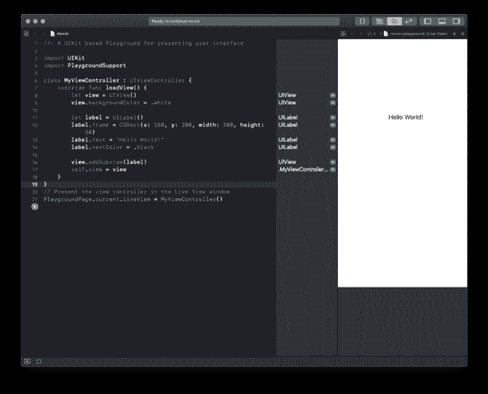

# Swift 中的 MVVM 设计模式概述

> 原文：<https://www.freecodecamp.org/news/an-overview-of-the-mvvm-design-pattern-in-swift-fb815ea5da40/>

作者:阿兹哈尔

# Swift 中的 MVVM 设计模式概述

本文假设您熟悉 MVC 模式，这是 Apple 采用和推荐的基线设计模式。

### 什么是 MVVM？

MVVM 是一种结构设计模式。假设您有两个布局不同的视图，需要用来自同一个模型类的数据填充。MVVM 允许您使用来自单个模型类的数据，并以不同的方式表示它来填充视图。

#### 模型

这些保存了应用程序数据。这些是您创建的结构和类，用于保存从 REST API 或其他数据源接收的数据。

#### 视图

这些在屏幕上显示 UI 元素。这些类通常是 UIView 的子类并使用 UIKit。

#### 查看模型

在这些类中，您可以从模型类中获取信息，并将它们转换成可以在特定视图中显示的值。

### 我如何使用这个？

使用此模式将数据从模型类转换为适用于不同视图的表示。例如，您可以使用视图模型将字符串转换为非属性字符串，或将日期转换为格式化字符串。

这种模式类似于 MVC，这也许是为什么将它添加到 MVC 代码库相对简单的原因。您所需要做的只是将视图模型类添加到现有的代码库中，并使用它们来表示您需要的数据。这确实最小化了视图控制器的作用，这有助于减轻视图控制器类的负担。你也可以避免“大规模视图控制器”。

***免责声明*** : MVVM 无法独自帮你避免大规模视图控制器问题。您可以通过结合使用设计模式来分散视图控制器类的负载，如委托模式、单例模式等。

让我们看看 MVVM 是如何用代码工作的。

打开 Xcode，创建一个新的游乐场项目。选择 iOS 选项卡下的单一视图开始。单击助手编辑器(带有两个相交圆圈的图标)以显示实时视图窗口。你应该看看这个。

您可以继续删除 MyController 类。我们将手动设置视图。

让我们假设我们正在开发一个鸟类商店应用程序。让我们从创建一个鸟的模型类开始。在 MyViewController 类的右大括号下面添加以下类。

每只鸟都有名字、稀有程度和图像。让我们假设我们需要在视图上显示这些属性。稀有属性是一个枚举，如果没有某种对视图元素呈现有用的表示，我们就不能在视图上显示它。这是我们为这个表示创建鸟瞰模型的最佳时机。让我们尝试根据鸟的稀有程度将每只鸟的价格显示为一个字符串。

将以下班级添加到您的操场。

下面是视图模型代码中发生的情况:

1.  我们创建一个 bird 类型的私有 Bird 属性，这样我们就可以访问模型类的属性。我们还编写了一个 init 方法来设置 bird 属性。
2.  我们创建两个计算属性，它们的值来自与私有 bird 属性相关联的属性。我们不修改属性，因为它们已经以正确的方式呈现在我们的视图中。
3.  我们创建一个 purchaseFeeText 属性，它是一个计算属性。该属性使用 private bird 属性中的稀有值，通过 switch 语句来分配成本。这是我们的视图模型类从模型类对象中获取数据并将其转换成我们想要在视图中使用的表示的地方。

现在让我们为 UIView 编写代码，我们将使用它来显示来自视图模型类的信息。将下面的类添加到您的操场文件中。

您可以在此下载 imageView [使用的图像。将其添加到项目导航器的 Resources 文件夹中，并将其重命名为“swifty.png”。](https://www.google.com/url?sa=i&rct=j&q=&esrc=s&source=images&cd=&ved=2ahUKEwiMnIqolaThAhUTbisKHXYhD78QjRx6BAgBEAU&url=https%3A%2F%2Fwww.iconfinder.com%2Ficons%2F1829980%2Fbrand_logo_network_social_swift_icon&psig=AOvVaw25fA-XJq_9BsiEnSwWxchz&ust=1553839488282677)

现在我们已经设置了鸟瞰图类，让我们添加代码，以便在操场实时视图中看到它。在 BirdView 类的右大括号后添加以下内容。

事情是这样的

1.  我们从名为“swifty”的模型类创建了一个新的 bird 实例
2.  我们从 swifty 对象的视图模型类创建一个新实例。
3.  我们创建一个框架属性，然后使用该框架初始化鸟瞰图。
4.  我们使用视图模型实例的属性来配置视图。
5.  我们将视图设置为操场实时视图，然后将所有内容渲染到助理编辑器中。

选择**查看** & **gt 就可以看到实景；辅助** a **nt Edi** t **或&g**t**；从顶部菜单栏显示 Ass** i **stant** Editor。

### 我什么时候用这个？

如果您发现自己需要在具有不同数据表示的视图中使用来自模型类的数据，那么使用 MVVM 模式是有意义的。MVVM 可能不会成为你的应用的起点。你可能会从 MVC 开始。关注你的需求，你可以随时在你的代码库中引入 MVVM(和大多数其他设计模式)。