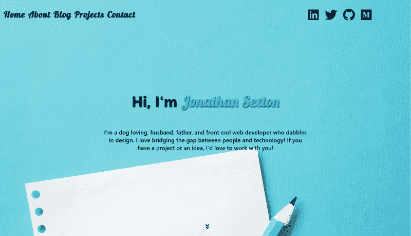
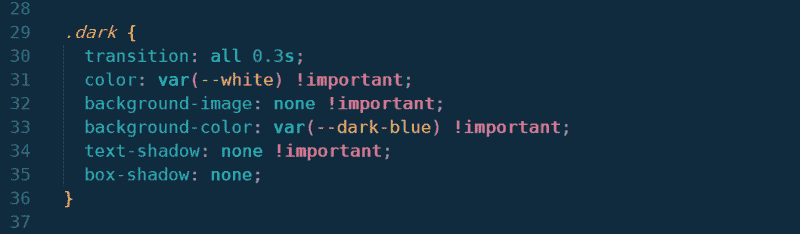
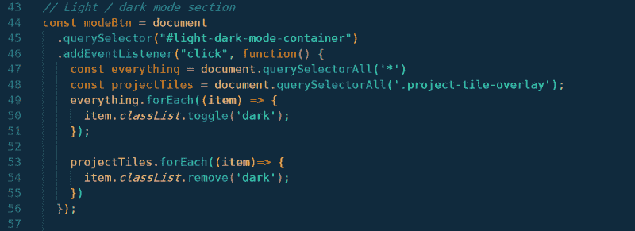
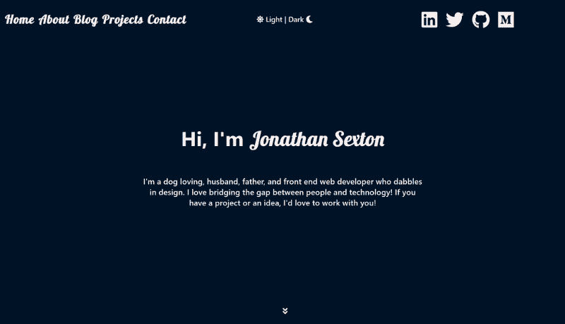
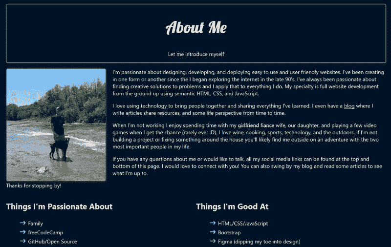

# 我是如何在我的网站上添加黑暗模式的

> 原文：<https://www.freecodecamp.org/news/how-i-added-dark-mode-to-my-website-484bc3cb0318/>

#### 相同的网站，两种不同的配色方案

去年，我决定从头开始重新设计我的网站。我想要一些简单和极简的外观，清楚地说明这是什么——一个投资组合网站。

在我从头开始重建我的网站后，似乎我所到之处都有另一篇关于给你的网站添加黑暗模式的文章。

起初我并不认为这会有很大的不同，因为虽然我偏爱深色，但我觉得我的网站在明亮有趣的颜色和深色字体之间取得了很好的平衡。

我读了一些我之前提到的文章，我想得越多，我就越决定去做。

我从 Flavio Copes 那里得到了一些灵感，他就这个主题写了一篇很棒的文章。与 Flavio 决定对他的站点所做的不同，我没有将用户的选择添加到本地存储中。

这在一定程度上是由于我们站点之间的差异。我有一个静态网站，除了在不同平台上的博客，没有重定向/单独的页面，所以用户一般不会刷新页面。这是一个很好的选择，我以后可能会添加进来。

好了，让我们深入了解一下我是如何完成黑暗模式切换的具体细节。

### 代码

实现这一点的代码相当简单。我采用了与 Flavio 相同的方法，并通过 CSS 添加了样式变化。我不得不多走几步，因为我的登录页面上有一张图片。

我不得不使用**！一些规则上的重要**标志，因为它们没有被正确应用。这是最容易实现的方法，我知道不建议使用这个标志，所以我将在不久的将来寻找一个替代方法。

下面是我用来让我的切换开关正常工作的 JavaScript:

我首先选择我的 id 为`light-dark-mode-container`的`div`，并向它添加一个[事件监听器](https://developer.mozilla.org/en-US/docs/Web/API/EventTarget/addEventListener)。

接下来，我设置我的变量`everything`，它选择页面上的所有内容，以及`projectTiles`，因为这个类属于一个特定的覆盖集，我不想有纯色的背景。

接下来，因为我使用了返回静态[节点列表](https://developer.mozilla.org/en-US/docs/Web/API/NodeList)的`[querySelectorAll](https://developer.mozilla.org/en-US/docs/Web/API/Document/querySelectorAll)`，所以我循环遍历两个节点列表中的所有元素，或者切换类`dark`或者从变量`projectTiles`返回的元素中完全删除它。

我留下的是我的网站顶部的一个容器，它有一个拨动开关，允许用户在亮暗模式之间切换。

The final product

The next screen down on dark mode

我希望你喜欢这篇文章，也许你也学到了一些东西！如果你决定在你自己的网站或你的下一个项目中实现它，请与我分享(给我留言或在 [Twitter](https://twitter.com/jj_goose) 上对我大喊)。我总是很高兴看到别人创作的作品和项目。

这篇文章发表在我的[博客](https://jonathansexton.me/blog)上，在那里我写了一些关于前端 web 开发的文章。我也在 [Dev.to](https://dev.to/jsgoose) 交叉发布，所以如果你在那个平台上，你也可以找到我的作品！

既然你在那里，为什么不注册我的**时事通讯**？我保证我永远不会给你的收件箱发垃圾邮件，你的信息也不会与其他人分享。

祝你有一个充满爱、快乐和编码的美好的一天！