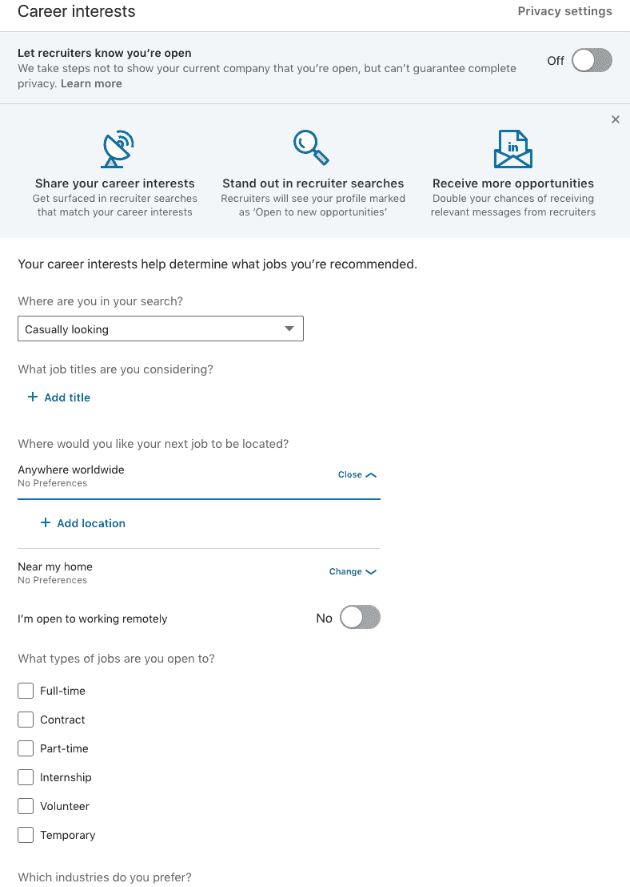

# 如何在编码训练营后找到工作

> 原文：<https://www.freecodecamp.org/news/how-to-get-a-job-after-a-coding-bootcamp-684aafbf4d4a/>

作者:罗克西·阿亚兹

# 如何在编码训练营后找到工作

Photo by [Jannis Brandt](https://unsplash.com/@jannisbrandt?utm_source=medium&utm_medium=referral) on [Unsplash](https://unsplash.com?utm_source=medium&utm_medium=referral)

在编码训练营之后获得一份技术工作是很有可能的，但不一定没有痛苦。

训练营结束后的几天/几周/几个月有自己的学习曲线，通常包括拒绝和对生活的严肃思考。

(除非你带着一份工作邀请或一些重要线索来——你真幸运！)

在训练营，你在短时间内学到的东西比以往任何时候都多。你将为学习如何编码打下坚实的基础。

然而，你不会学到足够的知识来通过大多数的编码挑战。你还没有准备好就不同的语言和技术自信地分享你的观点。更糟糕的是，你可能没有任何专业技术经验来证明你的价值。

你会觉得自己像个骗子。

由于你还没有准备好，以及业内一些怀疑这些非认证项目合法性的人，你将会因为没有达到预期而不断被拒绝。

编码训练营结束后，平均需要六个月才能找到工作。谢天谢地，在将近七个月之后，我穿越了整个国家，我的痛苦结束了。我得到了一份我热爱的工作。

如果你正在考虑一个为期 12 周的编码训练营，请记住，这不是一个快速改变你生活方向的 15k 黑客，因为你:

对你目前的工作或个人生活不满意

*B .对自己的收入不满意*

假设你会在项目结束后不久找到一份工作

d .有点好奇/感兴趣/好奇科技是什么样的

你必须真的想坚持到最后。

在训练营结束几个月后，我的同学中有相当多的人回到了他们原来的行业/工作岗位。有些人还得到了梦寐以求的工作——说实话，这是双向的！

这里有一些保持积极性的技巧，可以帮助你在编码训练营结束后找到第一份工作。

### 通过志愿活动获得一些真实世界的经验

重要的是继续提高你的技能，同时提高你的团队合作技能。让你的代码真正投入生产并被积极使用是证明你自己和做出贡献的最好方式。

直根基金会将非营利组织与有技能的志愿者联系在一起。

我用这个网站寻找我所在地区的机会，也可以远程寻找。我在一个精神健康网站做前端开发，兼职，远程。

我的任务是将线框(在 Zeplin 上创建)转换成 React 组件。我把我的“空闲时间”分为找工作/面试和做志愿者。

我们每周都有电话会议，比起去找另一个 YouTube 教程/项目，我学得更快更有效率。

我不仅是在为我关心的事业做贡献，我的队友也给了我很多指导，如果我一周很忙，如果我有事情要做，比如面试，我也有一些回旋的余地。点击查看[。](https://taprootfoundation.org/volunteers/)

### 总的来说，获得一些真实世界的经验

做自己的项目比单干要好。

对实习和学徒持开放态度。其中许多都向新兵训练营的毕业生开放，你被录取的几率比在同一家公司找到一份全职工作要高得多。在同一家公司完成实习后，你被录用的几率也非常高！

问问你周围的网络，看看是否有人需要一些帮助——也许一个专业网站需要一些修复，或者问问当地的企业你是否能提供一些帮助。这些都是伟大的添加到您的投资组合！

### 拥有一个像样的投资组合网站——因为它正在被评判

这不是一个简历就能说明一切的行业。简历附有网站。当你提交匿名申请时，这是你的两项资产。

你的网站正在展示你的一些最好的作品。

那里是你讲述你的故事的地方。利用这个机会展示你的能力和专业精神。

在我参加的许多面试中，我的网站被评论。我的媒体文章有时也会被提及。

以下是你应该包括的事项清单:

个人简介/简介部分

带有文档化源代码的项目(理想部署)( Github)

可下载的简历

相关社交媒体简介:LinkedIn、Twitter

易于查找的联系信息

自定义网址

响应式设计

[这里](https://spyrestudios.com/web-developer-portfolio/)是一些启发。

### 有效使用 LinkedIn

LinkedIn 是你展示给世界的一张脸，所以要把自己放在好的一面。通常，一旦你的申请被考虑，雇主就会看你的 LinkedIn。

首先，确保你的简介是完整的，越详细越好。有一张职业照片，一份详细的简历。

你的工作经历越详细，招聘人员/招聘经理就越不会猜测你的背景。你被联系的机会就越多。

通过在 LinkedIn 的职业兴趣部分拥有正确的偏好来帮助招聘人员找到你，在那里你可以让招聘人员知道你对工作持开放态度。把你在求职中的位置，你对什么职位开放，你对什么城市/地点和工作类型开放。

你也可以在你的行业中寻找导师，你想从他们那里得到职业建议，有点像一个导师项目。您可以选择您的偏好类型，以便获得[推荐](https://www.linkedin.com/opportunities/career-advice/get-advice/)。

你可以选择从你所在的地区、你的大学或者你的第一或第二学位 LinkedIn 联系人那里获得建议。

### 参加社交活动、聚会、黑客马拉松

这里的关键信息是把你自己放在那里。

把你自己放出去。

不要躲在屏幕后面，申请成百上千的申请，然后期待好运降临。

你正在与成千上万的训练营毕业生竞争，他们和你有着相同的技术经验，所以走出去，给你的名字加上面孔和个性。

认识人，参加活动。我遇到了一些很棒的人，他们也在寻求增加他们的技术知识，找一份工作，有些人甚至帮我找工作。

找到这类事件的一个很好的方法是去 Meetup.com，在科技类中寻找。您可以通过[城市或邮政编码](https://www.meetup.com/find/tech/)进行搜索。

(仅供参考:很多活动都有免费的披萨、小吃和饮料！)

添加你在 LinkedIn 上联系的人，这只会帮助你在招聘人员的搜索中更有相关性。

另一个值得参加的大型活动是黑客马拉松。这不仅是展示你积极参与技术社区的好方法，而且你将获得与行业相关的技能，学到更多，并与同行和行业级专家建立联系。

### 为面试而学习:编码挑战

招聘经理肯定会质疑你是否有能力接受这份工作，尤其是如果你没有任何专业的技术经验。

编码挑战从简单的 FizzBuzz 挑战到更复杂的挑战，比如构建一个完整的应用程序。你将不得不在编码训练营之外花费额外的时间

你可以利用这个网站练习技术面试问题:[https://interviewing.io/](https://interviewing.io/)

我还在 Glassdoor 上练习，阅读人们张贴的被问到的问题。我会练习这些问题，以及它们所涵盖的话题。

有时候，他们会问完全相同的问题！

### 有一个可以依靠的支持团体

没有你的朋友，你是过不去的。我得到的最好的支持来自我的同学，或者理解我的旅程和痛点的前训练营毕业生。

就个人而言，有时依靠非技术/训练营的朋友(并向他们发泄)有点困难。通常，我那些好心的朋友会在失业两个月后问我，“你觉得还要多久你才能回到原来的工作岗位？”

但是不要因此而气馁…继续前进！

Photo by [Priscilla Du Preez](https://unsplash.com/@priscilladupreez?utm_source=medium&utm_medium=referral) on [Unsplash](https://unsplash.com?utm_source=medium&utm_medium=referral)