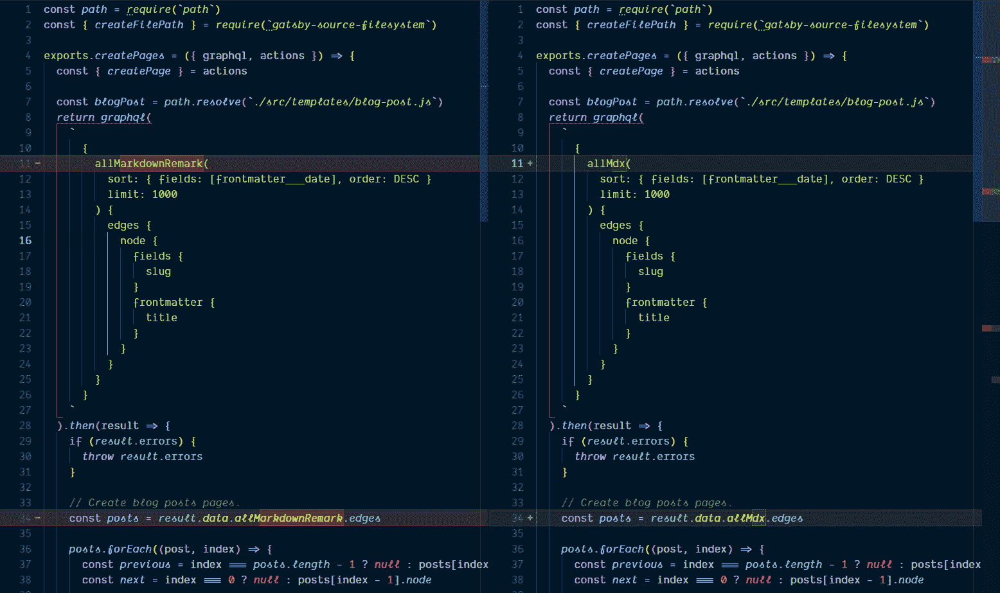
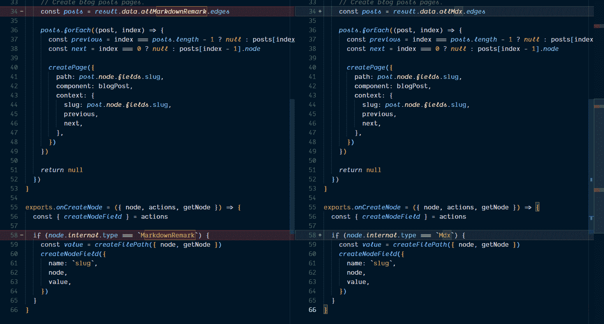
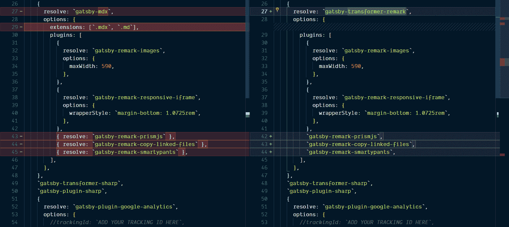
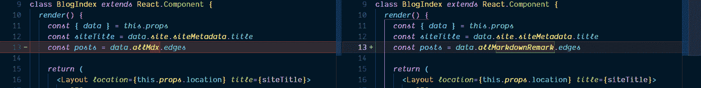
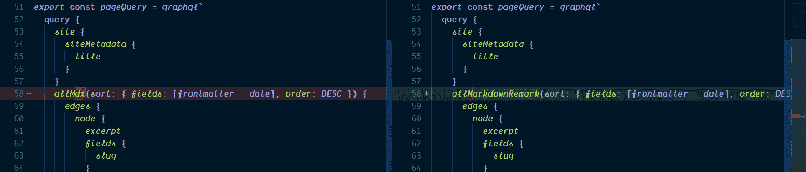
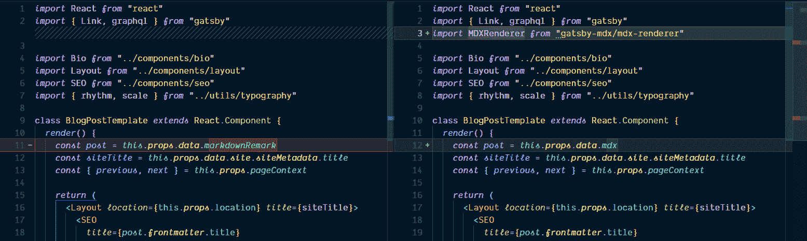
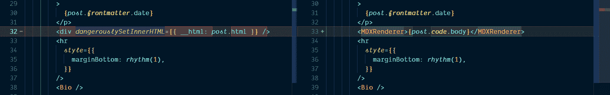
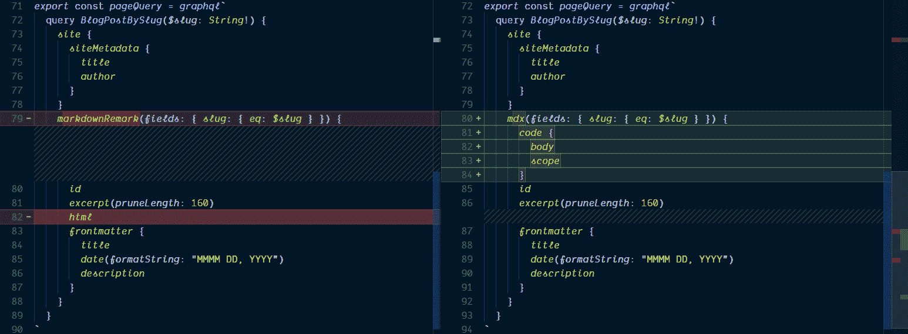

# 将 Gatsby 默认入门博客转换为使用 MDX

> 原文：<https://www.freecodecamp.org/news/convert-the-gatsby-default-starter-blog-to-use-mdx/>

在本指南中，我们将介绍如何将 Gatsby 默认博客启动器转换为使用 MDX。

这些天所有酷小孩都在博客里用盖茨比和 MDX。如果你已经有了一个使用盖茨比的博客，但想转移到新的热点，那么这是给你的指南。

[https://www.youtube.com/embed/gck4RjaX5D4?feature=oembed](https://www.youtube.com/embed/gck4RjaX5D4?feature=oembed)

## 版本:

本指南正与以下依赖版本一起使用。

*   盖茨比:2.3.5
*   反应:16.8.6
*   反应范围:16.8.6
*   gatsby-mdx: 0.4.5
*   @mdx-js/mdx: 0.20.3
*   @mdx-js/tag: 0.20.3

您还可以查看[示例代码](https://codesandbox.io/s/lqp6p647q)。

* * *

我们需要一些链接，它们是:

[用于导入项目的 CodeSandbox 文档](https://codesandbox.io/docs/importing)

[CodeSandbox 导入向导](https://codesandbox.io/s/github)

[盖茨比入门博客](https://github.com/gatsbyjs/gatsby-starter-blog)

## 导入到 CodeSandbox

对于这个例子，我将使用 [Gatsby starter 博客](https://github.com/gatsbyjs/gatsby-starter-blog)并将其导入 CodeSandbox，查看文档，它说您可以通过链接 [CodeSandbox 导入向导](https://codesandbox.io/s/github)来完成此操作，将链接粘贴到那里，CodeSandbox 将打开 GitHub 上的代码表示。

现在，我们可以开始从使用 Gatsby transformer 注释转移到 MDX。

让我们来看看我们将为这个例子改变什么。但是首先我们需要导入一些依赖项来让 MDX 在 Gatsby 项目中运行。

使用 CodeSandbox 中的“添加依赖项”按钮添加以下依赖项:

*   `gatsby-mdx`
*   `@mdx-js/mdx`
*   `@mdx-js/tag`

我们还需要为样式化组件添加依赖项，所以现在也可以添加它们:

*   `gatsby-plugin-styled-components`
*   `styled-components`
*   `babel-plugin-styled-components`

要更改的文件:

*   `gatsby-node.js`
*   `gatsby-config.js`
*   `index.js`
*   `blog-post.js`

## `gatsby-node.js`

首先我们需要改变`gatsby-node.js`这是所有页面和数据节点生成的地方。

使用 MDX 更改所有出现的 markdown 注释，这是 create pages 中的初始 GraphQL 查询，然后在结果中再次出现。



然后将`onCreateNode`中的`node.internal.type`从`MarkdownRemark`改为`Mdx`。



## `gatsby-config.js`

这里我们将把`gatsby-transformer-remark`替换为`gatsby-mdx`



## `index.js`

在这里，我们将改变`posts`变量以获得`Mdx`边缘。



`Mdx`边取自页面查询，它也被修改为使用`allMdx`代替`allMarkdownRemark`。



## `blog-post.js`

现在，列表中最后一个让 MDX 工作的是博客文章模板，我们将需要从`gatsby-mdx`导入`MDXRenderer`，我们将很快用它替换`dangerouslySetInnerHTML`。



这里是我们使用它的地方，我们将来到`post.code.body`。



同样在查询中，我们用`mdx`替换了`markdownRemark`，这次也从查询中去掉了`html`，并添加了`code`来代替我们在渲染方法中使用的`body`。



## 现在我们用的是 MDX！

现在我们可以创建一个`.mdx`帖子，让我们开始吧。

导入样式化组件依赖关系:

```
gatsby-plugin-styled-components
styled-components
babel-plugin-styled-components 
```

然后在`gatsby-config.js`中进行配置:

```
module.exports = {
  siteMetadata: {
    title: `Gatsby Starter Blog`,
    ...
    },
  },
  plugins: [
    `gatsby-plugin-styled-components`,
    {
      resolve: `gatsby-source-filesystem`,
      options: {
  ... 
```

现在我们可以使用样式化组件，在`src/components`中创建一个新组件，我已经把我的组件命名为`butt.js`你喜欢什么就叫你的组件。

我们将在一个`.mdx`文档中使用这个组件，首先是组件:

```
import styled from 'styled-components';

export const Butt = styled.button`
  background-color: red;
  height: 40px;
  width: 80px;
`; 
```

辣，对！？

现在我们可以将这个组件包含在一个`.mdx`文档中，让我们继续创建，在`content/blog`中创建一个新目录，我给我的目录起了一个富有想象力的名字`first-mdx-post`，在那里创建一个`index.mdx`文件，并使用其他帖子中的 frontmatter 作为使用示例:

```
---
title: My First MDX Post!
date: '2019-04-07T23:46:37.121Z'
---

# make a site they said, it'll be fun they said

more content yo! 
```

这将呈现一个`h1`和一个`p`，我们应该在我们的 CodeSandbox 预览中看到它的呈现。

现在我们可以导入我们制作精美的按钮了:

```
---
title: My First MDX Post!
date: '2019-04-07T23:46:37.121Z'
---

import { Butt } from '../../../src/components/button';

# make a site they said, it'll be fun they said

more content yo!

<Butt>yoyoyo</Butt> 
```

## 总结一下！

所以，就是这样，我们已经把 Gatsby starter 博客从使用 Markdown Remark 转换成使用 MDX。

我希望它对你有所帮助。

**感谢阅读。**

如果你喜欢这个，请看看我的其他内容。

在 Twitter 上关注我，或者在 GitHub 上关注 T2 问我任何问题。

> 你可以在我的博客上阅读其他类似的文章。