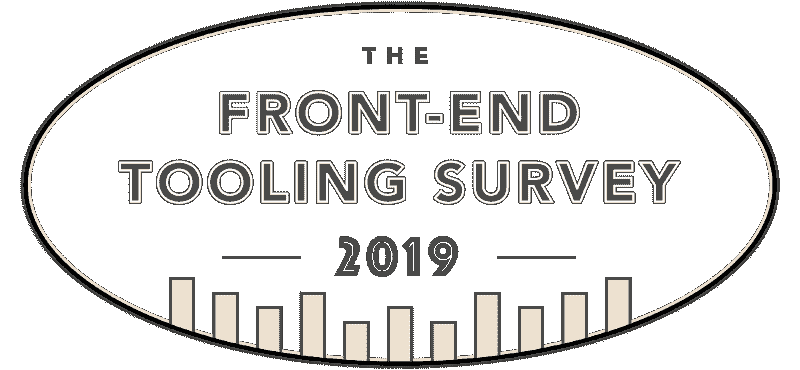
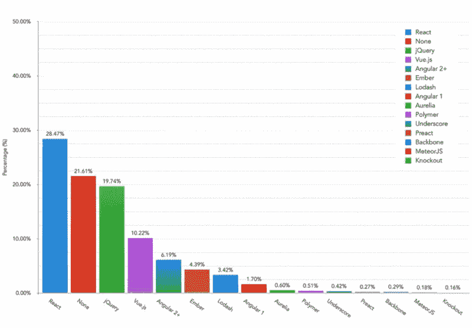
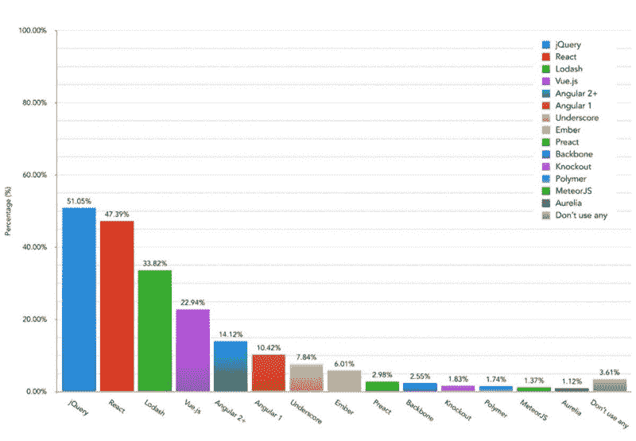

# 启动 2019 年前端工具调查

> 原文：<https://www.freecodecamp.org/news/launching-the-front-end-tooling-survey-2019-4cb2b72f0b42/>

阿什利·沃森-诺兰

# 启动 2019 年前端工具调查

#### 从去年的结果来看，我们的前端工具习惯有什么变化？

与往年一样，今年调查的目标很简单。了解整个行业中常见前端工具的当前知识和使用水平。

那么哪些工具会在 2019 年独占鳌头呢？

#### ➡️ [现在开始今年的调查](https://ashn.uk/survey-2019)

我真的很感谢你抽出时间来参加。每个响应都有助于提供更具代表性的前端社区样本。

### 对去年结果的总结

去年，5461 名前端开发人员花时间回答了关于各种前端工具的 24 个问题。

那么，在这些回答中可以看出哪些主要趋势呢？

#### React 和 Vue.js 的使用迅速增长

受访者被问了三个关于 JavaScript 库和框架的问题。这与他们对这些工具的了解和使用有关，也与他们在从事前端项目时是否认为这些工具是必不可少的有关。

React 和 Vue.js 在所有这些领域都取得了巨大的进步。事实上，与之前的结果不同，React 首次被认为是这一类别中最重要的工具，将 jQuery 挤下了头把交椅，近三分之一的受访者如此回答(28.47%)。

jQuery 在这一类别中跌至第三位，落后于那些表示他们不认为任何库或框架是必不可少的人。Vue.js 排名第四，从 2016 年业绩的 3.01%跃升至 2018 年的 10.21%。

Results for Question 16 in the 2018 Front-End Tooling survey: “Which JavaScript library or framework would you regard as essential to you on the majority of your projects?”

就这些工具的知识水平而言，jQuery 仍然是大多数受访者感觉使用舒适的工具(79.73%)。然而，这一数字首次出现百分比下降，比上一次调查下降了近 7%。相比之下，40.43%的受访者对 React 持相同看法，这一比例在同期上升了 12.30%。

使用数据显示了类似的趋势，当受访者被问及他们目前在项目中最常用的框架时，React 和 Vue.js 分别增长到 47.39%和 22.94%。这比 2016 年调查中的使用数字分别增长了 10.48%和 13.59%。相比之下，jQuery 的使用率下降了 19.20%，尽管它在这一类别中勉强保持领先，有 51.05%的人表示他们仍然经常使用它。

Results for Question 15 in the 2018 Front-End Tooling survey: “Which JavaScript libraries and/or frameworks do you currently use most frequently on projects?”

总的来说，这些问题的趋势清楚地表明，jQuery 的使用看起来正在稍微减弱，开发人员认为它是他们工作流程中不太重要的工具。另一方面，React 和 Vue.js 的使用和知识水平在同一时期迅速增长。

#### CSS-in-JS 工具稳步增长

在去年的调查结果中，表示对使用 CSS-in-JS 解决方案感到满意的开发者数量几乎翻了一番，达到 19.92%。显然，越来越多的开发人员在构建组件时，已经在寻找可以帮助他们封装风格的工具。

虽然这只代表了五分之一的受访者，但它显示了一种上升趋势，值得在今年的结果中关注。

#### CSS 网格的采用取得了良好的进展

CSS 布局特性在过去几年里有了巨大的飞跃。你需要一直生活在岩石下才能错过与 flexbox 和 CSS Grid 相关的大量新闻和教程。

去年的结果显示，这些特性在开发者中被广泛采用。绝大多数人(67.59%)表示他们觉得使用 flexbox 很舒服。相比之下，18.48%的人认为 CSS Grid 也是如此，考虑到 CSS Grid 支持的时间比 flexbox 短得多，这是一个相当可观的数字。当包括那些说他们至少有一点点使用 CSS Grid 的经验的人时，这个百分比上升到 62.41%。

#### 查看完整结果

如果你有兴趣浏览去年调查的所有数据，[请查看完整的 2018 年结果文章](https://ashleynolan.co.uk/blog/frontend-tooling-survey-2018-results)。

看到上述所有趋势和数字在接下来的 12 个月里是如何发展的，将会非常有趣。

### 今年有什么新消息？

为了保持调查的简洁，我们在考虑了去年受访者的反馈后，增加了几个新问题。

随着 CSS-in-JS 工具的兴起——如 2018 年的结果所示——今年的调查现在有一个专门与这类工具相关的问题。

此外，还有一些新的问题，旨在发现开发人员目前正在使用哪些性能和可访问性工具和特性。

经过去年的多次请求，我也将发布一个经过整理(匿名)的调查回复数据集。这也将包括前三次调查的回复数据。

### 参加今年的调查

我已经说够了— [继续参加今年的调查](https://ashn.uk/survey-2019)！

调查将于 4 月底结束，结果将在不久后公布。如果您想知道这何时发生，[在 Twitter 上关注我](https://twitter.com/AshNolan_)或者在调查结束时留下您的电子邮件。结果文章发布后，您将收到一个链接。

一篇总结文章也将在 Medium 上发表。