# 我如何在昌迪加尔大学中心组织 Google Hash Code 2019

> 原文：<https://www.freecodecamp.org/news/google-hash-code-2019-chandigarh-university-hub-organized-by-neeraj-negi-923118fce083/>

作者:Neeraj Negi

# 我如何在昌迪加尔大学中心组织 Google Hash Code 2019

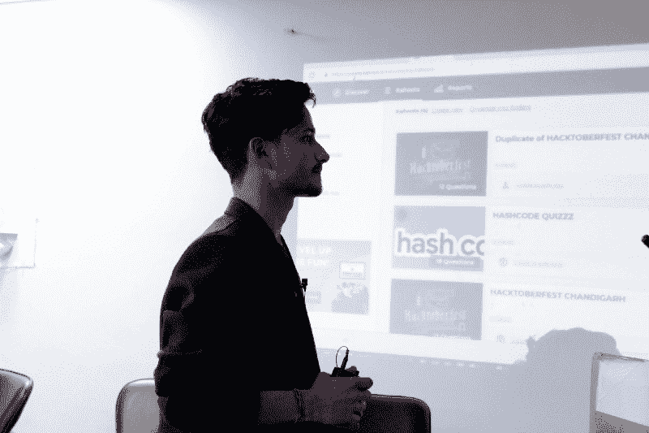

[Neeraj Negi](https://www.freecodecamp.org/news/google-hash-code-2019-chandigarh-university-hub-organized-by-neeraj-negi-923118fce083/undefined) — “Inspire at least one person before you Expire”

> 这就是我！！！**@ Neeraj Negi—Google HashCode Organizer**

> *“组织活动没什么大不了的，但成功举办活动才是重点”——Nj*

**超过 900+** 名学生参加了来自**昌迪加尔大学中心**的 **Google HashCode2019** 。我写这些是为了让我的同龄人和后辈可以从我的经历中学到一些东西*，因为在生活中我们没有足够的时间跌倒然后再学习*。我希望你会喜欢这个，并了解我是如何管理这个活动的。

所以故事从得到谷歌关于“Google HashCode 2019”的通知开始。我住在印度美丽的城市昌迪加尔，目前正在攻读计算机科学与工程学士学位。作为**谷歌网络专家学者**和**谷歌 Pytorch 学者**，我能够通过沟通更早得到关于 **GH19** 的通知。？

#### 关于我的一点点

我已经处理过许多大型活动，但这个特别的活动是最大的活动之一——不仅在学生参与方面，而且在期望方面。我对这次活动感到非常兴奋，尽管我是组织者，但我也想参加 hashcode 比赛。我是谷歌、 **的**女性科技创客、谷歌开发者小组-昌迪加尔、AWS Educate 成员、1MWIT、Linkedin Local、Adobe 俱乐部成员以及大学主办的许多其他俱乐部的成员*。*****

**背景:** *我是一名全栈 web 开发人员(MEAN Stack) |UI/UX -Web 设计|语音识别开发人员|业务定位的创始人|Linkedin 爱好者| Google Adwords 认证| Alexa Skill 和 Google Assistant 开发人员| 100 万技术领域女性的导师|Adobe 校园代表|从事自动驾驶汽车(ML，AI) |CompTIA+|从事 AWS*

我在高中期间已经接触了 C、C++和 Python，并学习了新的编程语言 Js，有棱角。大学 Js。我天生的好奇心将我引向了 web 开发和自动驾驶汽车领域。我正在研究深度神经网络。

现在让我们回到这个故事。？我大学里的大多数学生都不知道 Google hashcode 竞赛。所以我决定向学生传播一些意识，并说服他们参与进来，这样他们就可以从现实世界的问题中学到一些东西。即使他们不知道怎么写< <你好世界；他们仍然可以研究并开始探索。

> 研究就是去看别人看过的东西，思考别人没想过的东西。—艾伯特·森特-杰尔吉"

### Google HashCode —比赛计时| HashCode Hubs |仪表盘|团队组建

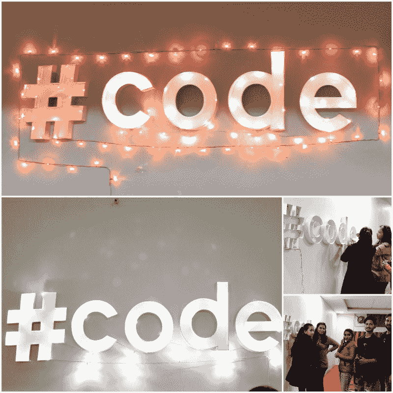

一点上下文，首先:Google Hash 代码是一个编程竞赛。您从 Google 获得一个任务，以及一些输入文件。你应该写一个程序来读取一个输入文件并产生一个输出文件来解决问题。最难的部分是:你必须在 4 小时内完成。

**在线资格赛**首次在线资格赛于 2019 年 2 月 28 日星期四举行，时间为世界协调时 17:30 至 21:30。

**参与理由:**

无论您是编程新手还是编程竞赛专家，都有很多理由参与哈希代码。我的导师林赛·陶博[说得好](https://blog.google/technology/developers/three-reasons-to-participate-in-hashcode/):

1.  **为赢而优化问题。** *就像谷歌工程师处理的问题一样，对于哈希代码问题，从来没有一个正确的答案。相反，每一轮比赛都被设计成一场“启发之战”——不完美的解决方案。有许多方法可以应对挑战，团队应该在整个过程中不断迭代他们的解决方案。熟悉过去的问题是最好的准备方式；使用散列码[存档](https://codingcompetitions.withgoogle.com/hashcode/archive?utm_medium=blog&utm_source=keyword&utm_campaign=reg_promo&src=Online/TOPs/HC)与你的团队进行一次(或两次)练习。*
2.  散列码是关于社区的。 *从两到四人的团队竞争到从[哈希码中心](https://codingcompetitions.withgoogle.com/hashcode/hubs?utm_medium=blog&utm_source=keyword&utm_campaign=reg_promo&src=Online/TOPs/HC)(你可以组织[的本地聚会](https://codingcompetitions.withgoogle.com/hashcode/hubs/organize?utm_medium=blog&utm_source=keyword&utm_campaign=reg_promo&src=Online/TOPs/HC))参与竞争，与其他哈希码编码者联系的机会无处不在。今年是 Hash Code 向全球开发者开放的第一年，我们很高兴看到这个社区继续发展。结识其他哈希编码者，找到队友，并了解所有最新的哈希代码。*
3.  谷歌的乐趣。 *哈希代码是一个窥见谷歌软件工程的机会，当我们的团队聚在一起解决具有挑战性的问题时，你可以打赌他们在做的时候会有一些乐趣。*
4.  **学而优则仕。** *如果问题被你解决了还是不行！通过学习新的东西，熟悉新的工具和方法，你总是会得到一些好处。不参与是学不到这些东西的，所以如果你尽了最大努力，那就恭喜你了。*

> 你永远不会输…要么你赢，要么你学习。

体验哈希代码的最佳方式是自己去发现它。？

以下是那天拍的一些照片！

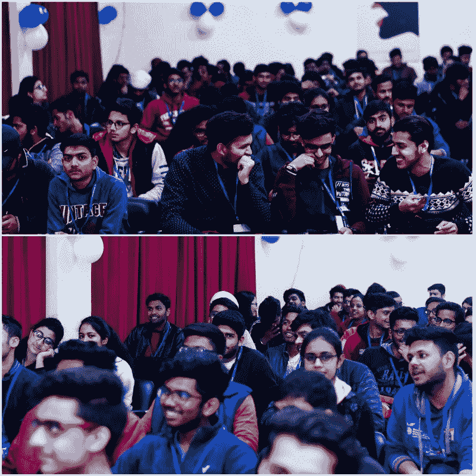

#### 以下是我想回答的一些问题:

1.  **我为什么选择在昌迪加尔大学组织一个中心？**

我选择在加州大学这里组织一个中心，是因为我觉得为人们提供一个聚在一起解决挑战性问题的机会是让他们发展技能和自我的最佳方式。Hub 给了你一个平台，让你可以展示你的编程天赋，同时也可以从别人那里学到一些东西。

**2。设置我的中心的过程是什么？**

有太多的事情要做，比如预订房间、实验室、获得我们大学的批准，以及确保 Wifi 已设置好。当时我预计大约有 400-500 人参加，但实际人数远远超过了这个数字...那天，我为与会者预定了 2 个研讨会大厅和 14 个计算机实验室，每个实验室有 36 台电脑。但是后来我又订了 4 个房间，所以我设法把所有的学生都安排在一个街区。获得房间过夜的许可是最困难的部分之一，但多亏了我的朋友们的支持，我才得以做到。

我们还在几周前开始宣传这项活动，以确保有尽可能多的参与者。真正的乐趣就在比赛开始前，我们用气球和海报装饰房间——幸运的是，一些志愿者提前来了，所以他们决定加入我们并提供帮助！

**3。我最喜欢托管中心的哪一部分？**

认识新朋友！这绝对是最精彩的部分。你可以感受到房间里的激情和兴奋。

学生来这里不仅是为了编码，也是为了成为世界级竞赛的一部分。

谢谢你们来到这里！

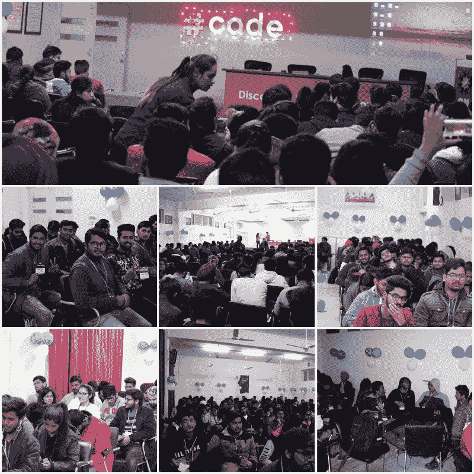

### **谷歌哈希码前 3 天**

#### **策划**

在印度，Google hashcode 比赛的时间是 2 月 28 日晚上 11 点。所以我必须找出学生们晚上是否有空，还有空间、装饰、无线网络、食物资源和安全。

最困难的任务是获得夜间活动的许可。3 天前，我给我的部门主管和 UIR 发了关于这件事的电子邮件，这样就不会发生任何问题。他们收到了我的邮件，并在同一天回复了我。系里帮助我安排了走读生的住宿，并获得了霍斯特勒到达我们中心的许可。然后，我得到了大学品牌部门的帮助，打印出了用于装饰和访客卡或参与者卡的谷歌可打印工具包。

我要感谢昌迪加尔大学的教授、院长和所有其他教职员工，他们允许我这么做，并在每一项安排上帮助我。

#### **促销**

我们在 hashcode 之前做了 2 天的推广，在学生门户上展示海报和传单。我们没有想到学生会有这样的参与——我的志愿者团队告诉我，对于夜间活动，我们可以假设参与者少于 400 人。

但是我知道我可以让 400 多名学生参与到这个活动中来。所以我创建了一个简单的演示来描述这个事件和参与的好处。我还创建了一个 Google 表单，这样我就可以获得参与者的信息。

#### **装修**

最有趣和引人注目的是装饰品。感谢我的朋友？@Deepika 负责装饰。她在这次活动中帮了我很多，我真的很感谢她的努力。

此外，@Shushant，@Anant @Aditinegi，@ayesha，@itika @priyanka @manish @simran 也在从事白板设计、气球和切割谷歌标牌印刷。

感谢你为这次活动付出的各种努力！

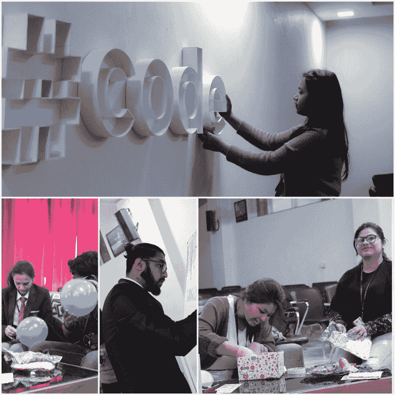

#### **志愿者团队**

我知道，对于这种活动，你需要自己的团队来帮助你安排各种事情，这样你就可以更专注于核心部分。

我已经有一个 150 名学生的团队，但这次我想把这个机会给新人。

我花了两天时间找到合适的志愿者，并给他们成长的机会。在此之前，早上与志愿者进行了一次会议，以便他们可以更舒适和灵活地与我在一起！

生活教会我的是，如果人们不尊重你、不信任你、不相信你，你就无法领导他们。你可以命令他们，但要让他们做到最好，你需要赢得他们的心。

人们不在乎你知道多少，直到他们知道你有多在乎他们，并能帮助他们解决问题。

创建这个志愿者团队，找到每一个志愿者都是值得的。感谢所有 80 多位帮助我完成这次活动的协调员。

特别感谢@avlin 和@ashish @jatin @akhil @kartik 和@karan 帮我安排布景。

我认为我能够通过引导他们正确的方向，使每个志愿者成为一个好的领导者。

> 领导者变得伟大不是因为他们的权力，而是因为他们有能力授权他人并发现自己的力量 —约翰·C·麦斯威尔

我就是这么做的！

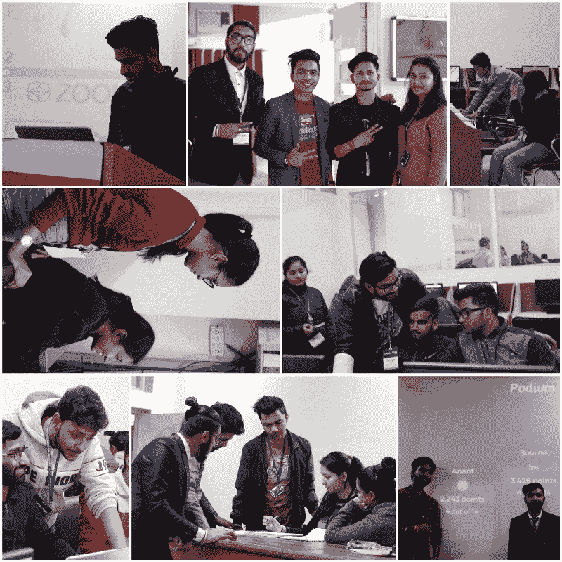

#### 【2019 年 2 月 28 日为

晚上 8:30 这就是人群？

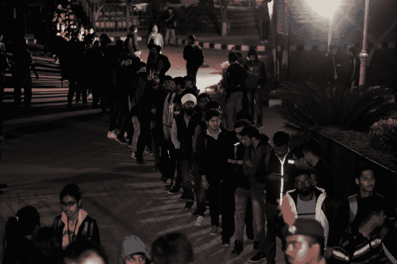

#### 【HashCode 线上资格赛前的 AMA 时段！

因此，在谷歌 HashCode 竞赛开始之前，我召开了一次会议，让学生们熟悉 HashCode 仪表板、积分和排名系统、问题的优化以及输入输出逻辑。我还谈到了除 hashcode 之外的很多东西，并与学生们分享了我的经验。

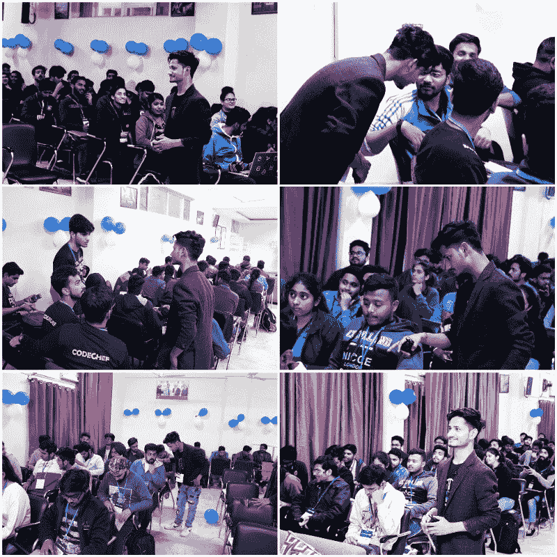

#### *问题和疑问*

我也回答了一些学生的问题。

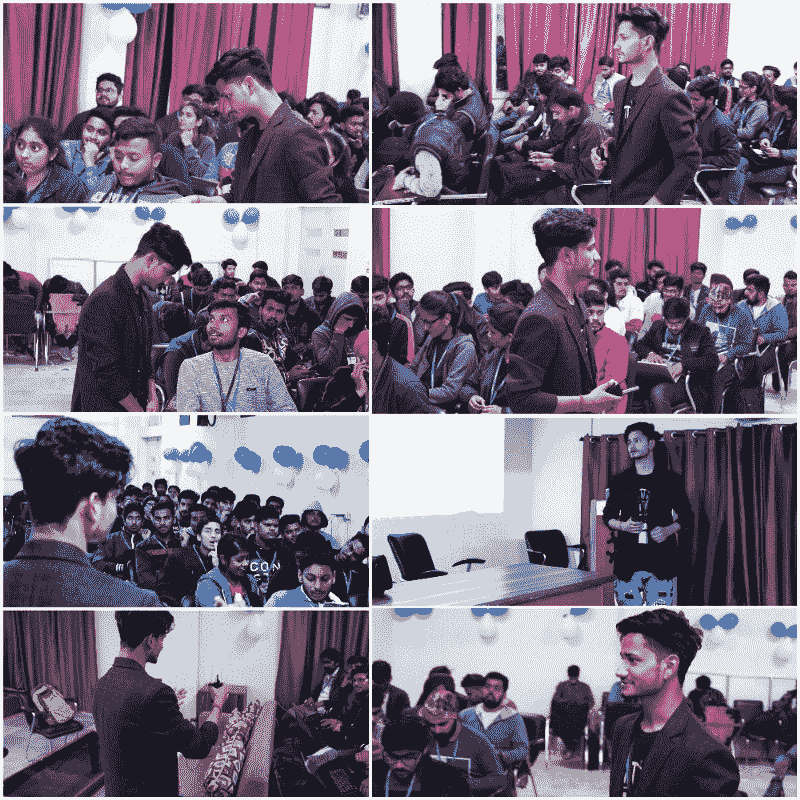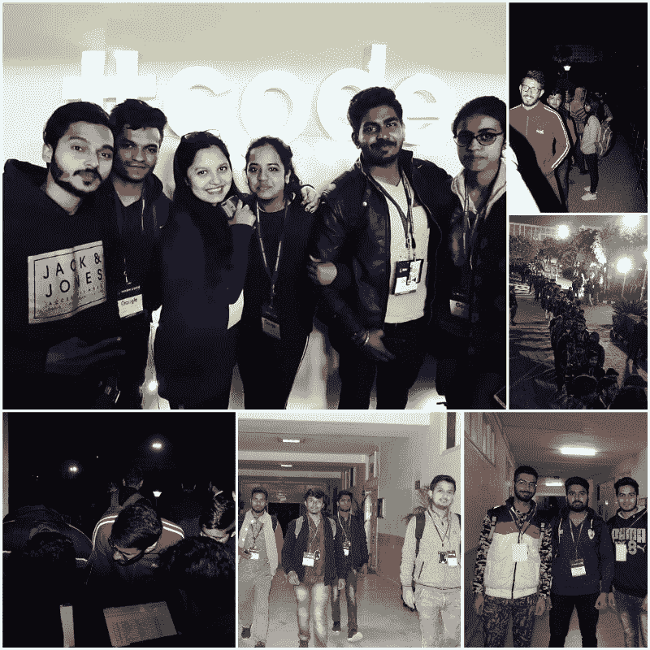

#### 【2019 年 3 月 1 日是

**比赛开始了！**

随着问题的出现，所有的编码人员都开始着手解决问题。所有的学生都忙于问题陈述。

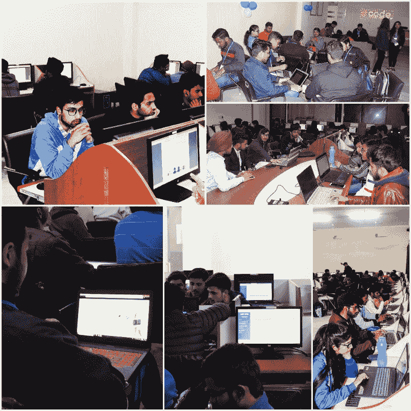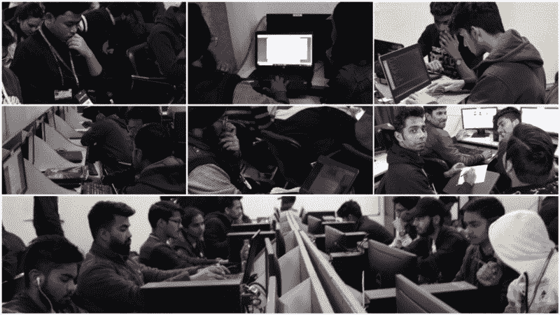

### 趣味|测验|音乐游戏|卡霍特

Hashcode 比赛结束后，我们组织了一些智力竞赛和音乐球类游戏，这样学生们就不会感到无聊，并与活动保持联系。重要的不仅是编码，还有享受当下。

谢谢@sahil 和[Nilansh Gupta](https://www.freecodecamp.org/news/google-hash-code-2019-chandigarh-university-hub-organized-by-neeraj-negi-923118fce083/undefined)——这些是我的朋友，他们在组织 Kahoot、音乐球游戏和 AR 游戏时与我在一起。我从学生那里得到了反馈，他们真的很喜欢这些游戏。比赛结束后，学生们开始拍照。

感谢@kashish、@himanngshu boro、@saurav 拍照！

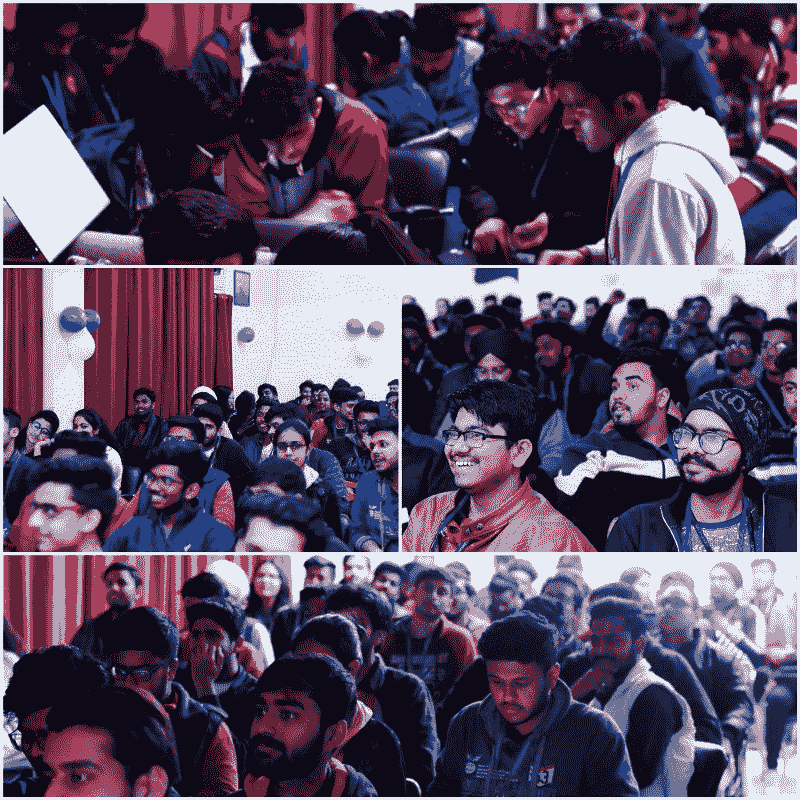

*卡豪特测验*

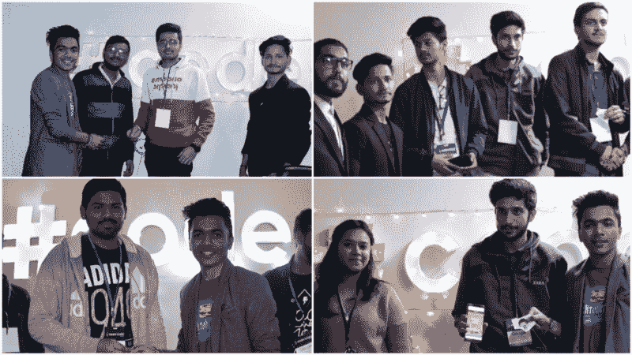

【Hashcode 比赛后的音乐游戏！

早上 5 点，学生们回到了他们的家。

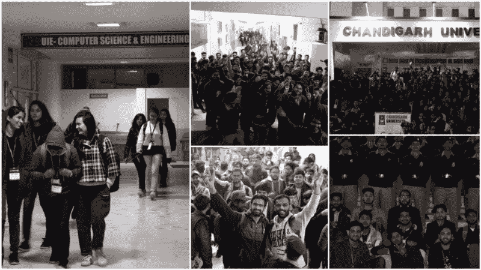

### HashCode 背后的志愿者团队

我认为，团队领导的主要责任是看到他人的潜力，帮助他们发挥他们自己都不知道的优势，给其他人成长的机会，并永远欣赏他们，即使这是他们的一个小胜利。

> 不做好人是不可能做好领导的！

尊重、善良、友善、支持、感激和积极是不需要任何代价的。

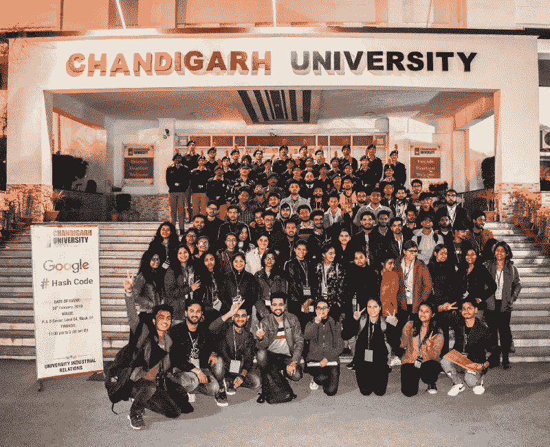

“我们不是一个团队，因为我们一起工作。我们是一个团队，因为我们互相尊重、信任和关心。”

这是我在第二天早上 6 点给志愿者的感谢留言！

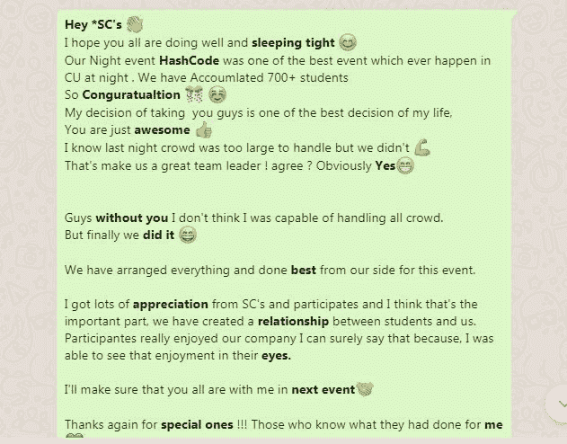

我从我的导师那里学到的是“*一个感受到被欣赏的人总是会比期望的做得更多。”*

### 哈希代码竞赛后的反馈和回应

我收到了来自不同平台的大约 300 多条关于 hashcode 事件的感谢信息。我想借此机会感谢所有与会者和协调员，他们和我一起参加了 Google Hashcode 2019。以后，我一定会再组织一次这样的活动。？

感谢@林赛·陶博对我的指导！

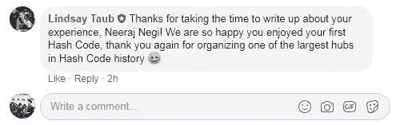

领导并不意味着胜利，而是带领其他人一起到达终点。同意吗？

高度赞赏评论和掌声！

在社交媒体上与我联系:

推特:[@ realnerajnegi](https://twitter.com/realneerajnegi)

LinkedIn:[https://www.linkedin.com/in/neerajnegideveloper/](https://www.linkedin.com/in/neerajnegideveloper/)
insta gram:[https://www.instagram.com/neerajnegi_nj/](https://www.instagram.com/neerajnegi_nj/)

关注我们的 Hashcode 页面:Hashcodenj 和#HashCodenj

[https://www.instagram.com/hashcodenj/](https://www.instagram.com/hashcodenj/)