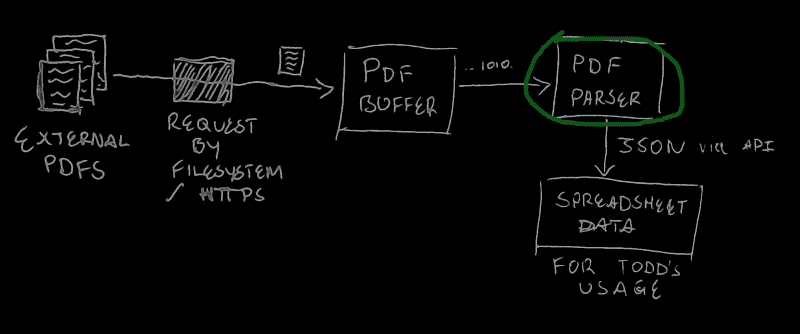
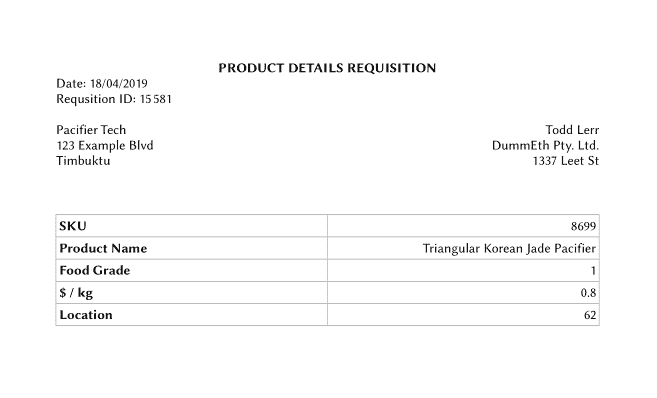
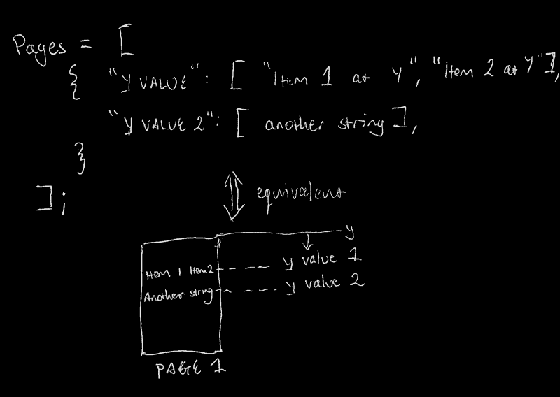
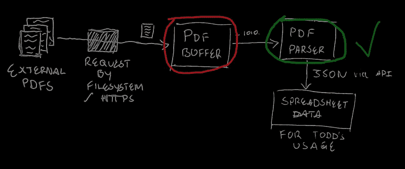
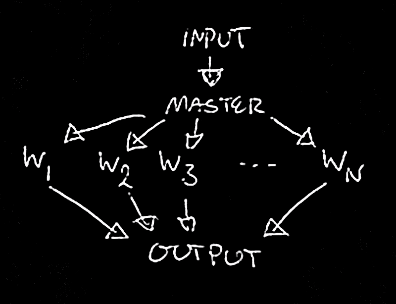

# 如何在 NodeJS 中大规模解析 pdf:做什么和不做什么

> 原文：<https://www.freecodecamp.org/news/how-to-parse-pdfs-at-scale-in-nodejs-what-to-do-and-what-not-to-do-541df9d2eec1/>

由汤姆

# 如何在 NodeJS 中大规模解析 pdf:做什么和不做什么

通过这篇文章，向程序架构迈进一步，并了解如何为 NodeJS 流的实际业务问题制定一个实用的解决方案。


Your stakeholder, after you save them countless hours poring over PDF files to get their data. (Source: GIPHY)

### 绕道:流体力学

软件最大的优势之一是我们可以开发抽象概念，这让我们能够以我们能够理解的方式推理代码和操作数据。流就是这样一个抽象类。

在简单的流体力学中，[流线](https://en.wikipedia.org/wiki/Streamlines,_streaklines,_and_pathlines#Streamlines)的概念对于推理流体粒子的运动方式以及在系统中不同点对它们施加的约束非常有用。

例如，假设你有一些均匀流过管道的水。在管道的中途，它分叉了。通常，水流会均匀地分流到每个分支。对于任何数量的分支或复杂的管道配置，工程师使用流线的抽象概念来推理水的属性，如流速。如果你问一个工程师，他假设通过每个分支的流量是多少，他会直觉地正确回答“一半”。这在数学上扩展成任意数量的流线。

流，从概念上讲，是编码什么流线太流体力学。我们可以通过将数据视为流程的一部分来推理任何给定点的数据。而不是担心如何存储之间的实现细节。有争议的是，你可以把它归纳为一些通用的管道概念，我们可以在学科之间使用。我想到了一个销售漏斗，但这是题外话，我们稍后会谈到它。最好的流的例子是 UNIX 管道，如果您还没有熟悉的话，您绝对必须熟悉它:

```
cat server.log | grep 400 | less
```

我们亲切地称`|`字为烟斗。基于它的功能，我们将一个程序的输出作为另一个程序的输入。有效地建立了一个管道。

(还有，看起来像管子。)

如果你像我一样，在这一点上想知道为什么这是必要的，问问你自己为什么我们在现实生活中使用[管道](https://en.wikipedia.org/wiki/Pipeline_transport)。从根本上说，它是一种消除处理点之间存储的结构。如果石油被泵出，我们就不需要担心储存成桶的石油。

用软件来解决这个问题。为管道数据编写代码的聪明的开发人员和工程师对它进行了设置，使它永远不会占用机器上太多的内存。上面的日志文件再大也不会挂终端。整个程序是一个处理流中无穷小的数据点的过程，而不是那些点的容器。日志文件从来不会一次加载到内存中，而是以可管理的部分加载。

我不想在这里重新发明轮子。既然我已经讲述了流的隐喻和使用它们的基本原理，Flavio Copes 有一篇很棒的博文讲述了它们是如何在 Node 中实现的。您需要花多长时间来介绍这些基础知识，当您准备好了，再回来，我们将讨论一个用例。

### 形势

现在你已经把这个工具放在你的工具箱里了，想象一下:

你正在工作，你的经理/法律/人力资源/你的客户/(在此插入利益相关方)向你提出了一个问题。他们花了太多时间研究结构化的 pdf。当然，一般情况下人们不会告诉你这种事。你会听到，“我花了 4 个小时做数据输入。”或者“我浏览价格表。”或者，“我填写了正确的表格，这样我们每个季度都能得到我们公司品牌的铅笔”。

不管是什么，如果他们的工作碰巧涉及到(a)结构化 PDF 文档的阅读和(b)结构化信息的大量使用。然后你就可以进来说，“嘿，我们也许可以自动完成这项工作，这样你就可以腾出时间去做其他事情了”。


Effortless speed. Your code is a fragrance, now say hello to your TV commercial. (Source: [Chris Peeters](https://www.pexels.com/@krizz59))

所以为了这篇文章，我们来想一个虚拟公司。在我来的地方，“假人”一词指的不是白痴就是婴儿的奶嘴。所以让我们想象一下这个制造奶嘴的假公司。当我们在做的时候，让我们跳过鲨鱼，说它们是 3D 打印的。该公司作为一家合乎道德的安抚奶嘴供应商，为那些自己买不起优质产品的穷人提供安抚奶嘴。

(我知道这听起来有多傻，请暂停你的怀疑。)

Todd 负责采购 DummEth 产品的印刷材料，并必须确保这些材料符合三个关键标准:

*   它们是食品级塑料，为了保护婴儿的健康，
*   它们很便宜，适合经济生产，而且
*   它们的来源尽可能接近，以支持该公司的营销文案，说明他们的供应链也是道德的，污染尽可能少。

### 该项目

所以更容易跟进，我已经建立了一个 [GitLab repo](https://gitlab.com/fourzerofour/pdf-parser-nodejs) 你可以克隆和使用。确保节点和 NPM 的安装也是最新的。

#### 基本架构:约束

现在，我们要做什么？让我们假设托德在电子表格方面工作得很好，就像许多办公室工作人员一样。对于托德来说，从谷壳中挑选出众所周知的 3D 打印小麦，对他来说，通过食品等级、每公斤价格和地点来衡量材料更容易。是时候设置一些项目约束了。

让我们假设一种材料的食品等级是从零到三。零表示加州禁止使用富含 BPA 的塑料。三是指通常使用的无污染材料，如低密度聚乙烯。这纯粹是为了简化我们的代码。实际上，我们必须以某种方式将这些材料的文字描述(例如:“LDPE”)映射到食品级。

我们可以假设每公斤的价格是由制造商给定的材料的属性。

位置，我们要简化一下，假设是一个简单的相对距离，直线距离。与之相反的是过度工程化的解决方案:使用一些 API(例如:Google Maps)来辨别给定材料到达 Todd 配送中心的大致行程距离。不管怎样，假设我们在 Todd 的 pdf 中给定了一个值(到 Todd 的公里数)。

此外，让我们考虑一下我们工作的环境。托德在一个充满活力的市场中有效地充当信息收集者。产品进进出出，它们的细节可能会改变。这意味着我们有任意数量的 pdf 可以随时更改，或者更恰当地说，可以随时更新。

因此，基于这些约束，我们可以最终找出我们希望我们的代码完成什么。如果你想测试你的设计能力，在这里停下来，考虑一下你将如何构建你的解决方案。它可能和我将要描述的不一样。这很好，只要你能为托德提供一个合理可行的解决方案，而且是你不会在事后拼命维护的东西。

#### 基础架构:解决方案

所以我们得到了任意数量的 pdf，以及一些如何解析它们的规则。我们可以这样做:

1.  设置一个可以从一些输入中读取的流对象。比如 HTTP 客户端请求 PDF 下载。或者我们编写的从文件系统的目录中读取 PDF 文件的模块。
2.  设置中间[缓冲](https://nodejs.org/api/buffer.html)。这就像餐馆里的服务员把一道完成的菜送到预定的顾客手中。每当一个完整的 PDF 被传递到流中时，我们将这些块刷新到缓冲区中，以便可以传输它。
3.  服务员(缓冲区)将食物(PDF 数据)交付给顾客(我们的解析功能)。客户可以随心所欲地使用它(转换成某种电子表格格式)。
4.  当客户(解析器)完成后，让服务员(缓冲人员)知道他们有空，可以处理新订单(pdf)。

你会注意到这个过程没有明确的终点。作为一家餐馆，我们的流缓冲区-解析器组合永远不会结束，当然，直到不再有数据——不再有订单——进来。

现在我知道还没有一点代码。这是至关重要的。在编写系统之前，能够对系统进行推理是很重要的。现在，即使有先验推理，我们也不会第一次就把所有事情都做对。东西总是在野外坏掉。bug 需要修复。

也就是说，在编写代码之前计划好代码是一种强大的克制和远见。如果你能把越来越复杂的系统简化成易于管理的部分和类比，你就能成倍地提高你的生产力，因为来自这些复杂性的认知压力会逐渐消失在精心设计的抽象中。

所以从整体来看，它看起来是这样的:



The initial concept of our program. It’s not going to look like this when it’s done, but the problem-solving process is just as important as the result. Circled in green: what we’re up to next.

### 相关性介绍

现在，作为免责声明，我应该补充一点，关于在代码中引入依赖关系，有很多想法。我很乐意在另一篇文章中讨论这个概念。与此同时，我只想说，我们希望快速完成工作(即:避免美国国家卫生研究院综合症(NIH syndrome)和避免第三方风险(T2)的愿望之间存在根本冲突。

将这个应用到我们的项目中，我选择将大部分的 PDF 处理卸载到 [*pdfreader*](https://www.npmjs.com/package/pdfreader) 模块。以下是几个原因:

*   它是最近发布的，这是回购是最新的好迹象。
*   它有一个依赖项——也就是说，它只是另一个模块的抽象——定期在 GitHub 上维护。仅此一点就是一个很好的迹象。此外，dependency，一个名为 *pdf2json* 的模块，拥有数百位明星，22 位贡献者，以及大量密切关注它的眼球。
*   维护者艾德里安·乔利在 GitHub 的问题跟踪系统中做了很好的记录，并积极回答用户和开发者的问题。
*   通过 NPM (6.4.1)进行审核时，未发现任何漏洞。

所以总的来说，包含它似乎是一个安全的依赖。

现在，该模块以一种相当简单的方式工作，尽管它的 README 没有明确描述其输出的结构。悬崖上写着:

1.  它公开了要实例化的`PdfReader`类
2.  这个实例有两种解析 PDF 的方法。它们返回相同的输出，不同之处仅在于输入:`PdfReader.parseFileItems`表示文件名，`PdfReader.parseBuffer`表示我们不想从文件系统中引用的数据。
3.  这些方法要求回调，每次`PdfReader`找到它表示的 PDF 项目时都会调用这个回调。有三种。首先是文件元数据，它总是第一项。其次是页面元数据。它充当要处理的文本项的坐标的回车符。最后是文本项，我们可以认为它是简单的对象/结构，具有文本属性，以及页面上的浮点 2D [AABB](https://stackoverflow.com/a/22512393) 坐标。
4.  由我们的回调函数将这些项处理成我们选择的数据结构，并处理任何抛出的错误。

下面是一个代码片段示例:

```
const { PdfReader } = require('pdfreader');
```

```
// Initialise the readerconst reader = new PdfReader();
```

```
// Read some arbitrarily defined bufferreader.parseBuffer(buffer, (err, item) =>; {
```

```
 if (err)    console.error(err);
```

```
 else if (!item)    /* pdfreader queues up the items in the PDF and passes them to     * the callback. When no item is passed, it's indicating that     * we're done reading the PDF. */    console.log('Done.');
```

```
 else if (item.file)    // File items only reference the PDF's file path.    console.log(`Parsing ${item.file && item.file.path || 'a buffer'}`)
```

```
 else if (item.page)    // Page items simply contain their page number.    console.log(`Reached page ${item.page}`);
```

```
 else if (item.text) {
```

```
 // Text items have a few more properties:    const itemAsString = [      item.text,      'x: ' + item.x,      'y: ' + item.y,      'w: ' + item.width,      'h: ' + item.height,    ].join('\n\t');
```

```
 console.log('Text Item: ', itemAsString);
```

```
 }
```

```
});
```

### 托德的 pdf

让我们回到托德的情况，只是为了提供一些背景。我们希望基于三个关键标准存储数据安抚器:

*   它们是食品级的，为了保护婴儿的健康，
*   他们的成本，经济的生产，和
*   他们与托德的距离，以支持该公司的营销文案，说明他们的供应链也是道德的，污染越少越好。

我已经硬编码了一个简单的脚本，它随机化了一些虚拟产品，你可以在这个项目的配套 repo 的 [/data](https://gitlab.com/fourzerofour/pdf-parser-nodejs/tree/master/data) 目录中找到它。该脚本将随机化的数据写入 JSON 文件。

里面还有一个模板文档。如果你熟悉像[手柄](https://handlebarsjs.com/)这样的模板引擎，你就会明白这一点。有一些在线服务——或者如果你喜欢冒险，你可以推出自己的服务——获取 JSON 数据并填写模板，然后以 PDF 格式返回给你。也许为了完整起见，我们可以在另一个项目中尝试一下。总之:我已经使用这样一个服务来生成我们将要解析的虚拟 pdf。

下面是其中一个的样子(多余的空格被去掉了):



我们希望从这个 PDF 中获得一些 JSON，它为我们提供了:

*   出于记账目的，请购单 ID 和日期，
*   奶嘴的 SKU，用于唯一识别，以及
*   安抚奶嘴的属性(名称、食品等级、单价和距离)，因此 Todd 实际上可以在工作中使用它们。

我们如何做到这一点？

### 读取数据

首先，让我们设置从这些 PDF 中读取数据的函数，并将 *pdfreader* 的 PDF 项提取到一个可用的数据结构中。现在，让我们用一个数组来表示文档。数组中的每一项都是一个对象，表示页面上该对象索引处所有文本元素的集合。page 对象中的每个属性都有一个 y 值作为其键，还有一个在 y 值处找到的文本项数组作为其值。下面是图表，这样更容易理解:



[/parser/index.js](https://gitlab.com/fourzerofour/pdf-parser-nodejs/blob/master/parser/index.js) 中的`readPDFPages`函数处理这个问题，类似于上面编写的示例代码:

```
/* Accepts a buffer (e.g.: from fs.readFile), and parses * it as a PDF, giving back a usable data structure for * application-specific, second-level parsing. */function readPDFPages (buffer) {  const reader = new PdfReader();
```

```
 // We're returning a Promise here, as the PDF reading  // operation is asynchronous.  return new Promise((resolve, reject) =>; {
```

```
 // Each item in this array represents a page in the PDF    let pages = [];
```

```
 reader.parseBuffer(buffer, (err, item) =>; {
```

```
 if (err)        // If we've got a problem, eject!        reject(err)
```

```
 else if (!item)        // If we're out of items, resolve with the data structure        resolve(pages);
```

```
 else if (item.page)        // If the parser's reached a new page, it's time to        // work on the next page object in our pages array.        pages.push({});
```

```
 else if (item.text) {
```

```
 // If we have NOT got a new page item, then we need        // to either retrieve or create a new "row" array        // to represent the collection of text items at our        // current Y position, which will be this item's Y        // position.
```

```
 // Hence, this line reads as,        // "Either retrieve the row array for our current page,        //  at our current Y position, or make a new one"        const row = pages[pages.length-1][item.y] || [];
```

```
 // Add the item to the reference container (i.e.: the row)        row.push(item.text);
```

```
 // Include the container in the current page        pages[pages.length-1][item.y] = row;
```

```
 }
```

```
 });  });
```

```
}
```

现在将一个 PDF 缓冲区传递给这个函数，我们将得到一些有组织的数据。下面是我从测试运行中得到的结果，并将其打印到 JSON:

```
[ { '3.473': [ 'PRODUCT DETAILS REQUISITION' ],    '4.329': [ 'Date: 23/05/2019' ],    '5.185': [ 'Requsition ID: 298831' ],    '6.898': [ 'Pacifier Tech', 'Todd Lerr' ],    '7.754': [ '123 Example Blvd', 'DummEth Pty. Ltd.' ],    '8.61': [ 'Timbuktu', '1337 Leet St' ],    '12.235': [ 'SKU', '6308005' ],    '13.466': [ 'Product Name', 'Square Lemon Qartz Pacifier' ],    '14.698': [ 'Food Grade', '3' ],    '15.928999999999998': [ '$ / kg', '1.29' ],    '17.16': [ 'Location', '55' ] } ]
```

如果你仔细看，你会注意到在原始 PDF 中有一个拼写错误。“申请”被拼错为“请求”。我们的解析器的美妙之处在于，我们并不特别关心输入文档中的这些错误。只要它们的结构正确，我们就可以准确地从中提取数据。

现在我们只需要把它组织成更有用的东西(就像我们通过 API 公开它一样)。我们要找的结构是这样的:

```
{  reqID: '000000',  date: 'DD/MM/YYYY', // Or something else based on geography  sku: '000000',  name: 'Some String We Have Trimmed',  foodGrade: 'X',  unitPrice: 'D.CC',  // D for Dollars, C for Cents  location: 'XX',}
```

#### 题外话:数据完整性

为什么我们把数字作为字符串包含进来？是基于解析的风险。假设我们将所有的数字都强制转换为字符串:

单价和位置都没问题——毕竟它们应该是可数的数字。

食品级，对于这个非常有限的项目来说，*技术上*是安全的。当我们强制它时，没有数据丢失——但是如果它是一个有效的分类器，比如枚举，那么它最好保持为一个字符串。

但是，如果将征用 ID 和 SKU 强制转换为字符串，可能会丢失重要数据。如果给定申请的 ID 以三个零开始，我们将其强制转换为一个数字，那么，我们就丢失了这些零，我们就混淆了数据。

因此，因为我们希望在读取 pdf 时保持数据的完整性，所以我们将所有内容都保留为字符串。如果应用程序代码希望将一些字段转换成数字，使它们可用于算术或统计运算，那么我们将让强制发生在该层。在这里，我们只是希望能够一致和准确地解析 pdf。

### 重构数据

现在我们已经得到了托德的信息，我们只需要以一种可用的方式组织它。我们可以使用各种数组和对象操作函数，这里 [MDN](https://developer.mozilla.org/en-US/docs/Web/JavaScript/Reference) 是你的朋友。

这是每个人都有自己偏好的一步。有些人更喜欢只完成工作并最大限度减少开发时间的方法。其他人更喜欢寻找工作的最佳算法(例如:减少迭代时间)。这是一个很好的练习，看看你是否能想出这样做的方法，并与我得到的进行比较。我希望看到更好、更简单、更快，甚至只是不同的方式来实现同一个目标。

总之，我是这样做的: [/parser/index.js](https://gitlab.com/fourzerofour/pdf-parser-nodejs/blob/master/parser/index.js) 中的`parseToddPDF`函数。

```
function parseToddPDF (pages) {
```

```
 const page = pages[0]; // We know there's only going to be one page
```

```
 // Declarative map of PDF data that we expect, based on Todd's structure  const fields = {    // "We expect the reqID field to be on the row at 5.185, and the    //  first item in that array"    reqID: { row: '5.185', index: 0 },    date: { row: '4.329', index: 0 },    sku: { row: '12.235', index: 1 },    name: { row: '13.466', index: 1 },    foodGrade: { row: '14.698', index: 1 },    unitPrice: { row: '15.928999999999998', index: 1 },    location: { row: '17.16', index: 1 },  };
```

```
 const data = {};
```

```
 // Assign the page data to an object we can return, as per  // our fields specification  Object.keys(fields)    .forEach((key) =>; {
```

```
 const field = fields[key];      const val = page[field.row][field.index];
```

```
 // We don't want to lose leading zeros here, and can trust      // any application / data handling to worry about that. This is      // why we don't coerce to Number.      data[key] = val;
```

```
 });
```

```
 // Manually fixing up some text fields so they're usable  data.reqID = data.reqID.slice('Requsition ID: '.length);  data.date = data.date.slice('Date: '.length);
```

```
 return data;
```

```
}
```

这里的肉和土豆在`forEach`循环中，以及我们如何使用它。在之前检索了每个文本项的 Y 位置之后，很容易将每个字段指定为 pages 对象中的一个位置。有效地提供了一个可遵循的地图。

然后，我们所要做的就是声明一个数据对象来输出，遍历我们指定的每个字段，按照我们的规范执行，并将我们在最后找到的值赋给我们的数据对象。

在用一些一行程序整理了一些字符串字段之后，我们可以返回数据对象，然后我们就可以开始比赛了。它看起来是这样的:

```
{ reqID: '298831',  date: '23/05/2019',  sku: '6308005',  name: 'Square Lemon Qartz Pacifier',  foodGrade: '3',  unitPrice: '1.29',  location: '55' }
```

### 把所有的放在一起



现在，我们将继续为这个解析模块构建一些并发性，以便我们可以大规模地操作，并认识到这样做的一些重要障碍。上图有助于理解解析逻辑的上下文。这对理解我们如何并行化它没有太大帮助。我们可以做得更好:



我知道这很琐碎，而且对于我们实际使用来说太教科书式的一般化了，但是，嘿，这是一个需要形式化的基本概念。

现在，我们首先需要考虑如何处理程序的输入和输出，这实质上是包装解析逻辑，然后在解析器工作进程之间分发。这里我们可以问很多问题，也有很多解决方案:

*   它会是一个命令行应用程序吗？
*   它会是一个具有一组 API 端点的一致的服务器吗？这有它自己的一系列问题——例如 REST 或 GraphQL？
*   也许它只是更广泛的代码库中的一个骨架模块——例如，如果我们对一套二进制文档进行一般化的解析，并希望将并发模型与特定的源文件类型和解析实现分开，那会怎么样？

为了简单起见，我将把解析逻辑包装在命令行实用程序中。这意味着是时候做一些假设了:

*   它期望文件路径作为输入吗？它们是相对的还是绝对的？
*   或者，它是否期望连接的 PDF 数据通过管道传入？
*   它会把数据输出到一个文件吗？因为如果是，那么我们必须提供这个选项作为参数，让用户指定…

### 处理命令行输入

同样，尽可能保持简单:我已经选择程序期望一个文件路径列表，或者作为单独的命令行参数:

```
node index file-1.pdf file-2.pdf … file-n.pdf
```

或者以换行分隔的文件路径列表的形式传送到标准输入:

```
# read lines from a text file with all our pathscat files-to-parse.txt | node index# or perhaps just list them from a directoryfind ./data -name “*.pdf” | node index
```

这允许节点进程以它认为合适的任何方式操纵这些路径的顺序，这允许我们在以后扩展处理代码。为此，我们将读取文件路径列表，无论它们是以何种方式提供的，并将它们按任意数量划分到子列表中。下面是代码，[中的`getTerminalInput`方法。/input/index.js](https://gitlab.com/fourzerofour/pdf-parser-nodejs/blob/master/input/index.js) :

```
function getTerminalInput (subArrays) {
```

```
 return new Promise((resolve, reject) =>; {
```

```
 const output = [];      if (process.stdin.isTTY) {
```

```
 const input = process.argv.slice(2);
```

```
 const len = Math.min(subArrays, Math.ceil(input.length / subArrays));
```

```
 while (input.length) {        output.push(input.splice(0, len));      }
```

```
 resolve(output);
```

```
 } else {          let input = '';      process.stdin.setEncoding('utf-8');
```

```
 process.stdin.on('readable', () => {        let chunk;        while (chunk = process.stdin.read())          input += chunk;      });
```

```
 process.stdin.on('end', () => {        input = input.trim().split('\n');
```

```
 const len = Math.min(input.length, Math.ceil(input.length / subArrays));
```

```
 while (input.length) {          output.push(input.splice(0, len));        }
```

```
 resolve(output);      })        }      });
```

```
}
```

为什么要分名单？假设您在消费级硬件上有一个 8 核 CPU，需要解析 500 个 pdf 文件。

不幸的是，尽管 Node 由于其事件循环而能够出色地处理异步代码，但它只能在一个线程上运行。要处理这 500 个 pdf，如果您没有运行多线程(即:多进程)代码，您只使用了八分之一的处理能力。假设内存效率不成问题，通过利用 Node 的内置并行模块，您可以将数据处理速度提高八倍。

将我们的输入分成几块让我们可以做到这一点。

顺便说一句，这本质上是一个原始的负载平衡器，并且明确假设通过解析每个 PDF 呈现的工作负载是可互换的。也就是说，pdf 具有相同的大小和相同的结构。

这显然是一个微不足道的例子，特别是因为我们没有考虑工作进程中的错误处理以及哪个工作进程当前可以处理新的负载。在我们已经建立了一个 API 服务器来处理输入解析请求的情况下，我们必须考虑这些额外的需求。

### 聚集我们的代码

既然我们已经将输入拆分成了可管理的工作负载，不可否认是以一种人为的方式——我希望以后能重构它——让我们来看看如何对它进行集群化。所以 Node 有两个独立的模块来设置并行代码。

我们将要使用的模块是[集群](https://nodejs.org/api/cluster.html)模块，它基本上允许节点进程生成自身的副本，并在它们之间平衡处理。

这是在 [child_process](https://nodejs.org/api/child_process.html) 模块的基础上构建的，该模块与并行化节点程序本身的耦合度较低，允许您生成其他进程，如 shell 程序或另一个可执行二进制文件，并使用标准输入、输出等与它们进行交互。

我*强烈*推荐通读每个模块的 API 文档，因为它们写得非常精彩，即使你像我一样，觉得毫无目的的手动阅读很无聊，完全是在忙碌地工作，至少熟悉每个模块的介绍将有助于你在主题中立足，并扩展你对节点生态系统的知识。

所以让我们浏览一下代码。这是散装的:

```
const cluster = require('cluster');const numCPUs = require('os').cpus().length;
```

```
const { getTerminalInput } = require('./input');
```

```
(async function main () {
```

```
 if (cluster.isMaster) {
```

```
 const workerData = await getTerminalInput(numCPUs);
```

```
 for (let i = 0; i < workerData.length; i++) {
```

```
 const worker = cluster.fork();      const params = { filenames: workerData[i] };
```

```
 worker.send(params);
```

```
 }
```

```
 } else {
```

```
 require('./worker');
```

```
 }
```

```
})();
```

所以我们的依赖关系非常简单。首先，有如上所述的集群模块。第二，我们需要 [os](https://nodejs.org/api/os.html) 模块的明确目的是计算出我们的机器上有多少 CPU 内核——这是划分我们工作负载的一个基本参数。最后，还有我们的输入处理功能，为了完整起见，我把它外包给了另一个文件。

现在主要的方法其实相当简单。事实上，我们可以把它分解成几个步骤:

1.  如果我们是主进程，那么将发送给我们的输入按照这台机器的 CPU 核心数平均分配
2.  对于每个 worker-to-be 的负载，通过`cluster.fork`生成一个 worker，并设置一个对象，我们可以通过[cluster]模块的进程间 RPC 消息通道将该对象发送给它，并将该死的东西发送给它。
3.  如果我们实际上不是主模块，那么我们必须是工人——只需运行我们工人文件中的代码，然后就到此为止。

这里没有什么疯狂的事情发生，它让我们专注于真正的提升，即弄清楚工人将如何使用我们给它的文件名列表。

### 消息传递、异步和流，营养膳食的所有元素

首先，如上所述，让我转储代码供您参考。相信我，先浏览一遍会让你跳过任何你认为无关紧要的解释。

```
const Bufferer = require('../bufferer');const Parser = require('../parser');const { createReadStream } = require('fs');
```

```
process.on('message', async (options) =>; {
```

```
 const { filenames } = options;  const parser = new Parser();
```

```
 const parseAndLog = async (buf) => console.log(await parser.parse(buf) + ',');
```

```
 const parsingQueue = filenames.reduce(async (result, filename) =>; {
```

```
 await result;
```

```
 return new Promise((resolve, reject) =>; {
```

```
 const reader = createReadStream(filename);      const bufferer = new Bufferer({ onEnd: parseAndLog });
```

```
 reader        .pipe(bufferer)        .once('finish', resolve)        .once('error', reject)        });    }, true);
```

```
 try {    await parsingQueue;    process.exit(0);  } catch (err) {    console.error(err);    process.exit(1);  }
```

```
});
```

现在这里有一些肮脏的黑客，所以如果你是外行的话要小心(只是开玩笑)。让我们先看看发生了什么:

第一步是要求所有必要的成分。请注意，这是基于代码本身的功能。我只想说，我们将使用一个自定义的可写流，我亲切地称之为 Bufferer，它是我们上次解析逻辑的包装器，也有复杂的名称，Parser，以及来自 [fs](https://nodejs.org/api/fs.html) 模块的可靠的 createReadStream。

神奇的事情发生了。您会注意到，函数中实际上没有包装任何东西。整个工作者代码只是在等待一个消息到达进程——来自它的主人的消息和它当天必须做的工作。原谅中世纪的语言。

所以我们首先可以看到它是异步的。首先，我们从消息本身提取文件名——如果这是生产代码，我会在这里验证它们。实际上，见鬼，我早就在我们的输入处理代码中验证它们了。然后我们实例化我们的解析对象——整个过程只有一个——这样我们就可以用一组方法解析多个缓冲区。我的一个担心是它在内部管理内存，回想起来，这是一件很好的事情。

然后有一个简单的包装器，`parseAndLog`围绕解析，它记录 JSON 化的 PDF 缓冲区，并在缓冲区后面附加一个逗号，只是为了使连接解析多个 PDF 的结果变得更容易。


Your worker, primed and ready for a date with destiny.

最后是问题的核心，异步队列。让我解释一下:

这个工人收到了它的文件名列表。对于每个文件名(或者路径)，我们需要通过文件系统打开一个可读的流，这样我们就可以获得 PDF 数据。然后，我们需要生成我们的 Bufferer(我们的服务员，遵循前面的餐馆类比)，这样我们就可以将数据传输到我们的解析器。

缓冲器是定制的。它真正做的只是在接收到所有需要的数据时接受一个函数进行调用——这里我们只是要求它解析并记录这些数据。

所以，现在我们有了所有的片段，我们只需要把它们连接起来:

1.  可读流 PDF 文件，通过管道传输到缓冲区
2.  Bufferer 完成并调用我们的工人级`parseAndLog`方法

整个过程被包装在一个承诺中，承诺本身被返回给它所在的 reduce 函数。解决后，归约操作将继续。

这种异步队列实际上是一种非常有用的模式，所以我将在下一篇文章中更详细地介绍它，这篇文章可能比前几篇文章更简短。

无论如何，剩下的代码只是基于错误处理来结束这个过程。同样，如果这是生产代码，您可以打赌这里会有更健壮的日志记录和错误处理，但是作为概念验证，这看起来没问题。

### 所以它是有效的，但是有用吗？

所以你有它。这是一个漫长的旅程，当然也是可行的，但是像任何代码一样，回顾一下它的优点和缺点是很重要的。我马上想到:

*   溪流必须堆积在缓冲区。不幸的是，这违背了使用流的目的，内存效率也因此受到影响。这是与 *pdfreader* 模块配合使用的必要胶带。我很想看看是否有一种方法可以流式传输 PDF 数据，并在更细粒度的层次上解析它。尤其是如果模块化的、功能性的解析逻辑仍然可以应用于它的话。
*   在这个婴儿阶段，解析逻辑也非常脆弱。试想一下，如果我有一个比一页还长的文档呢？一堆假设飞出窗外，使流动 PDF 数据的需求更加强烈。
*   最后，看看我们如何利用日志记录和 API 端点来构建这一功能，并向公众提供，这将是一件很棒的事情——根据其使用的环境，可以收费，也可以免费。

如果你有任何具体的批评或担心，我也很乐意听到，因为发现代码中的弱点是修复它们的第一步。而且，如果你知道任何更好的方法来同时流式传输和解析 pdf，请告诉我，这样我就可以把它留在这里，让所有阅读这篇文章的人来寻找答案。不管怎样——或者出于任何其他目的——给我发一封[电子邮件](mailto:tom@fourzerofour.pw)或者在 [Reddit](https://www.reddit.com/u/_fourzerofour) 上取得联系。