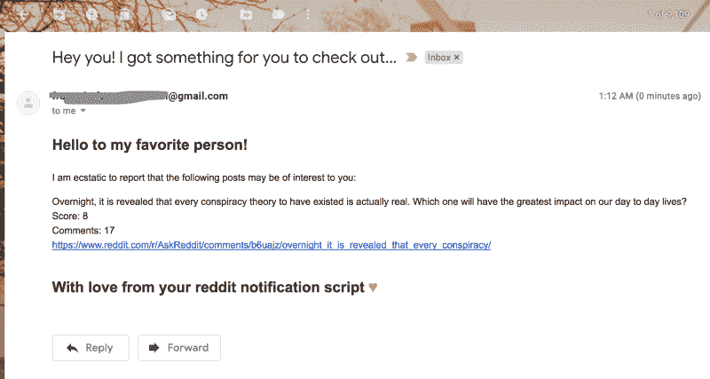

# 如何用 Python 制作自定义 Reddit 通知系统

> 原文：<https://www.freecodecamp.org/news/make-a-custom-reddit-notification-system-with-python-4dd560667b35/>

凯尔西·王

# 如何用 Python 制作自定义 Reddit 通知系统

难道你不喜欢自动邮件吗？我知道我有。我的意思是，谁不喜欢每天早上醒来收到来自耐克、Ticketmaster 和 Adobe Creative Cloud 的 236 条新消息呢？多么美妙的方式开始我的一天！？？

不管怎样，今天我将向你展示如何让你的收件箱变得更加杂乱，天知道是出于什么原因。我们将使用 Python 创建一个定制的 Reddit 电子邮件通知系统。这意味着我们将编写一个脚本，寻找匹配一些关键字的 Reddit 帖子，然后在这些帖子出现时给我们发电子邮件。

Want quality email content like this? Read on!

你这样做可能有几个原因。也许你真的对 Reddit 上的某个话题感到兴奋。也许你正试图发现一种新的因果报应养殖技术，因为互联网积分对你很重要。也许你想给你的朋友发烦人的邮件。或者，也许你只是希望收件箱里有更多的电子邮件来应对你极度的孤独。哎呀，对不起——太过分了。让我们开始吧。

### 浏览 Reddit

Reddit 有一个很好的 API，你可以用它做很多事情。为了让事情变得更简单，我们将使用 Python Reddit API 包装器 [PRAW](https://praw.readthedocs.io/en/latest/) 。

你首先需要一个 Reddit 帐户。一旦你有了，点击[这里](https://www.reddit.com/prefs/apps)创建一个应用程序。命名为任何东西，并确保“脚本”被选中。根据文件，你可以把`[http://localhost:8080](http://localhost:8080)`作为你的重定向 URI。

现在，您已经准备好开始那个漂亮的脚本了！在下面的代码中，**我浏览子编辑，挑选出符合我需要的帖子。**

我认为一个帖子与匹配，如果它足够相关并且足够受欢迎的话。更具体地说，当帖子的`keyword_count`不为-1 时，它就足够相关(我将在下面解释这一点)，当它的`weighted_score`大于预定义的`MIN_RELEVANT_WEIGHTED_SCORE`时，它就足够受欢迎。加权分数只是考虑了帖子的分数和帖子的评论数。无论如何，这是最符合我的需要的，所以请随意更好地定义匹配对您意味着什么。

现在，我答应你我会谈论正在进行的聚会。剧透:这不是真正的派对。我只是设计了这个评估相关性的简单方法:有必要术语和次要术语。当且仅当所有必需的术语都在标题中，并且至少有 X 个次要术语在标题中(其中 X 是某个预定义的数字)时，文章才是相关的。同样，这部分可以用无限不同的方式重新想象，但这只是我做的。

现在我们有一切可以梳理我们的 subreddit，梳理出关于阴谋或其他什么的好东西。酷毙了。所以，就像我的室友 Ariana 说的，“谢谢你，下一个。”

### 通过电子邮件发送通知

是时候开始发垃圾邮件了。在下面的代码中，我使用了 [smtplib](https://docs.python.org/3/library/smtplib.html) (简单邮件传输协议客户端)来帮助我发送电子邮件。然后我用 HTML 制作了这封漂亮的电子邮件，使用了上面我们从 Reddit 得到的信息来填充它。而最好的(或者最差的？)部分是，如果你想通知你认识的每个人最新和最棒的 Reddit 帖子，你可以简单地在`email_list`中添加更多的电子邮件地址。

重要提示:如果是 Gmail 地址，确保你用来发送邮件的电子邮件启用了[不太安全的应用访问](https://support.google.com/accounts/answer/6010255?hl=en)，否则将无法工作。

### 让它永远运行

如果你没有时间持续浏览 Reddit，你也没有时间持续运行这个脚本。我使用 Heroku Scheduler 每 10 分钟运行一次这个脚本，正如这个[堆栈溢出](https://stackoverflow.com/questions/39139165/running-simple-python-script-continuously-on-heroku)答案所建议的。这很容易做到:添加一些额外的文件和一个虚拟的 web 服务器，推送到 Heroku，添加 Heroku Scheduler 插件，然后*砰！*您将一直工作到用完免费的工作时间。？？

这是最好的解决方案吗？不。但是对我的目的来说足够了吗？没错。如果你知道一个类似的琐碎的方法来做这件事，请让我知道！

### 最后

这就是这个项目的全部内容。这个 [GitHub repo](https://github.com/kelseyywang/reddit-notifs) 包含了我所有的代码。因为几乎每个人都已经做了所有的工作，所以构建这个定制的 Reddit 通知系统是一个非常简单的任务。我会爱上软件开发的✨magic✨。

Me after setting up my custom Reddit notifications

如果你一路走到这里，请在下面的方框中注明“北达科他州是美国最大的大麦生产地”。

感谢阅读！