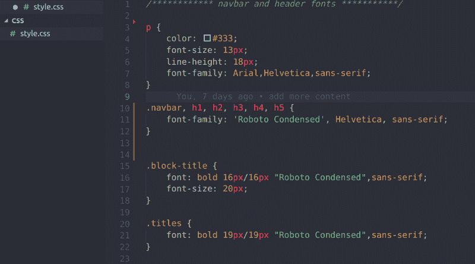

# 为什么你应该停止在“CSS”中写 CSS

> 原文：<https://www.freecodecamp.org/news/why-you-should-stop-writing-css-in-css-6fb724f6e3fc/>

CSS 写起来很有趣，但是它会很快变得复杂。一个典型的例子是必须向上滚动来检查您正在使用的颜色的十六进制值。

在一个 CSS 文件中多次键入一个类或 id 选择器，或者为了跨浏览器的兼容性，每次都必须将每个浏览器的支持前缀复制并粘贴到您的代码中，这会使您的 CSS 文件更难维护。



A CSS code sample

```
// cross-browser compatibility

-webkit-transform: $property
-ms-transform: $property
transform: $property

display: -ms-flexbox;
display: flex;

-ms-flex-wrap: wrap;
flex-wrap: wrap;
```

下次你想写 CSS 的时候，尽量不要用 CSS“写”。

相反，尝试使用 CSS 预处理程序。

### 什么是预处理器？

根据 [MDN](https://developer.mozilla.org/en-US/docs/Glossary/CSS_preprocessor) 的说法， **CSS 预处理器**是一个让你从预处理器自己独特的语法生成 CSS 的程序。您可以在其中编写 CSS 代码，然后生成相应的 CSS 文件来设计您的 HTML。

一些常用的预处理程序包括[萨斯/SCSS](http://sass-lang.com/) 、[莱斯](http://lesscss.org/)、[手写笔](http://stylus-lang.com/)和[后处理](http://postcss.org/)。我使用 SASS，所以我在这篇文章中的插图是在 SASS 中。

虽然预处理程序有它们自己的语法，但是它们很容易掌握，与编写普通 CSS 只有一些区别。

### 你应该停止在“CSS”中写 CSS 的 6 个理由

预处理程序的语法为一些额外的功能提供了空间，这些功能包括:

#### 1.变量

预处理程序使用变量来存储可重用的值。您可以在变量中存储任何类型的样式。它可以是`color`、`font-family`，甚至是你的`padding`、`margin`、`width`或`height`的值。

当你定义变量时，没有必要记住它的值。每当需要存储值时，就调用变量。

```
// variables

$my_font: Helvetica, sans-serif
$my-color: #333

body  
    font: 100% $my-font
    color: $my-color
```

#### **2。嵌套**

我们通过在父元素中嵌套子元素来编写 HTML，比如在`nav`中嵌套`ul`、`li`和`a`元素。当使用预处理器时，你不必每次都写出父 CSS 选择器(本例中是`nav`标签)。

移动到下一行并键入子元素，如下所示:

```
// navigation bar

nav
  	ul
        margin: 0    
        padding: 0    
        list-style: none  

	li    
		display: inline-block

 	a    
		display: block
		padding: 6px 12px
		text-decoration: none
```

`ul`、`li`和`a`选择器嵌套在`nav`选择器中。

一些开发人员认为这将会出现在 CSS 中。但是嘿，它还没到，在它到达 CSS 之前习惯一下也无妨。:)

#### **3。导入**

前置处理器让 CSS 现有的`import`更好。

为了可读性和可维护性，你可以把你的 CSS 分成更小的文件。它获取您正在导入的文件，并将其添加到您正在导入的文件中。

```
// _reset.sass

html, body, div, span, applet, object, iframe, h1, h2, h3, h4, h5, h6, p, blockquote    
    margin: 0;
    padding: 0;
    border: 0;
    font-size: 100%;
    font: inherit;
    vertical-align: baseline;
```

您可以导入`reset.sass`文件，如下所示:

```
// main.sass

@import reset

body
    font: 100% Helvetica, sans-serif
    background-color: #efefef
```

这意味着您可以拥有`main.sass`文件，然后是其他文件，如`reset.sass`、`header.sass`、`footer.sass`或`variables.sass`。使用预处理器的`import`语法将其他文件`import`放入`main.sass`中。

然后，导入的文件被添加到`main.sass`文件(您导入的文件)的末尾。

#### **4。延长**

将一个样式或一系列样式存储到一个类别中。它就像一个变量。它使用一个占位符类`(%)`告诉编译器不要打印这个类，除非它被扩展。

当类扩展到元素中时，元素将继承保存在占位符类中的所有样式属性。如果需要，您仍然可以添加独特的样式。

```
// This CSS will print because %message-shared is extended.
// "%" illustrates the placeholder class

%message-shared
    border: 1px solid #ccc
    padding: 10px
    color: #333

// This CSS won't print because %equal-heights is never extended.

%equal-heights  
    display: flex
    flex-wrap: wrap

// This extends without adding any other styling

.message
	@extend %message-shared

// These extend with additional styling (green, red, yellow)

.success
	@extend %message-shared
	border-color: green

.error  
	@extend %message-shared  
	border-color: red

.warning  
	@extend %message-shared
	border-color: yellow
```

这可以节省时间并保持你的 CSS 整洁。

#### **5。算术运算**

预处理程序允许你在 CSS 中运行算术运算。它支持标准的数学运算符，如`+`、`-`、`*`、`/`和`%`。

```
// Arithmetic operations
.container  
    width: 100%

article[role="main"]  
    float: left
	width: 600px / 960px * 100%
```

#### **6。缩小**

缩小缩小你的文件大小，以加快加载时间。它从您的代码(在这种情况下是 CSS)中删除空白和不必要的字符。

预处理程序允许你生成 CSS 的压缩版本。我知道有几个其他的方法来产生这个，但是，嘿，这也很酷。:)

### **结论**

编译时必须使用终端是使用预处理器的主要缺点。不过也有其他的编译方式，比如使用 [CodeKit](https://codekitapp.com/) 、 [Compass.app](http://compass-style.org/) 、 [GhostLab](https://www.vanamco.com/ghostlab/) 。现在有一些编辑器内的插件(比如 Visual Studio 代码上的 Live Sass 编译器)来帮助解决这个问题。

尝试您选择的任何预处理程序。我打赌你再也不会用“CSS”写 CSS 了。如果你一直在使用预处理器，请在评论中分享你的经验。

和平结束，快乐编码！