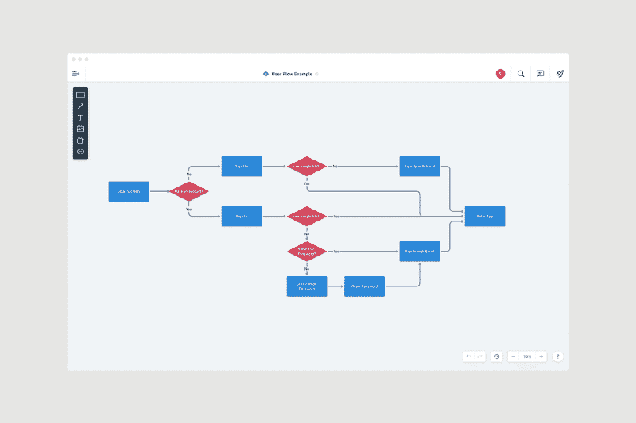
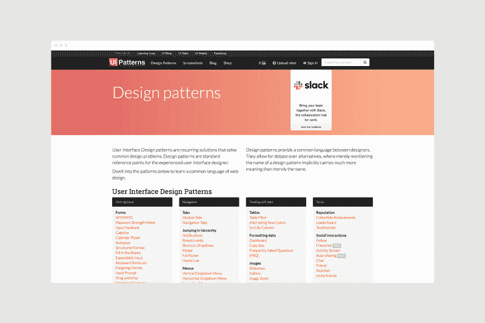
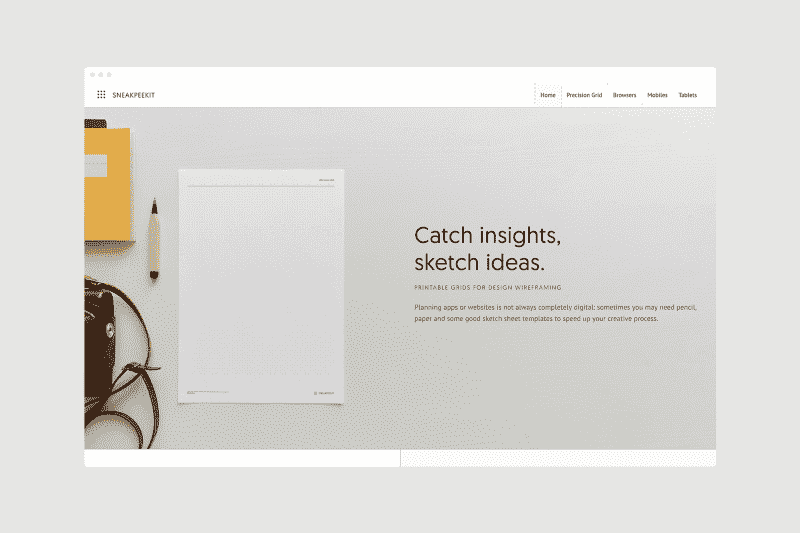
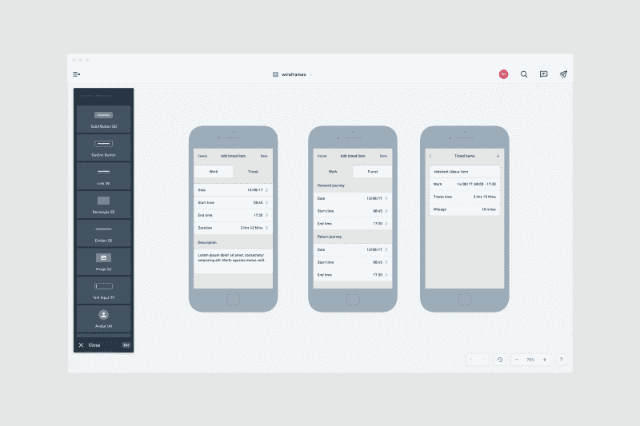
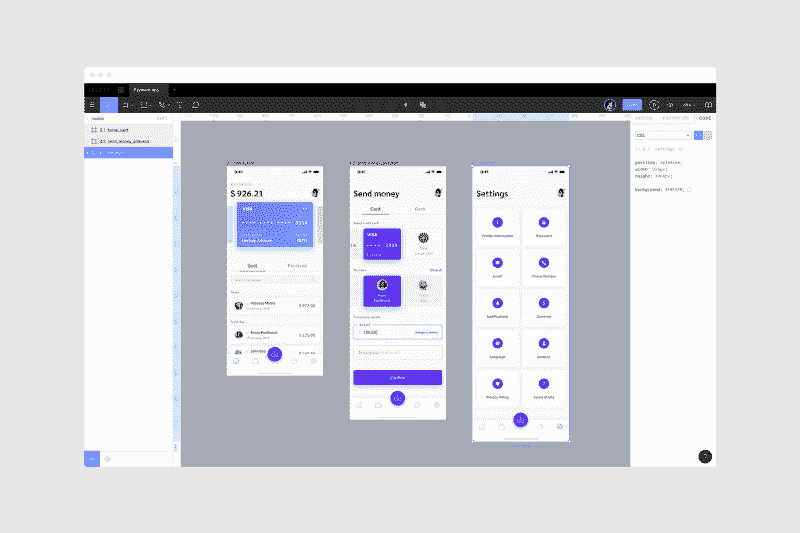

# 开发者和技术创始人如何将他们的想法转化为 UI 设计

> 原文：<https://www.freecodecamp.org/news/how-developers-and-tech-founders-can-turn-their-ideas-into-ui-design-d52cdb9ac30e/>

作者西蒙·麦卡德

# 开发者和技术创始人如何将他们的想法转化为 UI 设计

了解如何将一个伟大的产品或服务的想法变成一个美丽的网页或移动应用程序的用户界面设计。

将绝妙的想法转化为设计精美的网络和移动应用程序用户界面是非常耗时的。对于开发者和技术创始人来说，这通常是一项艰巨的任务。

在“发现了！”之后，这看起来应该是一个简单的过程瞬间。现实是，即使是最懂技术的工程师缺乏设计经验，也会阻碍一个应用程序在游戏中发挥最佳性能——至少对用户来说是这样。

在这个阶段，我假设你已经进行了一些用户研究。或者至少，与潜在客户交谈以检验你的假设。这样你就能更好地将你的想法转化为实际的设计。

这个简化的指南将这个过程分解成逻辑步骤，以方便那些没有时间去理解所有复杂的用户界面和 UX 设计的人。

### 从 UI 设计的角度来看，眼前的问题是什么？

起点总是不仅要定义你试图解决的问题，还要从你客户的角度去理解这个问题。当然，你的目标受众会有很多观点。

Defining the problem at hand from a UI design point-of-view

一个创始人的愿景只有在以这样一种方式设计时，客户才能真正使用它。这在很大程度上取决于他们用正确的技能将想法表达给正确的人的能力。

这听起来可能很简单，但真正的问题通常在于科技初创公司缺乏设计专业知识。在产品开发的早期阶段走上陡峭的学习曲线可能是对关键资源的不良利用。你要解决的第一个问题是，如何以最快、最聪明、最有效的方式解决客户面临的问题。

一旦你做到了这一点，你就可以将这些想法转化为真正有用的用户界面设计

> …您必须解决的第一个问题是如何以最快、最明智和最有效的方式解决客户面临的问题…

### 为你的应用开发一个简单的设计流程

它的关键在于为你的应用程序的 UI 设计形成一个简单的过程——以下是我一直推荐的步骤:

1.  创建用户流程图
2.  研究不同的设计模式和风格
3.  创建线框
4.  创建实体模型

### 创建用户流程图

首先从用户可能与你的应用程序交互的方式的顶层视角开始。

他们如何实现他们的特定目标？他们实现这些目标的潜在途径是什么？你能在用户流程图中很容易地将你的应用程序中所有可能的用户旅程可视化吗？

通过减少任何混乱和删除任何不必要的步骤来保持事情尽可能简单是至关重要的。从一开始鸟瞰这一点真的有助于你的 UI 设计。

我喜欢使用的一些工具是米罗、T2、米拉诺特和 T4 的流程图模板。通过理解流程图中的三种典型形状，您可以轻松规划旅程:

*   矩形:用于表示应用程序中的不同屏幕
*   菱形:用于表示用户在应用程序中做出的决定
*   箭头:用于显示屏幕和决策之间的联系

An example user-flow diagram for app design

这张图片展示了一个应用程序的预设计阶段的用户流程图。在[页面流](https://pageflows.com/)，你可以探索其他常见的用户旅程，并过滤来自 iOS、Android 和 Web 应用的各种截图。

### 研究不同的设计模式和风格

规划使实施更容易。我总是将任务分解成更小、更易管理的部分，以便能够实现我的应用程序设计目标。

对于拥有多年经验的 UI 设计师来说，创造性的本能将会发挥作用，但创始人和开发人员很容易陷入一个陷阱，即要求他们的日常事务为这些决策提供信息，例如从他们经常使用的应用程序中获取太多的影响。

> …将任务分解成更小、更易管理的部分…

重要的是要把这看作是你研究旅程的起点。使用这些见解来研究不同行业中不同的 UI 设计模式，比如表单、菜单和表格。利用这些见解，不仅要复制对你的受众有用的东西，还要对其进行改进，使你的应用尽可能的好。

关于这一点的一个很好的信息来源是 [UI 模式](http://ui-patterns.com/patterns)。这是熟悉最常用的设计模式的绝佳资源，包括如何以及何时使用它们。

A screenshot of UI-patterns.com

一旦你对你自己的应用程序中需要包含哪些组件有了更深入的了解，就去看看像 [Behance](https://www.behance.net/) 和 [Dribbble](https://dribbble.com/) 这样的网站来获取更多的灵感。不过，你可能会对你在 Dribbble 上看到的东西有所保留。当涉及到真正的应用时，你在那里看到的大部分是概念性的，而不是成品。

以下是一些具有行业领先设计的热门应用的截图资源:

*   [UX 截图](https://www.uxscreenshots.com/)
*   [值得称赞的应用](https://laudableapps.com/)
*   [Mobbin 设计](https://mobbin.design/)
*   [Pttrns](https://pttrns.com/)
*   [移动模式](https://mobile-patterns.com/)

这些都是设计新的网络和移动应用的视觉灵感的奇妙来源。

### 创建您的线框

现在，我们可以从这里开始创造。线框是设计过程中至关重要的一部分，所以它们不应该被忽略。

如果你熟悉原型工具，这是帮助你实现应用程序最佳设计的首选。如果那对你来说是一个全新的世界，那么你可能会想去守旧派，回到传统的纸和笔。适应新工具所需的时间只会让你慢下来，所以不要害怕复古。

> 线框是设计过程中至关重要的一部分，所以它们不应该被忽略。

看看 [SneakPeekIt](https://sneakpeekit.com/) 中的大量设备模板，你可以打印出来用于你的草图。它们是一种完全免费的方式，可以让你获得设计灵感。

A screenshot of SneakPeekIt.com

也一定要去看看 [Balsamiq](https://balsamiq.com/wireframes/) 、[异想天开](https://whimsical.co/wireframes/)和 [OmniGraffle](https://www.omnigroup.com/omnigraffle/) 。为了在预构建组件方面有更多的变化，你需要从你的 web 或移动应用的层次结构开始。

A screenshot of wireframes in Whimsical

你的第一个用户界面很可能来自这些网站的一些不同设计模板的融合。深入检查它们只会对优化你的应用内体验有好处。

如果你是处于设计早期的工程师或技术创始人，不要被跳过线框图的冲动所诱惑。你需要通过可视化来充分理解应用程序用户旅程的每个角度，以免为时过晚，无法进一步改变它们。

### 创建你的网络或移动应用的模型

一旦层级到位，每个屏幕的结构都定义好了，你就可以使用像 [Figma](https://www.figma.com/) 或 [Sketch](https://www.sketch.com/) 这样的软件来设计你的产品。Figma 是一个基于云的 UI 设计工具，它是为团队构建的，非常适合在流程的这个阶段实现线框。

A screenshot of UI designs in Figma

最初的设计模型将帮助你更有效地实现你的愿景，让你的应用看起来和感觉起来像一个真正的产品。在构建应用程序时，它应该可以作为开发人员的真正参考点。不要担心在这个阶段多花一点时间——细节越多越好。

### 你还在纠结你的 UI 设计吗？

如果你觉得你已经为你的想法做了所有你能做的，你需要帮助把它变成真正的用户界面设计，你可能会想叫一个应用程序设计师来帮助你。

我可以运用我十年的设计经验来执行将你的想法展示给真实的人所需的稳健过程，而不是费力地去完成它并冒着出错的风险。

如果您想咨询您的项目，无论是您的网站或移动应用程序的完整设计，还是正在进行的 UX 设计支持，我都愿意提供我的专业知识，并与您的开发团队集成，以实现最佳的最终产品。

需要其他建议吗？请求我的免费备忘单，其中包括“ [47 个可操作的 UX 黑客来修复你的应用](https://www.simonmccade.com/ux-hacks-to-fix-your-app)”。

感谢您花时间阅读这篇文章。如果你觉得它有帮助，请让我知道。？？？

如果你想了解更多，请查看我的[博客](http://www.simonmccade.com/blog)定期更新。

本文最初发表于*[www.simonmccade.com](https://www.simonmccade.com/blog/what-makes-a-great-landing-page)。*