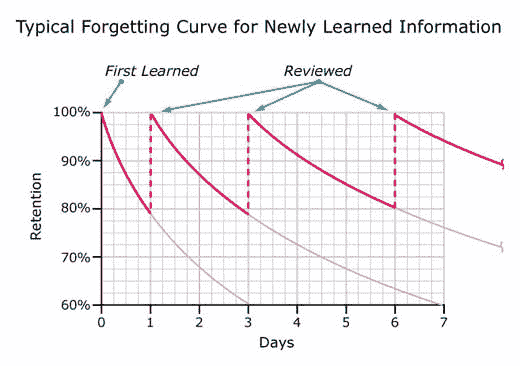
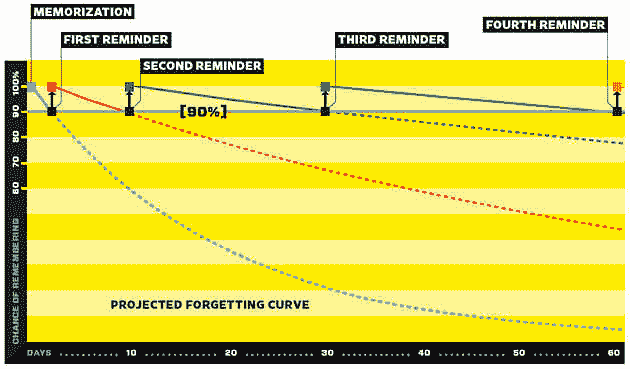
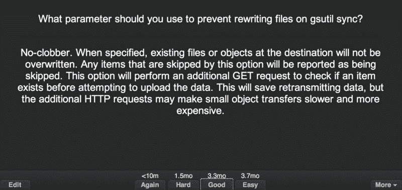
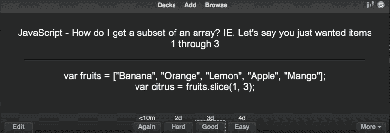
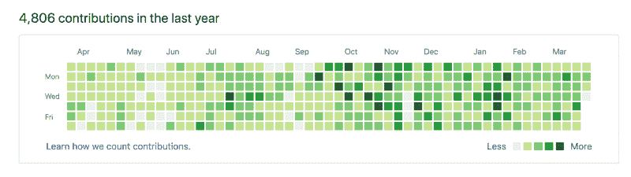
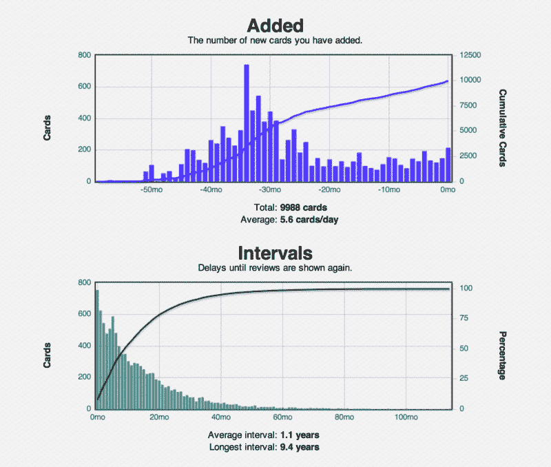

# 安奇如何拯救了我的工程生涯

> 原文：<https://www.freecodecamp.org/news/how-anki-saved-my-engineering-career-293a90f70a73/>

作者 Jeffrey Shek

# 安奇如何拯救了我的工程生涯

我筋疲力尽了，我的软件生涯也停滞了仅仅三年。我的记忆糟透了。我的记忆力差是因为压力、睡眠不足还是一直都这么差？工作是一个循环，以“今天是我改变的一天”开始一天，以自我厌恶的多巴胺上瘾的黑客新闻、Reddit 和 Medium 结束一天。我是个失败者。

Photo by [John T](https://unsplash.com/@john_visualz?utm_source=medium&utm_medium=referral) on [Unsplash](https://unsplash.com?utm_source=medium&utm_medium=referral)

> ***我需要却忽视的建议#213*** *:不要把自我价值和工作捆绑在一起。*

我想成为一名优秀的软件工程师。但是我的作品很一般。更糟的是，我在努力。我一天 12 个小时，一周 6 天坐在椅子上，试图写出漂亮的 Python 代码。我不断地查找文档，总是被互联网的干扰所吸引。我是一个非常失败的人。

然后是凯尔。凯尔和我从零开始编程；我们都在工作中学习。三年后，我们的进步完全不同。

> “凯尔是我合作过的第一个 10X 工程师。”—每一个。单身。同事。15 年以上工作经验。

凯尔工作日从上午 10 点到下午 4 点工作。他很早就完成了工作，并且单枪匹马地完成了整个团队 80%的工作。雪上加霜的是，他只有 60%的时间在工作。剩下的时间都花在了… HackerNews，Reddit 和 Medium 上。我是努力缓慢的野蛮人，而凯尔是优雅的野兔。

凯尔没有秘密的日常活动。他从不冥想。尽管早餐、午餐和晚餐都吃麦当劳，他还是很瘦。但是，凯尔有超级英雄的能力。API 语法和文档中的图片记忆。

我想要那样，我很嫉妒。我的职业生涯停滞不前，需要有所改变。于是我开始了一段专注的重复之旅。三年来的每一天，我都要花一到三个小时的时间进行有间隔的重复。这很残酷，我需要它。

### 什么是间隔重复？

间隔重复是一种记忆技巧，它会以一定的间隔提醒你一些概念，从而最大限度地提高记忆效率。这是一种提醒我们大脑事实的策略；它利用了这样一个事实，即记住一个事实的最佳时间就在我们忘记它之前。我们的大脑很健忘，但我们可以使用策略让它不那么健忘。

间隔时间越长，记忆越容易巩固成长期记忆(也越不容易遗忘)。请注意，每次提醒的持续时间越来越长。

From Wired

> 注意:此图像与上面的图像完全相同，但使用了不同的颜色以促进记忆。我满脑子都是黑客。

假设你一年中有六次机会提醒比尔·盖茨你的名字。如果一整年后比尔记得你的名字，你将得到一百万美元！

你会选择哪个提醒间隔？

*   **选项一——考前补习:**12 月 26 日、27 日、28 日、29 日、30 日、31 日。
*   **选项 2——常春藤联盟的毕业生代表:**每隔一个月的第一天。一月一日，三月一日，四月一日，等等。
*   **选项 3 —间隔重复:**1 月 1 日，1 月 3 日，1 月 20 日，2 月 28 日，4 月 15 日，9 月 30 日。

选项 3(间隔重复)让你最有可能记住你的名字。啊，船长明显博客作家。

但是为什么选择第三种呢？

1.  从短期记忆中消失后，填鸭式教学很少奏效。你记得从高中开始有多少次补习班？
2.  均匀间隔的提醒是一种工作，但你必须在每一个间隔回顾你所有的知识，这听起来不可扩展/有趣/允许你有社交生活。
3.  我们的大脑在指数间隔的提醒下工作得最好。

除了医学生和像 [Duolingo](https://www.duolingo.com/) 这样的语言学习应用，间隔重复并不常见。虽然没有填鸭式的酷，但是很管用。医科学生用它来记忆那些可怕的上千页教科书。Duolingo 用它是因为它很有效。还记得几年前统治《危险边缘》的那个家伙吗？间隔重复狂热者。

如果真有这么神奇，为什么间隔重复并不常见？

*   人们不知道这件事。
*   即使你用了，也很难养成复习抽认卡的习惯。
*   制作抽认卡很烦人。谁想在抽认卡应用程序中输入笔记？
*   人们夸夸其谈地谈论自我提高，但不想做任何讨厌的艰苦工作。
*   一点都不酷。你不会在第一次约会时提到学习抽认卡。

但是软件工程师已经有了这些痛点…

*   工程师应该知道即将到来的趋势。否则，你还在用 BitBucket 和 Adobe Flash。
*   工程师是习惯的动物。把检查你的抽认卡应用作为你的第一项工作任务(在火车上，糖果粉碎前的厕所里)。停止每月五次的 StackOverflowing“我如何修改我的 git 提交”。
*   记笔记时，不要使用箭筒、EverNote、概念等工具，而是保存为抽认卡。
*   成为一名优秀的软件工程师需要终身学习。
*   老实说，你没有多少第一次约会。

安奇和 T2 是最常见的间隔重复应用。两者都有助于创建抽认卡和基于间距算法的测验。如果你答对了一个问题，它会再问一遍。卡错了？明天它会提醒你。我用 Anki。Anki 似乎在软件工程师中更常见。下载手机应用程序(iOS/Android)。[安卓应用棒极了](https://play.google.com/store/apps/details?id=com.ichi2.anki&hl=en_US)。

一些快速术语(以防你忘记):

*   间隔重复是一种学习技巧。
*   Anki 和 SuperMemo 是将使用间隔重复的应用程序。
*   你在 Anki 和 SuperMemo 里制作抽认卡。他们每隔一段时间就考你一次。
*   一副卡片通常指的是你的全部抽认卡收藏。

习惯:每当我搜索 StackOverflow 时，我会立即为我的问题创建一个抽认卡，并将答案添加到 Anki 中。

Example: Parameter about gsutil. I generally add the answer + additional information.

An easy question I got wrong yesterday. I was almost too embarrassed to show this example.

间隔重复是离线穷人的 StackOverflow(是的，我试过[破折号](https://kapeli.com/dash))。在 Anki 之前，我忘记了相当于我日常学习的语法。我已经在用 Anki 了解常识了。为什么不为 Anki 编写抽认卡呢？我犹豫不决是因为几个原因。

*   懒惰。编写好的 Anki 编程抽认卡可能很难。
*   带代码的抽认卡很难记住。比起如何使用 xargs(cat list . txt | xargs-l { } mv/Volumes/External/{ }/Desktop)从外置硬盘复制. txt 文件中的文件列表，记住蒙古的首都(乌兰巴托)要容易得多。连续几天弄错一张卡是令人沮丧的。

在过去的三年里，我把所有的东西都加到了 Anki 上。Bash 别名、IDE 快捷方式、编程 API、文档、设计模式等。做了这些，我不会推荐添加**所有的**。我的 Anki 错误的主题值得它自己的文章…？

#### 利益

在拥抱 Anki 之后，一旦我掌握了一张卡，围绕语言和框架 API 的快速回忆就像是我对流动之神的祈祷最终得到了回应。

三年前，我最常见的模式是:

*   开始编码
*   StackOverflow 一些语法我很沮丧地忘记了
*   走神。阅读黑客新闻
*   嗯，黑客新闻上没什么新东西，让我们试试 Reddit
*   尝试进入心流？
*   绝望。也许有人在 HackerNews 上发布了一个新故事？

现在在 API 语法、文档、国家首都和工程方面配备了改进的内存——有了明显的不同。

#### 2016 年——短暂爆发后令人沮丧的分心

#### 今年至今—我应该找一个新的爱好…

#### 承诺

有间隔的重复需要每天的投入，但是可以保证很好的记忆力。大多数用户平均每天花 20 分钟来复习。如果你没有增加额外的卡片(咳嗽，懒鬼)，你的复习时间平均为零，因为知识变成了长期记忆。一旦某样东西被添加到 Anki 中，它就不会被忘记，这种自信令人陶醉。

#### 反射

间隔重复是我最重要的职业/生活方式。这并不总是容易的。它不能保证你会成为一名更好的工程师(最佳实践和设计胜过语法)，但它会让你成为一名有能力的工程师。当你能快速回忆起语法时，你会惊讶于自己编码的速度。有时候，这只会导致蹩脚的代码，更快。**但是最好的编码员编码很多**。这是唯一保证改进的方法。

知识以有趣的方式复合。我的许多抽认卡包括关于工程的博客和文章——了解 RPC、SOAP、REST 和 GraphQL 的历史有助于改进设计和架构决策。**计数器**:记忆二叉查找树算法还没有派上用场……

### 追逐 10 倍

我是从追逐一个“成为凯尔那样的 10X 工程师”的荒诞梦想开始的。好像会有毕业典礼什么的可笑。仔细想想,“年度最大工具”奖听起来是对的。

我不知道什么是 10X 工程师；我们没有涵盖产出、领导力、代码质量和技术债务的基准。当我终于有信心塑造自己的自我提升时，追逐 10 倍变得毫无意义。增强的记忆让我掌握了自己的命运。

凯尔仍然比我好很多倍，这很好。

> ***我需要却忽略的建议#421*** *:不要拿自己和别人比较。只要确保你每天都在进步。复利是宇宙中最强大的东西。*

**杂项:**

*   [My Anki Analytics](https://cdn.buttercms.com/CPodX9XATCGZBuwN89Vq)

**其他关于间隔重复的好文章:**

*   [间隔重复— Gwern](https://www.gwern.net/Spaced-repetition)
*   [增强长期记忆——迈克尔·尼尔森](http://augmentingcognition.com/ltm.html)
*   使用间隔重复软件记忆编程语言——德里克·西弗斯
*   想要记住你将学到的一切吗？投降——有线

**后续文章:**

*   最好和最糟糕的错误与 Anki 学习，记忆黑客和创造第一原则与战术抽认卡。(4 月 10 日)
*   我最喜欢的避免互联网干扰的方法(4 月 13 日)

最初发表于 [senrigan.io](https://senrigan.io/blog/chasing-10x-leveraging-a-poor-memory-in-software-engineering) 。