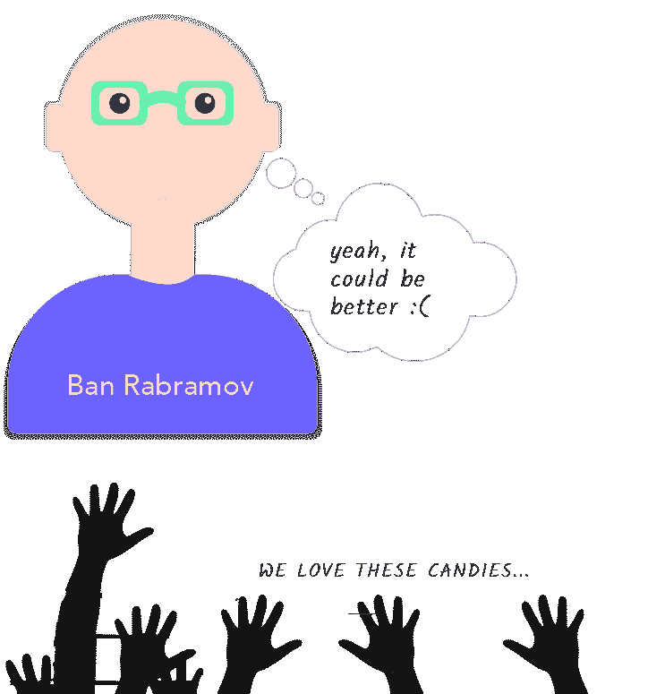
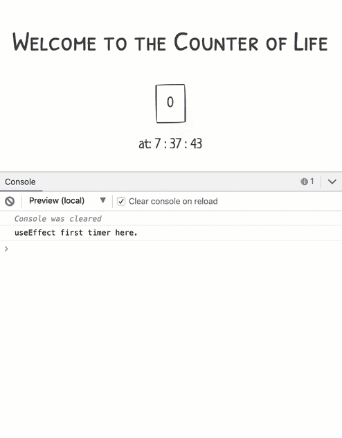
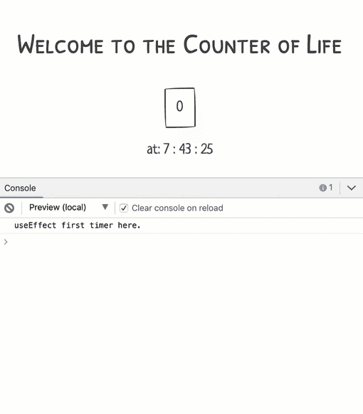

# 在不到 10 分钟的时间内学习 React 挂钩的基础知识

> 原文：<https://www.freecodecamp.org/news/learn-the-basics-of-react-hooks-in-10-minutes-b2898287fe5d/>

今年年初，React 团队在 16.8.0 版本中发布了 React 的新功能 hooks。

如果 React 是一大碗糖果，那么挂钩是最新的补充，非常耐嚼的糖果，味道很好！

那么，钩子到底是什么意思呢？为什么它们值得你花时间？

### 介绍

React 中添加钩子的主要原因之一是提供一种更强大、更有表现力的方式来编写(和共享)组件之间的功能。

> 从长远来看，我们希望钩子成为人们编写 React 组件的主要方式

如果钩子真的那么重要，为什么不用一种有趣的方式来了解它们呢！

### 糖果碗

把 React 想象成一碗漂亮的糖果。


这碗糖果对世界各地的人们有着不可思议的帮助。


制作这碗糖果的人意识到碗里的一些糖果对人们没什么好处。

一些糖果尝起来很棒，是的！但是当人们吃它们时，它们带来了一些复杂性——想想渲染道具和高阶组件？



那么，他们做了什么？


他们做了正确的事情——没有扔掉所有以前的糖果，而是制作了新的糖果。

这些糖果被称为挂钩。


这些糖果的存在只有一个目的:**让你更容易做你已经在做的事情**。


这些糖果并不特别。事实上，当你开始吃它们时，你会意识到它们尝起来很熟悉——它们只是 **Javascript 函数**！


如同所有的好糖果一样，这些新糖果都有它们独特的名字。虽然它们统称为**钩子**。

他们的名字总是以三个字母的单词开头，*用…* 如`useState`、`useEffect`等。

就像巧克力一样，这 10 种糖果都有一些相同的成分。了解一种食物的味道，有助于你与另一种食物产生共鸣。

听起来很有趣？现在让我们吃这些糖果吧。

### 州钩

如前所述，钩子是函数。官方说法是，他们有 10 个人。10 个新功能，使组件中的编写和共享功能更具表现力。

我们要看的第一个钩子叫做，`useState`。

很长一段时间，你不能在一个功能组件中使用本地状态。直到胡克丝。

使用`useState`，您的功能组件可以拥有(并更新)本地状态。

多有趣啊。

考虑以下计数器应用:


带有如下所示的`Counter`组件:

很简单，是吧？

让我问你一个简单的问题。为什么我们要把这个组件作为类组件？

答案很简单，因为我们需要跟踪组件中的一些本地状态。

现在，同样的组件被重构为一个功能组件，可以通过`useState`钩子访问状态。


Class to Hooks — wait for the animation.

有什么不同？

我会一步一步地教你。

一个功能组件没有所有的`Class extend ...`语法。

```
function CounterHooks() {  }
```

它也不需要一个`render`方法。

```
function CounterHooks() {    return (      <div>        <h3 className="center">Welcome to the Counter of Life </h3>        <button           className="center-block"           onClick={this.handleClick}> {count} </button>      </div>    ); }
```

上面的代码有两个问题。

1.  你不应该在函数组件中使用`this`关键字。
2.  `count`状态变量尚未定义。

将`handleClick`提取到功能组件中的一个独立功能:

```
function CounterHooks() {  const handleClick = () => {      }  return (      <div>        <h3 className="center">Welcome to the Counter of Life </h3>        <button           className="center-block"           onClick={handleClick}> {count} </button>      </div>    ); }
```

在重构之前，`count`变量来自类组件的状态对象。

在功能组件中，通过钩子，这来自于调用`useState`函数或钩子。

用一个参数调用`useState`，初始状态值，例如`useState(0)`，其中`0`表示要跟踪的初始状态值。

调用这个函数会返回一个包含两个值的数组。

```
//? returns an array with 2 values. useState(0) 
```

第一个值是被跟踪的当前状态值，第二个是更新状态值的函数。

把这想象成一些`state`和`setState`的复制品——然而，它们并不完全相同。

有了这些新知识，下面是`useState`的行动。

```
function CounterHooks() {  // ?   const [count, setCount] = useState(0);  const handleClick = () => {    setCount(count + 1)  }  return (      <div>        <h3 className="center">Welcome to the Counter of Life </h3>        <button           className="center-block"           onClick={handleClick}> {count} </button>      </div>    ); } 
```

除了代码的简单性之外，还有一些事情需要注意。

第一，由于调用`useState`会返回一个值数组，这些值很容易被析构为单独的值，如下所示:

```
const [count, setCount] = useState(0);
```

另外，请注意重构代码中的`handleClick`函数不需要任何对`prevState`或类似内容的引用。

它只是用新值`count + 1`调用`setCount`。

```
 const handleClick = () => {    setCount(count + 1) }
```

这是因为`count`状态变量的正确值将总是在重新渲染时保持。

因此，需要更新计数状态变量，只需用新值调用`setCount`，例如`setCount(count + 1)`

听起来很简单，你已经用钩子构建了你的第一个组件。我知道这是一个人为的例子，但这是一个好的开始！

**注意**:也可以将一个函数传递给状态更新函数。当状态更新依赖于先前的状态值时，通常推荐使用类'`setState`'，例如`setCount(prevCount => prevCount +` 1)

#### 多个 useState 调用

对于类组件，我们都习惯于在一个对象中设置状态值，不管它们包含单个属性还是多个属性。

```
// single property state = {  count: 0}// multiple properties state = { count: 0, time: '07:00'}
```

你可能已经注意到了细微的差别。

在上面的例子中，我们只用实际的初始值调用了`useState`。不是保存值的对象。

```
useState(0)
```

那么，如果我们想要另一个状态值呢？

可以使用多个`useState`调用吗？

考虑下面的组件。和以前一样，但这次它跟踪点击时间。


如您所见，钩子的用法完全相同，除了有一个新的`useState`调用。

```
const [time, setTime] = useState(new Date())
```

现在在渲染的`JSX`中使用`time`来检索点击的小时、分钟和秒。

```
<p className="center">    at: { `${time.getHours()} : ${time.getMinutes()} : ${time.getSeconds()}`}</p>
```

太好了！

然而，有没有可能使用一个带有`useState`的对象来代替多个`useState`调用呢？

绝对的！

如果您选择这样做，您应该注意到，与`setState`调用不同，传递给`useState`的值替换了状态值。`setState`合并对象属性，但`useState`替换整个值。

### 效果挂钩

对于类组件，您可能会产生一些副作用，如日志记录、获取数据或管理订阅。

这些副作用可以简称为“效果”，效果钩子，`useEffect`就是为此而产生的。

怎么用的？

嗯，`useEffect`钩子是通过传递给它一个函数来调用的，在这个函数中你可以执行你的副作用。

这里有一个简单的例子。

```
useEffect(() => {  // ? you can perform side effects here  console.log("useEffect first timer here.")}) 
```

为了`useEffect`,我传递了一个匿名函数，其中调用了一些副作用。

下一个逻辑问题是，什么时候调用`useEffect`函数？

好吧，记住在类组件中你有生命周期方法，比如`componentDidMount`和`componentDidUpdate`。

由于功能组件没有这些生命周期方法，`useEffect` *有点像*取代了它们的位置。

因此，在上面的例子中，`useEffect`中的函数，也称为效果函数，将在功能组件安装(`componentDidMount`)和组件更新`componentDidUpdate`时被调用。

这就是实际情况。

通过将上面的`useEffect`调用添加到计数器应用程序，我们得到了以下行为。



**NB** :这个`useEffect`钩子和`componentDidMount` + `componentDidUpdate`不完全一样。可以这么看，但是实现有一些细微的不同。

有趣的是，每次更新时都会调用效果函数。这很好，但并不总是理想的功能。

如果你只想在组件挂载的时候运行效果函数呢？

这是一个常见的用例，`useEffect`接受第二个参数，一个依赖数组来处理这个问题。

如果传入一个空数组，效果函数只在挂载时运行，后续的重新渲染不会触发效果函数。

```
useEffect(() => {    console.log("useEffect first timer here.")}, []) 
```



如果您将任何值传递到这个数组中，那么 effect 函数将在 mount 上运行，并且随时更新传递的值。即，如果任何值发生变化，受影响的调用将重新运行。

```
useEffect(() => {    console.log("useEffect first timer here.")}, [count]) 
```

效果函数将在装载时运行，并且每当计数函数改变时运行。


*count changes when the button is clicked, so the effect function re-runs*

订阅呢？

在某些应用中订阅和退订某些效果是很常见的。

请考虑以下情况:

```
useEffect(() => {  const clicked = () => console.log('window clicked');  window.addEventListener('click', clicked);}, [])
```

在上面的效果中，在安装时，一个点击事件监听器被附加到窗口。

当组件被卸载时，我们如何取消订阅这个监听器？

嗯，`useEffect`考虑到这一点。

如果你在你的效果函数中返回一个函数，它将在组件卸载时被调用。这是取消订阅的最佳位置，如下所示:

```
useEffect(() => {    const clicked = () => console.log('window clicked');    window.addEventListener('click', clicked);    return () => {      window.removeEventListener('click', clicked)    } }, [])
```

使用`useEffect`钩子可以做更多的事情，比如进行 API 调用。

### 打造你自己的钩子

从本文开始，我们已经从 React 提供的糖果盒中取出(并使用)了糖果。

然而，React 也为你提供了一种制作自己独特糖果的方法——称为定制挂钩。

那么，这是怎么做到的呢？

自定义钩子只是一个常规函数。但是，它的名字必须以单词`use`开头，如果需要，它可以调用自己内部的任何一个 React 钩子。

下面是一个例子:

### 钩子的规则

使用钩子时有两条规则要遵守。

1.  在条件、循环或嵌套函数中，只调用顶层的[钩子，即*而不是*。](https://reactjs.org/docs/hooks-rules.html#only-call-hooks-at-the-top-level)
2.  仅从 React 函数调用挂钩，即功能组件和自定义挂钩。

这个 eslit[插件](https://www.npmjs.com/package/eslint-plugin-react-hooks)非常好，可以确保您在项目中遵守这些规则。

### 其他糖果

我们已经考虑了 React 提供的一些钩子，但是还有更多！

这篇介绍应该已经让你准备好接受更密集的文档。也检查我的生活可编辑反应[钩 cheatsheet](https://react-hooks-cheatsheet.com) 。