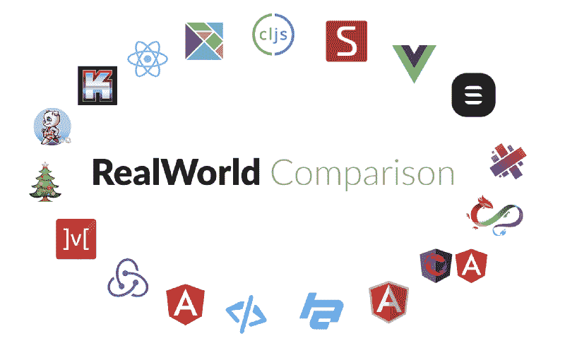
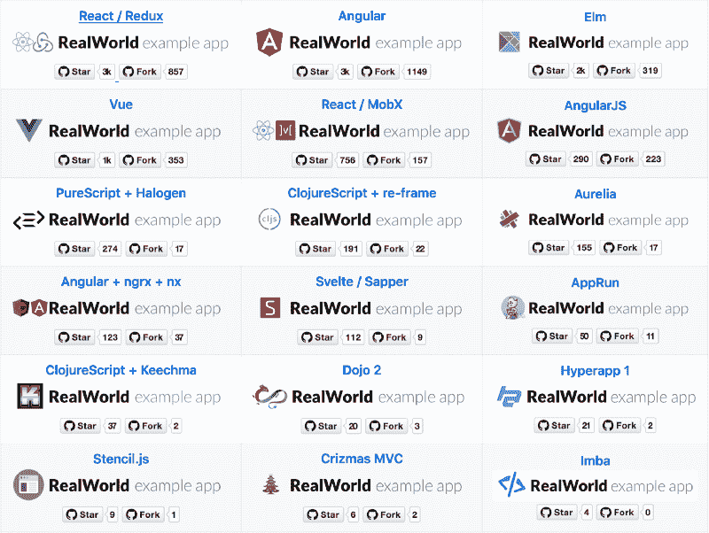
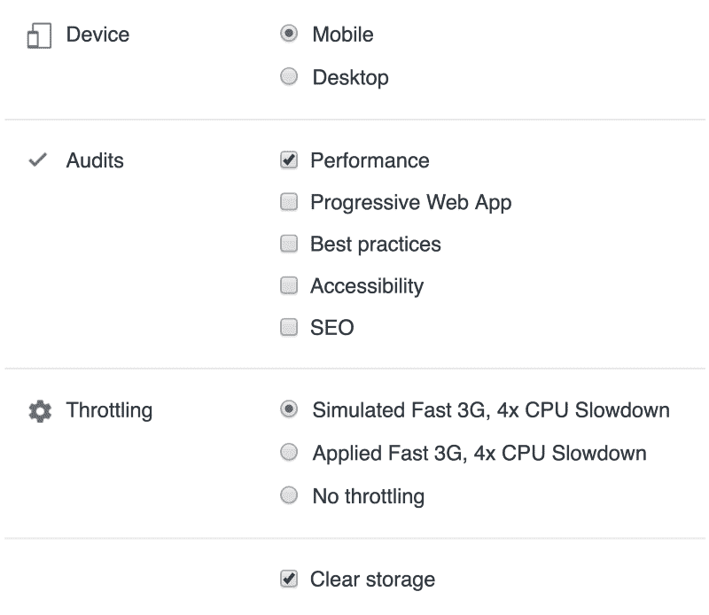
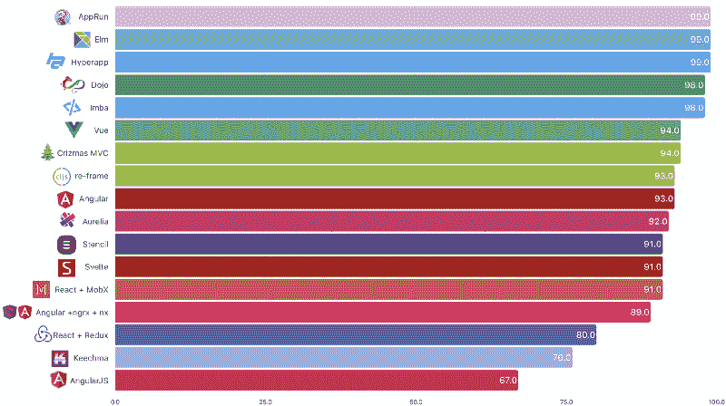
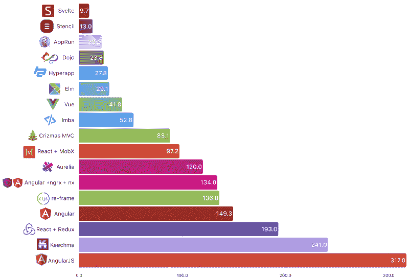
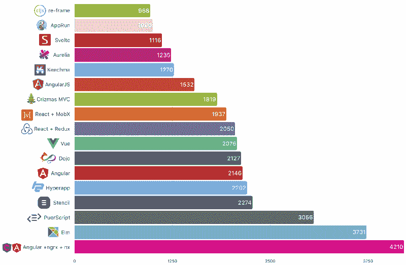

# 前端框架与基准测试的真实对比(2019 年更新)

> 原文：<https://www.freecodecamp.org/news/a-realworld-comparison-of-front-end-frameworks-with-benchmarks-2019-update-4be0d3c78075/>

作者亚采克·沙

# 前端框架与基准测试的真实对比(2019 年更新)

还有:
[土耳其语](https://medium.com/@erdenizZz/front-end-frameworklerinin-ger%C3%A7ek-bir-kar%C5%9F%C4%B1la%C5%9Ft%C4%B1r%C4%B1lmas%C4%B1-2019-9f417c1c9261) —感谢[@额尔德尼兹、](https://medium.com/@erdenizZz)
[波图格斯](https://medium.com/@felipefialho/front-end-frameworks-compara%C3%A7%C3%A3o-realword-com-benchmarks-vers%C3%A3o-2019-ed1024ee3cba) —感谢 [@felipefialho](http://twitter.com/felipefialho)

这是我们第三次通过使用[真实世界的示例应用](https://github.com/gothinkster/realworld)来比较前端框架。真实世界示例应用程序为我们提供了:

**RealWorld App**
比“待办事项”多的东西。通常“todos”不会传达足够的知识和观点来实际构建真正的*T4 应用程序。*

**标准化**
符合一定规则的项目。提供后端 API、静态标记、样式和规范。

由专家撰写或评审一个一致的、真实的项目，理想情况下，该技术领域的专家会构建或评审该项目。

### 我们在比较哪些库/框架？

在撰写本文时，Conduit 在 [RealWorld 示例应用程序](https://github.com/gothinkster/realworld) repo 中有 18 个实现。

有没有大粉丝并不重要。唯一的限定是它出现在 RealWorld repo 页面上。

Frontends at [Real World](https://github.com/gothinkster/realworld) repo (Mar 2019)

### 我们看什么指标？

#### **性能**

这个应用程序需要多长时间才能显示内容并变得可用？

#### **尺寸**

App 有多大？我们将只比较编译后的 JavaScript 文件的大小。CSS 对于所有变体都是通用的，并且是从 CDN(内容交付网络)下载的。HTML 对所有变体也是通用的。所有的技术都可以编译或转换成 JavaScript，因此我们只需要调整这个文件的大小。

#### **行代码**

作者创建基于 spec 的 RealWorld 应用程序需要多少行代码？公平地说，一些应用程序有更多的功能，但应该不会有太大的影响。我们唯一量化的文件夹是每个应用中的`src/`。

### 衡量标准#1:性能

我们将检查 Chrome 附带的 [Lighthouse Audit](https://developers.google.com/web/tools/lighthouse/) 的性能得分。Lighthouse 返回 0 到 100 之间的性能分数。0 是可能的最低分。

#### 审核设置

Lighthouse Audit Settings for all tested apps

绩效是以下指标的综合得分

*   第一幅令人满意的画
*   第一幅有意义的画
*   速度指数
*   第一指南
*   互动时间到了
*   估计输入延迟

更多详情请查看[灯塔评分指南](https://developers.google.com/web/tools/lighthouse/v3/scoring)。

#### 性能 TL；速度三角形定位法(dead reckoning)

你越早绘画，越早有人可以做一些事情，使用该应用程序的人的体验就越好。

Performance (points 0–100) — higher is better.

注意:由于缺少演示应用程序，PureScript 被跳过。

#### 结论

大多数应用程序的得分都在 90 分以上。说到性能，你可能不会感觉到太大的不同。

### 衡量标准 2:规模

传输大小来自 Chrome 网络选项卡。GZIPed 响应头加上响应体，由服务器交付。

这取决于您的框架的大小，以及您添加的任何额外的依赖项，以及您的构建工具能够在多大程度上从您的包中消除未使用的代码。

#### 尺寸 TL；速度三角形定位法(dead reckoning)

文件越小，下载速度越快，解析起来就越简单。

Transfer size in KB — fewer is better

#### 结论

这个地区发生了许多耸人听闻的事情。svelte——神奇的消失的 UI 框架——确实符合它的妙语。Stencil 是基准测试中的新手，表现也相当不错。两者都是相对较新的事物，都在挑战尺寸的极限。

### 指标 3:代码行

使用 [cloc](https://github.com/AlDanial/cloc) 我们计算每个回购的 src 文件夹中的代码行数。空白和注释行是**而不是**计算的一部分。这为什么有意义？

> 如果调试是去除软件缺陷的过程，那么编程就必须是把缺陷放进去的过程

#### 代码行 TL；速度三角形定位法(dead reckoning)

由此可见，给定的库/框架/语言是多么简洁。根据规范，您需要多少行代码来实现几乎相同的应用程序(其中一些有更多的功能)。

# lines of code — fewer is better

*注意 Imba:由于[时钟](https://github.com/AlDanial/cloc)无法处理`.imba`文件，Imba 被跳过。*

*注意 Elm: Elm 的开发者写代码时更倾向于垂直方向，因此 LoC 的数量更多——至少这是我被告知的。*

*注意 Angular+ngrx: LoC 计算是用`/libs`文件夹完成的，只包括`.ts`和`.html`文件。如果你认为这是错误的，请让我知道什么是正确的数字，你是如何计算的。*

*注意 Hyperapp:文章发表时 LoC 不正确，感谢 [Mateusz Kwasniewski](https://twitter.com/kwasniew) 指出计算 LoC 的正确方法。*

#### 结论

ClojureScript with re-frame 给你最大的震撼？对于 LoC。Clojure 以不同寻常的表现力而闻名。如果你关心你的 LoC，你应该看看 ClojureScript，AppRun 和 Svelte。

### 摘要

请记住，这并不完全是苹果之间的比较。有些实现使用代码分割，有些不使用。其中一些托管在 GitHub，一些托管在 Now，一些托管在 Netlify。你还想知道哪个最好吗？最好的就是符合你需求的。

**问:**你喜欢类型吗？
**答:**看进榆树，PureScript，打字稿——角，AppRun，道场。

**问:**你希望自己的足迹非常小吗？
**答:**检查出苗条，模板，和 AppRun。

**问:**你想拥有最小的代码库来维护吗？
**答:**退房 ClojureScript 与重新框，AppRun 和苗条。

**问:**想学点新东西？
**答:**挑一个你不认识的！

### 常见问题解答

#### **#1 为什么框架 X、Y 和 Z 没有包括在这个比较中？**

因为在[现实世界回购](https://github.com/gothinkster/realworld)时实现没有完成。考虑投稿！在您最喜欢的库/框架中实现该解决方案，下次我们将包括它！

#### #2 为什么称之为现实世界？

因为它不仅仅是一个待办事项应用程序。我们所说的真实世界并不是指我们将比较工资、维护、生产率、学习曲线等。还有其他的调查可以回答这些问题。我们所说的真实世界是指一个连接到服务器、进行身份验证并允许用户 CRUD 的应用程序——就像真实世界的应用程序一样。

#### #3 你为什么不包括我最喜欢的框架？

请看上面的#1，但是为了以防万一，它又来了:因为在 [RealWorld repo](https://github.com/gothinkster/realworld) 实现没有完成。我并不负责所有的实现—这是一项社区工作。如果您想在比较中看到您的框架，请考虑投稿。

#### #4 您包含了哪个版本的库/框架？

接线时可用的那个(2019 年 3 月)。信息来自[现实世界回购](https://github.com/gothinkster/realworld)。我相信你可以从 [GitHub 回购](https://github.com/gothinkster/realworld)中找到这一点。

#### #5 为什么你忘了包括一个比比较中的框架更受欢迎的框架？

同样，见上文。在 [RealWorld repo](https://github.com/gothinkster/realworld) 时，实现尚未完成；就这么简单。

感谢[里奇·哈里斯](https://twitter.com/Rich_Harris)和[理查德](https://twitter.com/rtfeldman)费尔德曼在出版前看了一眼。

#### 更新:

当这篇文章发表后；LoC 博士描述如下:

> 代码行数越少，发现错误的可能性就越小。您还需要维护较小的代码库。

> 如果你喜欢这篇文章，你应该在 Twitter 上关注我。我只写/发关于编程和技术的文章。