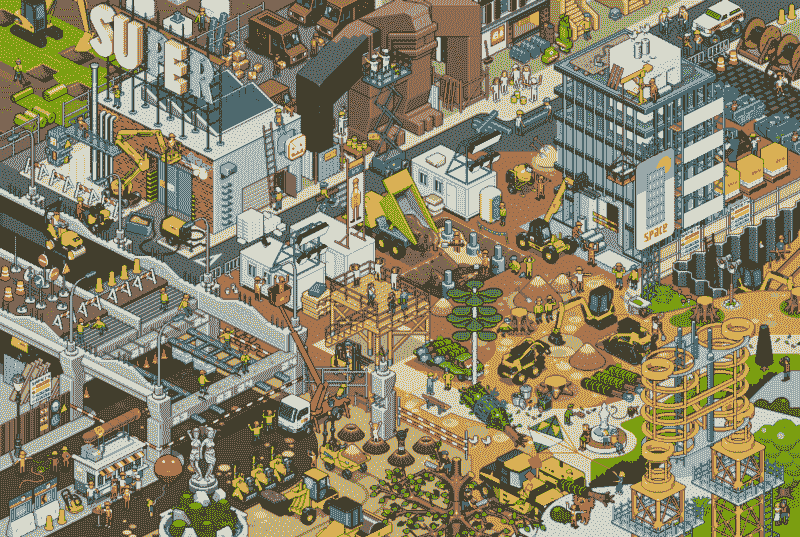
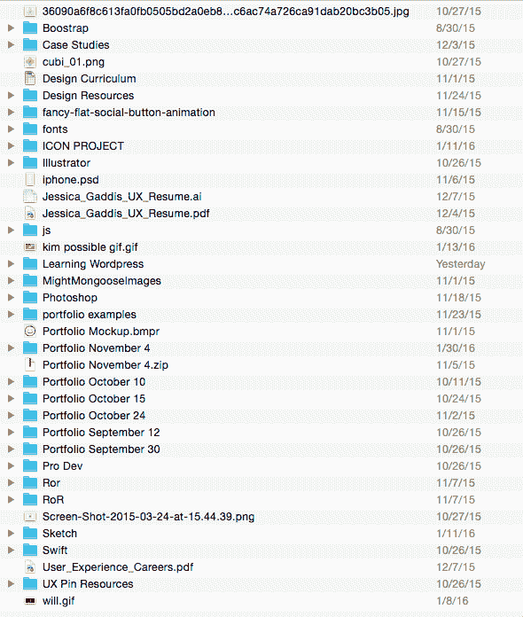
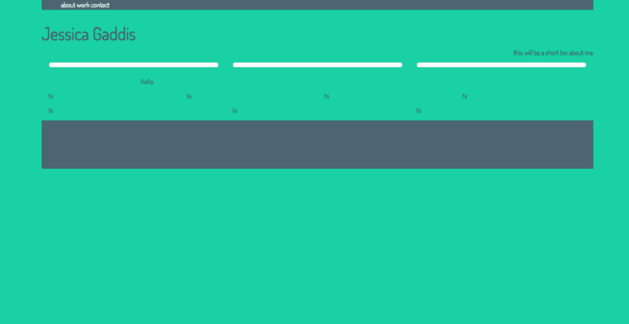
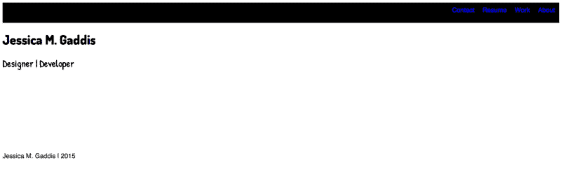
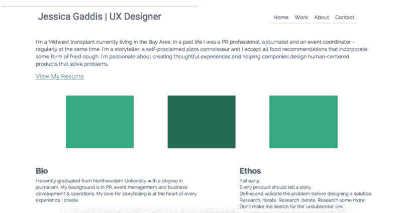
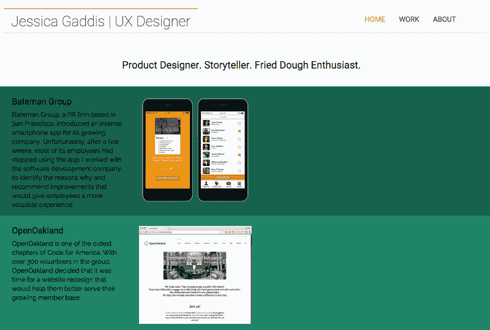
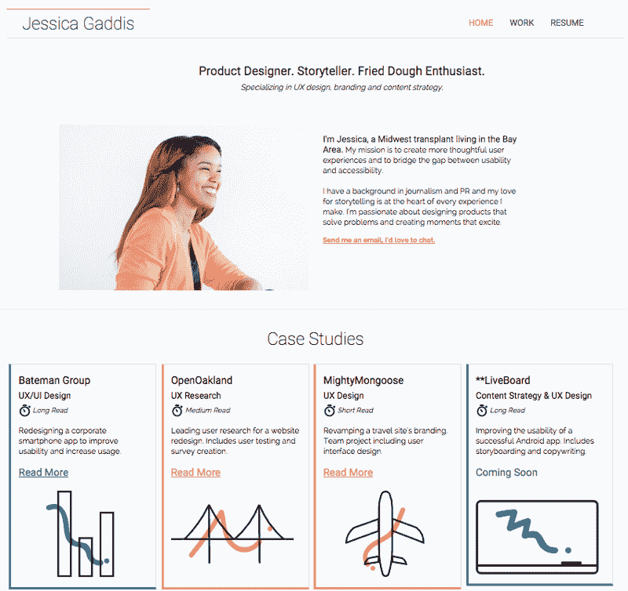
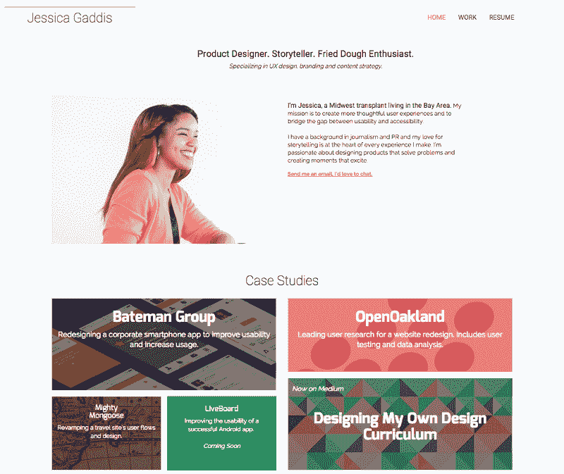

# 5 个失败的投资组合后，我在这里

> 原文：<https://www.freecodecamp.org/news/5-failed-portfolios-later-and-here-i-am-590707f38089/>

杰西卡·玛丽亚·加迪斯

# 5 个失败的投资组合后，我在这里

Art credit: [Eboy.com](http://hello.eboy.com/eboy/)

#### 我们是朋友，对吗？太好了——现在我向你展示我的 UX 投资组合过去的样子，感觉没那么糟糕了…

我的电脑上有一个名为 *Developments* 的文件夹，里面存放着我所有的“开发”。从我玩 Ruby on Rails 到我学习 Swift 的不幸经历。

在同一个文件夹里，你会发现我的 UX 作品集的六个不同版本，每个版本都以我开始创作的日期命名，在某些情况下，以我结束创作的日期命名。

A look inside my “Developments” folder

9 月 12 日是我开始为我的第一个作品集写代码的日子。我终于习惯了追求 UX 的想法，我想在这个过程中发展我的编码技能。

这就是我 9 月 12 日作品集的结局:

Portfolio September 12

我对它看起来如此糟糕感到沮丧，所以我停下来了。

***RIP Portfolio 9 月 12 日。死亡时间:九月十二日晚上十点半。***

几周后，我决定再试一次，9 月 30 日作品集诞生了。这是我那天所得到的:

Portfolio September 30

***死亡时间:9 月 30 日下午 3 点 34 分。***

此时我对自己很恼火，诅咒前端大神，也在怀疑自己的能力。

我一直告诉人们我可以编写代码，然而我甚至不能完成一个非常简单的网站。

我又给了自己几周时间。我开始在随机的餐巾纸和便利贴上勾画我的每一个想法，希望有一天我至少能完成我网站的框架。

10 月 10 日和 10 月 15 日被证明是充满希望的日子，但直到 10 月 24 日我才真正开始看到这个网站的雏形:

Portfolio October 24

我对这个版本非常满意，并持续做了几个星期，直到有一天我意识到我可以做得更好。所以我决定放弃所有的进步，重新开始。

又来了。

我毫不迟疑地从头开始:*新文件夹>无标题文件夹>作品集 11 月*4 月。

我承认，第一个版本结果并不太好，但我很高兴地告诉大家，我正在进行第三次迭代，我想我会将这个版本保留一段时间:

Portfolio November 4, v.1

Portfolio November 4, v.2

Portfolio November 4, v.3 (Current)

什么变了？

嗯，我想是所有的事情。首先，我开始相信自己的知识，挑战自己的极限。我没有追求简单的想法，而是决定一有机会就尝试新的东西。有时我在笔记本上写代码，只是为了理解所有的东西，我甚至开始用 HTML 和 CSS 做梦。我知道。奇怪。

当我碰壁时，我没有放弃，而是保存了我的工作，关闭了电脑，几天后又回来了。

当我开始的时候，我设定了大的目标，比如在 XX 日之前完成文件夹，当我不能跟上自己设定的期限时，我感到沮丧。所以，我开始把我的目标分成更容易管理的部分。我工作到早上 6 点，有时仅仅是因为我喜欢获胜的感觉。小胜利，但仍然是胜利。

我的网站的第二版是第一个真正看到真实网址的版本。它于 2015 年 12 月 31 日上线，证明了在新年之前将某些东西推出门外并进入宇宙。版本 3 在上周六上线，我花了三个多小时才完成更新。

总而言之，我很高兴我没有放弃，我可以清楚地衡量我在过去的六个月里取得了多大的进步。

所以，对于那些害怕强大的投资组合或者正在开发你的第一个网站的人，不要停下来！我经历了六次失败的尝试之后，才有了可以展示给人们的东西。

11 月 4 日，你的作品集正等着你去打造！即使你不得不从头开始无数次，这仍然是值得的，我保证你会越来越好，每一个版本。

特别感谢 Stack Overflow 上的所有人——尤其是那些可能认为自己在问愚蠢问题的人。你，我的朋友，拯救了我的理智。