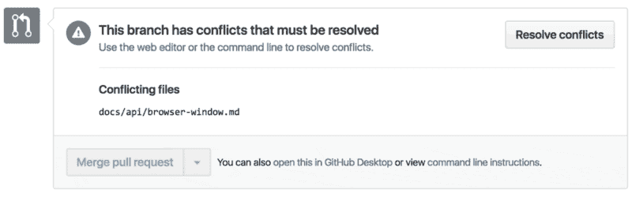

# 给新程序员的 5 个 GitHub 技巧

> 原文：<https://www.freecodecamp.org/news/5-github-tips-for-new-coders-2f312689ffd5/>

作者艾莉森·拉

# 给新程序员的 5 个 GitHub 技巧

今年十月，我庆祝了在 GitHub 工作五周年。？5 年前，我是一名热情的会计师(就像直男书呆子一样——我以前的 twitter 账号是@taxaly)，对代码一无所知，更不用说使用 Git 和 GitHub 了。

现在我是一名热情的数据科学家，知道一些关于使用 Git & GitHub 编码的事情。正是由于学习了这些技术，我才做出了这一有意义的职业转变。

但是即使在 GitHub 工作，学习 Git 和 GitHub 也很难！由于它是开源贡献的一种形式，我想与其他新编码的人分享我使用 GitHub 的 5 大技巧。

### **提示 1:更改与 Git 相关的默认文本编辑器**

对于许多人来说，从终端使用 Git 时，默认的文本编辑器是 VIM。对于新手或普通黑客来说，VIM 可能是一件可怕的事情。或者甚至对于资深黑客或者 [@haacked](https://twitter.com/haacked) 本人。

如果您发现自己遇到了合并冲突(您将会遇到，参见技巧 4)，您将被踢出到 VIM 来解决冲突，然后您将需要知道特定的 VIM 命令来编辑文档，并且想哭。一年多来，我在工作时在我的显示器上放了一个便签，提醒我基本的 VIM 命令，如`i`(编辑)和`:wq`(保存并退出)。为了避免潜在的问题，你可以改变默认的文本编辑器。

为了将您的文本编辑器更改为 Atom、Sublime 或 TextMate，请遵循本 [GitHub 帮助](https://help.github.com/articles/associating-text-editors-with-git/)中的说明。

当你这样做的时候，你还应该确保你的快捷方式已经设置好了，这样你就可以使用`subl .`或`atom .`直接从终端打开你喜欢的文本编辑器中的文件，查看[这些文档](http://flight-manual.atom.io/getting-started/sections/atom-basics/#opening-modifying-and-saving-files)用于从你的终端设置 Atom 访问，查看[这些文档](http://www.sublimetext.com/docs/2/osx_command_line.html)用于设置 Sublime。

### 技巧 2: **改变你的点文件**

我是在黑进和使用 Git & GitHub 多年后才了解到 dotfiles 的。我仍然很沮丧，我没有早点知道这件事！

Dotfiles 允许您定制您的终端提示，这样您就可以看到您在哪个 git 分支上&如果您有未提交的更改。简直是天才！我从一个同事([约翰·努纳梅克](https://www.freecodecamp.org/news/5-github-tips-for-new-coders-2f312689ffd5/undefined))那里得到了[我的点文件](https://github.com/alysonla/dotfiles)，但是如果你在 GitHub 上搜索‘点文件’，你会找到很多选项。

dotfiles for the win!

### 提示#3: **安装轮毂**

[Hub](https://github.com/github/hub) 是一个命令行工具，让使用 GitHub 变得更加容易。我经常在我的终端上处理一个存储库，但是想在 GitHub 上看到问题或者拉请求。所以我会打开一个浏览器标签，然后被电子邮件/Twitter/一只小狗分散注意力——十分钟后，开始输入 GitHub 资源库的 url。

通过在终端键入`hub browse`,它会自动神奇地直接在你的浏览器中打开资源库的 url，进行免费的 GitHub-ing。嘣。

Nash the Octodog

### 技巧 4: **练习合并冲突**

在这一点上，我承认我有时是个半途而废的人。特别是在合并冲突的时候。我不记得有多少次我因为遇到合并冲突而放弃了一个项目或拉请求。

它们让我害怕，关于如何修复它们的医生也让我害怕，然后我就进入了 VIM，想要永远退出(见提示 1)。

然后我意识到我需要面对我的恐惧，所以我开始了一个实践库，故意制造了一个合并冲突**，[浏览了文档](https://github.com/blog/2293-resolve-simple-merge-conflicts-on-github)或者看了一个关于如何修复合并冲突的 YouTube 视频。我做过几次。现在你也可以[在 GitHub 用户界面中修复简单的合并冲突](https://github.com/blog/2293-resolve-simple-merge-conflicts-on-github)，这很方便。**

**今天，当我遇到合并冲突时，我稍微不那么害怕了，并平静地删除了胡萝卜，因为我知道多亏了版本控制，我不会把事情搞得太糟。**

**

Practice.** 

### ****技巧 5:制作 GitHub 页面****

**GitHub 页面是一个 GitHub 将免费托管的个人或基于项目的网站！有一个实际的项目推进到 GitHub 来练习你的 Git 和 GitHub 技能总是有帮助的。**

**使用编码教程中的 HTML、CSS 和 JavaScript 制作一个简单的网站，然后按照步骤将其托管在 GitHub 上[这里](https://pages.github.com/)或者你可以查看[我不久前制作的这个](https://www.youtube.com/watch?v=rRGrT0wsJxI)视频，其中有一步一步的说明。或者试试超级简单的[叉走](https://github.com/jlord/forkngo)法。**

**最后，我要偷偷告诉你第六个可能是显而易见的提示，那就是——**参加 Git 和 Github 课程或教程**！**

**这里有几个值得一看的:**

*   **https://github.com/jlord/git-it-electron**
*   **freeCodeCamp 视频:[https://youtu.be/vR-y_2zWrIE](https://youtu.be/vR-y_2zWrIE)**
*   **GitHub 培训:[https://services.github.com/on-demand/resources/](https://services.github.com/on-demand/resources/)**
*   **git cheat sheet—[http://ohshitgit.com/](http://ohshitgit.com/)**

**我希望这个提示列表对你有所帮助，如果你在学习 Git 和 GitHub 的过程中有任何其他有用的提示，我很乐意听听！❤**