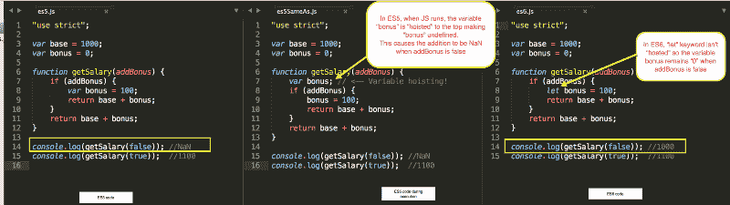
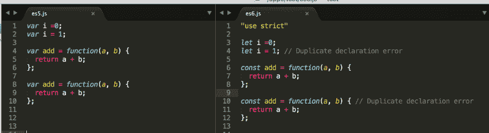
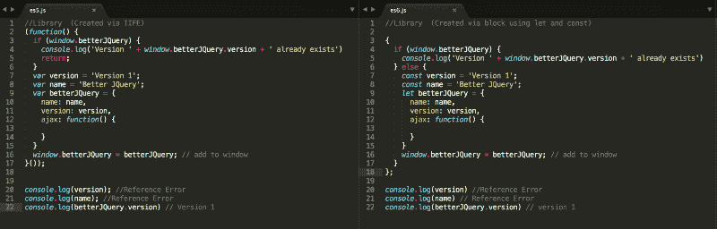
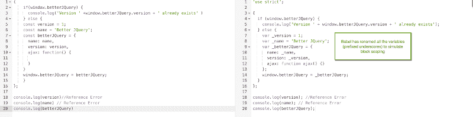
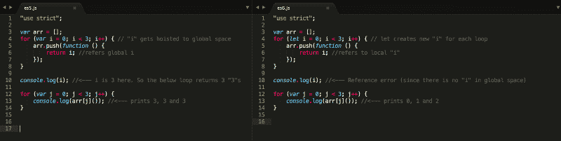
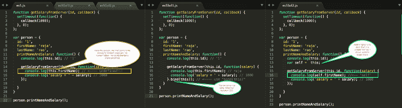
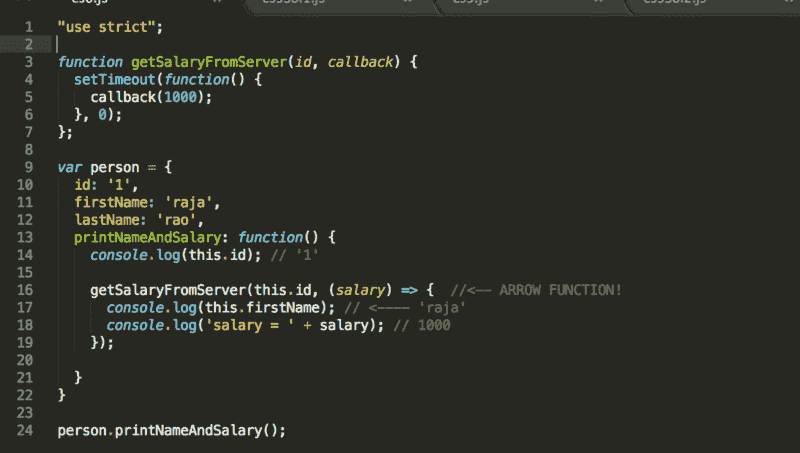
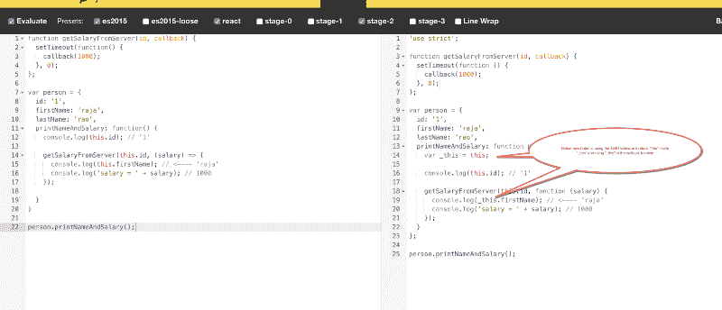
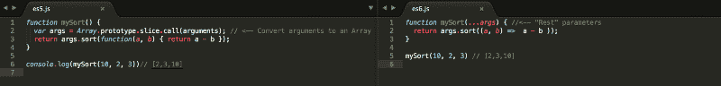
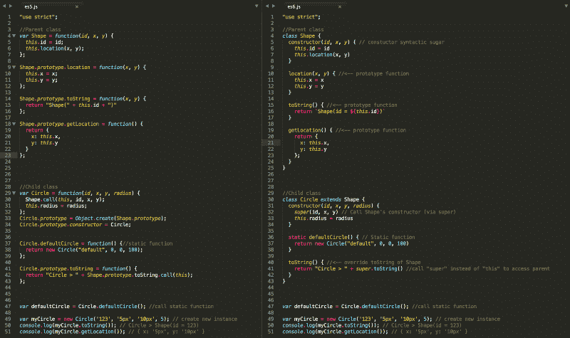

# ES6 中修复的 5 个 JavaScript“坏”部分

> 原文：<https://www.freecodecamp.org/news/5-javascript-bad-parts-that-are-fixed-in-es6-c7c45d44fd81/>

作者 rajaraodv

# ES6 中修复的 5 个 JavaScript“坏”部分

ECMAScript 6 (ES6)的特性可以分为纯语法的特性(比如: **class** )、增强 JavaScript 的特性(比如 **import** )和修复 JavaScript 一些“坏”部分的特性(比如 **let** 关键字)。大多数博客和文章结合了这三种类型，会让新来者不知所措。所以我写了这篇文章，只关注 ES6 修复“坏”部分的关键特性。

> 我希望在这篇博客结束的时候，你会意识到仅仅使用几个 ES6 的特性，比如 let 和胖箭头，你就会获得巨大的回报。

好了，我们开始吧。

### 1.块范围

ES5 只有“函数级作用域”(也就是说，你将代码包装在函数中来创建作用域)，这导致了很多问题。当我们使用“ **let** 或“ **const** ”而不是“ **var** ”时，ES6 提供了“块”级别的作用域(即作用域的花括号)。

#### 防止范围外的变量提升

下图显示了变量“bonus”并没有像大多数编程语言一样挂在“if”块之外。

> 注意:你可以点击图片放大阅读

#### 防止重复的变量声明

当我们在同一个作用域中使用**“let”或“const”声明变量时，ES6 不允许重复声明变量。这非常有助于避免来自不同库的重复函数表达式(如下面的“add”函数表达式)。**

#### 消除了对生命的需求

在 ES5 中，在下面这样的情况下，我们必须使用立即调用函数表达式(life)来确保我们不会污染或覆盖全局范围。在 ES6 中，我们可以只使用花括号({})并使用 **const** 或 **let** 来获得相同的效果。

#### babel——将 ES6 转换成 ES5 的工具

> 我们最终需要在常规浏览器中运行 ES6。Babel 是用来将 ES6 转换成 ES5 的最流行的工具。它有各种界面，如命令行界面，节点模块，也有一个在线转换器。我为我的应用程序使用节点模块，并使用[在线版本](http://babeljs.io/repl/)来快速查看差异。

> 下图显示了 Babel 如何重命名变量来模拟“let”和“const”！

BabelJS.io renaming variables to simulate let and const

#### 使得在循环中使用函数变得很简单

在 ES5 中，如果你在一个循环中有一个函数(比如 for(var I = 0；i < 3; i++) {…}), and if that function tried to access the looping variable “i”, we’d be in trouble because of hoisting. In ES6, if you us **e "** let "，您可以毫无问题地使用功能。

> 注意:你不能使用**常量**，因为它是**常量**，除非你使用新的 for..循环的。

### 2.词汇“this”(通过箭头函数)

在 ES5 中，“this”可以根据它被调用的“位置”甚至“如何”调用而变化，这给 JS 开发人员带来了各种各样的痛苦。ES6 通过“词法”解决了这个主要问题。

> 词汇“this”一个强制变量“this”总是指向其物理位置**的对象的特性。**

#### ES5 中的问题和两个解决方法:

在下图中，我们试图打印一个用户的名字和薪水。但是我们是从服务器拿工资的(模拟)。请注意，当响应返回时，“this”是“window”而不是“person”对象。

ES5 — the problem and two workarounds

#### ES6 中的解决方案

简单地使用胖箭头函数= >，你就会自动得到词汇“this”。

Line 16 shows how to use => function in ES6

> 下图显示了 Babel 如何将胖箭头函数转换成常规的 ES5 函数，以便在当前的浏览器中工作。

babel is converting fat-arrow to regular ES5 function w/ workaround #2

### 3.处理“争论”

在 ES5 中，“arguments”的行为就像一个数组(也就是说，我们可以对它进行循环)，但它不是一个数组。因此，所有像排序、切片等数组函数都不可用。

在 ES6 中，我们可以使用一个叫做“Rest”参数的新特性。它用 3 个点和一个类似于 **…args 的名字来表示。** Rest 参数是一个数组，所以我们可以使用所有的数组函数。

Picture shows ES6 “Rest” parameters

### 4.班级

从概念上讲，JS 中没有像 Java 等其他面向对象语言中那样的“类”(即蓝图)。但是很长一段时间以来，当我们使用“new”关键字作为类时，人们一直将创建对象的“函数”(又名“函数构造函数”)视为类。

由于 JS 不支持“类”,只是通过“原型”来模拟它，它的语法对于现有的 JS 开发人员和希望以传统 OO 方式使用它的新来者来说都非常混乱。对于 **来说尤其如此，比如:创建子类，在父类中调用函数等等。**

ES6 带来了一种在各种编程语言中通用的新语法，并使整个事情变得简单。下图显示了 ES5 和 ES6 类的并排比较。

> 注:可以点击图片放大阅读

ES5 Vs ES6 (es6-features.org)

> **更新:一定要看:[*ES6 中的“类”是新的“坏”的部分吗？*](https://medium.com/@rajaraodv/is-class-in-es6-the-new-bad-part-6c4e6fe1ee65#.4hqgpj2uv) *(在此之后)***

### 5.严格模式

[严格模式](https://developer.mozilla.org/en-US/docs/Web/JavaScript/Reference/Strict_mode)(“使用严格”)有助于识别常见问题(或“坏的”部分)，也有助于[“保护”JavaScript](https://developer.mozilla.org/en-US/docs/Web/JavaScript/Reference/Strict_mode#Securing_JavaScript) 。在 ES5 中，严格模式是可选的，但在 ES6 中，许多 [ES6 特性](http://www.ecma-international.org/ecma-262/6.0/#sec-strict-mode-code)都需要它。所以像 babel 这样的大多数人和工具都会自动在文件的顶部加上“use strict ”,将整个 JS 代码置于严格模式，迫使我们编写更好的 JavaScript。

就是这样！？

#### 如果这有用，请点击拍手？下面扣几下，以示支持！⬇⬇⬇ ?？

### 我的其他帖子

[*https://medium.com/@rajaraodv/latest*](https://medium.com/@rajaraodv/latest)

#### *ECMAScript 2015+*

1.  *[*看看这些有用的 ECMAScript 2015 (ES6)提示和技巧*](https://medium.freecodecamp.org/check-out-these-useful-ecmascript-2015-es6-tips-and-tricks-6db105590377)*
2.  *[*ES6*](https://medium.com/@rajaraodv/5-javascript-bad-parts-that-are-fixed-in-es6-c7c45d44fd81#.7e2s6cghy)中修复的 5 个 JavaScript“坏”部分*
3.  *[*ES6 中的“类”是新的“坏”的部分吗？*](https://medium.com/@rajaraodv/is-class-in-es6-the-new-bad-part-6c4e6fe1ee65#.4hqgpj2uv)*

#### *终端改进*

1.  **如何让你的终端变得更有趣**
2.  **[*用七个步骤让你的“ZSH”码头焕然一新——视觉指南*](https://medium.freecodecamp.org/jazz-up-your-zsh-terminal-in-seven-steps-a-visual-guide-e81a8fd59a38)**

#### **万维网**

1.  ***一段精彩纷呈的网络和 JavaScript 历史***

#### ***虚拟 DOM***

1.  ***[*虚拟 DOM 的内部运作*](https://medium.com/@rajaraodv/the-inner-workings-of-virtual-dom-666ee7ad47cf)***

#### **反应性能**

1.  **[*两种快速缩减 React App 生产规模的方法*](https://medium.com/@rajaraodv/two-quick-ways-to-reduce-react-apps-size-in-production-82226605771a#.6lepbl7ae)**
2.  **[*用 Preact 代替 React*](https://medium.com/@rajaraodv/using-preact-instead-of-react-70f40f53107c#.7fzp0lyo3)**

#### **函数式编程**

1.  **[*JavaScript 是图灵全集——解释*](https://medium.com/@rajaraodv/javascript-is-turing-complete-explained-41a34287d263#.6t0b2w66p)**
2.  **[*JS 中的函数式编程—结合实例(上)*](https://medium.com/@rajaraodv/functional-programming-in-js-with-practical-examples-part-1-87c2b0dbc276#.fbgrmoa7g)**
3.  **[*JS 中的函数式编程—结合实例(下)*](https://medium.freecodecamp.org/functional-programming-in-js-with-practical-examples-part-2-429d2e8ccc9e)**
4.  **[*Redux 为什么需要还原器是“纯函数”*](https://medium.com/@rajaraodv/why-redux-needs-reducers-to-be-pure-functions-d438c58ae468#.bntrywxrf)**

#### **网络包**

1.  **[*Webpack —令人困惑的部分*](https://medium.com/@rajaraodv/webpack-the-confusing-parts-58712f8fcad9#.6ot6deo2b)**
2.  **[*Webpack &热模块更换【HMR】*](https://medium.com/@rajaraodv/webpack-hot-module-replacement-hmr-e756a726a07#.y667mx4lg)*(引擎盖下)***
3.  **[*Webpack 的 HMR 和 React-Hot-Loader —失踪手册*](https://medium.com/@rajaraodv/webpacks-hmr-react-hot-loader-the-missing-manual-232336dc0d96#.fbb1e7ehl)**

#### **Draft.js**

1.  **[*为什么选择 Draft.js，为什么要投稿*](https://medium.com/@rajaraodv/why-draft-js-and-why-you-should-contribute-460c4a69e6c8#.jp1tsvsqc)**
2.  **[*draft . js 如何表示富文本数据*](https://medium.com/@rajaraodv/how-draft-js-represents-rich-text-data-eeabb5f25cf2#.hh0ue85lo)**

#### **反应和还原:**

1.  **[*逐步构建 React Redux 应用指南*](https://medium.com/@rajaraodv/step-by-step-guide-to-building-react-redux-apps-using-mocks-48ca0f47f9a#.s7zsgq3u1)**
2.  **[*React Redux CRUD App 构建指南*](https://medium.com/@rajaraodv/a-guide-for-building-a-react-redux-crud-app-7fe0b8943d0f#.g99gruhdz) *(3 页 app)***
3.  **[*在 React Redux 应用中使用中间件*](https://medium.com/@rajaraodv/using-middlewares-in-react-redux-apps-f7c9652610c6#.oentrjqpj)**
4.  **[*添加一个健壮的表单验证来反应 Redux 应用程序*](https://medium.com/@rajaraodv/adding-a-robust-form-validation-to-react-redux-apps-616ca240c124#.jq013tkr1)**
5.  **[*用 JWT 令牌保护 React Redux 应用*](https://medium.com/@rajaraodv/securing-react-redux-apps-with-jwt-tokens-fcfe81356ea0#.xci6o9s6w)**
6.  **[*在 React Redux 应用中处理交易邮件*](https://medium.com/@rajaraodv/handling-transactional-emails-in-react-redux-apps-8b1134748f76#.a24nenmnt)**
7.  **[*解剖一个 React Redux App*](https://medium.com/@rajaraodv/the-anatomy-of-a-react-redux-app-759282368c5a#.7wwjs8eqo)**
8.  **[*Redux 为什么需要还原器是“纯函数”*](https://medium.com/@rajaraodv/why-redux-needs-reducers-to-be-pure-functions-d438c58ae468#.bntrywxrf)**
9.  **[*两种快速缩减 React App 生产规模的方法*](https://medium.com/@rajaraodv/two-quick-ways-to-reduce-react-apps-size-in-production-82226605771a#.6lepbl7ae)**

#### **如果这有用，请点击拍手？按钮下面几下，以示支持！⬇⬇⬇ ?？**