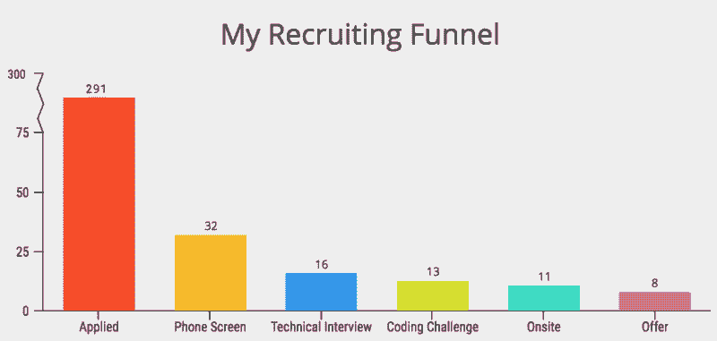
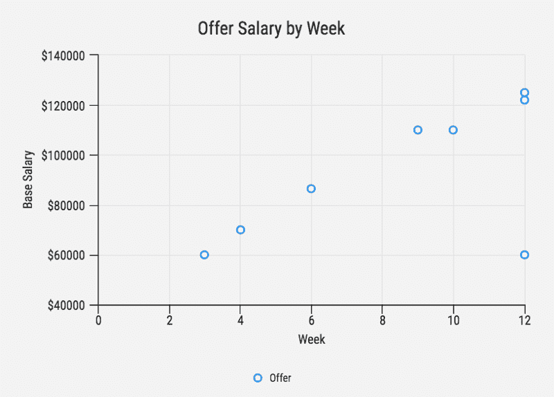
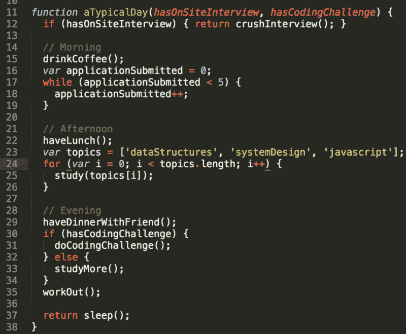

# 在一次编码训练营之后，我花了 3 个月申请工作。以下是我学到的。

> 原文：<https://www.freecodecamp.org/news/5-key-learnings-from-the-post-bootcamp-job-search-9a07468d2331/>

费利克斯·冯

# 在一次编码训练营之后，我花了 3 个月申请工作。以下是我学到的。

新兵训练营的旅程中鲜为人知的一部分是你毕业后会发生什么——当你寻找一个六位数的开发人员职位时。

< 3% of applications became offers

我在 2016 年 7 月完成了 Hack Reactor，花了近 3 个月的时间才接受了 Radius Intelligence 的邀请。我申请了 291 家公司，做了 32 次电话筛选，16 次技术筛选，13 次编码挑战，11 次现场面试，收到了 8 份录用通知。美国各地公司提供的薪水从 6 万美元到 12.5 万美元不等，包括前端和全栈职位。总的来说，2.8%的申请成为要约。

以下是我希望在开始找工作之前就知道的 5 件事。

### **洞察力#1:了解真实的人**

起初，我用散弹枪的方法申请公司。我通过 Indeed.com、AngelList、LinkedIn、StackOverflow、黑客新闻、公司网站，甚至 Craigslist 申请。

我会为任何需要 React、Node 或 JavaScript 经验的角色提交简历。在第一周，我每天申请 15-20 家公司。

> *提示:寻找使用这种[简单申请回购](https://github.com/j-delaney/easy-application)的公司。*

我的产量很低。不到百分之五的公司回复了我。我把申请扔进了黑洞。

当我的一位前招聘人员同学分享了一份求职指南时，一切都改变了。他告诉我们用每个应用程序直接发送电子邮件给真实的人。可能是任何人。只要有人看。

从那时起，每当我提交申请时，我都会在 LinkedIn 上搜索该公司，并给他们工程或招聘团队的某个人发电子邮件。

对于大多数小公司或首席执行官来说，电子邮件格式通常是 firstName@dreamCompany.com。对于大公司来说，可能是 firstName.lastName@dreamCompany.com。

为了验证电子邮件，我使用了 [Rapportive](https://rapportive.com/) 来交叉检查电子邮件和社交媒体账户。

结果是惊人的。在发送了 150 多封邮件后，我的回复率高达 22%。

听到真人的声音也感觉很棒。令人惊讶的是，CEO 和 CTO 都回复了我。有时他们甚至亲自采访我。

> 要点:如果你从前门申请，确保你能接触到人。

### 洞察力#2:从小处着手，逐步提升

你将面临 1 级面试(一家需要任何 dev 的非科技公司)，面试官问你的无非是 JavaScript 琐事。

你将面临 9 级面试(谷歌/脸书级别)，面试官会问一些困难的数据结构和算法问题。

我战略性地设置了我的流程，这样我就可以先进行低层次的面试，然后再进行高层次的面试。

早期，我获得了经验，树立了信心，并从面试不那么激烈的公司那里获得了工作机会。

随着我获得更多的经验，我有效地“升级”我能够在招聘门槛更高的公司完成面试。下面是我参与这个过程的周数和我拿到的基本工资之间的线性关系。

There’s a direct correlation between time spent interviewing and offer salary.

我解开了更难的问题。我获得了更高的薪水。最终，我找到了我的工作。

> 要点:计划在早期应对简单的面试，在后期应对更难的面试。

### **洞察力#3:学习就像你未来的工作取决于它一样(因为它确实如此)**

我不想打断你，但是在任何时候你能做的最重要的事情就是学习和准备。

为什么？因为如果你对他们问你的问题没有好的答案，你就不会得到工作机会。

如果人们认为你没有为他们的面试做好准备，他们不会推荐你。

从 Hack Reactor 出来，我的弱点是数据结构和算法。Triplebyte 的一项研究发现，训练营的毕业生在这些方面不如计算机科学专业的毕业生。

于是我学了，练了。每天都是。

我花了一整天学习排序算法。其他日子，我专注于理解互联网是如何工作的。

如果我没有完全理解一个概念，我会花一天时间看 YouTube 视频或搜索 StackOverflow，直到我理解为止。

我发现以下学习材料很有用:

*   [面试蛋糕](https://www.interviewcake.com/):我最喜欢的数据结构和算法的资源。它将解决方案分解成一步一步的块——这是破解代码面试(CTCI)的一个很好的替代方案。我唯一的抱怨是他们没有更多的问题！
*   [HiredInTech 的系统设计板块](https://www.hiredintech.com/classrooms/system-design/lesson/60):系统设计面试问题大指南。
*   如果你像躲避瘟疫一样躲避 CTCI，Coderust 2.0 可能非常适合你。只需 49 美元，你就可以获得几乎任何编程语言的解决方案，并带有交互式图表。
*   Reddit 的《如何准备科技面试》:我经常以此作为衡量自己准备程度的基准。
*   [前端面试问题](https://github.com/h5bp/Front-end-Developer-Interview-Questions):一份*详尽的*前端问题清单。
*   [Leetcode](https://leetcode.com/) :算法和数据结构问题的首选资源。你可以按公司进行过滤，例如，你可以得到优步或谷歌通常会问的所有问题。

> 外卖:没有太多的准备。

### **洞察力#4:全力以赴**

进入这个行业很难。你必须好好表现，即使你没有完全准备好。为了成功，你必须成为自己的倡导者。

#### 推销自己

在 Hack Reactor，我们被训练来掩饰我们的缺乏经验。在我们的个人叙述中，我们故意忽略了我们的训练营教育。

为什么？否则，公司会自动将我们归类为初级开发人员，或者给我们贴上“经验不足”的标签

在一次对一家初创公司的面试中，当他们意识到我参加了一次训练营时，面试马上就泡汤了。一家公司用它来对付我，给了我 6 万美元的报价，以初级开发人员为基准。

最终，你需要让公司相信你能胜任这份工作。

与此同时，你需要让自己相信你能胜任这份工作。

你可以。专注于你对编程的热爱。关注你用 React 和 Node 构建的东西。专注于展示你在 JavaScript 和你所学的任何其他语言方面的深厚知识。

只有这样，他们才有理由给你这份工作。

#### 这是一个双向的对话

面试是雇员和雇主之间对适合度的相互探索。虽然说服雇主雇用你是你的工作，但赢得你的支持也是他们的工作。

不要羞于把面试当成评估工作机会的机会。

我和任何一家公司谈过，即使我只是有一点点兴趣。

我和所有邀请我的公司在全国各地做现场工作。我提出问题，吸取关于工程团队组织、使用的技术和工具、公司挑战和系统架构的知识。

> *提示:在面试中，问以下问题:*

> *您最近面临的一些技术挑战是什么？*

> 你喜欢在 X 公司工作的什么？

> 团队是如何构成的，任务通常是如何划分的？

我把每一次互动都视为一次学习机会。每次互动都帮助我提高了演讲、面试和技术技能。每次失败都帮助我找到了自己的盲点。

> *要点:不要低估自己！记住，这是一种相互的探索。*

### **洞察力#5:这是一场马拉松，而不是短跑**

旅程一点也不容易。3 个月来，我每周磨 6 天。但是我试着照顾自己。

What a typical day could look like in JavaScript

有时候，我会和朋友一起学习。其他时候，我会去找一家咖啡馆独自学习，或者去 Hack Reactor 的校友休息室。每周我都会和我们的职业顾问讨论我的进步。

过程中很容易烧坏。吃好，睡好，运动。

它会变得孤独。花时间和有相同经历的朋友在一起。

> 外卖:为漫长的比赛做准备，并确保照顾好自己。

### 总而言之，关键要点是:

1.  与真实的人沟通
2.  从小处着手，逐步提升
3.  学习吧，就像你未来的工作取决于它一样
4.  全力以赴
5.  这是马拉松，不是短跑

这个过程可能看起来没完没了，但你会成功的。继续投入时间。继续发送申请。继续照顾好你自己。所有这些最终都会有回报。

特别感谢[迪伦·特兰](https://www.freecodecamp.org/news/5-key-learnings-from-the-post-bootcamp-job-search-9a07468d2331/undefined)、[卡伦·赵](https://www.freecodecamp.org/news/5-key-learnings-from-the-post-bootcamp-job-search-9a07468d2331/undefined)、[罗希特‘桑尼’雷基](https://www.freecodecamp.org/news/5-key-learnings-from-the-post-bootcamp-job-search-9a07468d2331/undefined)、[杰克·佩斯](https://www.freecodecamp.org/news/5-key-learnings-from-the-post-bootcamp-job-search-9a07468d2331/undefined)、[阿娜美塔·古哈](https://www.freecodecamp.org/news/5-key-learnings-from-the-post-bootcamp-job-search-9a07468d2331/undefined)、斯蒂芬妮·刘以及其他许多人。

请将此分享给正在找工作的朋友。