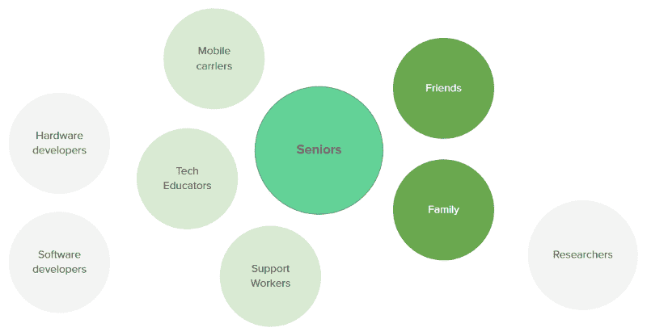
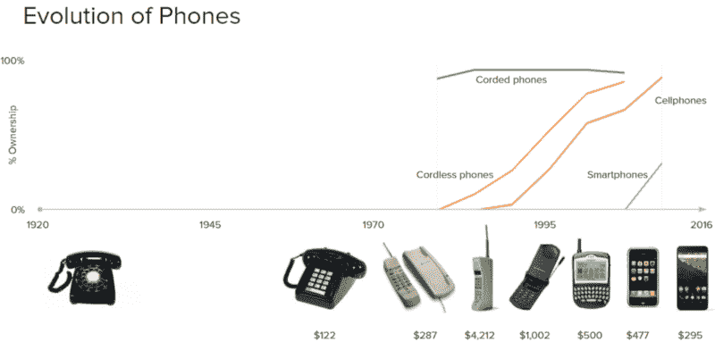

# 为老年人设计愉快数字体验的 5 个原则

> 原文：<https://www.freecodecamp.org/news/5-principles-for-designing-delightful-digital-experiences-for-seniors-8ece28229653/>

作者:毛凯

# 为老年人设计愉快数字体验的 5 个原则

My Grandfather doing what he loves, gardening. He really wanted to be able to take photos of his garden to show me.

当我们给我祖父买了他的第一部智能手机时，他非常激动。他已经听说了视频通话、智能手机摄影和把新闻装进口袋的种种奇迹。不幸的是，界面上的字体太小了。由于视力下降和手抖，他**根本无法使用它**。

> 到 2024 年，加拿大 20%的人口将达到 60 岁及以上。— [加拿大统计局](http://www.statcan.gc.ca/daily-quotidien/150929/dq150929b-eng.htm)

这意味着加拿大的老年人将首次超过 0-14 岁的儿童。根据皮尤研究中心(Pew Research Center)的数据，这个不断增长的群体正在快速采用技术。

那么为什么 2017 年技术还是那么难让学长们用呢？我想在今年的毕业设计论文中研究这个问题。

This is not what great user experience looks like folks. **credit**: [reddit user japanman195](https://www.reddit.com/r/funny/comments/1wddw9/my_90_year_old_grandma_from_japan_showing_us_how/)

为了更好地理解这一群体所面临的挑战，我采访了许多人。这包括老年人，但也包括移动运营商、家庭成员、技术教师和研究人员等。

More green = more involved.

从图中可以看出，学长和技术的这个问题空间不仅仅包括学长。

我想分享我的研究中的 5 个原则，这些原则指导我为 60 岁以上的老年人设计愉快的数字体验。

**小提示:**术语“老年人”是一个宽泛的术语，分为 3 个年龄段:

*   *年轻的*年老的(60-70 岁)
*   *中度*老年(70-80 岁)
*   *老*老(80+)。

这些群体之间的差异是显著的。刚过 60 岁的人可能对科技非常适应，而 90 岁的人可能就不那么适应了。为了简单起见，我将使用术语“高级”来包括所有这些子年龄。

### 原则 1:关注现实生活，而不是技术。

The single biggest complaint. “Why don’t people talk to each other on public transit anymore?”. [Image credit](http://maxpixel.freegreatpicture.com/Marmaray-Underground-Station-Phone-Istanbul-Subway-1304181)

学长对为了技术而学技术不感兴趣。对他们来说，技术是辅助手段，而不是现实生活的替代品。我听到的一个常见抱怨是，短信和视频电话无法取代面对面交流的 T2 艺术。

让老年人对技术感兴趣需要从技术如何给他们的生活增加价值的角度来看待它。你需要先了解他们的目标，这样你才能解释技术如何帮助他们更容易地实现这些目标。

### 原则二。尊重地交流，不使用行话。

Please. Do. Not. Compare. Seniors. To. Children. It’s disrespectful and insulting. [Image credit](http://www.zeroviolenza.it/component/k2/item/70070-i-ragazzi-in-balia-dei-media-abbandonati-fra-tv-e-web-g-gambassi).

高年级学生拥有广泛的技术能力。尽管如此，还是谨慎为妙。这并不意味着把事情变得简单，而是练习换位思考和理解。

*Phones really haven’t even been around that long.* ****Source****: [Telephone timeline](http://bgr.com/2013/12/13/telephone-timeline-a-brief-history-of-the-phone/), [cost of gadgets over time](http://www.washingtonpost.com/wp-srv/special/business/a-gadgets-life/)****

***电话只是在过去 100 年左右才出现。智能手机，在过去的 30 年里。这意味着对于一个 80 岁的人来说，智能手机出现在他们生活中的时间不到 20%。智能手机最初也是出了名的贵。这意味着大多数家庭买不起。***

***因此，对于许多老年人来说，技术是陌生的，这并不奇怪。对他们来说就像学习一门新的语言。如果你以前从未使用过电脑，什么是窗口、标签和鼠标？这就是为什么避免使用技术术语并尽可能解释是很重要的。***

### ***原则#3: **提供参与媒介的选择。*****

******

***有人给我讲了一个关于一位老人的故事，他需要帮助提交移民文件。他 70 多岁了，以前从未接触过技术。政府已经将这一过程完全数字化了。因此，他把自己的信用卡信息给了图书管理员来帮助他。我只能想象这种情况对他来说有多可怕。不仅如此，他还可能被人利用。***

***技术可以很棒。但是我们需要体谅那些对此感到不舒服的公民。我们需要提供模拟和数字选项。政府和公共服务部门应该对此特别敏感。***

### ***原则 4: **把明显的放在漂亮的前面**。***

***

Image credit: [Unsplash](https://unsplash.com/search/neon?photo=FQgI8AD-BSg)*** 

***高年级学生可能不太熟悉交互和用户界面模式。与其美观，不如清晰明显。无论你设计什么，防止错误都应该是首要目标。包括带有图标的单词，使用高颜色对比度，使用足够大的字体。WCAG 无障碍指南是设计无障碍界面的很好的参考。***

### ***原则 5:考虑隐私和安全问题。***

***

Image credit: [Unsplash](https://unsplash.com/collections/473843/privacysecurity?photo=8yYAaguVDgY)*** 

***随着年龄的增长，人们变得更具批判性和独立思考能力。高年级学生倾向于对技术持批判态度。这应该庆祝，而不是评判。***

***使用技术时，隐私和**安全**是首要考虑的问题。因此，你应该总是解释为什么你想要个人识别信息，如姓名或电子邮件。我建议尽可能避免注册，或者把它作为一个可选的步骤。***

***此外，你应该小心不要在你的设计中显得太“聪明”。一个例子是根据用户的购买历史在亚马逊上推荐类似的商品。虽然有用，但如果不了解它的工作原理，这可能会让老年人感到不安。***

***当涉及到技术时，老年人来自所有的经验水平。我定义的原则倾向于初学者。这将确保你的设计能被最大范围的老年人所理解。***

***我希望这些原则对你有用。这个世界需要更多包容所有人的设计。***

***感谢您花时间阅读！如果你喜欢这个，按那个❤来帮助其他人学习为老年人设计。***