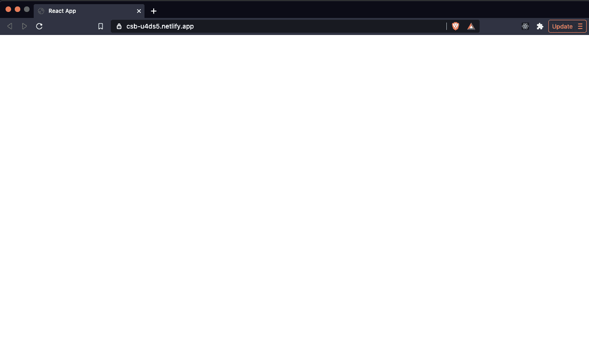
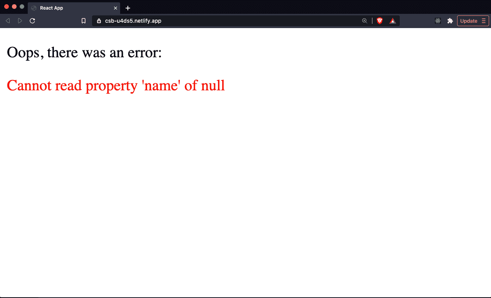

# 教程没有教给你的 5 个关键反应教训

> 原文：<https://www.freecodecamp.org/news/5-react-lessons-tutorials-dont-teach/>

React 开发人员需要了解许多基本概念和经验，而这些在大多数教程中都没有涉及到。

我精心挑选了一些我认为对你来说最重要的话题，但是很少有文章专门花时间来详细讨论。

让我们来看看你在别处可能找不到的、值得了解的五个关键 React 经验。

> 想学习成为高薪 React 开发人员所需的所有技能吗？查看 [**反应训练营**](https://reactbootcamp.com) 。

## 1.React 状态实际上是如何更新的

作为 React 开发人员，您知道可以用`useState`和`useReducer`钩子创建和更新状态。

但是当你用这些钩子更新一个组件的状态时会发生什么呢？状态是立即更新还是稍后更新？

让我们看看下面的代码，这是一个非常简单的计数器应用程序。正如你所料，你可以点击按钮，我们的计数器增加 1。

```
import React from 'react';

export default function App() {
  const [count, setCount] = React.useState(0)

  function addOne() {
    setCount(count + 1);
  }

  return (
    <div>
      <h1>Count: {count}</h1> {/* 1 (as we expect) */}

      <button onClick={addOne}>+ 1</button>
    </div>
  );
}
```

但是，如果我们试图添加一行，这也更新了我们的计数 1-你认为会发生什么？

当您点击按钮时，我们显示的计数会增加一个还是两个？

```
import React from 'react';

export default function App() {
  const [count, setCount] = React.useState(0)

  function addOne() {
    setCount(count + 1);
    setCount(count + 1);
  }

  return (
    <div>
      <h1>Count: {count}</h1> {/* 1?! */}

      <button onClick={addOne}>+ 1</button>
    </div>
  );
}
```

如果我们运行这段代码，我们会发现它只增加了 1！尽管试图用两次单独的状态更新将计数增加 1。

*为什么我们的计数器显示 1，尽管清楚地将状态增加 1 两次？*

这是因为 React 计划在我们第一次更新状态时执行状态更新。因为它只是被调度而不是立即执行(它是异步的，不是同步的)，所以在我们第二次尝试更新它之前，我们的`count`变量没有被更新。

换句话说，因为状态更新是预定的，而不是立即执行的，所以我们第二次调用`setCount`，`count`仍然只是`0`，而不是`1`。

尽管状态更新是异步的，我们可以解决这个问题，可靠地更新状态的方法是使用在`useState` setter 函数中可用的内部函数。

这允许我们获得先前的状态，并返回我们希望它在内部函数体中的值。当我们使用这种模式时，我们看到它像我们最初想要的那样增加了 2:

```
import React from 'react';

export default function App() {
  const [count, setCount] = React.useState(0)

  function addOne() {
    setCount(prevCount => prevCount + 1); // 1
    setCount(prevCount => prevCount + 1); // 2
  }

  return (
    <div>
      <h1>Count: {count}</h1>
      <button onClick={addOne}>+ 1</button>
    </div>
  );
}
```

## 2.最好使用多种效果，而不是一种

当执行一个副作用时，大多数 React 开发者只会`useEffect`一次，并试图在同一个效果函数中执行多个副作用。

那看起来像什么？下面你可以看到我们在一个 useEffect 钩子中获取帖子和评论数据，并放入它们各自的状态变量中:

```
import React from "react";

export default function App() {
  const [posts, setPosts] = React.useState([]);
  const [comments, setComments] = React.useState([]);

  React.useEffect(() => {
    // fetching post data
    fetch("https://jsonplaceholder.typicode.com/posts")
      .then((res) => res.json())
      .then((data) => setPosts(data));

    // fetching comments data
    fetch("https://jsonplaceholder.typicode.com/comments")
      .then((res) => res.json())
      .then((data) => setComments(data));
  }, []);

  return (
    <div>
      <PostsList posts={posts} />
      <CommentsList comments={comments} />
    </div>
  );
}
```

不要试图把你所有的副作用塞进一个效果钩子，就像你可以不止一次使用状态钩子一样，你可以使用几个效果。

这样做可以让我们将不同的行动分成不同的效果，以便更好地分离关注点。

与在类组件中使用生命周期方法相比，更好的关注点分离是 React hooks 提供的主要好处。

例如，在像`componentDidMount`这样的方法中，有必要包含我们希望在组件安装后执行的任何操作。你不能将副作用分解成多个方法——类中的每个生命周期方法只能使用一次。

React hooks 的主要好处是，我们能够根据它在做什么来分解我们的代码。我们不仅可以将渲染后正在执行的动作分离成多个效果，还可以将我们的状态放在一起:

```
import React from "react";

export default function App() {
  const [posts, setPosts] = React.useState([]);
  React.useEffect(() => {
    fetch("https://jsonplaceholder.typicode.com/posts")
      .then((res) => res.json())
      .then((data) => setPosts(data));
  }, []);

  const [comments, setComments] = React.useState([]);
  React.useEffect(() => {
    fetch("https://jsonplaceholder.typicode.com/comments")
      .then((res) => res.json())
      .then((data) => setComments(data));
  }, []);

  return (
    <div>
      <PostsList posts={posts} />
      <CommentsList comments={comments} />
    </div>
  );
}
```

这意味着我们可以把状态挂钩和与之相关的效果挂钩放在一起。这有助于更好地组织我们的代码，更好地理解它在做什么。

## 3.不要优化更新状态的函数(useState，useReducer)

每当我们将回调函数从父组件传递到子组件时，一个常见的任务是防止它被重新创建，除非它的参数已经改变。

我们可以在`useCallback`钩子的帮助下进行优化。

useCallback 是专门为传递给子组件的回调函数创建的，以确保它们不会被不必要的重新创建，这将导致每当有重新呈现时组件的性能受到影响。

这是因为每当我们的父组件重新呈现时，它将导致所有子组件也重新呈现。这就是为什么我们的回调函数会在每次重新渲染时被重新创建。

然而，如果我们使用 setter 函数来更新我们用 useState 或 useReducer 钩子创建的状态，我们不需要用 useCallback 包装它。

换句话说，没有必要这样做:

```
import React from "react";

export default function App() {
  const [text, setText] = React.useState("")

  // Don't wrap setText in useCallback (it won't change as is)
  const handleSetText = React.useCallback((event) => {
    setText(event.target.value);
  }, [])

  return (
    <form>
      <Input text={text} handleSetText={handleSetText} />
      <button type="submit">Submit</button>
    </form>
  );
}

function Input({ text, handleSetText }) {
  return(
    <input type="text" value={text} onChange={handleSetText}  />
  )
}
```

原因直接来自 React 文档:

> React 保证 setState 函数标识是稳定的，不会在重新呈现时改变。这就是为什么从 useEffect 或 useCallback 依赖列表中忽略它是安全的。

因此，我们不仅不需要用 useCallback 对其进行不必要的优化，也不需要将其作为依赖项包含在 useEffect 中，因为它不会改变。

这一点很重要，因为在许多情况下，它可以减少我们需要使用的代码。最重要的是，这种优化代码的尝试是徒劳的，因为它本身会导致性能问题。

## 4.useRef 挂钩可以跨渲染保留状态

作为 React 开发人员，在 ref 的帮助下引用给定的 React 元素有时非常有用。我们在 React 中借助`useRef`钩子创建了 refs。

然而，需要注意的是,`useRef`不仅仅有助于引用某个 DOM 元素。React 文档本身就是这么说的:

> useRef 创建的 ref 对象是一个通用容器，具有可变的 current 属性，可以保存任何值。

能够用`useRef`存储和更新值有一定的好处。它允许我们存储一个不在内存中的值，这个值不会在重新渲染时被擦除。

如果我们想在一个简单变量的帮助下在渲染中跟踪一个值，它会在每次组件渲染时被重新初始化。但是，如果使用 ref，存储在其中的值将在组件的呈现过程中保持不变。

*以这种方式利用 useRef 的用例是什么？*

如果我们只想对初始渲染执行给定的副作用，例如:

```
import React from "react";

export default function App() {
  const [count, setCount] = React.useState(0);
  const ref = React.useRef({ hasRendered: false });

  React.useEffect(() => {
    if (!ref.current.hasRendered) {
      ref.current.hasRendered = true;
      console.log("perform action only once!");
    }
  }, []);

  return (
    <div>
      <button onClick={() => setCount(count + 1)}>Count: {count}</button>
    </div>
  );
}
```

尝试自己运行这段代码。

正如您将看到的，无论按钮被点击多少次，状态被更新多少次，重新渲染发生多少次，我们想要执行的动作(参见`console.log`)只执行一次。

## 5.如何防止你的 React 应用崩溃

React 开发人员需要知道的最重要的经验之一是如何处理未被捕获的错误，尤其是如果他们还没有将 React 应用程序发布到 web 上的话。

在下面的例子中，我们试图在我们的应用程序中显示一个 Header 组件，但是正在执行的操作导致了一个错误。也就是说，试图从空值中获取属性:

```
import React from "react";

export default function App() {
  return (
    <>
      <Header />
    </>
  );
}

function Header() {
  const user = null;

  return <h1>Hello {user.name}</h1>; // error!
}
```

如果我们将此代码投入生产，我们将看到一个与此完全一样的空白屏幕:



为什么我们什么也看不见？

同样，我们可以在 React 文档中找到答案:

> 从 React 16 开始，没有被任何错误边界捕获的错误将导致整个 React 组件树的卸载。

在开发过程中，您会看到一个红色的大错误消息，并带有一个堆栈跟踪，告诉您在哪里可以找到错误。然而，当您的应用程序运行时，您只会看到一个空白屏幕。

这不是您希望应用程序具有的行为。

但是有一种方法可以修复它，或者至少向用户显示一些信息，告诉他们如果应用程序意外崩溃，就会发生错误。你可以把你的组件树包装在一个叫做错误边界的地方。

错误边界是组件，允许我们捕捉错误并向用户显示回退消息，告诉他们发生了错误。这可能包括如何消除错误的说明(比如重新加载页面)。

我们可以在包`react-error-boundary`的帮助下使用一个错误边界。我们可以将它包装在我们认为容易出错的组件周围。它也可以包含在我们的整个应用组件树中:

```
import React from "react";
import { ErrorBoundary } from "react-error-boundary";

export default function App() {
  return (
    <ErrorBoundary FallbackComponent={ErrorFallback}>
      <Header />
    </ErrorBoundary>
  );
}

function Header() {
  const user = null;

  return <h1>Hello {user.name}</h1>;
}

function ErrorFallback({ error }) {
  return (
    <div role="alert">
      <p>Oops, there was an error:</p>
      <p style={{ color: "red" }}>{error.message}</p>
    </div>
  );
}
```

您也可以随意显示错误消息，并像处理任何普通组件一样处理它。

当错误发生时，我们得到的结果要好得多:



## 喜欢这篇文章吗？加入 React 训练营

**[React 训练营](http://bit.ly/join-react-bootcamp)** 将你应该知道的关于学习 React 的一切打包成一个全面的包，包括视频、备忘单，外加特殊奖励。

获得数百名开发人员已经使用的内部信息，以掌握 React、找到他们梦想的工作并掌控他们的未来:

[](http://bit.ly/join-react-bootcamp) 
*打开时点击此处通知*