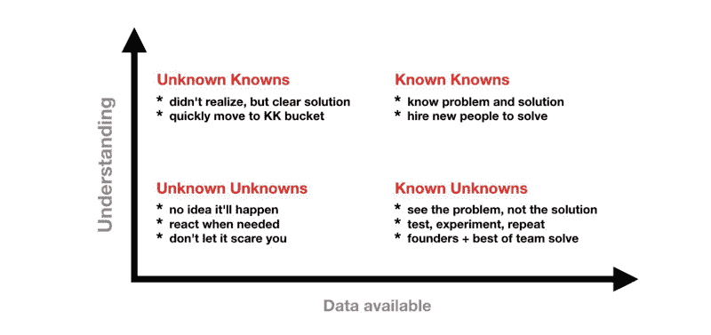
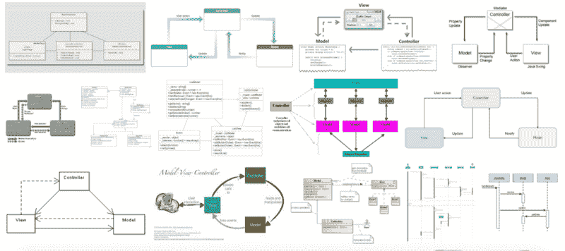

# 在工作 6 个月后，我很高兴知道的，我希望我已经知道的

> 原文：<https://www.freecodecamp.org/news/5-simple-things-i-was-happy-to-know-and-3-i-wish-i-knew-fedfdac0d30c/>

迈克尔·里宾采夫

# 在工作 6 个月后，我很高兴知道的，我希望我已经知道的

在用 freeCodeCamp 和其他在线资源自学了 web 开发的基础知识后，我得到了一份在英国牛津郡的初级 Web 开发员的工作。

前六个月已经过去了，在这篇文章中，我将谈论一些我认为在工作中需要了解的话题，以及一些我希望在开始工作之前能够早点涉及或更多关注的话题。

这篇文章献给所有初级和即将成为开发人员的人，以及他们聪明而耐心的导师。

### 开始工作前我很高兴知道的五件事

#### 1.如何解决问题？

当您理解了问题的本质(至少是近似的)，您知道问题的领域和所需的资源，并且您理解问题试图解决什么时，您就准备好解决问题了。

这些是完整解决方案的主要标准。

准备两个迭代:大的和小的。

**小:**

大声问自己一些你不知道答案的问题。与朋友或同事谈论这个问题，或者寻求帮助。我有古斯塔夫，花了 3 美元买的。他擅长反驳我的提议，并提出好的问题作为回应。集思广益。

Meet Gustav.

写下东西，画出图画，创建图表。然后，把事情分解。复杂到复杂，再复杂到简单。

然后列出已知的未知，研究它们。和你的古斯塔夫谈谈接下来的步骤。他说了什么？尝试一些事情，如果你失败了，重复迭代。

**大:**

有三个小迭代。更多的是浪费时间，虽然数字本身可以变化，而且是个人的。

如果事情不顺利，那就休息一下，和别人聊聊你做的事情。古斯塔夫，不幸的是在这里帮不上忙。你可以去散步/跑步/去健身房/淋浴/做任何单调的事情。尝试彻底切换精神问题。学一门外语课，读一本书，看一些吉他/钢琴/班卓琴 YouTube 教程。写一篇中等文章…

这是我目前为止为自己找到的一点金子。记下你自己的尝试、使用的材料和最初的想法。当你找到答案时，很容易认为所有的脑力劳动都是解决问题所必需的。但是你真的只需要以下三样东西:

*   背景工作。
*   最初的火花。
*   努力把成果带回家。

这时候日记就是一个完美的过滤器:

应该分析无用的背景工作。为什么白做了？然后从进一步的尝试中消除它。

试着重现火花的感觉和氛围。不过，可能要走很多路。

努力是可以优化的。

最后但同样重要的是，阅读有关解决问题的书籍，并与人们谈论他们如何处理问题。借点技巧。也试试那些。不幸的是，古斯塔夫不会在这里帮忙，但是，我相信，你知道的。

#### 2.如何搜索你需要的信息？

Google 是栈溢出之前的一步。所以好好利用它。

*   你的搜索会返回你不感兴趣的词语吗？排除他们！
*   你在寻找一个确切的短语吗？使用精确匹配！
*   不确定某个术语或寻找类似的东西？同义词搜索！

外面有数百篇文章，所以我只列举这篇作为例子:

[**如何像专业人士一样使用搜索:谷歌及其他公司的 10 个技巧和窍门**](https://www.theguardian.com/technology/2016/jan/15/how-to-use-search-like-a-pro-10-tips-and-tricks-for-google-and-beyond)
[*搜索引擎很擅长找到你想要的东西，但有时它们仍然达不到要求……*www.theguardian.com](https://www.theguardian.com/technology/2016/jan/15/how-to-use-search-like-a-pro-10-tips-and-tricks-for-google-and-beyond)

找到你需要的东西几乎是你将要做的工作的一半。省去扫描数百万条结果的麻烦！

#### 3.以及如何快速发现你不需要的信息。

是的，你发现的很多都是垃圾。略读和扫描是必备技能。

好消息，如果英语不是你的第一语言。你可能已经知道这些了。

[**略读和浏览**](http://www.bbc.co.uk/skillswise/factsheet/en05skim-e3-f-skimming-and-scanning)
[*理解略读和浏览一篇或多篇文章以获取信息或获得主旨的区别。*www.bbc.co.uk](http://www.bbc.co.uk/skillswise/factsheet/en05skim-e3-f-skimming-and-scanning)

#### 4.你不可能什么都知道。

我爷爷常说:“我希望我知道我不知道的事情。”是的，千真万确。

换句话说，我们都希望知道未知的未知。这种感觉很奇怪。意识到自己的无能后，要真正感到舒服。

Because who doesn’t like a chart?

#### 5.假设的基础。

在每个国家、行业、公司和部门，总有一些关于事物如何运作的基本原理的假定知识。

一些有意识的公司试图在部门/公司层面上记录这些假定的知识。而国家或行业层面的知识通常在大学教授。

但是如果你从未在这个行业工作过，或者从未获得过这个学科的学位呢？好吧，你会觉得自己是个局外人，应该进行一些学习。

想象一下，你在国外遇到一个人，他们邀请你去吃点东西或喝点饮料。他们可能认为你知道如何使用公共交通工具。你对当地饮食传统的熟悉程度也是假设的。你永远也不会听到长篇大论的“初学者公共交通购票”讲座。或者开设一门“酒吧点餐入门”课程。如果你不是这个星球的人，或者你的文化与你所在的星球截然不同，那该怎么办？

幸运的是，在我得到开发工作之前，我阅读了很多业内的“假定知识”。以下是我发现的最好的材料:

**互联网的历史:**

安德鲁·布鲁姆关于互联网是什么的演讲，作为一个物理对象的集合:

来自 Chrome 开发者的关于网络基础的最有用的资源之一:

关于浏览器和网络我学到的 20 件事
[*关于网络你一直想知道但又不敢问的事。在这个……*www.20thingsilearned.com](http://www.20thingsilearned.com/en-US)了解网络&浏览器

关于路由器和数据包的精彩介绍:

[**通过免费的在线课程、编程项目和面试准备学习编程……**](https://www.freecodecamp.org/videos/routers-and-packets)
[*在本视频中，我们将更详细地介绍路由器和数据包，以及一些重要的概念，以便了解……*www.freecodecamp.org](https://www.freecodecamp.org/videos/routers-and-packets)

我最喜欢的树屋三重奏:

[**HTTP 基础课程**](https://teamtreehouse.com/library/http-basics)
[*在本课程中，我们将了解设备用于相互通信的底层方法:HTTP…*teamtreehouse.com](https://teamtreehouse.com/library/http-basics)[**REST API 基础课程**](https://teamtreehouse.com/library/rest-api-basics)
[*你在网上遇到的许多 API 都使用一种称为 REST 的底层设计思想，它代表…*teamtreehouse.com](https://teamtreehouse.com/library/rest-api-basics)

是的，我知道，Treehouse 不是免费的，但是他们的免费 7 天试用足以涵盖以上三门课程。如果你刚刚起步，它们绝对物有所值。

> Woah，等等，你花钱去学课程了？

> *是的，我看到了。树屋实际上是我学习曲线的很大一部分。*

> *你能告诉我更多关于成为一名开发者的学习吗？*

> ***当然，我在的媒体上有[我的帖子，上面有详细的材料清单。](https://medium.com/@michael_mynah/how-i-got-my-job-as-a-junior-developer-and-realised-that-i-have-no-idea-about-what-happens-next-56938c56eac)***

### ****我希望自己更了解的三件事****

#### **1.饭桶**

**当你认为你了解 Git 的时候，它就会变成一只狼，拖着你用它写的东西跑进森林。所以你必须把你和它的关系恢复到它变成野兽之前的状态，并尽量把它关在室内。你只是希望有一天，你会停止忘记满月。**

**老实说，我只是还没有找到一门像样的课程。实际上，使用 Git 是最好的方法。涵盖基础知识，用 Git 做任何事情。不做开发商？为您的购物清单提出拉动式请求！**

#### **2.手动音量调节**

**或者应该是 MCV？**

**模型→视图→控制器。**

**无论你用哪种方式画箭头，这个概念都很简单。**

**Web 开发都是关于正确的抽象——也就是说，正确的抽象级别和选择。英语也用于同样的目的。所以如果一个单词看起来很熟悉，不要担心，它已经被用来表示其他的意思。**

> **请注意，根据您选择的图，下面的一些特征会从 MVC 的一部分流向另一部分。不，我也不知道。**

*   ****模型**就是你的数据抽象，你如何描述它，你如何写下来，你最终如何操纵它。**

**

These seemingly complicated and different diagrams all explain MVC. Well, at least they try…** 

*   ****视图**是你的用户界面。有许多方法可以创建您的视图。可以发 HTML/CSS，可以用 Razor(。NET 用 C#做前端语言的尝试)或者你的 React 或者 Angular。当然简单来说。**
*   ****控制器**是连接魔法发生的地方。它处理剩下的一切。视图是一张图片，模型是背景数字，而控制器是将所有这些集合在一起并生成一个您可以与之交互的页面。它处理您的点击和推送，您的 HTTP 请求，并告诉您您填写的讨厌的表单是否正确(也称为输入验证)。当它发生在控制器中时，它被称为服务器端输入验证。**

**说到剃刀观点:它们非常漂亮，实际上非常有趣。我强烈推荐用 Razor 创建你的页面布局。因为如果你决定走那条路，它会为你的反应做好准备。**

**实际上，它很少用于大型项目，因为无论如何，你最终都会使用 C#和 JavaScript。因为那个 jQuery(嗯是的，你确实认为 2017 年不需要它。*叹气*)真的很好，因为你没有正确填写那些表格。这就是前端输入验证。**

**哦，对了，忘了视图模型。嗯，他们就像你的观点的模型。我知道，这有多气人？**

***提示:如果这有点过分，请随意访问 [codeanalogies](https://www.codeanalogies.com/) ，这是一个美丽的地方，在那里许多复杂的概念都用日常事物来解释。我是认真的，下面是 [MVC 在](https://medium.freecodecamp.org/model-view-controller-mvc-explained-through-ordering-drinks-at-the-bar-efcba6255053)酒吧点饮料时的解释。***

#### **3.敏捷**

**在线课程很少指出这一条的重要性。**

**你的工作是写代码，对吗？不完全是。没有人关心代码，如果没有人需要代码的话。当有人需要你的代码时，他们可能会改变主意，不知道他们需要多少代码以及这些代码有什么用途。**

**你可能认为这没那么难，但是相信我，它很难！你的项目经理和业务分析师是你最好的朋友。他们已经完成了所有幕后棘手的繁重工作，所以你可以只写代码。简单来说，“制作一个按钮来做一件事”变成了“用户可以确认他们愿意参与我们提供的活动”。**

**现在你的任务是学习如何以最有成效的方式参与整个过程。是的，关于 Scrum、极限编程和看板有很多争论。但是现在，至少在理论上，知道什么是什么是好的。**

**在这个问题上有很多固执己见的人，坦率地说，甚至他们也经常犯错。这就像一个完美的比萨饼——它就是不存在。**

**从树屋开始的好地方:**

**[**Scrum 基础课程**](https://teamtreehouse.com/library/scrum-basics)
[*最近，几乎每个软件团队都说他们是“敏捷的”你甚至会发现许多工作机会宣称……*teamtreehouse.com](https://teamtreehouse.com/library/scrum-basics)**

**现在我要谈谈我学到的一些其他东西…**

#### **总的来说，任务没有我想象的那么重复。**

**当然，在该公司工作了很长时间的人确实有相当多的重复经历，并且不止一次地看到过很多事情。**

**但是总有一些事情是他们从来没有做过的。总是一些不寻常的，或者不标准的东西。很难进入一种纯粹下意识完成任务的“流水线”模式。**

**因此，作为一名新员工，学习如何做好一件事是非常困难的。你在一项任务上几乎只有一次机会，因为当它完成后，在相当长的一段时间内不会再有机会做类似的事情。**

**不过，这也有好的一面。它让我对我正在做的工作进行长期思考，并让我更好地记录我的过程和想法。这并不是说我从来不问同一个问题两次——天哪，我希望这是真的。大卫，非常感谢你的耐心:)**

****

#### **如果你喜欢这个故事，请点击？按钮并分享，以帮助其他人找到它。欢迎留言评论订阅。**

**在 Twitter 上，我是 Michael Rybintsev，在这里你可以找到我的日常工作和初级开发人员的生活。**

**以下是我的一些帖子，你可能会喜欢:**

**[**节省时间就像上帝一样，使用 npm**](https://medium.com/@michael_mynah/creation-using-npm-aecaebbb1701)
[*创造神话就是为了 npm，为了真实！*medium.com](https://medium.com/@michael_mynah/creation-using-npm-aecaebbb1701)[**2018 年初学者要学的前 3 种编程语言。**](https://medium.com/@michael_mynah/top-3-programming-languages-to-learn-for-a-beginner-in-2018-d8f2fd39072d)
[*Javascript。*](https://medium.com/@michael_mynah/top-3-programming-languages-to-learn-for-a-beginner-in-2018-d8f2fd39072d)
[*到处都是，学习资料也不错(看看 freeCodeCamp 的课程就知道了，Scott tolin ski……【medium.com *](https://medium.com/@michael_mynah/top-3-programming-languages-to-learn-for-a-beginner-in-2018-d8f2fd39072d)**

**如果你发现了一个错误或者知道如何改进这篇文章，请随时给我写信。**

#### **请便，请留下你的评论——我们有太多的事情需要谈论。**

#### **对话改变世界，不要害怕开始对话。**