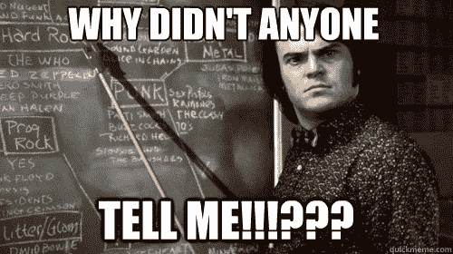
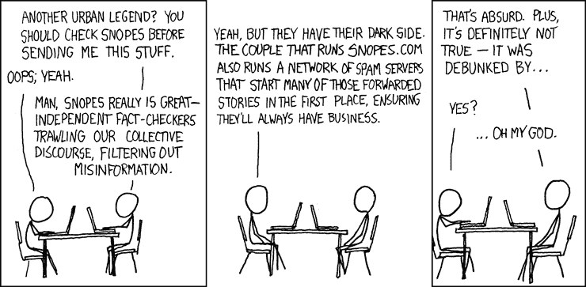
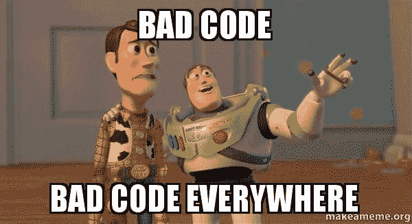
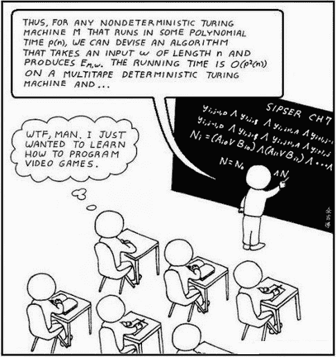
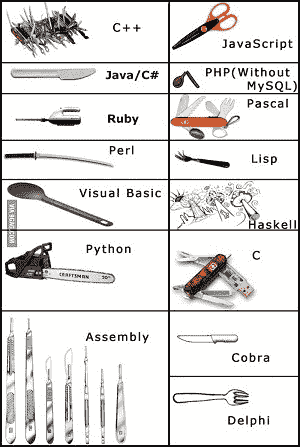
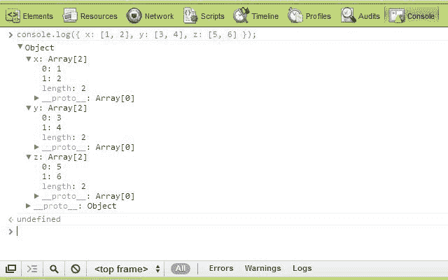

# 学习编程时要记住的 5 件事

> 原文：<https://www.freecodecamp.org/news/5-things-you-should-keep-in-mind-when-learning-to-program-and-shouldn-t-repeat-when-teaching-it-1ed8e734b04f/>

作者库尔特

# 学习编程时要记住的 5 件事

学习编程很有挑战性。除了选择一门语言或建立一个你一无所知的开发环境之外，还有成千上万的文章和教程，它们只会让你感到愚蠢，失去动力，或者让你认为到目前为止你所学的一切都是浪费时间，你做的一切都是错的。

我曾经经历过，所以我想我应该整理出一个简短的清单，列出你在学习编程时应该记住的事情，以防止你认为自己有智力障碍，或者让别人在阅读你的教程时感到有智力障碍。

#### **1。记住你是在互联网上。**

你不相信你读到的所有新闻都是合法的，或者你看到的照片不是 PS 过的，所以不要照字面理解你读到的一切。仅仅因为它是关于编程的，并不意味着它是可靠的或正确的。是一个人写的，人都会犯错，会有偏差。

#### **2。唯一真正糟糕的代码是不能工作或不能做它应该做的事情的代码。**

你会遇到很多这样的文章:如果 ***你……你是*** ***做错了*** 。这些绝大多数只是*意见*。首先关注返回正确结果的代码。

您可以编写一个简单的函数，用几乎任何语言以一百种不同的方式返回相同的结果；如果他们的做法如此“正确”，那是什么让其他九十九个都错了呢？他们用什么来分级——可读性？执行时间？都是相对于你编码的时候需要什么的。

与您为循环选择的方法相比，糟糕的命名约定、缩进和文档更有可能产生“糟糕”的代码。

#### **3。程序员有一种让其他人感到愚蠢的诀窍。**

编程中的两个常见概念是混淆(模糊交流中的意图，使信息混乱、故意含糊或难以理解)和抽象，出于某种原因，这似乎贯穿于程序员写的许多东西中。

他们在写作时倾向于使用非常大的单词，或者只与编程领域相关的术语。如果你在阅读一篇文章时不得不在谷歌上搜索一个单词 15 次，请记住你并不笨。相反，作者很可能想让你认为他真的很聪明，给你留下深刻印象。

他没有意识到的是，当阅读一篇使用大词的文章时，人们通常会认为作者是正常的，而 T2 是愚蠢的。

#### **4。没有“坏的”流行编程语言。**

当你遇到一个程序员同事时，他们可能会问你的第一个问题是，

> “你用什么语言编码？”

你的回答通常会形成他们对你的专业知识和技能水平的初步看法。我无法表达这有多偏见！很有可能他们甚至从未接触过他们评判你的语言，或者他们不能恰当地证明他们的观点。所有的语言都有长处和短处。

编程是一种贸易，对于一个好的程序员来说，编程语言就像工具对于机械师一样。从他的盒子里为手头的任务选择最好的工具是他的选择，我从来没有听到任何人说，“永远不要用那个扳手！”

#### **5。学习概念、数据结构、设计模式和理论比了解语法更重要。**

编程概念都比较相似。如果你了解你的东西，你会熟悉术语“数组”，你会知道它是什么，它可能有什么内置方法，然后可以在任何语言中查找它的语法。

所有流行的语言都是基于编程理论、概念和原则的，通常它们会试图在这些理论、概念和原则的基础上进行构建和添加。了解并理解这一点可以让你超越单一编程语言的限制，转而使用最好的工具来完成工作……即使你需要稍微搜索一下。

我希望这能帮助你学习并保持动力。

哦，仅供参考——记住**每个**程序员都花了几个小时拔头发调试一个错别字，如果他们否认，他们就是在撒谎。

如果你喜欢这篇文章，看看我写的其他东西…

[**预防性编程——如何防患于未然**](https://medium.com/p/9df82cf215c5)
[*…以及为什么福尔摩斯会成为一名出色的程序员*medium.com](https://medium.com/p/9df82cf215c5)[**我是如何成为一名程序员的。当我开始自称为 One**](https://medium.com/p/54a0533c4335)
[*的时候，我已经想开始写关于编程的博客好几个月了，就像我之前的许多人一样，我开始写满了……*medium.com](https://medium.com/p/54a0533c4335)[**如何用 71 行代码编写一个像库一样的 jQuery 了解 DOM**](https://medium.com/p/e9fb99dbc8d2)
[*JavaScript 框架风靡一时。你打开的任何与 JavaScript 相关的新闻提要都有可能散落一地……*medium.com](https://medium.com/p/e9fb99dbc8d2)[**让它下雨代码——矩阵风格**](https://medium.com/p/ec6e1386084e)
[*HTML 5 画布动画介绍*medium.com](https://medium.com/p/ec6e1386084e)[**将代码变成现金——如何作为一名 Web 开发人员赚钱并活着讲述故事。**](https://medium.com/p/f5eedc557b3e)
[*所以你刚学会编码。你很渴望，任何不会编码的人都认为你是天才，消息传出去，所有的……*medium.com](https://medium.com/p/f5eedc557b3e)