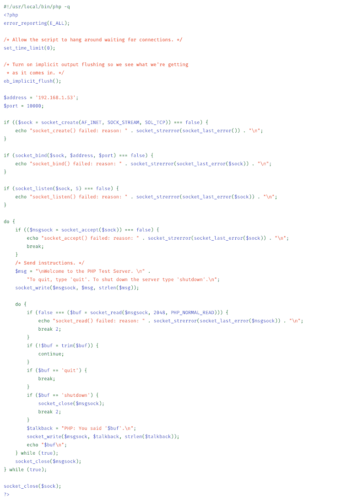

# 用 JavaScript 构建实时应用的 5 种方法

> 原文：<https://www.freecodecamp.org/news/5-ways-to-build-real-time-apps-with-javascript-5f4d8fe259f7/>

曾经有一段时间，我们对网页不抱太大期望。这提醒了我，太空堵塞电影网站仍然以它的原始形式在互联网上。它使用了一个[框架集](https://caniuse.com/#search=frameset)。不是 iFrames。**定格**。

[**Space Jam**](https://www.warnerbros.com/archive/spacejam/movie/jam.htm)
[*Space Jam、字符、名称和所有相关标记均为华纳兄弟的商标 1996*www.warnerbros.com](https://www.warnerbros.com/archive/spacejam/movie/jam.htm)

华纳兄弟有一些轻轻使用的 Dreamweaver MX 的副本。

那是 1996 年。这是 2019 年。时代变了，用户对网站有了更多的期望。他们不仅仅希望它们看起来不错，他们还希望它们充满应用程序，这包括实时性。

#### 实时应用

实时应用程序是那些对联网应用程序系统中任何地方的变化做出反应的应用程序，而不仅仅是当前用户做出的那些变化。

实时的典型例子是消息应用程序。就像你给一群朋友发短信说周五要一起吃鸡翅一样。然后每分钟向每个人更新你从工作到酒吧的进度。谢谢特雷弗。现在我们都被困在一个通知地狱里，这不是我们想要的。我只想吃点鸡翅。


What’s that, Trevor? You’re only 10 minutes away now? REJOICE. Looking forward to single digits.

说到 web，有几种不同的模式、技术、库和服务可以用来获得通常为本地应用程序保留的实时功能。我最近采访了 Anthony Chu，他给了我用 JavaScript 构建实时应用的 5 种方法。

[**Anthony Chu # MSIgniteTheTour(@ nthonyChu)| Twitter**](https://twitter.com/nthonychu)
[*Anthony Chu # MSIgniteTheTour(@ nthonyChu)的最新推文。云倡导者@微软。Azure，ASP。twitter.com*](https://twitter.com/nthonychu)

#### 1.长期轮询

这是应用程序按计划向服务器请求更新的时候。应用程序正在“轮询”服务器。

这相当于孩子们问“我们到了吗？”每五分钟一次。我们看起来像到了吗，孩子？再问我一次，我向你发誓，我会把这本《蜜蜂电影》扔到沟里，然后你就可以像小时候那样盯着窗外的草地看了。

长轮询可以用任何 JavaScript HTTP 库手动实现，比如 jQuery 或 Axios。我自己从未真正实现过这一点。在为本文做一些研究时，我发现最好的方法是使用带有`setTimeout`的递归函数。这是因为使用`setInterval`不会考虑失败或超时的请求。您可能会得到一堆无序处理的 ajax 调用。

这里有一个例子，来自一篇关于科技八度音阶的非常好的文章。

```
(function poll(){
   setTimeout(function(){
      $.ajax({ url: "server", success: function(data){
        //Update your dashboard gauge
        salesGauge.setValue(data.value);
        //Setup the next poll recursively
        poll();
      }, dataType: "json"});
  }, 30000);
})();
```

也有像 pollymer(不要与 Polymer 混淆)这样的库是专门用于长轮询的。明白了吗？《民意测验》ymer？因为民意测验？这东西开着吗？

[**fanout/pollymer**](https://github.com/fanout/pollymer)
[*通用 AJAX/长轮询库。在 GitHub 上创建一个帐户，为 fanout/polymer 开发做贡献。*github.com](https://github.com/fanout/pollymer)

长轮询是好的，因为它适用于每一种浏览器；即使是超级老的。之所以不好，是因为它的效率超级低，而且不完全是“实时”的。它也有一些奇怪的边缘情况(比如请求失败)，你必须像我们已经在`setInterval`中看到的那样进行编程。

长轮询的一个更好的替代方法是服务器发送事件或 SSE。

#### 2.服务器发送的事件

服务器发送事件(SSE)类似于长轮询，因为客户端向服务器请求信息。最大的区别是，对于 SSE，服务器只是保持连接打开。当事件发生并且有信息要发送给客户端时，服务器向客户端发送事件。

[**【服务器发送事件】**](https://developer.mozilla.org/en-US/docs/Web/API/Server-sent_events)
[*传统上，一个网页要向服务器发送一个接收新数据的请求；也就是说，页面请求来自…*developer.mozilla.org](https://developer.mozilla.org/en-US/docs/Web/API/Server-sent_events)的数据

回到我们的“地狱之旅”类比，这就像如果孩子说“我们到了吗？”，然后耐心等待你的回应。四个小时的沉默之后，你到达了目的地，转过身，说“是”。那是我这辈子想到的最不切实际的场景。

SSE 是浏览器`EventSource` API 的一部分。注意，根据[caniuse.com](https://caniuse.com/#search=EventSource)的说法，IE 11 和 Edge 都不支持 SSE。这使得它成为一种很难选择的技术，不管它有多有趣。

好消息是几乎每个浏览器都支持网络套接字。

#### 3.Web 套接字

Web Sockets 是一种促进客户端和服务器之间真正双向通信通道的技术。与服务器发送的事件不同，它只是从服务器到客户端的通信，Web 套接字可用于双向通信。

网络套接字有点冗长。它们不是你想用来构建应用的那种 API。有点像你*可以*用 [XHR 对象](https://developer.mozilla.org/en-US/docs/Web/API/XMLHttpRequest)发出 HTTP 请求，但是 OMG NO .我谷歌了一下“PHP Web Socket Sample”并从 PHP 文档中找到了这个 doozy。我在 Chrome 中一路放大，在一张截图中几乎看不到任何东西。



这还只是服务器部分。你还是要连接浏览器。

所以…对我来说那是一个**不**。

幸运的是，有很多库对 Web 套接字进行了更进一步的抽象，所以您不需要编写任何代码。其中一个库叫做“SignalR”。

#### 4.信号员

SignalR 是一个在 JavaScript 和. NET 中实现 Web Sockets 的库。在服务器上，您可以在 SignalR 中创建一个“hub”。该集线器发送和接收来自客户端的消息。

然后，客户端连接到 hub(使用 SignalR JavaScript 库),并响应来自 hub 的事件，或者将自己的事件发送到 hub。

每当 Web Sockets 不可用时，SignalR 也会回退到长轮询。虽然这不太可能，除非你使用 IE 9 或更低版本。

这是一个在服务器上设置 SignalR 的例子…

```
using System;
using System.Web;
using Microsoft.AspNet.SignalR;
namespace SignalRChat
{
    public class ChatHub : Hub
    {
        public void Send(string name, string message)
        {
            // Call the broadcastMessage method to update clients.
            Clients.All.broadcastMessage(name, message);
        }
    }
}
```

好吧，好吧。我知道这和上面的 PHP 例子没有可比性，但是我想在这里说明一点。顺其自然吧。为了我。我今天早上过得很糟糕。

所以 SignalR 让编写 Web 套接字变得更有趣，但是你知道什么比编写它们更有趣吗？不是给他们编程。

#### 5.蓝色信号

通常，当我们想要建立实时应用程序时，构建一个 Web 套接字服务器并不完全是一项增值活动。我们这样做，只是因为我们必须得到实时数据。我们更希望它“刚刚工作”。

Azure SignalR 正是如此。它是一个信号中心，您可以按需使用它作为服务。这意味着您只需发送和响应事件——这是您首先要做的。

[**什么是 Azure SignalR**](https://docs.microsoft.com/en-us/azure/azure-signalr/signalr-overview?WT.mc_id=medium-blog-buhollan)
[*Azure SignalR 服务概述。*docs.microsoft.com](https://docs.microsoft.com/en-us/azure/azure-signalr/signalr-overview?WT.mc_id=medium-blog-buhollan)

您在 Azure 中将 SignalR Hub 创建为 Azure 服务，然后您只需从客户端连接到它并发送/接收消息。

#### 现在你知道了…

看看下面对安东尼的采访。我们在维加斯拍了这张照片，当时我们都在开会，戴着我在派对城买的假发玩得很开心。我花的最值的 8 美元。

[https://www.youtube.com/embed/videoseries?list=PLlrxD0HtieHgugDxYBujMFnvSveH4fgWN](https://www.youtube.com/embed/videoseries?list=PLlrxD0HtieHgugDxYBujMFnvSveH4fgWN)