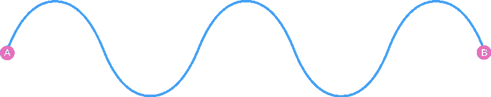
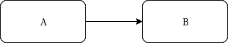
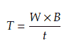
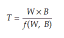

# 软件阻抗解释

> 原文：<https://www.freecodecamp.org/news/software-impedance-6796cc65758b/>

米兰·米米卡

# 软件阻抗解释

#### 数据处理组件之间的阻抗不匹配

一切从有史以来最简单的信号处理图开始:

组件 A 正在将信号传递给组件 b。让我们立即切换到软件工程术语:生产者正在调用消费者的方法。调用一个方法需要有限的时间。我们称这种响应时间或*延迟*。生产者可以向每个方法调用传递任意(但有限)数量的数据。我们称之为*批量*。并发级别是我们可以使用的另一个变量。生产者可以通过限制挂起响应的*窗口大小*来控制并发调用的数量。并发调用该方法确实会增加吞吐量。吞吐量(T)是窗口大小(W)、批量大小(B)和等待时间(T)的函数。

我们的目标是最大的吞吐量，所以增加并发性和使用更大的批处理大小。但愿如此！响应时间取决于批量大小和窗口大小。更正式地说，响应时间是窗口大小和批量大小的函数。

为了实现最大吞吐量，我们必须找到产生最低 *t* 的最高 *W* 和 *B* 。非理想的 *W* 和 *B* 会在组件中引发更高的“阻力”，如果你愿意，也可以称之为*背压*。

> 无论是产生数据还是仅仅传递数据，生产者都必须调整窗口大小和批量大小，以最大限度地满足消费者的需求。否则我们就有了我所说的软件阻抗不匹配。

f(W，B)没有通用表达式，因为它依赖于组件的实现。理论在这里没有任何帮助。您必须调查不同批次和窗口大小的消费者，以找出最大化吞吐量的理想值。

一旦你找到理想的批量，你必须建立一个“阻抗适配器”。下面是一个建议的 java 实现，它在将项目发送到下一个组件之前累积并批处理这些项目(为简洁起见，省略了许多样板代码)。

请注意，仍然允许调用小于最大(理想)批量的消费者。这确保不会增加额外的延迟。如果所选的批量大小是最优的，假设稳定的项目供给，调用消费者将正好花费填充队列中的 *maxBatchSize* 个项目的时间。

同样，可以使用信号量来控制对某个消费者实例的并发方法调用的数量。

#### 推模式与拉模式

上面的场景描述了“推”模式，在这种模式下，生产组件控制调用、它的时间和提到的关键参数。处理背压的一种更现代的方法是让消费组件负责调用。这使系统设计者处于一个稍微好一点的位置，因为消费组件的工程师不需要与生产者交流批处理和窗口大小。然而，需要类似的阻抗适配器。

#### 结论

阻抗适配器是有状态的组件，由队列、线程、回调映射等组成。，这增加了复杂性，但匹配阻抗在元件间通信中至关重要。

我认为每个组件都应该指定其阻抗参数:最佳批量和并发级别。这样，生产者组件可以适应最小化背压。

与电阻抗不同，软件中的阻抗不限于二维。这里我只展示了两个参数，但是响应时间通常也取决于其他变量。

阻抗是一个非常动态的属性。这可能取决于正在发送的数据、总体工作负载，有时甚至取决于不受调用者控制的变量。如果需要，消费者的 API 应设计成允许元件通过 API 发布其最新阻抗参数。这样生产者就可以动态地适应。