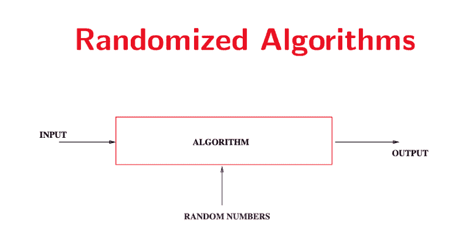
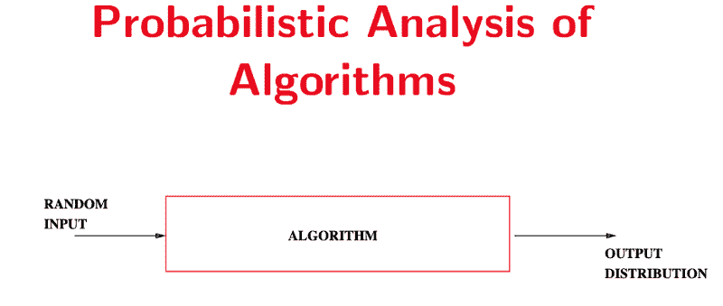
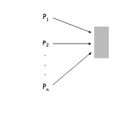

# 随机化算法:如何解决竞争解决问题

> 原文：<https://www.freecodecamp.org/news/randomized-algorithms-part-1-d89986bb685b/>

作者查德·马拉

# 随机化算法:如何解决竞争解决问题

Photo by [Ryan Thomas Ang](https://unsplash.com/@ryanthomasang?utm_source=medium&utm_medium=referral) on [Unsplash](https://unsplash.com?utm_source=medium&utm_medium=referral)

随机化算法在理论计算科学领域以及现实世界应用中非常重要。对于很多问题来说，要得到确定性的答案，在给定相同输入的情况下总是返回相同答案的函数计算量很大，并且无法在多项式时间内求解。

当我们随着输入引入一些随机性时，我们**期望**具有更有效的时间复杂度。或者我们**期望**有一个最优解的比率，这个比率有一个很好的迭代次数的上限。

这些算法通常很难实现。但是分析和证明运行时间/正确性要复杂得多。值得注意的是，概率分析和随机化算法的分析是有区别的。在概率分析中，我们给算法一个假设来自概率分布的输入。而在随机化算法中，我们将一个随机数添加到输入中。下面的图像应该显示了区别。图片来自斯坦福大学的讲座幻灯片。

[http://theory.stanford.edu/people/pragh/amstalk.pdf](http://theory.stanford.edu/people/pragh/amstalk.pdf)

[http://theory.stanford.edu/people/pragh/amstalk.pdf](http://theory.stanford.edu/people/pragh/amstalk.pdf)

在这篇文章中，我将通过**克莱恩伯格**和**塔多斯*算法设计*中的竞争解决问题。**

### 竞争解决

问题是有 ***n* 处理器**共享一个**单一数据库 *D*** 并且时间被分成 ***k* 个离散的间隔。**数据库**一次最多为**1 个处理器服务。

**目标:**以一种*的公平方式在 *n* 个处理器之间分配回合。*

[http://www.cs.princeton.edu/courses/archive/spr05/cos423/lectures/13randomized.pdf](http://www.cs.princeton.edu/courses/archive/spr05/cos423/lectures/13randomized.pdf)

请记住，处理器之间没有任何通信来计划何时访问数据库。如果每个处理器不断重复尝试同时访问 *D* ，那么数据库将被锁定，为 0 个处理器服务。不理想。通过随机化处理器的访问尝试序列，我们可以*【消除】*竞争，避免锁定。

### 事件

我们需要指定一些事件以及与它们相关的概率。

想想这里发生了什么，一个处理器 *i* 在时间*t*试图访问 *D* ，让它成为我们的第一个事件。

> *E1 =* A[i，t]: **P[i](进程 I)试图在回合 *t*** 访问 *D*

这个事件有一个优点，进程在 t 轮时不尝试访问。

> E1^ = A[i，t]^: **P[i]在第*t*t5 回合不尝试访问 *D***

设 A[i，t]发生的概率为 *p* ，由于样本空间 S = {E1，E1^}中所有个体的概率加起来为 1，我们得到 A[i,t]^的概率为 *1-p* 。

> Pr[A[i，t]] = p | Pr[A[i,t]^] = 1-p

在尝试访问数据库之后，进程 P[i]会发生两种情况之一:要么成功，要么失败。

> E2 = S[i，t]: **P[i]在回合*t*T5 成功访问 *D***

> E2^ = S[i,t]^: **P[i]在第*t*t5 回合访问 *D* 不成功**

只有当 P[i]试图访问 *D* 而所有其他进程都没有尝试时，才会成功。这是所有过程的事件 E1 的交集。

> S[i，t] = A[i，t] ∩ (∩j≠i A[j,t]^)

因此，S[i，t]的概率是 A[i，t]的概率乘以 A[j,t]^补事件的乘积。

> Pr[S[i，t]] = Pr[A[i，t]]*∏j≠I pr[a[j,t]^]= p(1-p)^(n-1)

还记得衍生品吗？它们在最小值或最大值时等于 0。设 f(p) = p(1-p)^(n-1)那么 f(p)的导数是

f '(p)=(1-p)^(n-1)-(n-1)*p*(1-p)^n-2

使这个等式等于 0 的显而易见的值是 0 和 1。当 p = 0 时，没有进程试图访问数据库。当它等于 1 时，所有的进程同时尝试。这两种情况都是我们不感兴趣的。唯一的其他值是当 p = 1/n 时。

设 p = 1/n 我们得到

> Pr[S[i，t]= 1/n(1–1/n)^(n-1

根据微积分，我们将使用两个事实。

1.  (1–1/n)^n 从 1/4 到 1/e 单调收敛
2.  (1–1/n)^n-1 从 1/2 到 1/e 单调收敛

所以我们看到有一个我们可以使用的渐近界限。

1/n(1–1/n)^(n-1)从(≤) 1/2 *1/n 向下单调收敛到(≥) 1/e*1/n

> 1/en ≤ Pr[S[i，t]] ≤ 1/2n

先验渐近等于 *O(1/n)*

另一个事件，失败…

E3 = F[i，t]:表示 P[i]在从 1 到 *t* 的任何一轮中没有成功访问 *D* 的“失败事件”

这相当于为 r = 1…t 指定事件的交集，S[i,r]^(不成功)

这最终有助于 F[i，t]的概率成为一个很好的可互换的数学方程，因为事件交集的概率是单个事件概率的乘积。

**Pr[F[i，t]]= pr[⋂r=1.to.t(s[i,r]^)]= ∏r=1.to.t(pr[s[i,r]^])=**

**(1-p(1-p)^(n-1))^t**

*   Pr[S[i，t]] = p(1-p)^(n-1)，S[i,t]^ = 1-Pr[S[i，t]]

还记得我们之前看到的微积分收敛性质吗？我们用它们来获得

Pr[F[i，t]]=(1-**p(1-p)^(n-1)**)^t =(1-**1/n(1–1/n)^(n-1)**^t ≤( 1–1/en)^t

*   p = 1/n，因为在时间 *t* 时，n 个处理器中的每一个都有相等的概率尝试访问数据库

现在让我们来看看参数 *t.*

如果我们设置 *t* = ceiling(en)以确保它是一个整数，我们得到

Pr[F[i，t]]≤(1–1/en)^ceiling(en)≤(1–1/en)^en≤1/e

这个界限告诉我们，进程 I 从第 1 轮到上限(en)的尝试不成功的概率上限为 1/e，与 n 无关。

设 t = ceiling(en)*(c*ln(n))则我们有

> **Pr[F[i，t]]≤(1–1/en)^t ≤((1–1/en)^ceiling(en))^(c*ln(n))≤(1/e)^c*ln(n)≤1/n^c = n^-c**

最后一件事…我们的目标是让流程尽可能多的成功。换句话说，如果，

E4 =**F【t】**:表示协议在 *t* 轮后失败的**事件，那么我们想在这里**最小化*t*以最大化它成功的轮数。****

F[t]本质上发生**当且仅当**F[I，t]中的一个发生时，只需要一个进程失败就可以说协议已经失败。因此，这是过程 i = 1…n 的事件 F[i，t]的并集。

⋃i=1.to.n(F[i,t])

#### **联合约束**

先验很难精确计算，因为事件 F[i，t]不是独立的。简单的解决办法是把他们捆绑在一起，好像他们都是独立的。

> 给定事件 E1，… En，我们有**pr[⋃i=1.to.n(ei)]≤∑I = 1 . to . n(pr[ei])**

Pr[F[t]] ≤ ∑i=1.to.n(Pr[F[i，t]])

回想一下当 t = ceiling(en)*c*ln(n)给出 Pr[F[i，t]] ≤ n^-c 的一个上界

设 c = 2，我们有 pr[f[t]]≤∑i=1.to.n(n^(-2))= n*n^(-2)= 1/n

在 *t* = 2*ceiling(en)*ln(n)轮内，所有进程成功访问 *D* 至少一次的概率是多少？

取 F[t]，F[t]^的补码，得出一个概率

11n

#### 包扎

这是一个相当长的分析，大多数随机算法的分析都是如此。这本质上是一种权衡，因为这种算法比复杂的确定性算法更容易设计和理解，而复杂的确定性算法计算量很大，难以得到正确的解决方案。对于随机化算法，我们愿意接受一些小的误差，以提高效率。

感谢您的阅读。我是博客游戏的新手，所以任何反馈都将不胜感激。