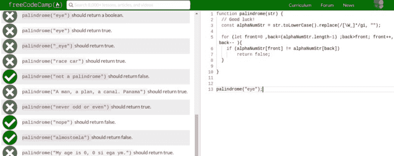
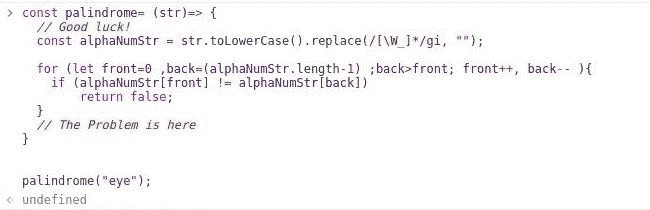
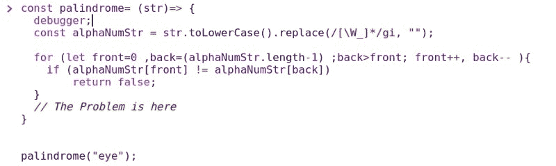
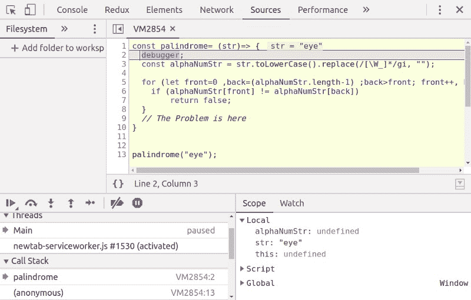
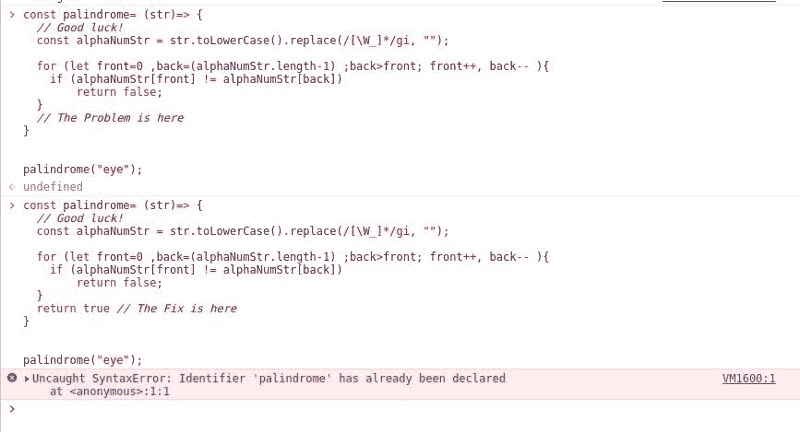
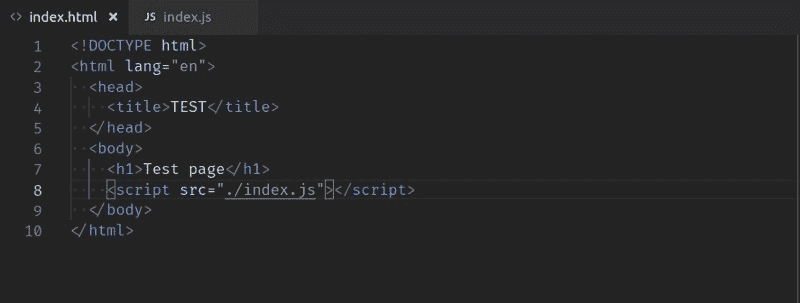
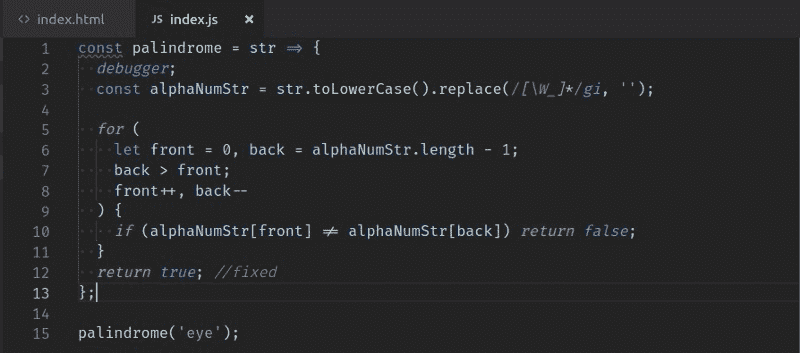
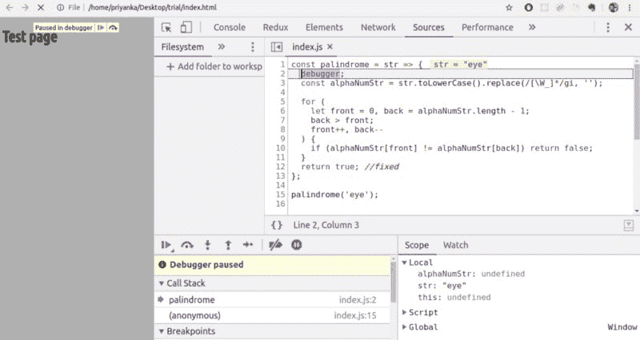

# JavaScript 初学者的调试技巧和诀窍

> 原文：<https://www.freecodecamp.org/news/debugging-javascript-for-beginners-5d4ac15dd1cd/>

作者:普里扬卡·加尔格

本教程的目标读者是初级程序员。您将了解到使用 chrome 开发工具进行无挫折调试。

亲爱的初学者，不久前，我在你的地方！在经历了很多挣扎之后，我觉得自己在学习的旅途中已经走得很远了。我目前正处于沉浸式训练营的高级阶段，在那里我正在构建全栈应用程序。

每天，我都在学习和偶然发现很多东西，我希望我以前就知道。本文试图分享一个这样的想法，让你的生活变得更轻松。

您一定已经知道，学习编程的最佳方式是实践。现在，当你开始练习编码时，有时(或大多数时候)你的代码不会工作；换句话说，你的代码中会有一个 BUG。您可能已经尝试并学习了一些调试方法。这篇文章不是关于任何一种调试方法，而是一个为编程实践调试代码的设置。

如果你在一个在线开发环境中实践，很可能你有一个编辑器，一个问题和一个测试你的程序的测试套件。

您已经编写了代码，并且存在一些错误，在某些时候，测试套件抛出的错误并没有真正的帮助。

我不会在这里详述调试会变得多么乏味——而是让我直接跳到给初学者的一些提示。

### 问题是

例如，我正在 FreeCodeCamp 的编辑器中编写一个回文检查器。我的解决方案失败了。在这种情况下，我们可以使用测试套件结果进行调试。

但是让我们假设这个测试套件并没有给我很好的指向确切错误的指针。(就逻辑错误而言，这可能不是理想的例子。关键是你会遇到测试套件不会直接指出逻辑错误的问题。)

#### **提示:** **使用开发者工具的控制台。**

我用失败的测试用例在控制台中运行相同的代码，我看到它返回‘undefined’。这意味着代码没有返回任何值。我可以很快发现，如果字符串是一个回文，我忘记了返回' true'。

这是一个非常简单的错误。大多数时候，你会遇到一些需要你检查变量的错误。检查变量的一种方法是在程序中 ***console.log( <变量*s>)。**

然而，我建议你使用 ***开发工具调试器*** 来代替。在您的程序中，您可以指定从哪里开始获得调试器的帮助。

调试器将向您显示调用堆栈中的所有变量，并让您逐步执行函数调用，您会发现这非常有用。

一旦你使用几次，你就会掌握使用调试器的窍门。注意左下角的箭头吗？这将让你控制程序流程，并在变量变化时向你展示它们。

现在我们来玩个把戏。

#### **招数:制作个人调试设置**

如上所述，使用调试器和控制台，我们可以很容易地识别问题。但是，如果我想在控制台上再次运行修改后的程序，只需修改一行代码，我就必须重新输入。

即使在那之后，我也会得到一个错误:

这个错误是因为我使用了一个箭头函数，并且不能重新声明一个*常量。*这意味着我每次修改代码时都必须打开一个新的标签和新的控制台。额外开销，对吧？

让我们找到一个解决方法。在您的系统上，创建一个目录并将 cd 放入该目录。

现在创建两个文件:index.js 和 index.html。在 index.html 中键入以下 HTML:

现在将您的代码从控制台移动到 index.js。注意，我已经在代码的第 2 行启动了调试器。

现在在浏览器中运行 index.html 文件。打开开发人员工具或控制台(您可能需要刷新才能看到调试器)。您可以在这里调试您的代码。

现在，每当您对 index.js 进行更改时，只需点击该选项卡上的刷新，代码就会重新运行。无需关闭和打开标签，无需重新输入整个程序。

将刚刚创建的文件夹放在手边。每当您需要尝试或调试一段代码时，将它放入 index.js 并进行实验！！

#### 结束语

如果你已经知道这一点，恭喜你浪费了宝贵的 4 分钟；)

最后，记住*人非圣贤，孰能无过！不要担心 bug——它们会教给你最有价值的编程课程……然后...*哦！你要去的地方…**