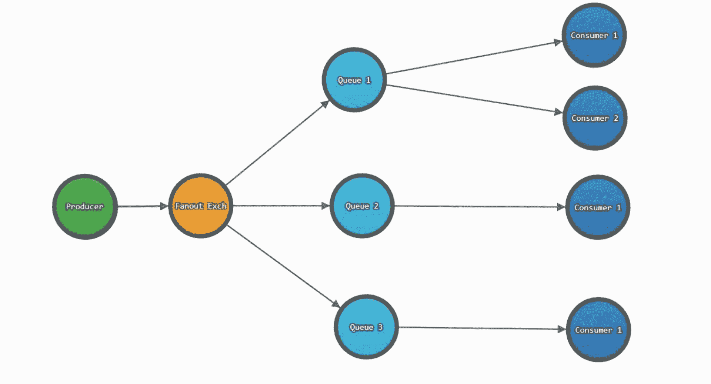

# RabbitMQ 介绍，这是一个处理消息的代理

> 原文：<https://www.freecodecamp.org/news/rabbitmq-9e8f78194993/>

#### 介绍 RabbitMQ、消息代理、AMQP 模型等等。

在分布式系统中，各种应用程序之间的通信起着重要的作用。在应用程序之间有效地传递消息一直是系统设计中的一个关键决策。在分布式系统中传递消息的一个优雅的解决方案是消息代理。

在分布式系统中，各种应用程序之间的通信起着重要的作用。在应用程序之间有效地传递消息一直是系统设计中的一个关键决策。在分布式系统中传递消息的一个优雅的解决方案是消息代理。

它们带来了应用程序之间的解耦，并提供了一种有效的通信方式。使用消息代理，应用程序不需要事先知道接收者就可以进行通信。

然而，RabbtiMQ 是什么？RabbitMQ 在这幅图中的位置如何？还有，什么是 AMQP？

到本文结束时，我们将能够回答这些问题。我还添加了一些动画，以便您可以直观地理解 RabbitMQ 的概念。

你兴奋吗？我是！如果您曾经像我一样对理解消息代理有困难，那么这篇文章是开始您的旅程的合适地方。留在我身边？

# 消息代理

一般来说，经纪人是帮助买卖双方进行交易的人。一个例子可能是房地产经纪人或股票经纪人。

类似地，如果我们想在两个分布式软件组件之间交换消息，我们需要一个中介。这个中介被称为消息代理。它接收来自发件人的传入消息，并将它们发送给收件人。这样发送者和接收者可以完全隔离。

消息代理的另一个类比可以是邮局(参见图 1)。让我们假设一个场景，你要给住在另一个城市的表兄寄信。按照这个类比，你是生产者，你的堂兄是消费者，邮局是信息中介。


Figure 1: Analogy for message broker

# RabbitMQ 作为消息代理

现在我们知道消息代理的目的是将消息从生产者路由到消费者。让我们研究这样一个消息代理— RabbitMQ。这是目前使用最广泛的消息代理之一。

RabbitMQ 路由消息的方式取决于它实现的消息传递协议。RabbitMQ 支持多种消息传递协议。然而，我们感兴趣的是 AMQP。它是高级消息队列协议的首字母缩写。

所以，事不宜迟，让我们更深入地了解一下 AMQP 协议模型。

# 高级消息队列协议

AMQP 的概念模型非常简单明了。它有三个实体:

1.  长队
2.  有约束力的
3.  交换

当发布者向 RabbitMQ 推送消息时，它首先到达一个交易所。然后，交换机会将这些邮件的副本分发到不同的连接队列中。最后，消费者会收到这些信息。

将消息视为一段数据。它必须是一个包含有效载荷和一些元数据的包。有效负载包含完整的数据，而元数据是 RabbitMQ 使用的属性。

图 2 描绘了 AMQP 模型的图形表示。


Figure 2: AMQP model

AMQP 是一种可编程协议。程序员可以根据自己的需要自由地使用库来配置实体(交换、绑定和队列)。RabbitMQ 管理员没有设置这些实体的角色。

有很多库可以使用 RabbitMQ。可以选择 [Nodejs](http://www.squaremobius.net/amqp.node/) 、 [Python](https://pypi.org/project/pika/) 、。[网](https://github.com/rabbitmq/rabbitmq-dotnet-client)， [Java](https://github.com/rabbitmq/rabbitmq-java-client/) ，等等。

# 行列

这些队列在某种程度上类似于我们的数据结构类中的队列。RabbitMQ 队列也遵循先进先出的方法。队列是 RabbitMQ 存储消息/数据的地方。

程序员可以通过可用的编程库来配置队列。您可以使队列持久化(使用`Durability`属性),以便在代理崩溃时保护您的数据。您还可以为队列提供一个名称(带有`Name`属性)。除了`Name`和`Durability`，队列还有一些其他属性，比如自动删除、独占和参数。

在进一步讨论之前，了解谁是这些队列的直接消费者非常重要。此外，用户可以通过多少种方式使用队列中的消息？

# 顾客

消费者是将要使用存储在队列中的消息的人。一次可以将多个使用者连接到一个队列。消费者可以通过池化从队列中提取消息，或者队列甚至可以将消息推送到各种连接消费者。

# 粘合剂

绑定是队列在与交换建立连接时定义的规则。您可以将一个队列连接到多个交换机。每个队列还连接到一个默认的交换机。交换将使用这些绑定将邮件路由到队列。

# 交易所及其类型

交换是你的信息通往 RabbitMQ 的门户。消息在 RabbitMQ 中传输的距离取决于交换的类型。主要有四种类型。

*   直接的
*   扇出
*   主题
*   页眉

## 直接的

名字就说明了一切！—直接交换将消息直接传递给满足以下条件的队列:

```
Routing key == Binding key 
```

路由关键字是消息的一个属性。另一方面，绑定键是在队列和交换之间创建绑定时指定的。

图 3 直观地解释了使用直接交换时消息是如何流动的。

消息来自生产者(绿色圆圈)，带有路由关键字— `img.resize`。一旦它到达交换机(橙色圆圈)，交换机将尝试查找所有具有绑定关键字— `img.resize`的队列。在匹配的情况下，消息被推送到所有匹配的队列(在我们的例子中是调整大小)。如果没有找到匹配，消息可以被发送回生产者，甚至可以被丢弃。幸运的是，我们在示例中找到了匹配？

[gif 图片]

一旦消息到达所需的队列(在我们的例子中是 resize)，它们就会以循环方式分发给所有连接的消费者(在我们的例子中是 resizer.1/resizer.2)。

通过以循环方式分发消息，RabbitMQ 确保了消息的负载平衡。

您一定注意到了名为 ****crop**** 的队列没有接收到任何消息。因为这个例子中的路由关键字是`img.resize`。为了将消息发送到这个队列，我们需要使用与绑定键匹配的路由键来发送消息(比如说`img.crop` )。

## 扇出

扇出交换忽略路由关键字，并将消息分发到所有连接的队列。难怪叫 Fanout(向所有连接的队列吹消息！？).

这种类型的交换的一个用例是消息广播。



请注意，如果队列中有多个使用者，RabbitMQ 仍然会执行循环调度。

## 主题

主题交换通过将路由关键字与绑定关键字中的模式进行匹配来路由消息。

```
Routing key == Pattern in binding key.
```

RabbitMQ 使用两个通配符进行模式匹配`*`和`#`。使用`*`匹配 1 个单词，使用`#`匹配 0 个或更多单词。

图 5 是主题交换的可视化描述。带有路由关键字— `logs.error`的消息将匹配模式— `logs.error`和`logs.*`。因此，这些消息将在队列中结束— `only error` 和`all logs`。

而对于左下角的生产者，带有路由关键字— `logs.success`的消息将匹配绑定关键字`#success` 和`logs.*`的模式。因此，这些消息将在队列中结束— `all logs`和`only success`。

[gif]

这种类型的交换有广泛的使用案例。它可以在发布-订阅模式中使用，将相关数据分发给期望的工作进程等等。

# 页眉

头是一种特殊类型的交换，它根据消息头中的关键字来路由消息。它忽略了消息的路由关键属性。

为头交换创建绑定时，可以绑定一个队列来匹配多个头。在这种情况下，RabbitMQ 应该从生产者那里知道它是否应该匹配所有或任何这些键。

生产者/应用程序可以通过提供称为“x-match”的额外标志来做到这一点。“x 匹配”可以有`any`或`all`值。第一种要求只有一个值应该匹配，而后者要求所有值都必须匹配。

# 消息确认

一旦消息到达目的地，代理应该从队列中删除消息。这是必要的，因为如果消息不断累积，可能会发生队列溢出。

在删除任何消息之前，代理必须有一个送达确认。有两种可能的方式来确认消息传递。

1.  自动确认:一旦消费者收到消息
2.  显式确认:当消费者发回确认时

在大多数情况下，使用显式确认是因为它可以确保使用者在没有任何故障转移的情况下使用了消息。

# 下一步是什么

RabbitMQ 是一个非常成熟和有用的产品。本文只是对 RabbitMQ 的高级介绍。我简化了这些概念，以便为您的进一步发展提供一个参考点。访问 RabbitMQ 网站了解更复杂的主题。

希望你喜欢这篇文章。别忘了鼓掌(还是鼓掌？).跟随阅读我即将推出的故事。直到下一次，继续排队。