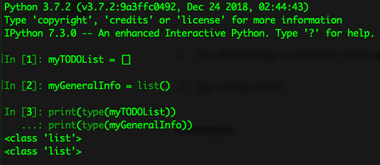
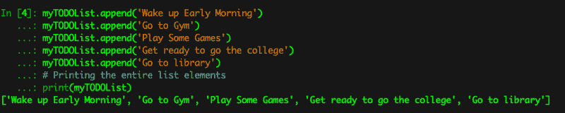
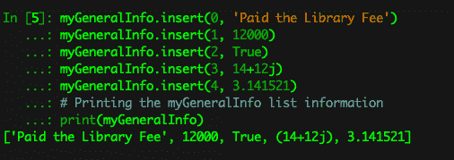
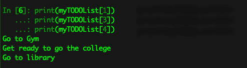
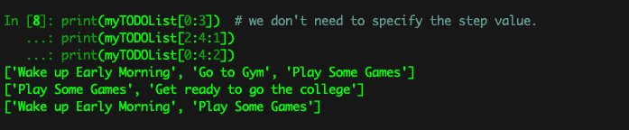
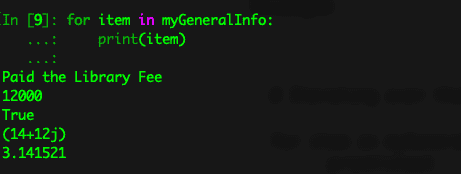
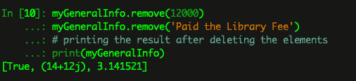
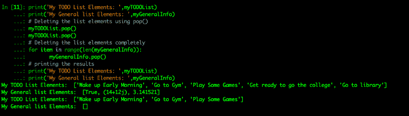
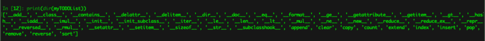

# 只用 7 分钟就可以快速而完整地浏览 Python3 中的列表

> 原文：<https://www.freecodecamp.org/news/a-quick-yet-complete-tour-of-lists-in-python3-in-just-seven-minutes-437e615110d0/>

by PALAKOLLU SRI MANIKANTA

# 只用 7 分钟就可以快速而完整地浏览 Python3 中的列表


Photo by [Emma Matthews](https://unsplash.com/@emmamatthews?utm_source=medium&utm_medium=referral) on [Unsplash](https://unsplash.com?utm_source=medium&utm_medium=referral)

Python 列表不像数组。他们有点不同。当谈到处理数组时，我们谈论的是同构数据元素的集合。对于 python 中的列表，这是不正确的。Python List 可以存储不同种类的元素集合。这个特性将帮助开发人员和程序员以更灵活的方式使用列表。python 中的列表是最强大的内置数据结构之一。

python 中的列表可以存储整数、浮点值、字符串、布尔值和复数值。

#### 如何在 python 中创建列表

我们可以用两种方式在 python 中创建一个列表

1.  通过用一个空的方括号声明一个变量，即[]
2.  通过使用 list()。

**例子**

```
# Here first I'm creating a my todo list which is used to store my to-do activities.
```

```
myTODOList = []
```

```
# The above line will create a list object for me# I'm creating a another list which will store my general information.
```

```
myGeneralInfo = list()
```

```
# The above line will also create a list object for me# Getting the types of list objects
```

```
print(type(myTODOList))print(type(myGeneralInfo))
```

**输出**



Output for the above few lines of code.

令人惊讶的是，现在您能够用最常用的方法创建一个新的列表对象。现在，我们将继续讨论如何在我们的列表中添加新的元素以及更多的内容。让我们开始吧。

#### 如何将数据添加到我们的列表中？

首先，我想介绍一下可变性的概念。可变性意味着改变其行为的能力。Python 列表本质上是可变的。我们可以从列表中添加或删除元素。与其他内置数据结构相比，这是吸引程序员使用列表的最大优势之一。

我们可以通过两种方式向列表中添加元素:

1.  通过使用 append()
2.  通过使用 insert()

**通过使用 append()**

在 append 方法的帮助下，我们能够一次添加一个元素。这个方法将帮助我们只在列表的末尾添加元素。

> append 函数的语法是—

> listName.append(项目/元素)

```
# Adding Elements to the lists
```

```
myTODOList.append('Wake up Early Morning')myTODOList.append('Go to Gym')myTODOList.append('Play Some Games')myTODOList.append('Get ready to go the college')myTODOList.append('Go to library')
```

```
# Printing the entire list elements
```

```
print(myTODOList)
```

**输出**



Output for the above line of code.

**通过使用 insert()**

这个 insert 方法用于在给定列表中的指定位置添加元素。

> 插入函数的语法是—

> listName.insert(位置，项目/元素)

insert()使用两个参数—位置和列表项。位置是元素需要在列表中保留的位置。这些位置通常被称为索引。通常，python 中的列表索引从 0 开始。(即第一个元素索引为 0，第二个元素索引为 1，第三个元素索引为 2，依此类推)。由此，我们可以得出这样的结论——

> n 个元素的列表最多具有 n-1 的索引号，即具有 5 个元素的列表的最大索引值为 4。

**例子**

```
# Adding Elements to our list with the help of insert()
```

```
myGeneralInfo.insert(0, 'Paid the Library Fee')myGeneralInfo.insert(1, 12000)myGeneralInfo.insert(2, True)myGeneralInfo.insert(3, 14+12j)myGeneralInfo.insert(4, 3.141521)
```

```
# Printing the myGeneralInfo list information
```

```
print(myGeneralInfo)
```

**输出**



Output for the above few lines of code.

> myGeneralInfo 填充了一些随机信息，只是为了便于说明。

#### 如何访问列表元素

我们可以通过以下两种方式访问元素列表:

1.  通过使用索引运算符。
2.  通过使用切片运算符

**通过使用索引运算符**

在索引操作符的帮助下，我们可以直接访问列表元素。

**例子**

```
# Acessing the certain values from the list
```

```
print(myTODOList[1])print(myTODOList[3])print(myTODOList[4])
```

**输出**



Output for the above program

**通过使用切片运算符**

slice 操作符是有效访问列表元素最常用的操作符之一。切片运算符的语法是:

listName[开始:停止:步进]

开始—它指示切片必须开始的索引。默认值为 0。

停止—它指示切片必须结束的索引。默认值是列表的最大允许索引，即列表的长度。

步长-增量值。默认值为 1。

**例子**

```
# Getting the information using slice operator
```

```
print(myTODOList[0:3])  # we don't need to specify the step value.print(myTODOList[2:4:1])print(myTODOList[0:4:2])
```

**输出**



Output for the above few lines of code.

Python 列表是可迭代的对象。对于 python 中的任何可迭代对象，我们可以编写一个 For 循环来打印出所有数据。

**例子**

```
# Iterating over the list
```

```
for item in myGeneralInfo:      print(item)
```



Output for the above lines of code.

#### 如何从列表中删除元素

我们可以用以下两种方法删除列表元素:

1.  通过使用 remove()
2.  通过使用 pop()

**通过使用 remove()**

remove()用于移除指定给它的元素。remove()的语法是:

listName.remove(项目/元素)

```
# Deleting the element from the list
```

```
myGeneralInfo.remove(12000)myGeneralInfo.remove('Paid the Library Fee')
```

```
# printing the result after deleting the elements
```

```
print(myGeneralInfo)
```



After deleting the list elements the output would be as follows

**通过使用 pop()**

这是一种迭代器方法，用于一次移除单个(或多个)元素。它从背面删除元素。pop()方法的语法是:

列表 Name.pop()

```
# printing the list items before deleting
```

```
print('My TODO List Elements: ',myTODOList)print('My General list Elements: ',myGeneralInfo)
```

```
# Deleting the list elements using pop()
```

```
myTODOList.pop()myTODOList.pop()
```

```
# Deleting the list elements completely
```

```
for item in range(len(myGeneralInfo)):       myGeneralInfo.pop()
```

```
# printing the results
```

```
print('My TODO List Elements: ',myTODOList)print('My General list Elements: ',myGeneralInfo)
```



This is the way we can delete list elements using pop()

> 在上面的程序中，我们在 for 循环中使用了 len()。len()用于给出列表的长度，即列表中元素的数量。

#### 列表对象的各种属性和功能

python dir()函数用于给出一组内置的属性和与之相关联的方法。

**例子**

```
# Printing all the attributes and functions on the list object
```

```
print(dir(myTODOList))
```

**输出**



Various Attributes and Methods on the list object

#### 各种列表方法及其用途:

1.  append() — 它会将一个元素添加到列表的末尾。
2.  **clear() —** 用于从列表中删除所有项目。
3.  **copy() —** 用于返回列表的另一个副本。
4.  **count() —** 用于返回作为参数传递的项数的计数。
5.  将一个列表中的所有元素添加到另一个列表中。
6.  **index() —** 用于返回第一个匹配项的索引。
7.  **insert() —** 用于在定义的索引处插入一个项目。
8.  **pop() —** 用于移除和返回给定索引处的元素。
9.  **remove() —** 用于从列表中删除一个项目。
10.  **reverse() —** 用于颠倒列表中项目的顺序。
11.  **sort() —** 用于对列表中的项目进行升序排序。

#### 什么时候使用列表数据结构？

如果要存储多个数据对象，必须保持插入顺序。如果您还想存储重复的值，那么这个数据结构将更有助于执行这样的操作。

我几乎涵盖了在列表数据结构上执行任何操作所需的所有内容。

希望这有助于你快速简单地学习 python 中的列表。

如果你喜欢这篇文章，请点击拍手并给我留下反馈。请分享给你的朋友。