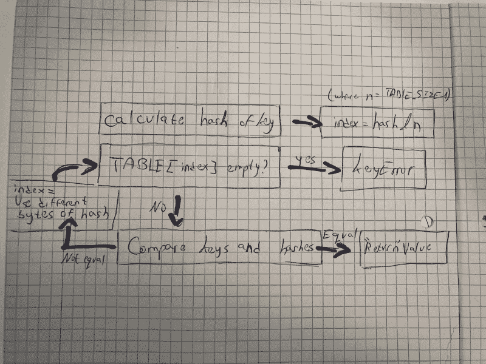
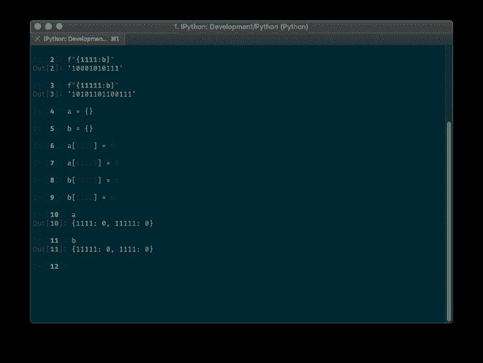

# 升级您的 Python 技能:检查字典

> 原文：<https://www.freecodecamp.org/news/exploring-python-internals-the-dictionary-a32c14e73efa/>

作者:亚当·戈德施密特

# 升级您的 Python 技能:检查字典


Photo by [Romain Vignes](https://unsplash.com/@rvignes?utm_source=medium&utm_medium=referral) on [Unsplash](https://unsplash.com?utm_source=medium&utm_medium=referral)

> *哈希表(hash map)是实现关联数组抽象数据类型的数据结构，这种结构可以将键映射到值。*

如果它闻起来像一条蟒蛇`dict`，摸起来像一条`dict`，看起来也像一条……那么，它一定是一条`dict`。绝对的！哦，还有一只`set`...

#### 啊？

Python 中的字典和集合是使用哈希表实现的。起初这听起来令人生畏，但随着我们进一步调查，一切都应该清楚了。


### 目标

在整篇文章中，我们将发现如何在 Python 中实现一个`dict`，并且我们将构建我们自己的(一个简单的)实现。本文分为三个部分，构建自定义词典发生在前两个部分:

1.  了解什么是哈希表以及如何使用它们
2.  深入 Python 的源代码，更好地理解字典是如何实现的
3.  探索字典与列表和集合等其他数据结构之间的差异

### 什么是哈希表？

哈希表是一种设计用于存储键值对列表的结构，而不会影响操作和搜索该结构的速度和效率。

哈希表的有效性来自于**哈希函数**——一个计算键值对索引的函数——这意味着我们可以快速插入、搜索和删除元素，因为我们知道它们在内存数组中的索引。

当我们的两个键散列到相同的值时，复杂性就开始了。这种情况被称为*哈希冲突*。处理冲突有许多不同的方式，但是我们将只讨论 Python 的方式。为了保持这篇文章对初学者友好和以 Python 为中心，我们不会对散列表的解释进行太深入。

在继续之前，让我们确保我们已经理解了散列表的概念。我们将开始为我们非常(非常)简单的自定义`dict`创建框架，只包含插入和搜索方法，使用 Python 的一些 [dunder 方法](https://docs.python.org/3.6/reference/datamodel.html#object.__getitem__)。我们需要用一个特定大小的列表初始化哈希表，并为它启用订阅([]签名):

现在，我们的哈希表列表需要保存特定的结构，每个结构包含一个键、一个值和一个哈希值:

#### 基本示例

一家拥有 10 名员工的小公司希望保留包含员工剩余病假天数的记录。我们可以使用下面的散列函数，这样所有内容都可以放入内存数组:

`length of the employee's name % TABLE_SIZE`

让我们在入口类中定义我们的散列函数:

现在我们可以在表中初始化一个 10 元素的数组:

等等！让我们仔细考虑一下。我们很可能会处理一些哈希冲突。如果我们只有 10 个元素，我们在碰撞后找到一个开放的空间会困难得多。让我们决定我们的表将有两倍的大小——20 个元素！将来会派上用场的，我保证。

为了快速插入每个员工，我们将遵循以下逻辑:

```
array[length of the employee's name % 20] = employee_remaining_sick_days
```

因此我们的插入方法将如下所示(还没有哈希冲突处理):

对于搜索，我们基本上做同样的事情:

```
array[length of the employee's first name % 20] 
```

我们还没完呢！

### Python 冲突处理

Python 使用一种叫做开放寻址的方法来处理冲突。当哈希表达到一定大小时，它也会调整哈希表的大小，但是我们不会讨论这个方面。从[维基百科](https://en.wikipedia.org/wiki/Hash_table#Open_addressing)中打开寻址定义:

> 在另一种称为开放寻址的策略中，所有条目记录都存储在桶数组本身中。当必须插入一个新条目时，将检查存储桶，从散列到的槽开始，并继续某个探测序列*，直到找到一个未被占用的槽。当搜索条目时，以相同的顺序扫描桶，直到找到目标记录，或者找到未使用的数组槽，这表明表中没有这样的键。*

让我们通过查看 Python [的源代码](https://github.com/python/cpython/blob/master/Objects/dictobject.c#L745)(用 C 语言编写)来检查通过`key`检索值的过程:

1.  计算`key`的哈希
2.  通过`hash & mask`计算项目的`index`，其中`mask = HASH_TABLE_SIZE-1`(简单来说——从哈希位中取最后 N 位):

```
i = (size_t)hash & mask;
```

3.如果为空，返回`DKIX_EMPTY`，它最终会转换为一个`KeyError`:

```
if (ix == DKIX_EMPTY) {   *value_addr = NULL;   return ix;}
```

4.如果不为空，比较关键字和散列值，如果相等，则将`value_addr`地址设置为实际值地址:

```
if (ep->me_key == key) {    *value_addr = ep->me_value;    return ix;}
```

并且:

```
if (dk == mp->ma_keys && ep->me_key == startkey) {    if (cmp > 0) {        *value_addr = ep->me_value;        return ix;    }}
```

5.如果不相等，使用哈希的不同位(此处的算法解释为)并再次转到步骤 3:

```
perturb >>= PERTURB_SHIFT;i = (i*5 + perturb + 1) & mask;
```

这里有一张图来说明整个过程:



插入过程非常相似——如果找到的槽是空的，条目被插入，如果不是空的，那么我们比较键和散列——如果相等，我们替换值，如果不相等，我们继续用`perturb`算法寻找新的点。

#### 借鉴 Python 的思想

我们可以借用 Python 的思想，将每个条目的键和散列都与我们的条目对象进行比较(取代前面的方法):

我们的哈希表仍然没有任何冲突处理—让我们实现一个吧！正如我们前面看到的，Python 通过比较条目，然后改变位的掩码来实现，但我们将使用一种称为线性探测的方法来实现(这是一种开放式寻址的形式，如上所述):

> 当[散列函数](https://en.wikipedia.org/wiki/Hash_function)通过将新的关键字映射到已经被另一个关键字占据的散列表的单元而引起冲突时，线性探测搜索该表以寻找最近的下一个空闲位置，并在那里插入新的关键字。

所以我们要做的是继续前进，直到我们找到一块空地。如果您还记得，我们实现了两倍大小的表(20 个元素，而不是 10 个)——**这就是它派上用场的地方**。当我们前进时，我们寻找一个开放空间的速度会快得多，因为有更多的空间！

但是我们有一个问题。如果有人试图插入第 11 元素怎么办？我们需要提出一个错误(在本文中我们不会处理表格大小调整)。我们可以在表中保留一个已填充条目的计数器:

现在让我们在我们的搜索方法中实现同样的功能:

**完整的代码可以在[这里](https://gist.github.com/AdamGold/f2107afeec2a4788fb6e79a3ceeae32d)找到。**

现在，公司可以安全地存储每位员工的病假天数:

### Python 集

回到文章开头，Python 中的`set`和`dict`实现非常相似，`set`在每条记录中只使用了`key`和`hash`，这可以从[的源代码](https://github.com/python/cpython/blob/e42b705188271da108de42b55d9344642170aa2b/Include/setobject.h#L26)中看出:

```
typedef struct {    PyObject *key;    Py_hash_t hash; /* Cached hash code of the key */} setentry;
```

与`[dict](https://github.com/python/cpython/blob/e42b705188271da108de42b55d9344642170aa2b/Objects/dict-common.h#L4)`相反，它包含一个值:

```
typedef struct {    /* Cached hash code of me_key. */    Py_hash_t me_hash;    PyObject *me_key;    PyObject *me_value; /* This field is only meaningful for combined tables */} PyDictKeyEntry;
```

### 性能和订单

#### 时间比较

我认为现在很清楚，在搜索、插入(在特定位置)和删除方面，`dict`比`list`快得多(占用更多的内存空间)。让我们用一些代码来验证这个假设(我在 2017 年的 MacBook Pro 上运行代码):

以下是测试代码(一次用于`dict`，一次用于`list`，替换`d`):

结果和我们预期的差不多..

`dict` : `0.015382766723632812`秒

`list:` `55.5544171333313`秒


#### 顺序取决于插入顺序

字典的顺序取决于插入的历史。如果我们插入一个具有特定哈希的条目，然后插入一个具有相同哈希的条目，那么第二个条目将会在一个不同的位置结束，如果我们先插入它的话。



### 在你走之前…

感谢阅读！你可以在 [Medium](https://medium.com/@adamgoldschmidt) 上关注我以获取更多这些文章，或者在 [GitHub](https://github.com/AdamGold) 上关注我以发现一些很酷的回复:)

如果你喜欢这篇文章，请按住鼓掌按钮？帮助其他人找到它。你拿的时间越长，你给的掌声就越多！

请不要犹豫，在下面的评论中分享你的想法，或者纠正我的错误。

### 额外资源

1.  [哈希崩溃:哈希表的基础知识](https://medium.com/@bartobri/hash-crash-the-basics-of-hash-tables-bef82a8ea550)
2.  [浩如烟海的字典](https://pyvideo.org/pycon-us-2010/the-mighty-dictionary-55.html)
3.  [算法介绍](https://www.amazon.com/Introduction-Algorithms-3rd-MIT-Press/dp/0262033844)