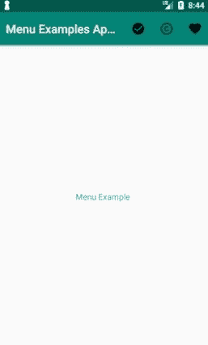
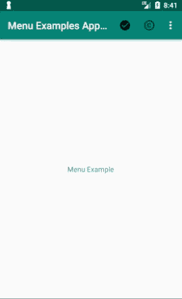
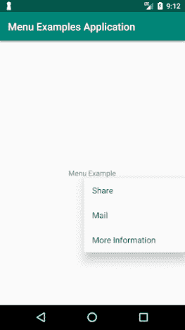
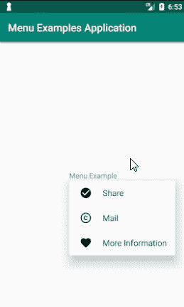

# Android 菜单介绍

> 原文：<https://www.freecodecamp.org/news/android-menus-introduction/>

Android 中有三种类型的菜单:弹出菜单、上下文菜单和选项菜单。

每一个都有一个特定的用例以及相应的代码。要了解如何使用它们，请继续阅读。

每个菜单都必须有一个相关的 XML 文件来定义它的布局。这些是与菜单选项相关联的标签:

这是你的菜单的容器元素(类似于 LinearLayout)

`<item>` -这表示一个项目，嵌套在菜单标签内。请注意，item 元素可以保存一个`<menu>`元素来表示子菜单

`<group>` -这用于表示几个菜单项的某个属性或特征(即状态/可见性)

```
<?xml version="1.0" encoding="utf-8"?>
<menu xmlns:android="http://schemas.android.com/apk/res/android"
    xmlns:app="http://schemas.android.com/apk/res-auto"
    xmlns:actionProviderClass="http://schemas.android.com/tools">
    <item android:id="@+id/item1"
        android:icon="@drawable/ic_baseline_check_circle_24px"
        android:title="item1"
        app:showAsAction="always"
        />
    <item android:id="@+id/item2"
        android:icon="@drawable/ic_baseline_copyright_24px"
        android:title="item2"
        app:showAsAction="always"
        />
    <item android:id="@+id/item3"
        android:icon="@drawable/ic_baseline_favorite_24px"
        android:title="item3"
        app:showAsAction="always">
    </item>
</menu>
```

A simple menu layout

如上面的代码片段所示，每个菜单项都有与其相关联的各种属性。我将在这里详述主要的，但是如果你想看看你还能添加什么，请点击[这里](https://developer.android.com/guide/topics/resources/menu-resource.html)。

*   ****id**** -这是菜单中项目的唯一标识符。您可以使用它来查看用户点击了哪个项目
*   ****图标**** -如果你想显示一个与该菜单项相关的图标
*   ****标题**** -将在该项目菜单中显示的文本
*   ****showas action****——只有在使用[应用程序栏](https://developer.android.com/training/appbar/index.html)(也称为动作栏)的活动中使用菜单时，才应该使用该属性。它控制这个项目何时以及如何作为一个动作出现在应用程序栏中。有五个值:always、never、ifRoom、withText 和 collapseActionView

```
android:showAsAction="always|never|ifRoom|withText|collapseActionView" 
```

我将在下一节详细阐述这些值的含义。

此外，您需要将相关的 onCreate menu 方法添加到活动中。

```
//Options Menu
@Override
public boolean onCreateOptionsMenu(Menu menu) {
    MenuInflater inflater = getMenuInflater();
    inflater.inflate(R.menu.options_menu, menu);
    return super.onCreateOptionsMenu(menu);
}

//Context Menu
@Override
public void onCreateContextMenu(ContextMenu menu, View v,
                                ContextMenu.ContextMenuInfo menuInfo) {
  super.onCreateContextMenu(menu, v, menuInfo);
  MenuInflater inflater = getMenuInflater();
  inflater.inflate(R.menu.context, menu);
}
```

R.menu.id is the id of the menu you created

## 选项菜单

该菜单通常位于应用程序的顶部，你应该在其中放置影响整个应用程序的操作。这些可能是应用程序的设置或搜索框。

使用上面的菜单布局，我们得到以下选项菜单:



如前所述，让我们检查一下可以为 showAsAction 属性提供的值:

*   总是-将总是显示在动作栏中
*   永不显示，因此可通过[溢出菜单](https://www.techotopia.com/index.php/Creating_and_Managing_Overflow_Menus_on_Android)查看
*   ifRoom -只有当动作栏中有足够的空间时，才会显示。请记住，根据文档，操作栏上的图标数量是有限制的。
*   with text-将在动作栏中包含项目的标题
*   collapseActionView -如果这个项目有一个关联的动作视图，它将变成可折叠的(从 API 14 和更高版本)

如果我们继续将菜单中的最后一项更改为******showa action = " never "******，我们会得到以下结果:



The third menu item moved to the overflow menu

## 上下文菜单

当用户长时间点击你的 UI 元素时，这个菜单就会出现。该菜单中的选项会影响用户点击的 UI 元素。在列表或网格视图中通常使用这种类型的菜单，用户与每个项目的交互可以导致特定的操作。

**想象一个场景，你有一个带有图片的应用程序，当用户点击图片时，你想向用户呈现几个选项。**

上下文菜单有两种显示方式:

1.  浮动菜单
2.  应用程序顶部的操作栏

我们将只演示如何使用第一个选项，但是你可以在这里阅读关于第二个选项[的更多内容。](https://developer.android.com/guide/topics/ui/menus#CAB)

使用以下 XML:

```
<?xml version="1.0" encoding="utf-8"?>
<menu xmlns:android="http://schemas.android.com/apk/res/android">
    <item
        android:id="@+id/share"
        android:title="Share"/>
    <item
        android:id="@+id/Mail"
        android:title="Mail"/>
    <item
        android:id="@+id/MoreInfo"
        android:title="More Information"/>
</menu>
```

The layout for our context menu

并将以下代码添加到我们的主活动中:

```
 @Override
    protected void onCreate(Bundle savedInstanceState) {
       super.onCreate(savedInstanceState);
       setContentView(R.layout.activity_main);
       TYPE_OF_LAYOUT layout = (TYPE_OF_LAYOUT)findViewById(R.id.main_layout);
       registerForContextMenu(layout);
  }
```

The code needed to enable context menu for our main activity’s layout

我们将得到以下内容:



When performing a long click on the text, the context menu appears

## Popup Menu

弹出菜单是一种在垂直列表中显示项目的菜单。该列表被附加到用户点击以调用该菜单的视图上。重要的是要记住，当选择一个弹出菜单时，你不希望用户的选择影响到用户按下的前一个内容。

我们将使用与之前相同的菜单 XML 布局，但是我们需要将以下代码添加到我们的活动中:

```
void showPopupMenu(View view) {
  PopupMenu popup = new PopupMenu(this, view);
  MenuInflater inflater = popup.getMenuInflater();
  inflater.inflate(R.menu.actions, popup.getMenu());
  popup.show();
}
```

The showPopupMenu method should be called when a click happens

我们将得到与前面截图相同的结果，但是不需要用户执行长时间的点击。

## 弹出菜单中的图标

现在我知道你来这里大概是为了什么: ******你想知道如何给菜单添加图标****** 。

虽然我将展示一个如何做到这一点的例子，但明智的做法是理解这是一个没有为弹出菜单启用的特性，并且可能导致意外的行为。您可以通过使用反射打开一个名为 ****setForceShowIcon**** 的标志来实现这一点。

```
//popup is an instance of PopupMenu

try {
      Field[] fields = popup.getClass().getDeclaredFields();
      for (Field field : fields) {
          if ("mPopup".equals(field.getName())) {
              field.setAccessible(true);
              Object menuPopupHelper = field.get(popup);
              Class<?> classPopupHelper = Class.forName(menuPopupHelper
                      .getClass().getName());
              Method setForceIcons = classPopupHelper.getMethod(
                      "setForceShowIcon", boolean.class);
              setForceIcons.invoke(menuPopupHelper, true);
              break;
          }
      }
  } catch (Throwable e) {
      e.printStackTrace();
  }
```



我只是对 Android 菜单做了简单的描述，但希望这足以激发你去深入挖掘。